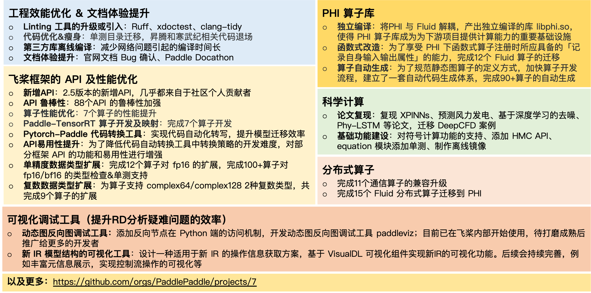

什么是开源项目和开源社区？国内活跃度 Top 的开源社区，都有哪些有趣的人和事？开源社区之于开源项目有何重要意义？

<!-- more -->

开源项目（Open Source Project），顾名思义是指开放源代码的可以被公众使用的软件项目，在开源合规的基础上，其他开发者可以对软件进行使用、修改和发行。基于「共建共治共享」的开源理念，许多开源项目汇聚了一批拥有共同兴趣爱好的开发者，形成了一个个独特的开源社区（Open Source Community）。据第三方数据显示，飞桨开源社区已成为国内 Top 的开源社区，作为社区维护者，我们做对了什么？

## 1. 飞桨开源数据一览

-  在 [GitHub PaddlePaddle 组织](https://github.com/PaddlePaddle)下，有 90+ 个开源的代码仓库。
-  累计 Commits 超过 93 万次，PR & ISSUE 的贡献者超过 18000 人。
-  飞桨框架位列 GitHub 中国项目活跃度榜首。（[2022 中国开源年度报告](https://kaiyuanshe.feishu.cn/wiki/wikcnUDeVll6PNzw900yPV71Sxd)）
-  全球开源项目中，开源动力指数位列前 30。（[2023 年 10 月份，Linux 基金会旗下的云原生计算基金会统计](https://github.com/cncf/velocity#current-reports)）

## 2. 整体飞桨平台的情况

来一段官方介绍：

飞桨（PaddlePaddle）以百度多年的深度学习技术研究和业务应用为基础，集核心框架、基础模型库、端到端开发套件、丰富的工具组件、星河社区于一体，是中国首个自主研发、功能丰富、开源开放的产业级深度学习平台。飞桨在业内率先实现了动静统一的框架设计，兼顾科研和产业需求，在开发便捷的深度学习框架、大规模分布式训练、高性能推理引擎、产业级模型库等技术上处于国际领先水平。

飞桨端到端自适应混合并行训练技术以及压缩、推理、服务部署的协同优化，高效支撑以文心一言为代表的文心大模型的生产与应用。

IDC 发布的 2022 年中国深度学习框架和平台市场份额报告显示，百度稳居中国深度学习平台市场综合份额第一。中国信息通信研究院《深度学习平台发展报告(2022)》指出，飞桨已经成为中国深度学习市场应用规模第一的深度学习框架和赋能平台。

当前飞桨已凝聚 800 万开发者，基于飞桨创建 80 万个模型，服务 22 万家企事业单位，广泛服务于金融、能源、制造、交通等领域。

截至 2023 年 8 月，飞桨开源社区累计提交 Commits 超过 93 万次，以 PR 或 ISSUE 提交形式的开源贡献者超过 18000 人。

## 3. 谁开发了飞桨

**BAIDU Contributors**：专职的研发部门（深度学习技术平台部），及非专职的其他部门的工程师。

尽管并没有一种特定的方法来识别某位 contributor 是否是百度的雇员，但你依然可以从 github profile 或者 author email 中来找到大量活跃的百度工程师的身影。

**Corporate Contributors**：NVIDIA、INTEL、昆仑芯、寒武纪，等等多家硬件公司的专职工程师。

翻看[AUTHORS.md](https://github.com/PaddlePaddle/Paddle/blob/develop/AUTHORS.md)文件，或者查看飞桨的代码仓库的 commits log，你总能看到来自于这些硬件公司的优秀的工程师的贡献。（小彩蛋：你甚至能找到 intel 工程师们的一张合照）

**Individual Contributors**：来自高校的学生及来自企业的工程师在业余时间的贡献。

我们今天对开源社区及开发者的讨论，会聚焦到 **Individual Contributors** 群体。当前，个人贡献者群体已经成为飞桨开源社区必不可少的研发力量，在提升开源项目影响力、社区活跃度、扩大开源声量方面，更是有着十分重要的意义。

## 4. **社区开源贡献为飞桨带来了什么**

这是一些 2023 年至今社区开发者为飞桨核心框架做出的代码贡献合辑，可以看到从工程效能优化、文档体验提升，到飞桨内核十分重要的 PHI 算子库独立编译，社区开发者都做出了非常重要的贡献。值得一提的是，飞桨 2.4 版本中发布的 API 有三分之一是由社区开发者完成的，**到飞桨 2.5 版本，新增的 API 贡献几乎都来自社区开发者。**

除此之外，在飞桨的端到端开发套件 PaddleOCR、PaddleClas、PaddleDetection、PaddleSeg，以及大模型套件 PaddleNLP、PaddleMIX 中，社区开发者贡献了许多 SOTA 的算法模型、训推一体 pipeline、tutorials&demo，与飞桨团队共同打磨易用的深度学习框架与工具组件。

这里可以查看更多进行中和已结项的项目：https://github.com/orgs/PaddlePaddle/projects/7

## 5. **参与飞桨社区的开源贡献会获得什么**

**技术实力与开源影响力提升**

-  飞桨社区开源项目覆盖深度学习框架、模型、应用全领域，你想提升的技术，这里全都有；
-  与飞桨产研团队紧密沟通协作，和飞桨共同成长；
-  开源贡献行为全部公开可查，飞桨社区丰富的开源贡献活动助你树立个人开源影响力；
-  鼓励社区孵化项目，你可以在这里找到志同道合的小伙伴，把想法变成现实。

**荣誉证书、现金激励与工作机会**

-  颁发开源贡献证书、社区曝光度、奖状徽章等，致敬每一位贡献者；
-  举办丰富社区赛事，提供奖金/奖品激励与权威机构认证；
-  开源社区贡献者在招聘中会被优先考虑。

**硬件支持**

-  提供线上 V100 开发环境，随时可以开发与编译。

## 6. 飞桨快乐开源：Grow Together, and Have Fun

先来讲一个故事。

大概在 2022 年 12 月份的时候，通过代码扫描工具发现了飞桨框架的 100 多个小 bug 🐛。说是 bug，但是问题真的很小，诸如堆栈溢出（stack overflow）、UFA 非法地址访问（UFA illegal address access）、Python IndexError、空指针（Null pointer）、除 0 错误（divide by 0），大部分 bug 可以被很少的一行或几行代码 fix。

bug 发现了不能不修，怎么修呢？我们把目光放到了开源社区。这是一批极易上手的开发任务，开发者可以在不熟悉框架的情况下完成 bug 修复任务，获得满满成就感；时间上来看，刚好赶上高校学生们放寒假，有大量的空闲时间参与开源活动；研发人力方面，我们协调到 1 个完整人力来支持 code review，保障 bug 修复质量。天时地利人和，我们把这一批 bug 修复任务包装成了一个社区活动 —— 飞桨快乐开源：提 PR 领取新年礼物 🎁。

这个活动一经推出，立马受到了社区开发者的广泛关注和参与，出乎我们意料的是，看到了很多老朋友和新面孔的 PR 提交，有些人（点名 [DrRyanHuang](https://github.com/DrRyanHuang)）嘴上说着「年后再说」，表情包做了不少，背地里 PR 也提了不少。

更为经典的是一名社区开发者 [RedContritio](https://github.com/RedContritio) 在除夕夜连着提了 18 个 PR，因为那个时间点大家都在欢度春节，没有人和他抢，导致他的 PR 编号都是连号的，由于 PR 质量过高，最后也顺利的全部完成了合入 ✅，给了我们**一点小小的开源震撼**。

后来，快乐开源活动就顺理成章的成为了飞桨开源社区长期有效的日常活动，旨在通过简单易上手的开发任务，帮助开发者渐进的了解飞桨、参与开源。我们会按季度更新礼品清单、统计参与活动的开发者信息，并完成礼品邮寄。随着开发者参与热情越来越高，礼品也从游戏键盘、无线耳机升级到了 PS5、iPad、Apple Watch 等。

在 2023 年 Q4，快乐开源活动完成了一次全新升级 🔥，任务范围从 Paddle 框架扩展到科学计算 PaddleScience、大模型套件（PaddleMIX、PaddleNLP）、端到端开发套件（PaddleOCR、PaddleSeg、PaddleClas、PaddleDetection）、动转静孵化项目 PaddleSOT 等更多飞桨生态开源项目，**上线「✨ 热身任务」、「🎯 命题任务」与「💡 开放任务」**，使用「[HappyOpenSource](https://github.com/PaddlePaddle/Paddle/labels/HappyOpenSource)」 标签追踪相关的 issue 与 pr，我们确立了「 **Grow Together, and Have Fun！**」为口号，快乐开源活动逐渐做大做强~

更多信息可访问活动 issue 了解：https://github.com/PaddlePaddle/Paddle/issues/56689

## 7. 社区主导项目：Community over Code

[Community over Code](https://www.apache.org/theapacheway/) 是 Apache 软件基金会的项目中最广为人知的理念。尽管在社区的沟通方式上，跟 ASF 所鼓励的用邮件组来沟通不一样，飞桨社区的绝大部分沟通方式是在大家熟悉的微信群里，但从解决 「[First Good Issue](https://github.com/PaddlePaddle/Paddle/issues?q=label%3A%22good+first+issue%22+)」 加入进来的社区开发者们， 在熟悉了社区之后，同样可以迸发更大的能量。

再来讲一个故事。

作为源自百度的开源项目，飞桨的运营团队通常可以接触到一些第三方办赛的邀请，这次找到我们的是第六届『中国软件开源创新大赛』，这是一个由中国计算机学会（CCF）主办，西北工业大学、绿色计算产业联盟、CCF 开源发展委员会联合承办的大型赛事，联合百度、清华大学等企业单位以及多所高校共同设置赛题，飞桨参与了『开源任务挑战赛』赛道，发布了 16 道具有一定难度的、需要参赛选手自行拆解与项目管理的开源任务。我们称其为 「[HappyOpenSource Pro](https://github.com/PaddlePaddle/Paddle/labels/HappyOpenSource%20Pro)」 ，**快乐开源进阶版**。任务详情：[飞桨框架任务挑战赛（上）](https://github.com/PaddlePaddle/Paddle/issues/53172)、[飞桨框架任务挑战赛（下）](https://github.com/PaddlePaddle/Paddle/issues/55663)

让我们惊喜的是，这些即使是内部研发团队都觉得棘手的开发任务，被一批高水平的开发者完美的解决了。以飞桨赛道一等奖项目：[赛题五：将 xdoctest 引入到飞桨框架工作流中](https://github.com/PaddlePaddle/Paddle/issues/53172#paddlepaddle05) 为例，项目涉及修改 1400+ API，数十万行代码，24 位开发者近 3 个月协同工作，队长 [megemini](https://github.com/megemini) 成长为 Reviewer，800 万飞桨用户从中受益。

更多顺师傅的专访可以查看往期 blog：https://pfcc.blog/posts/shun-story

这件事情让我们愈发**相信开源的力量**，即使是如此历史包袱重、项目管理难、工程量巨大的开源任务，在找到合适的 owner，提供足够资源支持的情况下，都是有可能被社区开发者们联合解决的。

正在进行中的**第五期飞桨黑客马拉松 PaddlePaddle Hackathon 5th**，是飞桨开源社区一年两度的大型编程活动。

第五期活动发布三大赛道：开源贡献个人挑战赛、大模型应用与创意赛、飞桨护航计划集训营，上线当天即获得了开发者的广泛报名和参与，目前总体任务认领率 100%，核心框架任务提交率接近 90%，许多开发者直呼「卷出新高度」。

由社区开发者 [Tomoko-hjf](https://github.com/Tomoko-hjf) 开发黑客松小助手，自动更新任务榜单与看板，极大提升了社区活动的自动管理水平。在护航计划集训营中，学员 [MarioLulab](https://github.com/MarioLulab) 兼任助教，搭建开源项目用于管理开发进度与周报提交，欢迎大家前往围观 ➡️ [PFCCLab/Camp](https://github.com/PFCCLab/Camp) 。

与此同时，配套直播课程经过多期打磨，已形成完整的飞桨开源贡献视频资料，并发布在星河社区课程专区 [深度学习开发指南——黑客松 5.0 - 飞桨 AI Studio 星河社区-人工智能学习与实训社区](https://aistudio.baidu.com/course/introduce/30009)，跟着飞桨导师，从这里开始你的黑客松之旅吧 💕

更多黑客松活动情况，可查看 blog：[PaddlePaddle Hackathon Episode01](hackathon-5th-episode01.md)、[PaddlePaddle Hackathon Episode02](hackathon-5th-episode02.md)

## 8. 飞桨开源社区有哪些玩法

如果你正在寻找一个开源项目做贡献，或有意向加入一个开源组织 or 社区，我们非常欢迎你来飞桨开源社区玩，**与我们一起执桨破浪，让深度学习技术的创新与应用更简单**。

你可以 follow 这样的路径：

### 社区活动

#### 入门：快乐开源、启航计划

**「快乐开源活动」** 旨在鼓励更多的开发者参与到飞桨社区的开源建设中，帮助社区修复 bug 或贡献 feature，加入开源、共建飞桨。如果你是刚接触飞桨 or 开源社区的小白，我们十分推荐你从打卡任务开始：

-  **任务一：修改飞桨文档**，完成你的第一个 PR，练习 git 操作，熟悉 GitHub 开源协作方式
-  **任务二：拉取 Paddle 代码，完成本地编译**，让你对 Paddle 代码有更深入的理解，便于参与后续的框架开发任务
-  **任务三：在 PaddleMIX 中跑通 Stable-Diffusion 训练推理**，你会快速掌握飞桨开发套件的使用，便于参与后续的套件开发任务

详情可查看 issue：https://github.com/PaddlePaddle/Paddle/issues/56689

**「启航计划」** 是 **飞桨社区** 发起的远程项目，也是「护航计划」的前置活动（不了解护航计划请看这里 ➡️ [护航计划说明](https://github.com/PFCCLab/Camp)）。我们以**集训营**的形式，鼓励开发者**积极参与快乐开源活动**，以此提升自己的代码实践能力。你可以把它当做【HACKATHON 预备营】，在这里找到志同道合的小伙伴，一起开发，一起成长。

详情可查看 issue：https://github.com/PaddlePaddle/Paddle/issues/58497

#### 进阶：黑客松、护航计划

**「PaddlePaddle Hackathon 飞桨黑客马拉松」** 是飞桨社区的大型编程活动，鼓励社区开发者了解与参与**飞桨深度学习开源项目与文心大模型开发实践**，为飞桨框架、套件、大模型、合作伙伴等生态进行开源贡献。适合具备一定开源贡献基础和代码基础的朋友前来挑战自我~~

第五期黑客松活动火热进行中，详情可查看 issue：

-  开源贡献个人挑战赛：https://github.com/PaddlePaddle/Paddle/issues/57262
-  大模型应用与创意赛：https://github.com/PaddlePaddle/Paddle/issues/57585
-  飞桨护航计划集训营：https://github.com/PaddlePaddle/Paddle/issues/57264

### 社区组织

#### 技术交流组织：飞桨核心框架贡献者俱乐部 PFCC

**PFCC，全称 Paddle Framework Contributor Club，飞桨核心框架贡献者俱乐部**，是一个有兴趣、正在、或者已经为[飞桨开源框架](https://github.com/PaddlePaddle/Paddle/)做开源贡献的贡献者成立的虚拟组织，在这里，飞桨开源框架的贡献者进行讨论、交流和分享，并为飞桨框架做出持续的贡献。

目前，PFCC 已汇聚 100+ Contributor，6 名贡献者成长为 Committer，维持双周一次技术分享会，累计召开 30+ 次，产生上百个议题（详见[会议纪要](https://github.com/PaddlePaddle/community/tree/master/pfcc/meetings)），与飞桨产研团队探讨飞桨框架硬核技术难题，发起联合开发项目。

更多信息可前往社区查看：https://github.com/PaddlePaddle/community/tree/master/pfcc

#### 社区治理组织：飞桨社区开源发展工作组 PPOSDWG

**PPOSDWG，全称 PaddlePaddle OpenSource Development Working Group，飞桨社区开源发展工作组**，为加强飞桨开源社区的透明治理，提升社区成员的参与感和社区认同，决策飞桨社区的关键事项与治理策略而成立。

2023 年 11 月 16 日，飞桨开源社区举行线上投票选举与成立仪式，39 名合格投票人完成投票，选举产生第一届工作组成员。

更多信息可前往社区查看：https://github.com/PaddlePaddle/community/tree/master/pposdwg

## 9. 写在最后

我们始终相信，开源社区因为人的汇聚而变得有意义。在这一年中，我们参与和见证了许许多多社区故事，为每一个精彩的 PR 鼓掌喝彩，为每一次「我们 paddle 如何如何」的句式感动，向每一位热爱开源的开发者和研发工程师致敬。

在飞桨开源社区，我们结识了许多有趣可爱的人，程序员不再是一个标签化 🏷 的群体。他们中，有「摸资本主义的鱼，建设社会主义框架」的 Intel 工程师 [jinyouzhi](https://github.com/jinyouzhi)，有社区 Committer 手搓框架入职百度的全栈 001 喵喵喵 [SigureMo](https://github.com/SigureMo)，有「水遍」所有开发任务群强势进入贡献者排行榜的 002 张师傅 [Liyulingyue](https://github.com/Liyulingyue)，有获得硬件伙伴高度称赞的 3w+ 部署代码贡献达人 [Zheng-Bicheng](https://github.com/Zheng-Bicheng)，...，甚至还有五年级的小朋友 [zhiheng-liu](https://github.com/zhiheng-liu) 刷新飞桨 Contributor 最小年龄记录。

因此我们萌生了创建这个 blog 网站的想法，由全栈工程师 001 搭建，代码开源在 GitHub，记录飞桨开源社区的故事，欢迎各位开发者投稿呀~~ https://pfcc.blog/

👆一些流传度很广的开发者自制表情包👆

**「Shaping PaddlePaddle Future with You，与你一起定义飞桨的未来！」** 从来不只是一句口号，就是在这日复一日的平凡生活中，在一行行代码的设计与运行里，在一次次前沿技术的交流与碰撞下，一些改变正在悄然发生。期待飞桨与你共同成长，让我们一起打造易用的深度学习框架与工具组件，在开源的世界走得更远！
