2024 年已悄然落幕。这一年，飞桨开源社区在挑战与机遇中不断成长与突破。在这新年伊始，我们为大家呈上一份 2024 年度报告，以此致敬每一位开发者的努力与贡献。

<!-- more -->

---

## 省流版

总体来看，2024 年飞桨开源社区在贡献者扩增、技术研发、活动策划和社区活力等多方面均取得了骄人成果。

**社区贡献显著增长：**

- 社区贡献者总数从 2023 年的 264 人跃升至 2024 年的 449 人，**新增 185 人**。其中，“启航计划集训营”贡献了约 40% 的新增力量。
- Paddle 主框架的社区开发者 PR 占比从 2023 年的 23.8% 提升到 2024 年的 **40.95%**。同时，docs、PaddleMIX、PaddleOCR 等项目也均表现不俗。

**丰富的社区活动**

- 成功举办 3 期**启航计划集训营**（3 月、6 月、11 月），吸引大量新手加入并涌现出多名优秀贡献者和获奖选手。
- 举办了 2 期**飞桨黑客马拉松**（3 月和 9 月），覆盖多个赛道，有力推动了关键技术项目的研发。
- 与**第三方组织**携手举办了开放原子开源大赛、开源之夏、GLCC 以及国际赛事（如 IJCAI、CIKM），共同构建飞桨开源生态，进一步彰显了社区的影响力。

**开放的社区治理**

- PFCC 成员已达 **195 人**，全年召开 17 次例会，并组织了多场线下 meetup，增强了社区凝聚力。
- 成立了 **Paddle2ONNX 和 PaddleOCR 的 PMC**，确保各项目持续、健康地发展。
- 通过“**开源之星**”和“**开源仙人**”等奖项，定期表彰在社区中做出突出贡献的开发者。

**活跃的博客分享**

- 全年发布 21 篇博客，累计吸引 9.3K 浏览，生动展示了社区的丰富活动、独特开发者故事和前沿技术分享。

---

## 目录

- [两个关键数据](#两个关键数据)
- [飞桨开源社区活动](#飞桨开源社区活动)
   - [一、启航计划集训营](#一、启航计划集训营)
   - [二、飞桨黑客松](#二、飞桨黑客松)
   - [三、第三方合作办赛](#三、第三方合作办赛)
- [飞桨开源社区 2024 年完成的代表性项目总览](#飞桨开源社区-2024-年完成的代表性项目总览)
- [飞桨开源社区治理结构](#飞桨开源社区治理结构)
- [飞桨开源社区博客](#飞桨开源社区博客)

---

## 两个关键数据

我们的目标始终是打造一个**繁荣且有粘性**的飞桨开源社区，而这一目标主要通过两个关键指标来衡量：（1）**contributor 累积数量**，（2）**社区开发者贡献的 PR 占比**。

### 一、Contributor 累积数量

- 2022 年：101
- 2023 年：264（+163）
- **2024 年：449（+185）** 🎉

2024 年，飞桨开源社区新增 **185 名 contributor**，创下历史新高 🎉🎉，累计 contributor 总数达到 449 名！

下图展示了 2023 至 2024 年间各季度累计 contributor 数量的变化趋势。可以看到，2024 年的增长速度相比 2023 年有了显著提升。

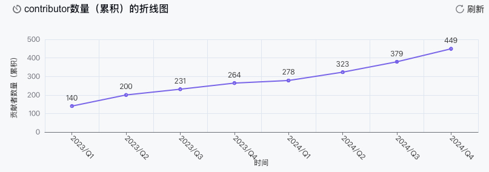

> 备注：只有成功向飞桨仓库提交并合入代码的开发者，才会被计为贡献者。 
> 数据来源：内部个人贡献者统计表（Paddle+docs+Science+2ONNX+MIX+OCR）

其中，**「启航计划集训营」** 吸引了大量新人积极参与，为飞桨贡献力量，成为**新增 contributor 的主力军**。

下图展示了 2024 年新增 contributor 的主要来源。可以看出，「启航计划集训营」的参与者贡献了约四成的新增 contributor。此外，在自然流量吸引的 contributor 中，PaddleOCR 项目占据了约一半的比例，表现尤为突出。

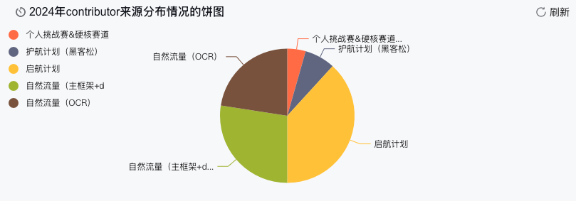

### 二、全年社区开发者贡献的 PR 占比

#### 1. Paddle 主框架的社区开发者 PR 占比

- 2022 年：7.1% （419/5873）
- 2023 年：23.8%（1588/6660）
- **2024 年：40.95%（2730/6667）** 🎉

2024 年，Paddle 主框架的社区开发者 PR 贡献占比达到了 **40.95%**，较去年显著提升，创下了历史新高 🎉🎉

下图展示了 2024 年 Paddle 主框架社区开发者 PR 占比情况，可以清晰地看到社区开发者的影响力显著提升。

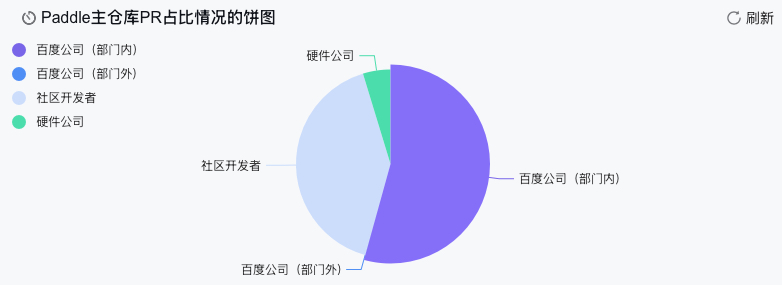

#### 2. docs 文档的社区开发者 PR 占比

- 2022 年：34.4% （180/524）
- 2023 年：72.9%（467/640）
- **2024 年：72.6%（333/459）** 🎉

2024 年，docs 文档的社区开发者 PR 贡献占比达到了 **72.6%**，与去年持平，但依然是一个非常高的比例。感谢每一位贡献者的努力与支持！

#### 3. 其他 repo 的社区开发者 PR 占比：🎉🎉🎉

- PaddleMIX: **16.01%**
- PaddleScience: **27.31%**
- PaddleOCR：**66.82%**
- Paddle2ONNX：**72.53%**
- PaddleSpeech：**52.94%**
- X2Paddle：**45.45%**

> 数据来源：内部社区开发者 PR 统计（2024）

---

## 飞桨开源社区活动

2024 年，飞桨开源社区成功策划并举办了一系列面向各层次开发者的活动，涵盖多个技术领域。活动内容丰富多样，包括**启航计划**、**黑客松**，以及与**国内外第三方联合举办的多项比赛**等。

### 一、启航计划集训营

2024 年，飞桨开源社区在 **3 月、 6 月和 11 月** 先后成功举办了 3 期启航计划集训营，涵盖框架开发、文档优化、编译器改造、大模型套件、科学计算等多个方向。通过设计**低门槛、富有趣味**的热身打卡任务，参与者能够轻松获得成就感。这一举措吸引了大量**首次接触飞桨社区的开发者**积极参与，共同推动飞桨生态的建设与发展。

#### 1. 第二期（3 月）

> 活动 Issue：[#62347](https://github.com/PaddlePaddle/Paddle/issues/62347)

本期启航计划集训营推出 **「探索团🪂 & 专项团🎯」** 新模式

|      |                     探索团🪂                     |                                                   专项团🎯                                                    |
| :--: | :----------------------------------------------: | :-----------------------------------------------------------------------------------------------------------: |
| 概要 | 不限制任务方向，按照活动规则完成任务即可顺利结营 | 聚焦某一具体方向（如 docs、复数、组合算子等）的小团体，由飞桨研发同学充当**导师**，护航计划学员充当**助教**。 |
| ...  |                       ...                        |                                                      ...                                                      |

- 线上共有 18 名营员合入了超过 100 个 PR；
- 线上共有 16 名营员成为了飞桨新的 contributor；
- 16 名营员通过考核，2 名优秀营员入选护航计划。

同时，我们鼓励在线上集训期间表现优秀的开发者主动申请参与角逐**一、二、三等奖**，答辩和评审工作由研发导师共同把关。

**一、二、三等奖礼品及获奖选手：**

- 一等奖：PS5 🎮 [@Eddie-Wang112](https://github.com/Eddie-Wang1120)
- 二等奖：Apple Watch SE ⌚️ [@InsaneOnion](https://github.com/InsaneOnion)
- 三等奖：Airpods（第三代）🎧 [@wufei2](https://github.com/wufei2)

> 结营公告：[PFCCLab/Starter#240](https://github.com/PFCCLab/Starter/issues/240)

#### 2. 第三期（6 月）

> 活动 Issue：[#65279](https://github.com/PaddlePaddle/Paddle/issues/65279)

本期启航计划联合**北京航天航空大学**举办线上 + 线下集训营

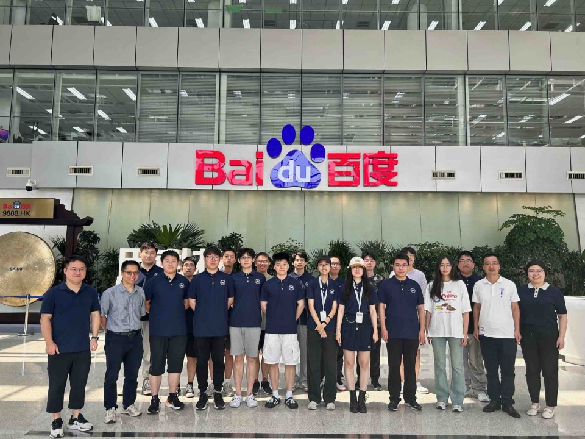

- 线上共有 13 名营员合入了超过 60 个 PR；
- 线上共有 9 名营员成为新的 contributor，11 名营员通过考核；
- 北航 15 名优秀同学在为期 8 周的“线上+线下”混合实习实训中累积已合入 426 个 PR

针对线下参与集训的北航同学，我们特别安排了现场答辩和结营仪式。

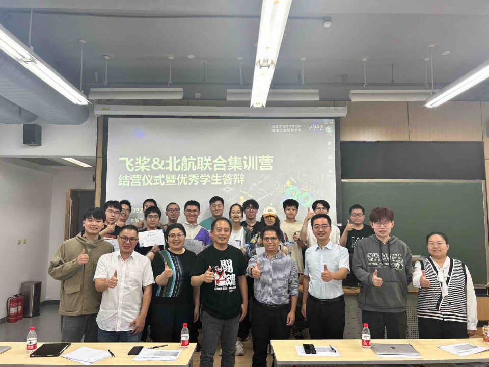

与此同时，线上集训营的**一、二、三等奖**的答辩和评审工作也按计划顺利进行，以下是礼品和获奖选手名单：

- 一等奖：iPad (第十代) 💻 [@GoldenStain](https://github.com/GoldenStain)
- 二等奖：Apple Watch SE ⌚️ [@Aoraki-Dream](https://github.com/Aoraki-Dream)
- 三等奖：Airpods（第三代）🎧 [@fufu0615](https://github.com/fufu0615)

> 结营公告：[PFCCLab/Starter#411](https://github.com/PFCCLab/Starter/issues/411)  
> 结营 blog：[飞桨&北航启航计划显成效：8 周 426 个 PR 的产学研新探索](https://pfcc.blog/posts/buaa-starter)

#### 3. 第四期（11 月）

> 活动 Issue：[#69152](https://github.com/PaddlePaddle/Paddle/issues/69152)

本期启航计划联合**四川大学**举办线上 + 线下集训营，同时线上集训营针对老师傅们推出续航充电团🔋

- 线上共有 26 名营员合入了超过 80 个 PR；
- 线上共有 23 名营员成为新的 contributor，12 名营员通过考核；
- 其余数据正在统计中...

本期启航计划中涌现出众多优秀营员，一二三等奖的竞争异常激烈，因此我们相应地扩大了获奖名额，以下是奖品及获奖选手名单：

- 一等奖：iPad (第十代) 💻 [@LittleHeroZZZX](https://github.com/LittleHeroZZZX)
- 二等奖：Apple Watch S10 ⌚️ [@aquagull](https://github.com/aquagull)
- 三等奖：Airpods 3&4 🎧 [@WAYKEN-TSE](https://github.com/WAYKEN-TSE)、[@Albresky](https://github.com/Albresky)

### 二、飞桨黑客松

2024 年，飞桨开源社区先后于 **3 月**和 **9 月**成功举办了 **2 期飞桨黑客马拉松**，活动形式多样，包括不同难度的开源任务、导师一对一的远程开发实践指导，以及攻克硬核技术难题等赛题形式。

飞桨黑客松主要面向**资深开发者**，对选手的技术水平要求较高，为此，组委会也提供了丰厚的奖励（50 万奖金）。这两期黑客马拉松有效推进了多个研发课题，显著加速了飞桨产品的迭代与优化。

#### 1. 第六期（3 月）

> 活动 Issue：[#62904](https://github.com/PaddlePaddle/Paddle/issues/62904)

第六期新增两条赛道：**Fundable Projects** 和 **优秀稿件征集与传播**。前者聚焦飞桨硬核技术难题，要求参赛者独立拆解任务并制定技术规划；后者旨在扩大飞桨影响力，参赛者先撰写符合选题的技术文章，经审核后可采用任意形式进行传播。

**四大赛道成果：**

- **开源贡献个人挑战赛**：共发布 55 个开源贡献任务，最终由 13 位开发者完成 38 个任务。
- **护航计划集训营**：共发布 27 个远程实训项目，涵盖多个技术方向，最终 28 位开发者参与答辩并顺利结营。
- **Fundable Projects**：定位为硬核社区项目，最终由社区完成了 5 个关键技术项目的研发。
- **优秀稿件征集与传播**：社区完成 9 篇高质量稿件，并在 CSDN 等平台传播。

以下是黑客松各赛道的获奖选手名单：

<!-- 第六期名单 -->

    <figure style="width: 15.3%">
    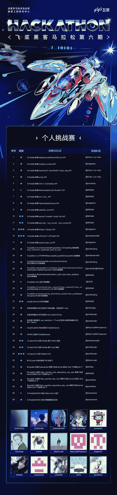
    </figure>
    <figure style="width: 16%">
    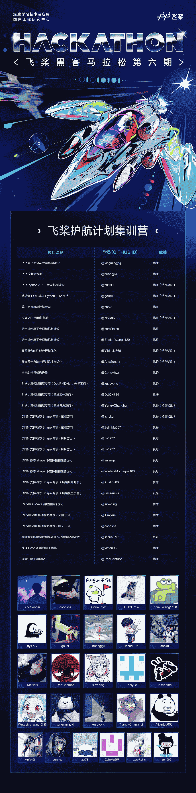
    </figure>
    <figure style="width: 34.5%">
    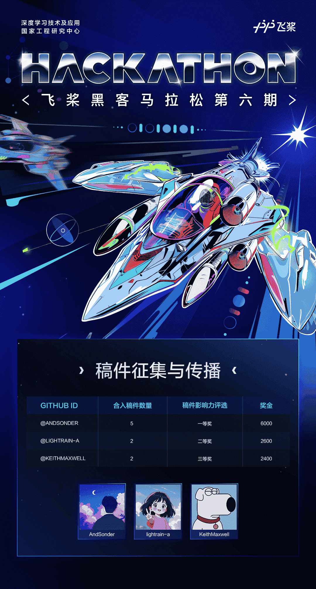
    </figure>
    <figure style="width: 30%">
    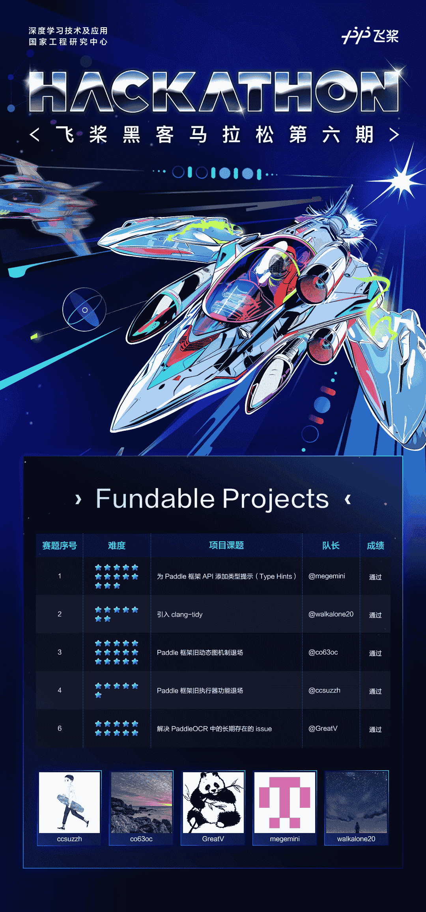
    </figure>

> 第六期黑客松结项 blog：[PaddlePaddle Hackathon | 探索无限可能！飞桨黑客马拉松第六期活动完美收官](https://pfcc.blog/posts/hackathon-6th-summary)

#### 2. 第七期（9 月）

> 活动 Issue：[#68242](https://github.com/PaddlePaddle/Paddle/issues/68242)

第七期黑客松较以往**更加聚焦**，延续了开发者喜爱的三大经典赛道——开源贡献个人挑战赛、飞桨护航集训营和 Fundable Projects 硬核赛道，同时在难度和数量上实现了升级。

**三大赛道成果：**

- **开源贡献个人挑战赛**：共发布 58 个开源贡献任务，最终由 19 位开发者完成 27 个任务。
- **护航计划集训营**：共发布 19 个实训项目，最终 19 位开发者参与答辩并顺利结营。
- **Fundable Projects**：共发布 11 个硬核社区项目，本期完成了 9 个关键技术项目的研发。

以下是黑客松各赛道的获奖选手名单：

<!-- 第七期名单 -->

    <figure style="width: 29%">
    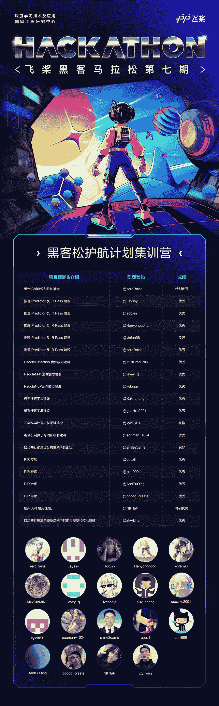
    </figure>
    <figure style="width: 24.7%">
    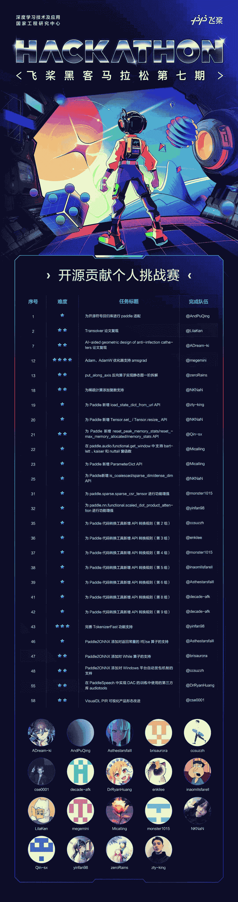
    </figure>
    <figure style="width: 37.5%">
    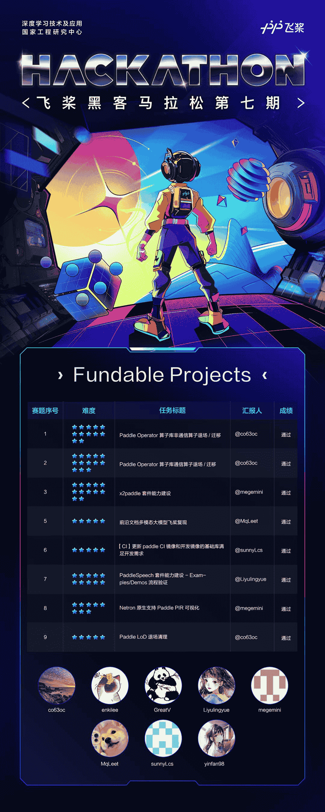
    </figure>

> 第七期黑客松结项 blog：[PaddlePaddle Hackathon | 再攀高峰！飞桨黑客马拉松第七期圆满落幕](https://pfcc.blog/posts/hackathon-7th-summary)

### 三、第三方合作办赛

除了飞桨开源社区主办的启航计划和黑客松外，我们还与多家第三方组织和机构联合举办了多项赛事活动。

#### 1. 开放原子开源大赛

[开放原子开源基金会](https://www.openatom.org/about)是致力于推动全球开源事业发展的非营利机构。

2024 年，飞桨开源社区先后于 **1 月**和 **9 月**应开放原子基金会邀请，共同参与筹建并成功举办了**第一届**和**第二届开放原子开源大赛**。

- 第一届（1 月）[PaddleOCR 算法模型挑战赛](https://competition.atomgit.com/competitionInfo?id=d25e62a0d7f27876a8c4219bfc0be90e)

   本次大赛共报名 211 支团队，总人数达到空前的 671 人。由于赛题本身具有一定挑战性（要求选手在 PaddleOCR 基线模型之上提升模型精度，同时保持推理速度与基线持平），最终 10 支队伍提交作品，其中 8 支队伍通过代码审查，**5 支队伍**入围决赛答辩。

   **赛题一：OCR 端到端识别任务**
   - 一等奖：1 支队伍，每支队伍奖金 15 万元
   - 二等奖：1 支队伍，每支队伍奖金 4 万元
   - 三等奖：1 支队伍，每支队伍奖金 1 万元

   **赛题二：通用表格识别任务**
   - 一等奖：1 支队伍，每支队伍奖金 7 万元
   - 二等奖：1 支队伍，每支队伍奖金 2 万元
   - 三等奖：1 支队伍，每支队伍奖金 1 万元

   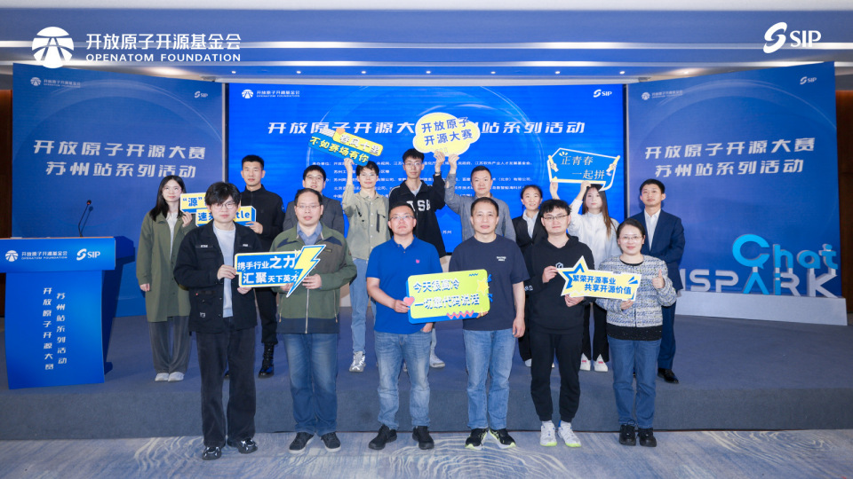

   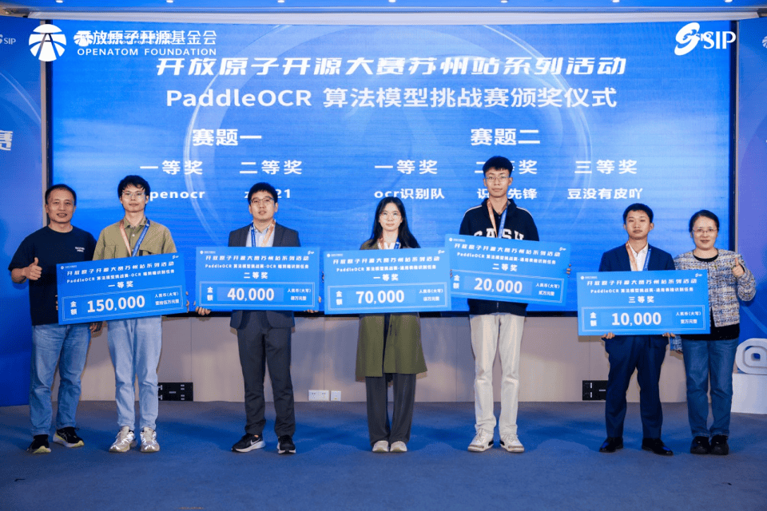

   > 结项 blog：[PaddleOCR 算法模型挑战赛圆满落幕 & 杭州开发者线下 Meetup](https://pfcc.blog/posts/suzhou-kaifangyuanzi)

- 第二届（9 月）
   1. [飞桨多模态大模型套件 PaddleMIX 开发大赛](https://competition.atomgit.com/competitionInfo?id=d65b849bc916bd42e1bc5f5ee2562efa)

      PaddleMIX 开发大赛共 85 个团队报名，11 个团队成功入围决赛。
      - 一等奖：1 支队伍，每支队伍奖金 5 万元
      - 二等奖：2 支队伍，每支队伍奖金 3 万元
      - 三等奖：4 支队伍，每支队伍奖金 1 万元

      以下是获奖名单及选手与评委的合影：

      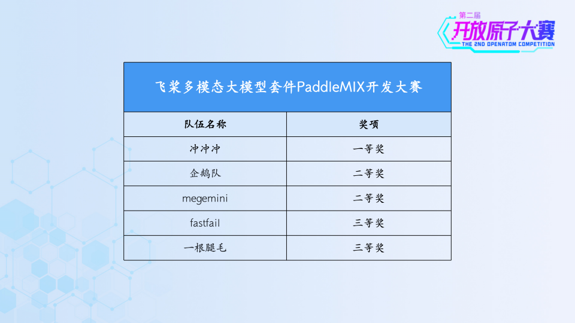

      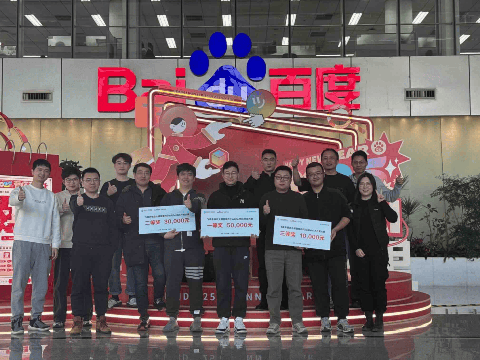

   2. [飞桨科学计算工具组件开发大赛](https://competition.atomgit.com/competitionInfo?id=805ad94637707d062f24e54265d85731)

      科学计算工具组件开发大赛包含 6 个赛题，共有 64 个团队报名，11 个团队闯入决赛。

      **赛题一：飞桨适配 torch-harmonics**：
      - 一等奖：1 支队伍，奖金 1 万元
      - 二等奖：1 支队伍，奖金 0.2 万元
      - 三等奖：1 支队伍，奖金 0.1 万元

      **赛题二：飞桨适配 Open3D**：
      - 一等奖：1 支队伍，奖金 1 万元
      - 二等奖：1 支队伍，奖金 0.2 万元
      - 三等奖：1 支队伍，奖金 0.1 万元

      **赛题三：飞桨适配 nueralop**：
      - 一等奖：1 支队伍，奖金 3 万元
      - 二等奖：1 支队伍，奖金 0.3 万元
      - 三等奖：1 支队伍，奖金 0.1 万元

      ……

      以下是获奖名单及选手与评委的合影：

      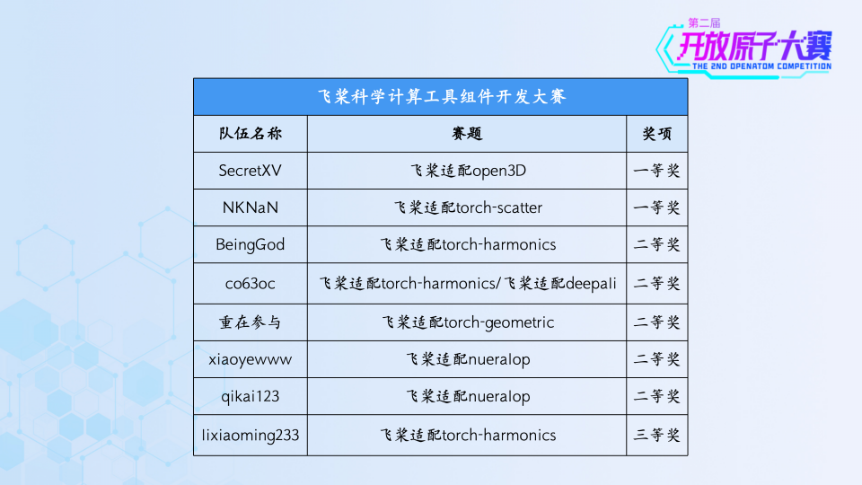

      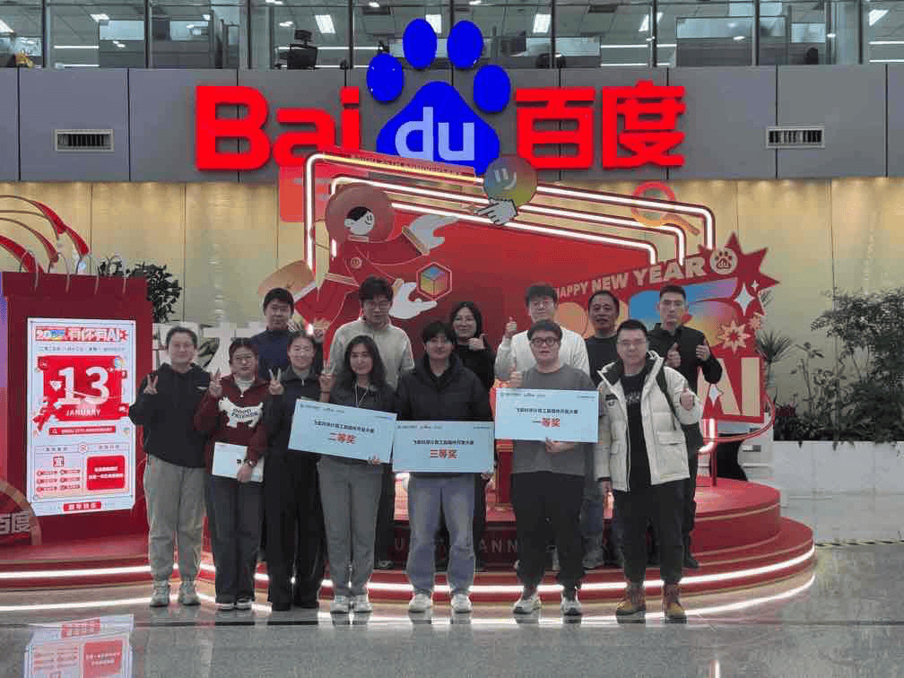

#### 2. 开源之夏 & GLCC

2024 年，飞桨开源社区应开源之夏和 GLCC 邀请，共同参与筹建并成功举办了 2 个暑期编程活动，累计完成 **5 个课题**。

- **开源之夏**

   [开源之夏](https://summer-ospp.ac.cn)是由 **中国科学院软件研究所** “开源软件供应链点亮计划”发起并长期支持的一项暑期开源活动，旨在鼓励在校学生积极参与开源软件的开发维护，培养和发掘更多优秀的开发者。

   | 学生姓名 |                    项目名称                    |     社区名称      | 社区导师 |
   | :------: | :--------------------------------------------: | :---------------: | :------: |
   |  秦忠宇  |   飞桨 PaddlePaddle-PIR 适配 2ONNX 推理转换    | 飞桨 PaddlePaddle |   王震   |
   |  谢一帆  | 飞桨 PaddlePaddle-PIR 适配 VisualDL 模型可视化 | 飞桨 PaddlePaddle |  陈志扬  |

- **GitLink 编程夏令营（GLCC）**

   [GLCC](https://www.gitlink.org.cn/glcc) 是在 **CCF 中国计算机学会** 指导下，由 CCF 开源发展委员会举办的面向全国高校学生的暑期编程活动。活动将覆盖近千所高校，携手各大开源基金会、开源企业、开源社区、开源专家联合开展。

   | 学生姓名 |              课题名称               | 导师姓名 | 评分结果 |
   | :------: | :---------------------------------: | :------: | :------: |
   |  曾志鹏  |    飞桨稀疏算子 API 升级适配 PIR    |  刘娇蒂  |    S     |
   |  刘斯哲  |  为开源大语言模型推理增加优化 Pass  |  方华强  |    S     |
   |  张瑞涛  | 飞桨 Save/Load 体系功能升级适配 PIR |  王儒婷  |    B     |

飞桨开源社区同样获得了 开源之夏 和 GLCC 组织方的高度认可。

<!-- 一些认可 -->

    <figure style="width: 48%">
    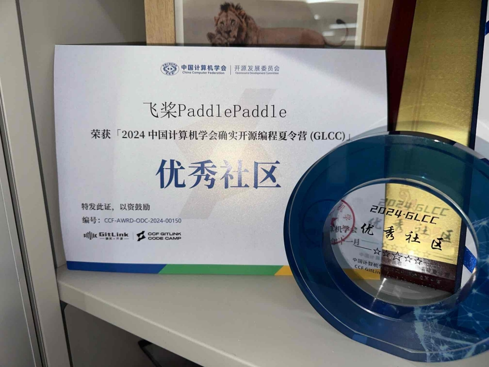
    </figure>
    <figure style="width: 48%">
    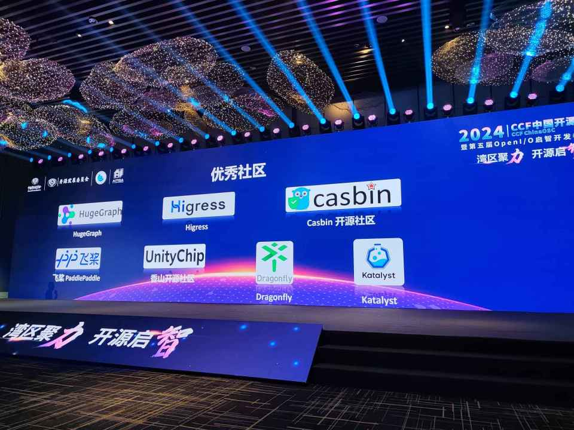
    </figure>

#### 3. 走向国际的比赛

飞桨开源社区也是一个国际化社区，我们与全球开源组织携手举办了多项赛事与活动。

- **IJCAI 2024 任意三维几何外形车辆的风阻快速预测竞赛**

   **2024 年 4 月**，开放原子开源基金会携手百度飞桨、北京航空航天大学，联合发起了一场科技界的盛大赛事——IJCAI 2024: 任意三维几何外形车辆的风阻快速预测竞赛。赛事旨在探索人工智能在汽车空气动力学领域的前沿应用，推动技术突破，解决实际的工业难题。

   本次比赛为参赛选手准备了 35,000 美元的丰厚奖池，并且提供了包含 450 种不同 ShapeNet 汽车的训练数据、基于 PaddlePaddle 框架构建的 baseline 代码。

   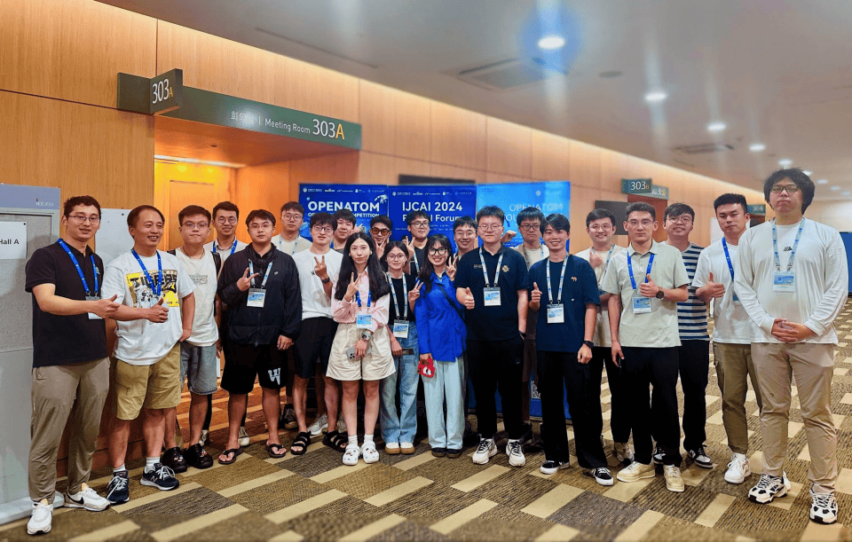

- **CIKM 2024 AI 辅助的先进空气动力学-优化汽车设计以实现最佳性能**

   第 33 届国际信息与知识管理大会将于 2024 年 **10 月 21 日**至 **25 日**在美国博伊西隆重举行。依托该会议，开放原子开源基金会携手百度飞桨、阿尔特汽车，联合举办了一场重量级赛事——“CIKM 2024：AI 辅助的先进空气动力学-优化汽车设计以实现最佳性能”，并取得了令人瞩目的成果。

   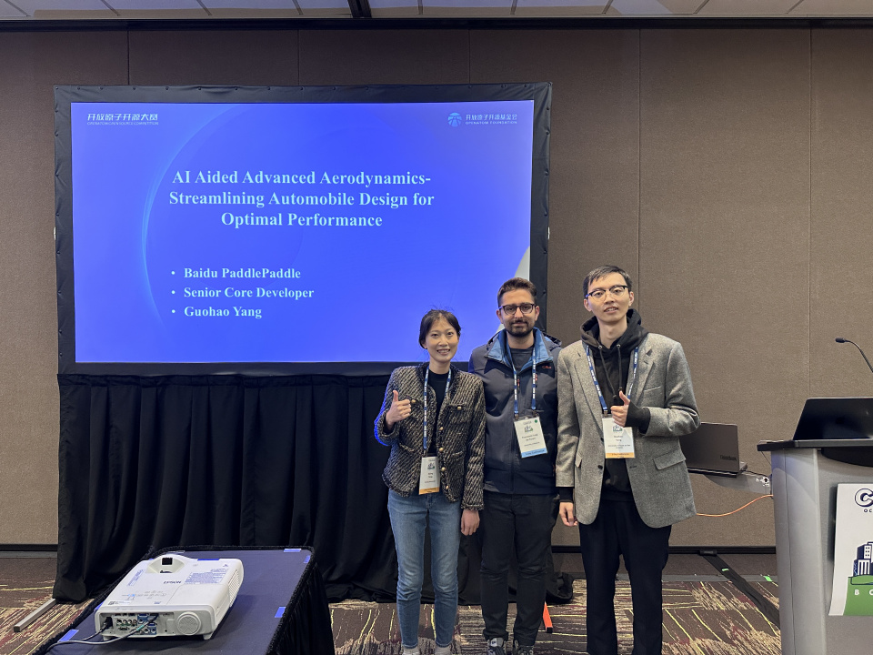

---

## 飞桨开源社区 2024 年完成的代表性项目总览

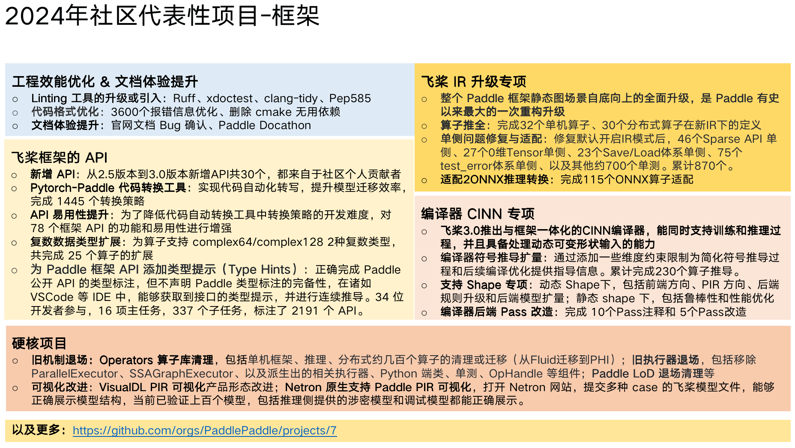

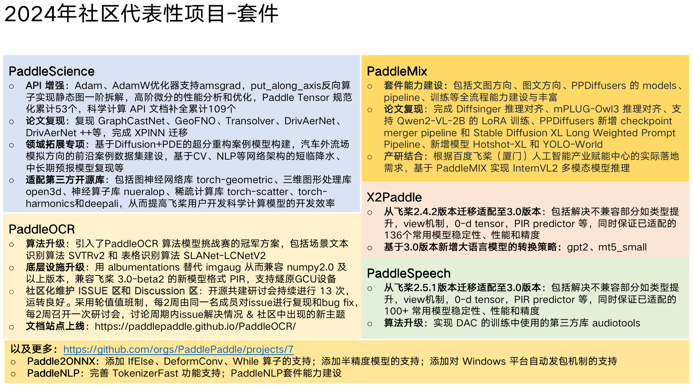

> 详情见：https://github.com/orgs/PaddlePaddle/projects/7

---

## 飞桨开源社区治理结构

### 一、 PFCC

[PFCC](https://github.com/PaddlePaddle/community/tree/master/pfcc) 是一个由飞桨开源社区**贡献者**所组成的虚拟组织。在这里，开发者们可以自由讨论、交流经验、分享成果，并持续为飞桨开源项目贡献力量，共同推动项目的发展。

#### PFCC 成员数量

截止 2025 年 1 月 21 日， PFCC 成员已达到 **201 人** 🎉

- 2022 年：67
- 2023 年：131（+64）
- **2024 年：195（+64）** 🎉

#### PFCC 双周例会

2024 年共召开了 **17 次 PFCC 例会**，并推出了「**PFCC 全勤奖**」，鼓励每位成员积极参与社区讨论与建设。

> - 附：[全年会议情况](https://github.com/PaddlePaddle/community/tree/master/pfcc/meetings/2024)
> - 2024 年 10 月～12 月的全勤奖获奖人分别为： [@unseenme](https://github.com/unseenme)、[@zrr1999](https://github.com/zrr1999)、[@greatv](https://github.com/greatv)、[@Liyulingyue](https://github.com/Liyulingyue)、[@ccsuzzh](https://github.com/ccsuzzh)

#### PFCC 开发者线下 meetup

我们在各个城市不定期组织线下 PFCC 社区 meetup 面基（大型同性 I 人交友现场）

<!-- 线下meetup -->

    <figure style="width: 49%">
    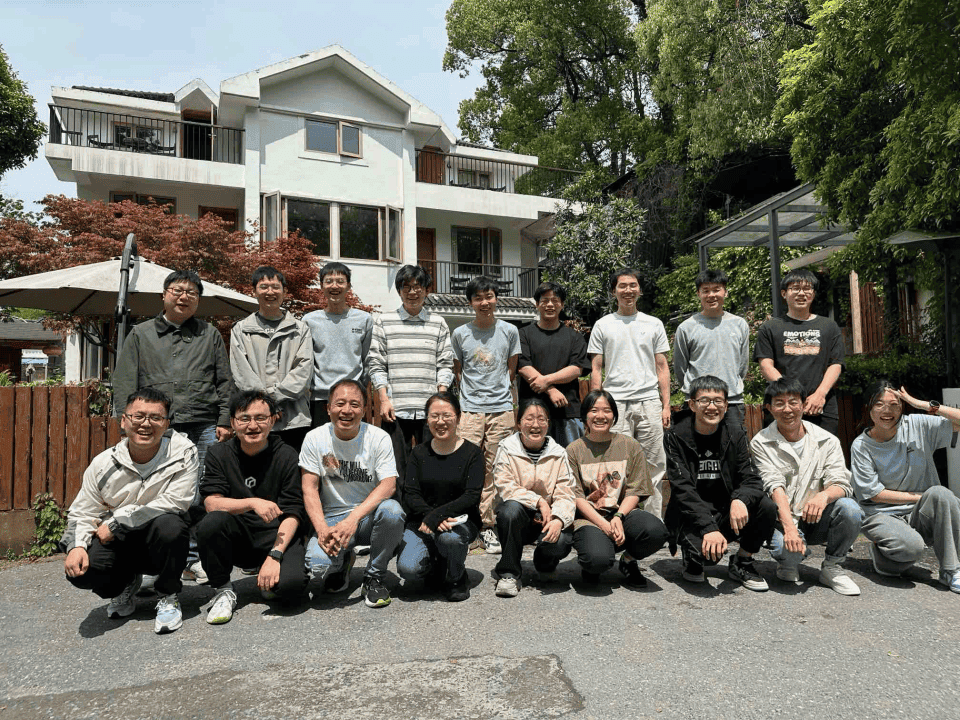
    <figcaption>2024 年 4 月杭州线下面基</figcaption>
    </figure>
    <figure style="width: 49%">
    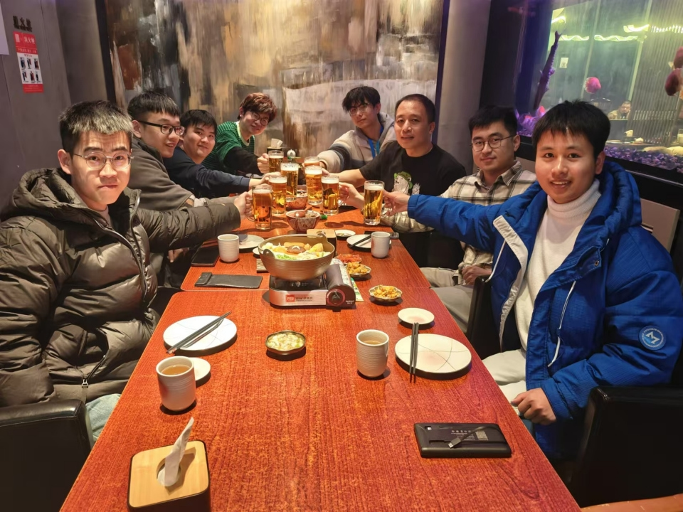
    <figcaption>2024 年 12 月上海线下饭局</figcaption>
    </figure>

    <figure style="width: 43%">
    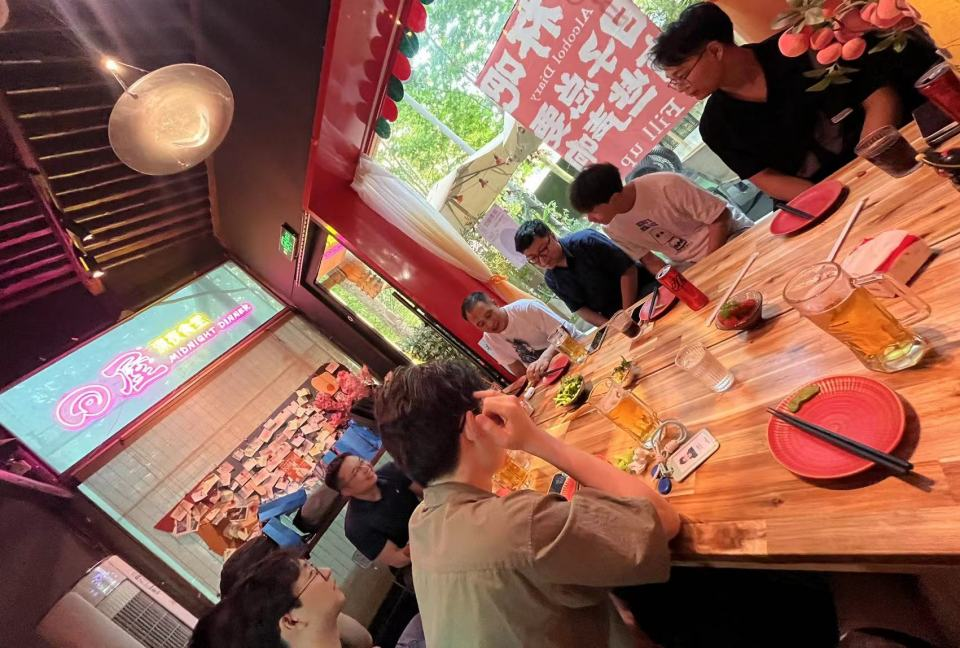
    <figcaption>2024 年 6 月 北京线下饭局</figcaption>
    </figure>
    <figure style="width: 55%">
    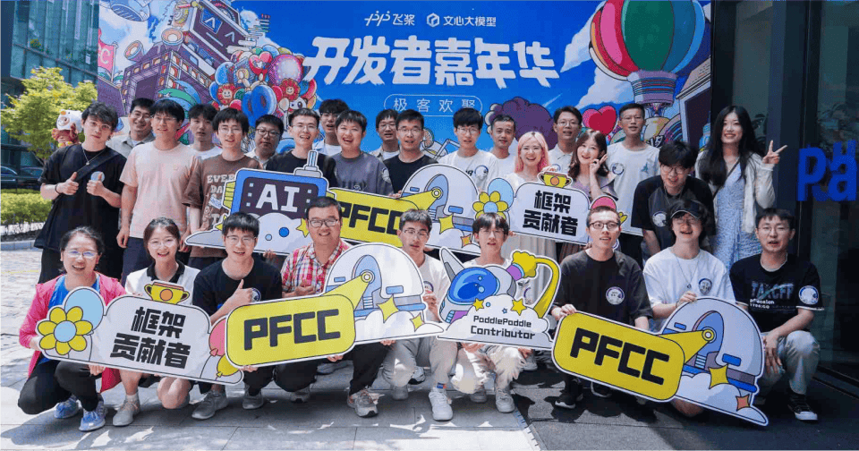
    <figcaption>经典老图</figcaption>
    </figure>

### 二、 PMC

为保障项目的可持续健康发展并加强社区治理，飞桨开源社区于 2024 年成立了 **Paddle2ONNX** 和 **PaddleOCR** 的 **PMC（项目管理委员会）** 组织。

PMC 成员由社区开发者与百度员工共同组成，但均以**个人身份**参与项目的维护与开发，不代表其雇主的利益。

#### Paddle2ONNX PMC

- 成立公告： [Paddle2ONNX/#1185](https://github.com/PaddlePaddle/Paddle2ONNX/issues/1185)
- PMC Chair：郑必城 [@Zheng-Bicheng](https://github.com/Zheng-Bicheng)

#### PaddleOCR PMC

- 成立公告：[PaddleOCR/#13019](https://github.com/PaddlePaddle/PaddleOCR/discussions/13019)
- PMC Chair：[@GreatV](https://github.com/GreatV)、[@tink2123](https://github.com/tink2123)

### 三、 开源之星、开源仙人

飞桨开源之星、开源仙人旨在表彰在一段时间内做出突出贡献的飞桨开源社区开发者。该奖项每半年评选一次，通常在飞桨开发者峰会（WAVE SUMMIT）现场颁发。

> 附：[历届开源之星名单](https://github.com/PaddlePaddle/community/blob/master/contributors/certificate-inspection.md)

<!-- 开源之星、仙人 -->

    <figure style="width: 50%">
    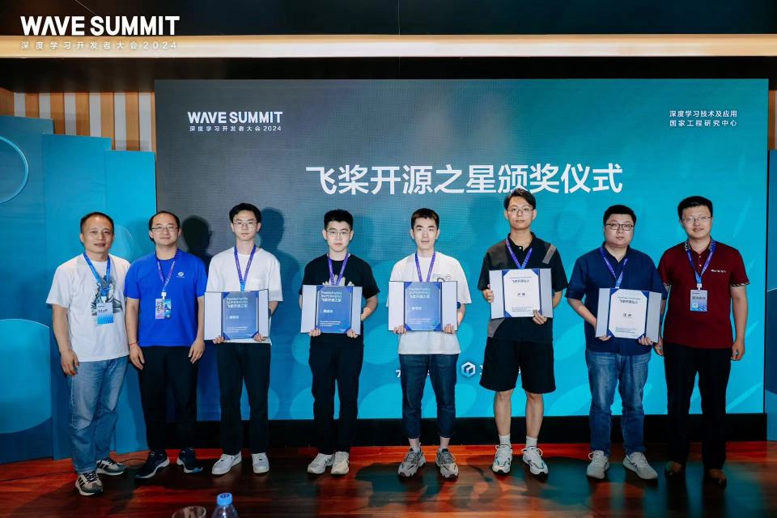
    <figcaption>2024 上半年开源之星、开源仙人颁奖现场</figcaption>
    </figure>
    <figure style="width: 23.4%">
    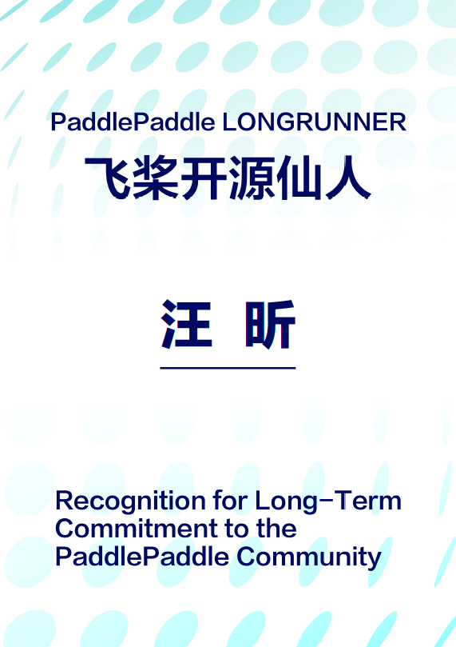
    <figcaption>2024 开源仙人证书</figcaption>
    </figure>
    <figure style="width: 23.3%">
    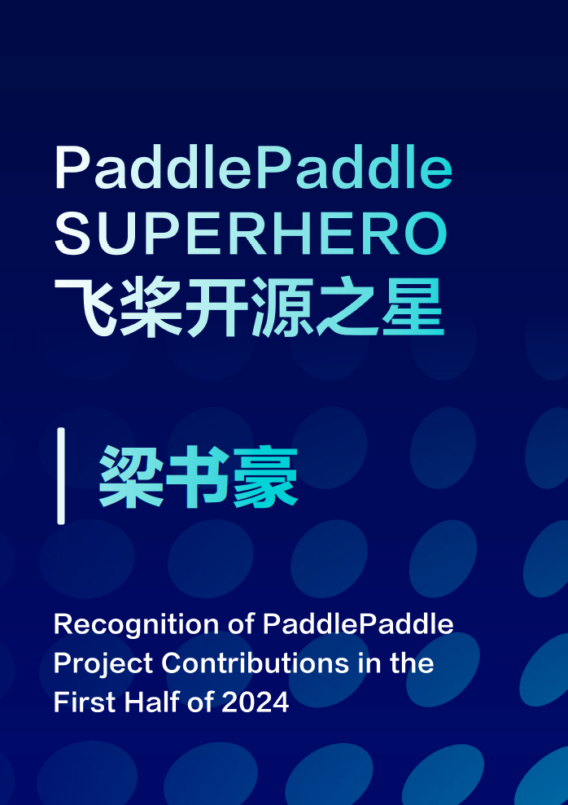
    <figcaption>2024 开源之星证书</figcaption>
    </figure>

---

## 飞桨开源社区博客

全年发布 21 篇 blog，包括日常活动、开发者访谈、开源洞察等栏目，总共吸引 **9.3K** 的活跃用浏览。

> 博客域名：[pfcc.blog](https://pfcc.blog/)

    <figure>
    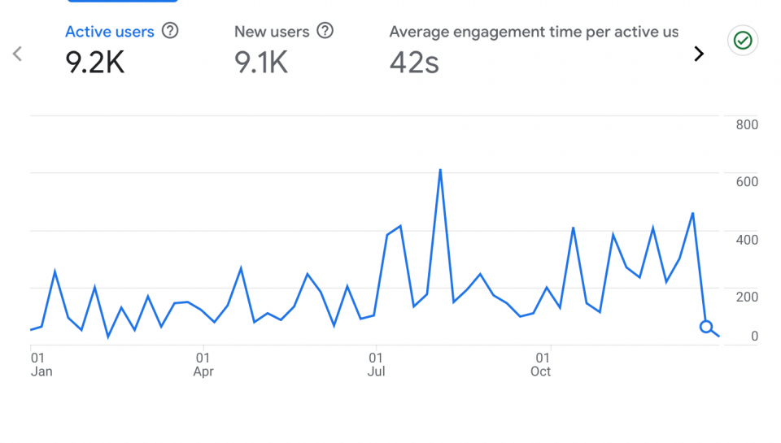
    <figcaption>2024 全年博客浏览人数的变化图</figcaption>
    </figure>

### 一、飞桨社区日常活动博客

- 2 月 18 日｜[新征程 ⛵️ ｜飞桨「启航计划」集训营圆满落幕](https://pfcc.blog/posts/starter-camp)
- 3 月 29 日｜[第三十六次 PFCC 会议｜Ivy 与 PaConvert 分享](https://pfcc.blog/posts/pfcc-36th)
- 4 月 17 日｜[PaddleOCR 算法模型挑战赛圆满落幕 & 杭州开发者线下 Meetup](https://pfcc.blog/posts/suzhou-kaifangyuanzi)
- 7 月 8 日｜[终于等到你！PaddleOCR 新版本发布！](https://pfcc.blog/posts/paddleocr-release)
- 8 月 19 日｜[IJCAI 2024 任意三维几何外形车辆的风阻快速预测竞赛比赛圆满完成~](https://pfcc.blog/posts/ijcai-2024-competition)
- 8 月 23 日｜[PaddlePaddle Hackathon | 探索无限可能！飞桨黑客马拉松第六期活动完美收官](https://pfcc.blog/posts/hackathon-6th-summary)
- 9 月 1 日｜[项目收官 | 为 Paddle 框架 API 添加类型提示（Type Hints）](https://pfcc.blog/posts/type-hints-project)
- 11 月 17 日｜[第二十八期 “CCF 开源高校行”暨“木兰技术开放日”走进北京大学活动成功举办](https://pfcc.blog/posts/ccf-pku)
- 11 月 26 日｜[百度“与你一起定义飞桨的未来”主题活动走进浙江大学软件学院成功举办](https://pfcc.blog/posts/zju-event)
- 11 月 27 日｜[飞桨&北航启航计划显成效：8 周 426 个 PR 的产学研新探索](https://pfcc.blog/posts/buaa-starter)
- 12 月 26 日｜[飞桨开源社区上海活动剪影](https://pfcc.blog/posts/shanghai-event)

### 二、开发者访谈专栏「开源江湖闲聊录」

- 1 月 14 日｜[【开源江湖闲聊录】物理 ➡️ 经济 ➡️ 开源，看散步师傅的曲折求学史～](https://pfcc.blog/posts/sanbu-story)
- 1 月 25 日｜[【开源江湖闲聊录】社区最强水群人——张师傅的酸甜苦辣生活说](https://pfcc.blog/posts/zhangyiqiao-story)
- 2 月 6 日｜[【开源江湖闲聊录】飞桨的见证者：涛姐的风风雨雨传奇之旅](https://pfcc.blog/posts/tao-story)
- 3 月 18 日｜[【开源江湖闲聊录】Paddle 六边形战士？揭开汪师傅的神秘面纱～](https://pfcc.blog/posts/wangxin-story)
- 4 月 26 日｜[【开源江湖闲聊录】从代码到键盘外的世界，走进 NKNaN 的日常](https://pfcc.blog/posts/nknan-story)
- 8 月 9 日｜[【开源江湖闲聊录】再见，追寻月亮的梦师傅](https://pfcc.blog/posts/ligoml-story)
- 11 月 19 日｜[【开源江湖闲聊录】化学的尽头是 AI？折腾不止的北美水獭哥](https://pfcc.blog/posts/yanguohao-story)

### 三、开源洞察专栏

- 3 月 3 日｜[【睁眼看世界 🌍】｜PyTorch Conference 2023 - State of PyTorch](https://pfcc.blog/posts/pytorch-conference-01)
- 7 月 5 日｜[Paddle 静态图并行编排与执行流程](https://pfcc.blog/posts/paddle-pipeline-parallel) （@[andsonder](https://github.com/andsonder)）
- 10 月 17 日｜[【睁眼看世界 🌍】｜扎克伯克写给开发者的一封信：开源 AI 是未来的前进之路](https://pfcc.blog/posts/zuckerberg-letter-post)

---

## 彩蛋🥚

领取你个人的飞桨 2024 年度报告 ：https://2024-report.pfcc.blog
