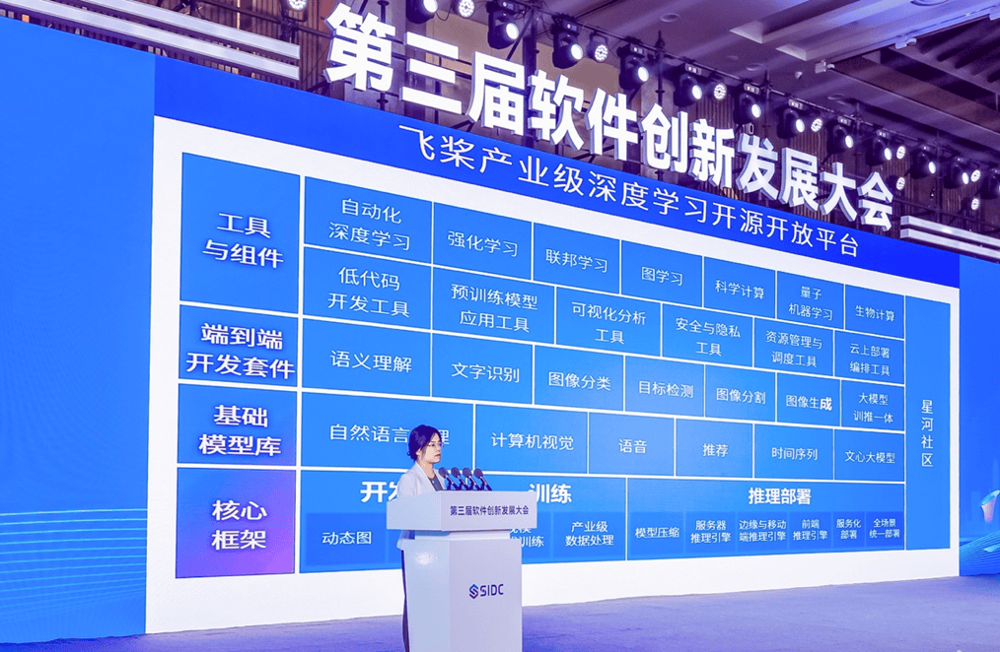
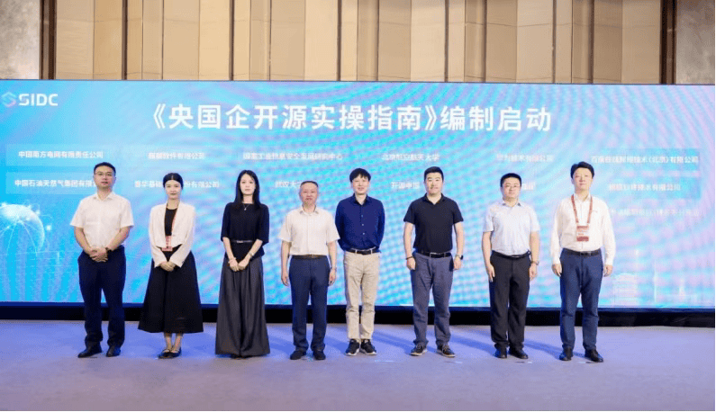
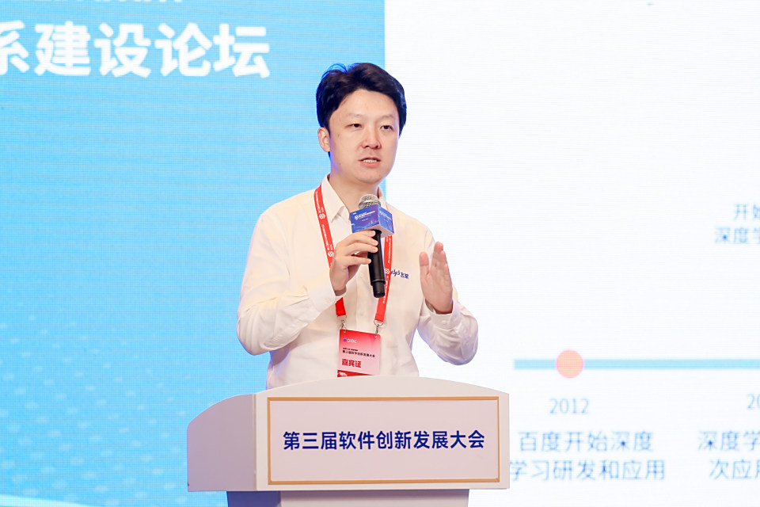

2025 年 6 月 13 日，第三届软件创新发展大会在武汉光谷顺利召开。大会聚焦大模型时代下基础软件的创新与发展，吸引了众多行业专家和企业代表参与。

在主论坛上，百度集团副总裁、深度学习技术及应用国家工程研究中心副主任吴甜发表主题演讲，分享了大模型时代给深度学习平台等基础软件带来的深刻变化。她指出：

> **大模型效果不断提升的背后，是深度学习平台等基础软件的支持。飞桨等深度学习平台的发展，将为人工智能下一步发展提供长足支持力。**

   

      <figure>
         
         <figcaption>吴甜在大会主论坛发表演讲</figcaption>
      </figure>
   

吴甜进一步介绍，基础软件平台的繁荣离不开开发者的广泛参与。飞桨正持续赋能开发者：

- 飞桨 AI Studio 星河社区已上线 **700 万个实践项目**
- 600 多门公开课
- 400 多场 AI 竞赛

基于飞桨深度学习平台和文心大模型，百度已在上海、广州、南京、武汉、厦门、宁波、南昌、无锡等地落地产业赋能中心、数据生态中心和教育创新中心，加快区域产业智能化升级。

在武汉，百度飞桨已重点赋能 **229 家企业**，拓展 **29 家飞桨技术合作伙伴**，培育出 **23 个基于文心大模型的生态 AI 产品**。

下午，由国家工业信息安全发展研究中心和武汉开源创新联盟共同承办的 **企业开源体系建设论坛** 成功召开。论坛以“开源促创新 生态筑未来”为主题，邀请了湖北省经济和信息化厅党组成员、总工程师盛章学，国家工业信息安全发展研究中心总工程师周平，开放原子开源基金会秘书长助理李博等嘉宾致辞。

会上，周平与首批参编单位代表——中国南方电网有限责任公司、中国石油天然气集团有限公司、麒麟软件有限公司、武汉大学、华为技术有限公司、百度在线网络技术（北京）有限公司和统信软件技术有限公司——**共同启动**《央国企开源实操指南》编制工作。

   

      <figure>
         
         <figcaption>《央国企开源实操指南》编制启动仪式现场</figcaption>
      </figure>
   

在启动仪式后，来自开放原子开源基金会、武汉大学、南方电网、中国石油、武汉开源创新联盟、芯来科技、百度、武汉凹语言社区等单位的十余位专家代表，结合实际工作，围绕企业开源的战略融合、合规设计、社区治理与运营等领域展开了深入交流。

百度在线网络技术(北京)有限公司高级产品经理张晶，现场分享了 **《产业级深度学习平台飞桨的开源实践》** ，从飞桨框架的演进历程、开发者社区建设、教育生态、企业生态等多个视角，系统拆解了飞桨开源的成功之道。

他介绍，今年 4 月，飞桨框架迎来重大更新，发布[飞桨框架 3.0](https://mp.weixin.qq.com/s/MAdo7fZ6dfeGcCQUtRP2ag)正式版。飞桨框架 3.0 具备动**静统一自动并行、大模型训推一体、科学计算高阶微分、神经网络编译器、异构多芯适配**五大新特性，为开发者打造了一站式、高性能的深度学习开发体验。

另外，与传统软件开发相比，开源项目有多样的参与方，需要有更灵活透明的协同机制，构建活跃的开发者社区，真正实现“众人拾柴火焰高”，开发者社区的构建和运营就变得尤为重要，甚至超越开发本身。飞桨在开发者社区建设方面针对飞桨核心框架的开源贡献者，设立了[飞桨框架贡献俱乐部 PFCC](https://github.com/PaddlePaddle/community/tree/master/pfcc)；对分布全球的区域开发者，组建以城市和高校为单位的[飞桨领航团](https://www.paddlepaddle.org.cn/ppdenavigategroup)；飞桨还协同开源生态伙伴组织丰富多样的社区活动。例如组织飞桨黑客松，通过挑战性的编程任务设定，让开发者深入探索飞桨框架。

嘉宾分享完毕后，参会者和嘉宾们还进行了热烈的交流互动，希望在开源标准、平台、工具、咨询等相关领域多找合作点，共同推动研究创新和应用实践！作为国产开源深度学习平台的代表，百度飞桨，跟已开源的文心大模型一起，通过线下技术沙龙、[WAVE SUMMIT 开发者峰会](https://www.wavesummit.com.cn/)以及社区共创项目‌等与开发者高频互动，持续深化开源生态建设！
