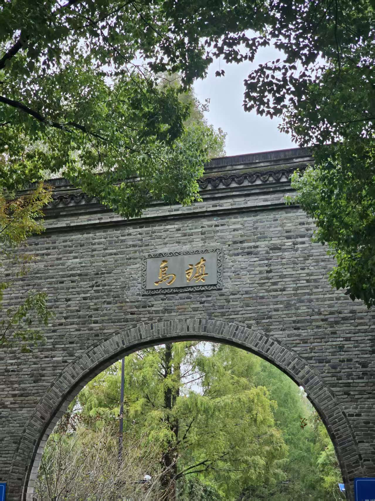
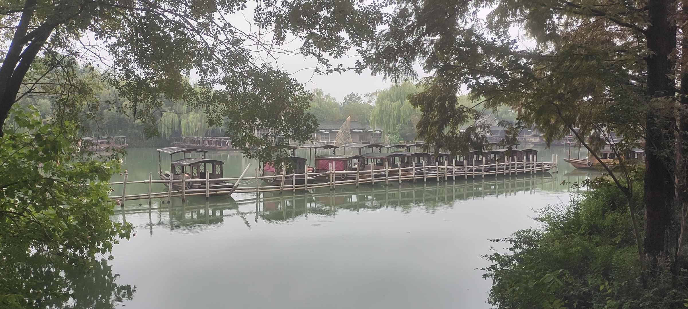
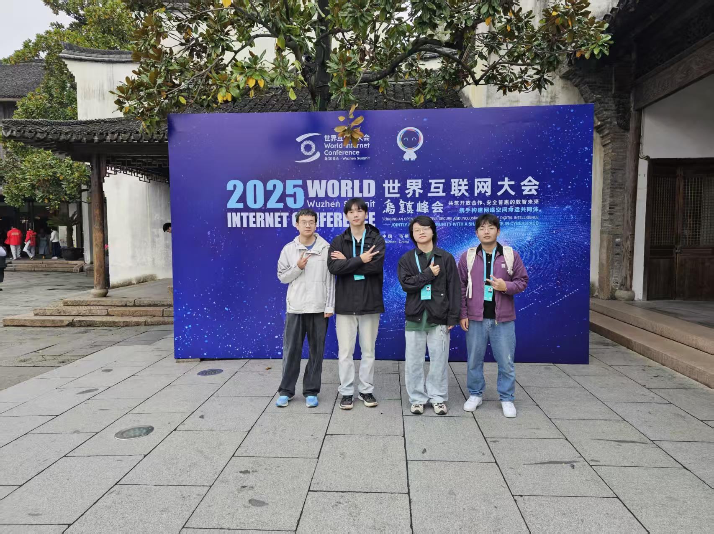
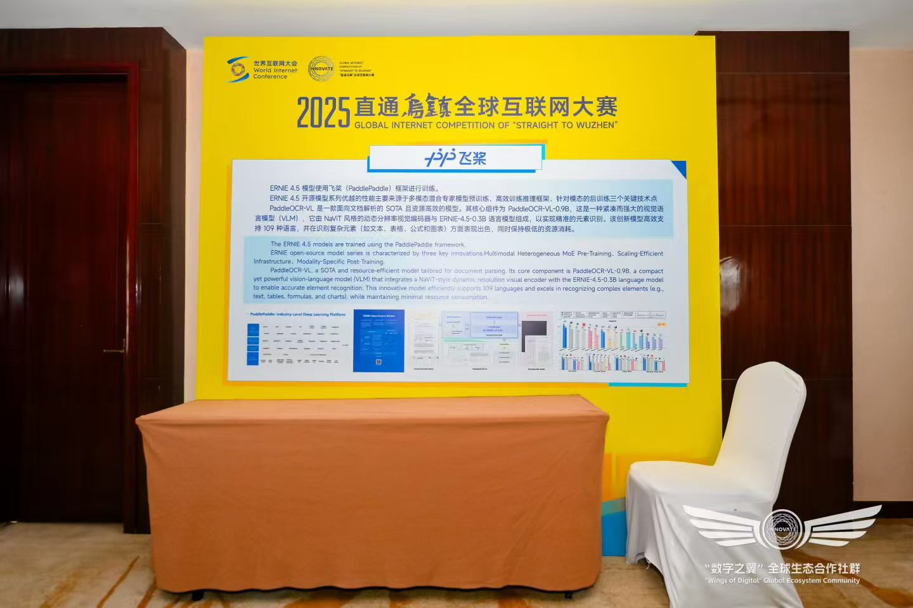
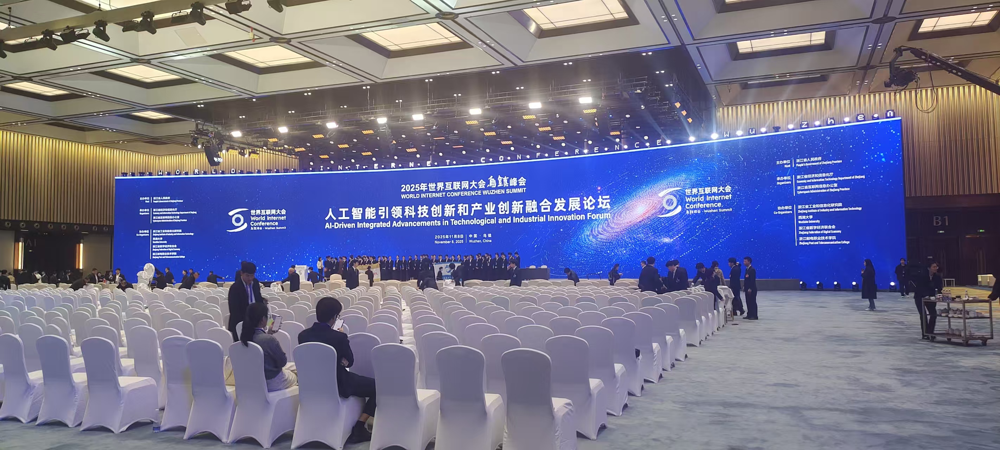
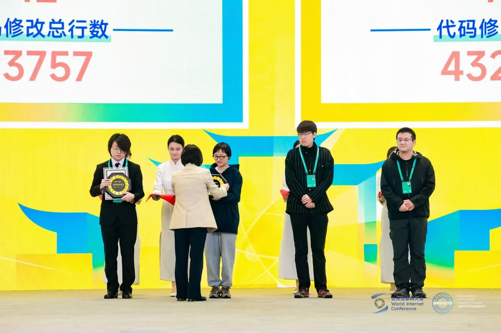
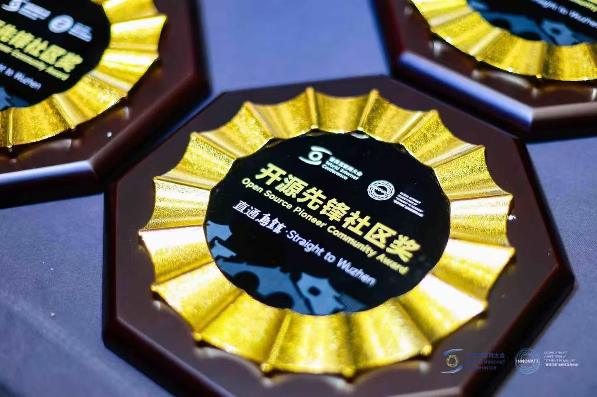
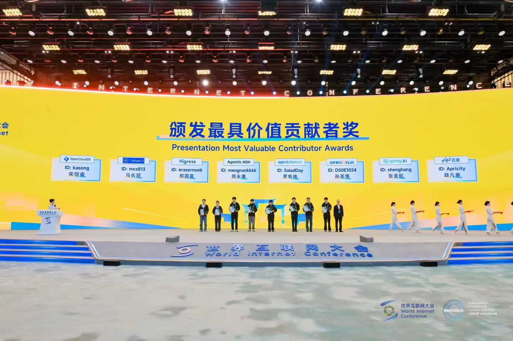
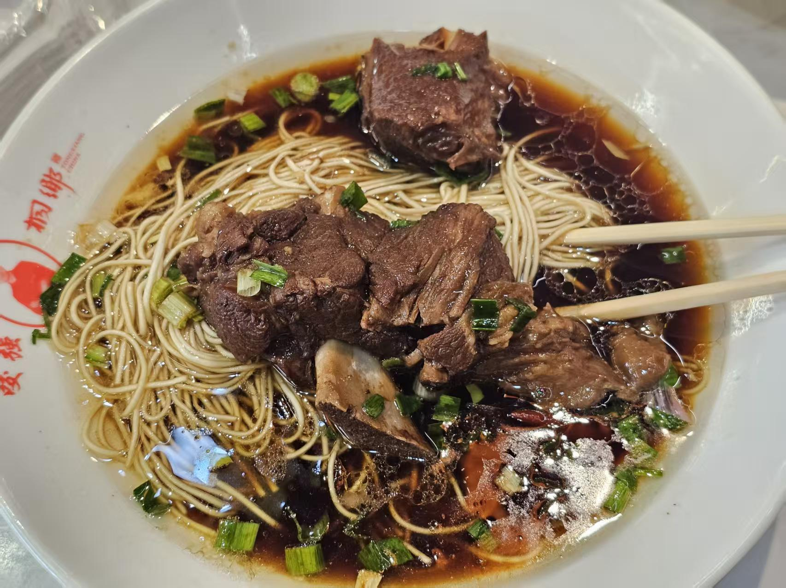
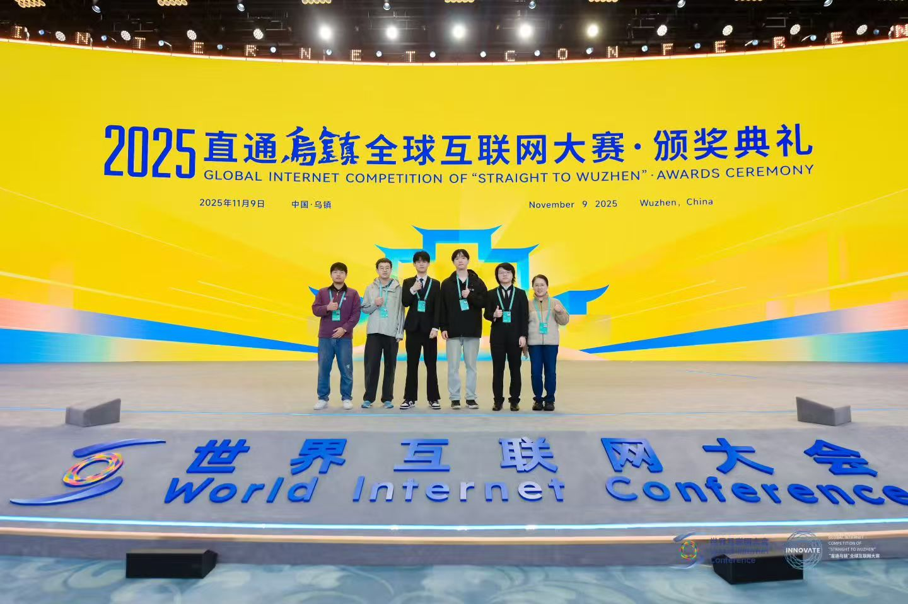

写在前面： 这不是一篇正经的技术战报，而是一个“乌镇闲散人员”的碎碎念。关于怎么跨越半个中国去领奖，关于嘉兴的雨，关于飞桨社区在世界互联网大会上的那些事儿。

<!-- more -->

---

## 这一路，真挺“折腾”的

如果只看结果，我们在乌镇领了大奖，光鲜亮丽。但如果看过程，这简直是一场海陆空（夸张了，只有空陆）大迁徙。

为了赶上 2025“直通乌镇”全球互联网大赛的颁奖典礼，我们的通勤路线是这样的：

北京 ✈️ 上海：先飞过去，这只是热身。

上海 🚄 嘉兴：转高铁，看着窗外景色从高楼变成水田。

嘉兴 🚕 乌镇：最后再打个车，晃晃悠悠进景区。

虽然现在交通发达，但这几经周转下来，确实让人有点没脾气。尤其是到了嘉兴之后，迎接我们的不是灿烂阳光，而是雨。

> 编者✍️的疑惑🤔：乌镇作为“世界互联网大会举办地”，竟然 **没有高铁**！

江南的雨，和北方的雨不一样。它是那种细细密密、黏在身上的湿冷。嘉兴在下，到了乌镇还在下。但这雨水打在青石板路上，把古镇洗得像水墨画一样，你不得不承认，虽然鞋湿了很烦，但真美。

<figure style="text-align: center;">
  
  <figcaption>乌镇风景</figcaption>
</figure>

<figure style="text-align: center;">
  
  <figcaption>乌镇风景</figcaption>
</figure>

---

## 乌镇的“闲散”时光

戴着绿色的参会证，穿梭在乌镇西栅的景区里，有一种奇妙的穿越感。

这里是世界互联网大会的永久举办地，你能看到最前沿的 AI 技术、最硬核的极客展台，但转个身，旁边就是摇着橹船的小河。

作为“闲散人员”，虽然背负着任务，但也不能亏待肚子。乌镇的美食，在湿冷的雨天里简直是救赎。大家围坐在一起吃饭的时候，聊的不是只有代码 review 和 PR，还有这雨到底什么时候停，以及这菜是不是太甜了点（笑）。

这种 **“人味儿”**，可能就是线下活动最大的魅力吧。

<figure style="text-align: center;">
  
  <figcaption>乌镇风景</figcaption>
</figure>

<figure style="text-align: center;">
  
  <figcaption>闲散人员合照</figcaption>
</figure>

## 还有比红烧肉更让人开心的事

当然，这次大费周章跑来乌镇，不是只为了吃。

我们是带着飞桨（PaddlePaddle）社区的使命来的。在 2025“直通乌镇”全球互联网大赛中，飞桨作为开源项目竞技挑战赛的开源社区支持方，见证了无数开发者的硬核比拼。

<figure style="text-align: center;">
  
  <figcaption>飞桨展台</figcaption>
</figure>

<figure style="text-align: center;">
  
  <figcaption>好大的排场</figcaption>
</figure>

最激动的时刻发生在 11 月 9 日的颁奖典礼。

当大屏幕上亮起 **「开源先锋社区奖」** 的时候，虽然作为社区的一份子早有心理准备，但那种自豪感还是很真实的。这不是一个人的奖，是成千上万个 commit，是无数次 issue 讨论换来的认可。

<figure style="text-align: center;">
  
  <figcaption>开源先锋社区奖</figcaption>
</figure>

<figure style="text-align: center;">
  
  <figcaption>奖牌</figcaption>
</figure>

更让我们开心的是，薛凡豪同学（来自北大，还是个学生！）拿下了 **「最具价值贡献者奖」**。 看着他上台领奖，心里特别感慨。开源社区最酷的地方就在这里：不问出身，只看代码。无论你是资深工程师还是在校学生，只要你的代码能解决问题，能推动项目前进，你就是 MVP。

> 编者✍️注：co 师傅谈泊名利，不想领奖，奖项顺延给薛凡豪同学。

<figure style="text-align: center;">
  
  <figcaption>最具价值贡献者奖</figcaption>
</figure>

---

## 写在最后

回程的路上，雨好像停了。

这次乌镇之行，虽然路途辗转，虽然天公不作美，但能在此时此地，和志同道合的朋友们聚在一起，看着我们共同维护的飞桨社区获得世界的认可，这一切都值了。

但由于各位“闲散人员”实在玩的过于开心，导致我们竟然没有一个人拍聚餐的照片！只能用这张“我们真的聚餐了”的照片来告诉大家，我们是真的聚了。

<figure style="text-align: center;">
  
  <figcaption>我们真的聚餐了</figcaption>
</figure>

代码通常是冰冷的逻辑，但在乌镇的这几天，我感受到了社区的温度。

<figure style="text-align: center;">
  
  <figcaption>合照</figcaption>
</figure>

飞桨，Keep Paddling！我们下一站见。

---

By 一个刚烘干了鞋子的飞桨社区成员
