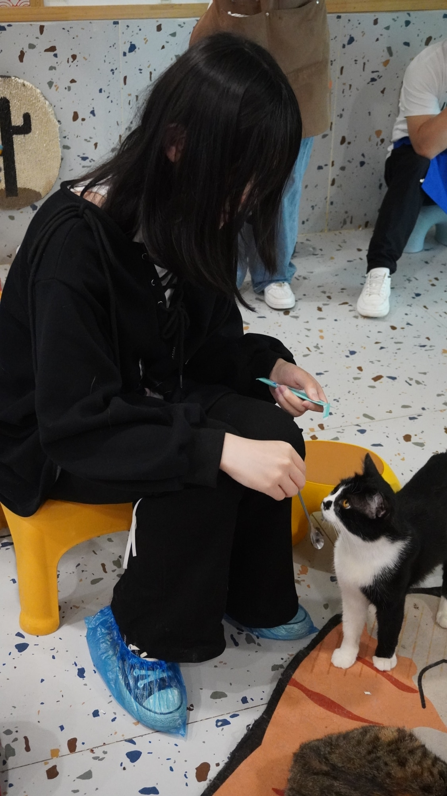
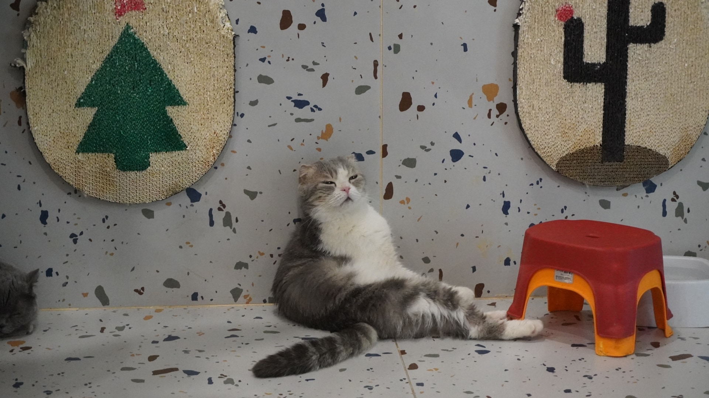
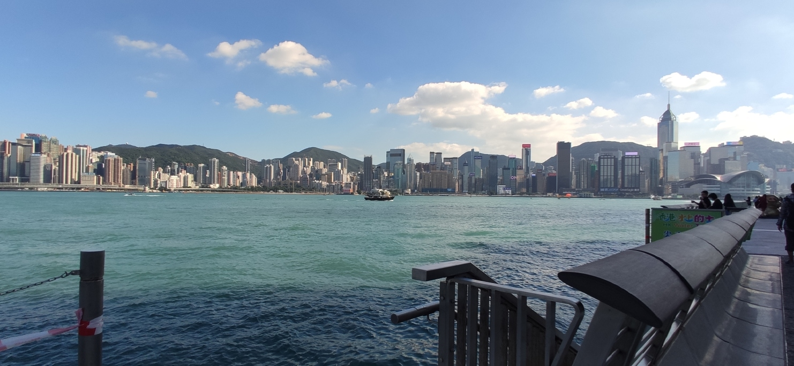
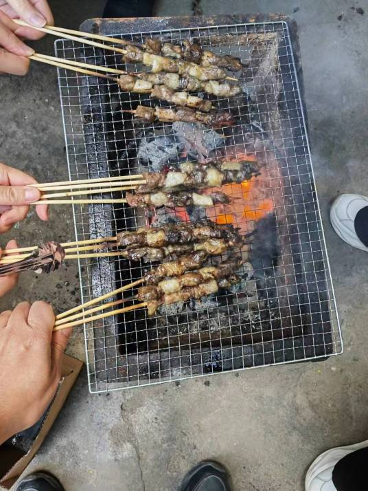
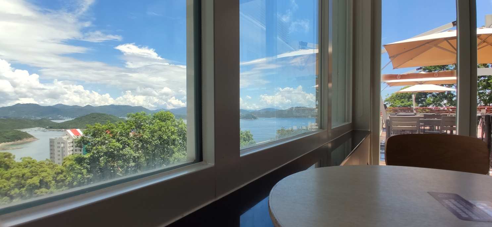
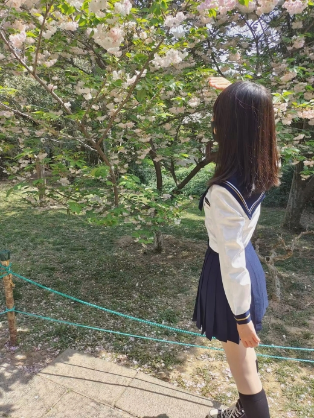

大家好！这次我们有幸采访到社区中的一位特别的朋友——NKNaN。她不仅是飞桨社区中的佼佼者，对于开发中的难题总能迎刃而解，也是一位才华横溢且性格随和的女性开发者。通过这次的对话，我们将一起走进李睿文的日常生活，了解她在社区背后充满转折和惊喜的个人故事～

<!-- more -->

<!-- 导入聊天框功能 -->

<!-- 导入聊天框功能 -->

## 一、前言

NKNaN 是我们社区中的一位特别的成员，她不仅是我们社区中少有的女性猛将，更是一个勇敢跨界的探索者。从西安的古城墙到香港的繁华街道，再到可能的北美新生活，她的脚步从未停歇。她的学术之旅横跨金融、数学和计算机科学，每一步都显得那么自然而充满挑战。

NKNaN 的职业生涯同样精彩纷呈——她曾冲动地辞去稳定的工作，追寻博士学位的梦想，但在一年后，她又勇敢地决定放弃，选择重新探索适合自己的道路。无论是在学术界还是生活中，NKNaN 都以她独有的风格和魅力，展示了自己对生活的热情和对技术的执着。

她的故事不仅充满了色彩，还散发着温暖的光芒。让我们一起走进 NKNaN 的世界，看她如何在技术的大潮中保持真我，用代码和智慧编织自己的梦想，享受那份难得的轻松和自在。

## 二、采访内容

1. **介绍一下自己吧，Nan 佬！**

   **NKNaN：** 哈喽大家好，我是百度飞桨社区的个人开发者 NKNaN，非常荣幸能够被选中参与这次采访~ 我老家在西安，本科毕业于香港理工大学金融服务专业，（水）master 毕业于香港科技大学金融科技专业。因为想要出国看看外面的世界，目前正在申请北美的 CS 项目。关于我自己的话，平时比较宅，喜欢室内的活动，撸猫、弹钢琴、看动画片、写代码；偶尔外出，外出的话喜欢随手拍拍风景？MBTI 是 INFJ，还被人誉为 I 人中的 I 人。
   <!-- 🐱 -->
   

      <figure style="width: 23.5%">
         
         <figcaption>撸猫</figcaption>
      </figure>
      <figure style="width: 73.5%">
         
         <figcaption>看透一切的猫猫</figcaption>
      </figure>
   

   <figure>
      
      <figcaption>随拍</figcaption>
   </figure>

2. **到你本科在香港理工大学就读工商管理专业，可以聊聊当时为什么选择这个专业呀？以及为什么选择去香港读书？**

   **NKNaN：** 在专业是家里人给我选的。因为我爸妈都在银行工作，他们就觉得学了这个，以后进银行比较方便呗~

   选择去香港也是父母决定，他们可能觉得香港是亚洲金融中心之类的，更加国际化一点。所以当时高考完了之后，父母告诉我可以选择香港这条路，就用高考成绩给我报了香港的学校。当时香港所有学校都申了，但港前三所都要面试，我英语口语又差，就挂掉了，最后还是选择了港理工。

   但现在回过头看看决策还挺失误的，一开始就没有规划好就选择了去香港。这人生地不熟的，又不能转专业，还是太听父母话了。
   <!-- 香港 -->
   <figure>
      
      <figcaption>本科大二最后一次去维港，之后疫情就回家网课了qaq</figcaption>
   </figure>

3. **觉得失误是因为对本科专业不太喜欢吗？但看你本科专业学的很好、绩点非常高，还获得了学院杰出学术成就奖！**

   **NKNaN：** 这个奖是按每一年小专业的排名发的，如果在本专业排前三的话就能获得。可能我们专业比较废，大部分人都比较菜，像其他那些小专业的获奖大佬，他们的分数就比我高。

   而且其实我的专业算是文科。文科怎么说呢，学和不学感觉好像没啥区别？像我们绝大部分课程的 assessment ，很大一部分得分占比是通过写 essay 来拿分，但 essay 人家愿意给你几分就给你几分，纯看人家的心情。所以这边也奉劝大家，**如果对自己写文商课小论文的能力没有十足把握千万不要来学商科！！**

   另外，商科如果想学得好，英语好是最基础的。家里资源也要好，还不能是 i 人！像做 presentation 的时候，必须要表现的很 expressive，要能说（吹）出来好多东西。但我就是 i 人，不太适合商科这种风格，还是喜欢做一些具象化的成果。

   所以本科的时候就想转计算机了，但学校太坑太死板了，不让转专业，就只能去辅修。当时成绩好的人都会去辅修数学或者计算机（好多人都去辅修计算机）因为我的 GPA 不够，最后就选择辅修数学了～其实自己也想往计算机方面靠，就自学了 Machine Learning 之类的课程，后来读的 master 也是香港科技大学的金融科技专业。

4. **想学计算机是因为兴趣吗？还是因为赚钱多呀（笑）**

   **NKNaN：** 一开始确实是基于自己兴趣吧，后来发现这个赚钱确实也挺多的～不过感觉对计算机感兴趣的女孩子确实可能比较少一点。

5. **研究生毕业之后，你在上海某银行的金融科技子公司短暂工作了一年，可以讲讲吗？**

   **NKNaN：** （先给公司打个码）我当时入职了智能风控组，主要是用机器学习模型给风控项目做建模，比较传统和偏业务。但实际上做的事情挺杂的，还会做一些客户信用评分卡评级之类的事，会用到一些统计学习模型，基本就是调调参数。我自己对这种工作没有非常大的热情，想看看能不能读个博提升一下（虽然后来发现读错了），就有点冲动的裸辞了，也不建议大家学习。

   不过那里的团队氛围真心很 nice，大家的关系都很融洽，比较扁平化，入职之后会有很多破冰以及团建的活动，平时也会互相分享技术心得。

   <!-- 团建 -->
   

      <figure style="width: 35.5%">
         
         <figcaption>上海某公园团建-1</figcaption>
      </figure>
      <figure style="width: 63%">
         
         <figcaption>上海某公园团建-2</figcaption>
      </figure>
   

6. **冲动是因为受到刺激了吗？**

   **NKNaN：** 对，确实有点受刺激。那份工作工资很少，一个月没有补贴的时候只有 9k，有补贴的时候也只有一万多一点（应届生刚进来的工资），这还是在上海！向上发展的路线我也比较迷茫，走技术路线在那里好像待遇一般，走管理路线又不太适合我。而且杂事也多，像处理一些数据都算正事了，很多时候会做和工作完全无关的事，就比如说组织什么活动、清点一下资产、给部门 HR 做助理...给人分工很不明确的感觉。

   但其实如果一直待在那里也可以安安稳稳的，只是我自己不太喜欢能一眼望得到头的生活，每个人的选择不一样啦。

7. **那之后去读博是什么感觉～以及读了一年后为什么又选择 quit ？**

   **NKNaN：** 在 2023 年 9 月我去港理工攻读 phd，但工作其实 5 月就辞了，因为那会儿导师已经开始给我做一些数学基础和科研能力的训练（做题和读 paper）。我导师挺 push 的，一周要开三次组会，其中我要主讲两次——一次是论文进度、一次是讲做的习题。然后还有一次相当于旁听，但是旁听也不能只听着，得发表意见参与进来，很累。

   而且我导师是属于应用数学学院下的，她是想把传统的统计学和 Machine Learning 结合，做一些统计迁移学习，而不是用目前流行的 Deep Learning，这就对数学能力要求比较高。虽然我本科辅修了数学，但还是觉得自己的数学基础能力不太够，可能看 paper 的时候理解的会容易一点，不过理解和自己推出来这两者差别是很大的（真的推不了一点）。

   可是我能力太差了，光是训练就把我搞懵了。如果按我当前这个速度去读博，可能得要五年...导师对我期望值也很高，想着三年就毕业吧，弄得我压力很大。而且对于这个方向我也不是很感兴趣，感觉太传统了，所以最后还是决定 quit。

8. **所以选择 quit 一方面是压力大，另一方面是方向不太合适？**

   **NKNaN：** 是的。除非你本科就是学数学的，已经经过三到四年的严格专业训练，然后再去读这个博士，可能收获会更大吧～或者找一个计算机系的教授，跟着做深度学习可能更适合我。

9. **你这些年在香港待了也挺久的，喜欢香港文化吗？粤语会说吗？**

   **NKNaN：** 我觉得对香港没有那么喜欢，因为有时候遇到一些比较排外的 local，体验会挺差的。比如说学校附近有很多小店，有一些是建制派的，有一些是泛民派的，吃饭的时候去比较港独的店就会感觉态度很不好。然后 20 年那会儿他们闹到了学校，好多内地生也都回来了。

   粤语的话我到现在还不太会说，可能我语言天赋太差了。像我室友她语言就比我好的多，我跟她一起备考 GRE，她只复习了一两个月就考到了 325，而我当时考的可低了，后面又复习了两个月才考到了这分数。她一开始英语说的就很好，之后粤语学也很快，一两年就学会了，我到现在还会听不懂一些对话。另外主要是自己也不太想学粤语，感觉可难了，音调那么多，粤语的拼音发音又和中文的拼音不一样，不太规则。
   <!-- 港科食堂 -->
   <figure>
      
      <figcaption>港科食堂，风景属实不戳</figcaption>
   </figure>

10.   **那在日常生活中，你一般会做什么呀？**

      **NKNaN：** 生活上我感觉因为我是 I 所以就很少社交了，除了前面提到的那些，还喜欢自己研究一些好玩的东西～比如一开始在中国大学慕课网学 Python 编程的时候，就会跟着做一些比较有意思的小项目。在学校里也修了 C++，后面为了找开发工作还学了 JAVA，顺便自己做了[康威生命游戏](https://github.com/NKNaN/ConwayLifeGame)，就是一个界面，里面有黑白小格子可以点点点，现在看是个挺无聊的一游戏了～其实本来想着学机器学习，但后来跟着做了这些开发项目后，觉得这些语言也挺有意思的，包括最近我还在一些前端。
      <!-- 生活 -->
      

         <figure style="width: 46%">
            
            <figcaption>当然也用照片套模型炼过自己（雾）</figcaption>
         </figure>
         <figure style="width: 46%">
            
            <figcaption>为数不多的主角是自己的外出照片</figcaption>
         </figure>
      

11.   **聊聊开源吧～是什么契机接触飞桨的呀？**

      **NKNaN：** 在去年五六月的时候，我想做一些开源项目提升一下。因为当时抱有一个目的——进大厂，所以觉得做一些开源项目应该是有好处的，然后想做深度学习领域的开源项目，就去 GitHub 搜一些国内的深度学习社区嘛，看到 Paddle 仓库有一个 project —— call for contribution，在里边的列表里看到 paddlescience 有个题目，需要做 HamiltonianMonteCarlo（HMC） API。MonteCarlo 我肯定是知道的，但对 HMC 不太熟悉，我就搜了一下是啥样子的，感觉应该还挺好实现的，就帮着做了一下。

12.   **像科学计算、API 功能增强之类的开源任务都有一定挑战性的，但对你这样的大佬来说是不是难度不大？**

      **NKNaN：** 难度我觉得对我而言主要还是在于理解这个框架吧，就是理解框架背后的原理。因为像 MonteCarlo 这样的 API 底层本身应该是很好写的，给一个数学公式，如果能看懂就可以写出来吧！但要把它适配到这个框架里面，是需要花一定时间的。我自己的开发经验少，接触的开发项目也少，所以当时半天看不懂为什么这块儿要这么写，那块要那么写～

13.   **身为一名很厉害的女性开发者，你觉得在工作或者学术中会存在大家对女性的一些刻板印象吗？**

      **NKNaN：** 这个我感觉可能国内有的地方确实会有这种现象吧，就是说比如说找工作的时候，像涛姐写的那样，在简历上就不会写上自己的性别。然后不仅是开发者这个职业，包括其他的一些工作，在一些国企里面，好像也更偏向于男生，可能因为出于传统刻板印象，他们觉得女生事儿多，担不起大梁。

      读 PhD 的时候倒是完全没有这类问题，因为导师本身自己也是女性。她也非常提倡有女孩子能来跟她读博，她不会觉得性别是一个做研究上的一个障碍吧。这方面可能在发达地区不会有那么严重的性别歧视。

14.   **之后有什么打算吗？是继续深造还是工作～**

      **NKNaN：** 现在想准备去加拿大读一个 master 之类的，因为想要去国外看看。

      我感觉自己年纪有点大了，都 25 了，也有点年龄焦虑。我父母也会觉得读出来都二十七八了，有点晚了，所以大概率就是读完 master 之后找个开发的工作～

      其实我一开始还挺想去做学术研究的，但是后来发现做研究就得没日没夜，有点不对劲，完全没有 work life balance。你可能每天都得干到晚上 12 点，一点都不快乐，所以现在看起来开发应该会比做研究轻松一点吧～

15.   **最后给我们社区的小伙伴说几句话吧！**

      **NKNaN：** 我感觉来社区里的大家，肯定都是很有自己想法的开发者～我自己也很随性很散漫，所以就希望大家能去做自己想做的，成为自己想成为的人，不要在意外界的闲言碎语，遵从自己的内心就好～
      <!-- GitHub头像 -->
        

            <figure style="width: 25%;">
              
              <figcaption>GitHub头像原图照骗</figcaption>
            </figure>
        

## 三、两分钟快问快答

   <MessageBox>
   <Message name="孙师傅" github="sunzhongkai588">
   最喜欢的编程语言？
   </Message>
   </MessageBox>
   <MessageBox>
   <Message type="right" name="NKNaN" github="NKNaN">
   Python
   </Message>
   </MessageBox>

   <MessageBox>
   <Message name="孙师傅" github="sunzhongkai588">
   早起还是夜猫子？
   </Message>
   </MessageBox>
   <MessageBox>
   <Message type="right" name="NKNaN" github="NKNaN">
   夜猫子
   </Message>
   </MessageBox>

   <MessageBox>
   <Message name="孙师傅" github="sunzhongkai588">
   最喜欢的科技产品？
   </Message>
   </MessageBox>
   <MessageBox>
   <Message type="right" name="NKNaN" github="NKNaN">
   平板电脑？
   </Message>
   </MessageBox>

   <MessageBox>
   <Message name="孙师傅" github="sunzhongkai588">
   最常用的app？
   </Message>
   </MessageBox>
   <MessageBox>
   <Message type="right" name="NKNaN" github="NKNaN">
   微信
   </Message>
   </MessageBox>

   <MessageBox>
   <Message name="孙师傅" github="sunzhongkai588">
   最近读的一本书？
   </Message>
   </MessageBox>
   <MessageBox>
   <Message type="right" name="NKNaN" github="NKNaN">
   海伯利安
   </Message>
   </MessageBox>

   <MessageBox>
   <Message name="孙师傅" github="sunzhongkai588">
   最喜欢的电影或电视剧？
   </Message>
   </MessageBox>
   <MessageBox>
   <Message type="right" name="NKNaN" github="NKNaN">
   盗梦空间
   </Message>
   </MessageBox>

   <MessageBox>
   <Message name="孙师傅" github="sunzhongkai588">
   必备的零食？
   </Message>
   </MessageBox>
   <MessageBox>
   <Message type="right" name="NKNaN" github="NKNaN">
   可乐
   </Message>
   </MessageBox>

   <MessageBox>
   <Message name="孙师傅" github="sunzhongkai588">
   喜欢的音乐类型或歌手？
   </Message>
   </MessageBox>
   <MessageBox>
   <Message type="right" name="NKNaN" github="NKNaN">
   中世纪吟唱风
   </Message>
   </MessageBox>

   <MessageBox>
   <Message name="孙师傅" github="sunzhongkai588">
   喜欢猫还是狗？
   </Message>
   </MessageBox>
   <MessageBox>
   <Message type="right" name="NKNaN" github="NKNaN">
   猫
   </Message>
   </MessageBox>

   <MessageBox>
   <Message name="孙师傅" github="sunzhongkai588">
   出门必备的三样东西是什么？
   </Message>
   </MessageBox>
   <MessageBox>
   <Message type="right" name="NKNaN" github="NKNaN">
   伞，口罩，手机
   </Message>
   </MessageBox>

   <MessageBox>
   <Message name="孙师傅" github="sunzhongkai588">
   如果不做开发，最想尝试的职业？
   </Message>
   </MessageBox>
   <MessageBox>
   <Message type="right" name="NKNaN" github="NKNaN">
   自由职业
   </Message>
   </MessageBox>

---

## 写在最后 💡

**【开源江湖闲聊录】** 是一项专门为 Paddle 社区的开发者打造的特色访谈栏目 📚。在这里，我们邀请到每一位别具一格且富有热情的开发者，通过文字或语音的方式进行深入采访 🎙️，探索并展现他们背后独一无二的故事，将他们的经历、见解和创意整理成精彩内容，呈现给整个社区。

如果你有兴趣对社区的开发者进行采访，可以联系孙师傅，**急缺助手！**

---
