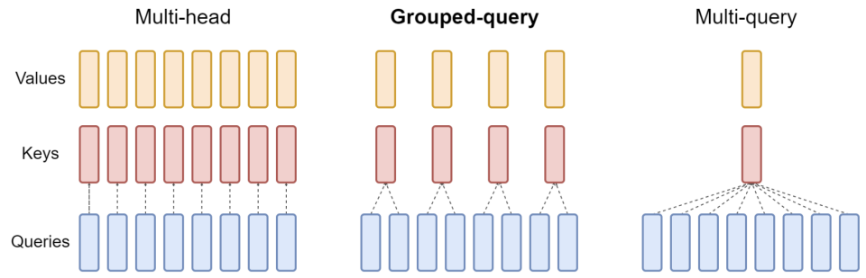
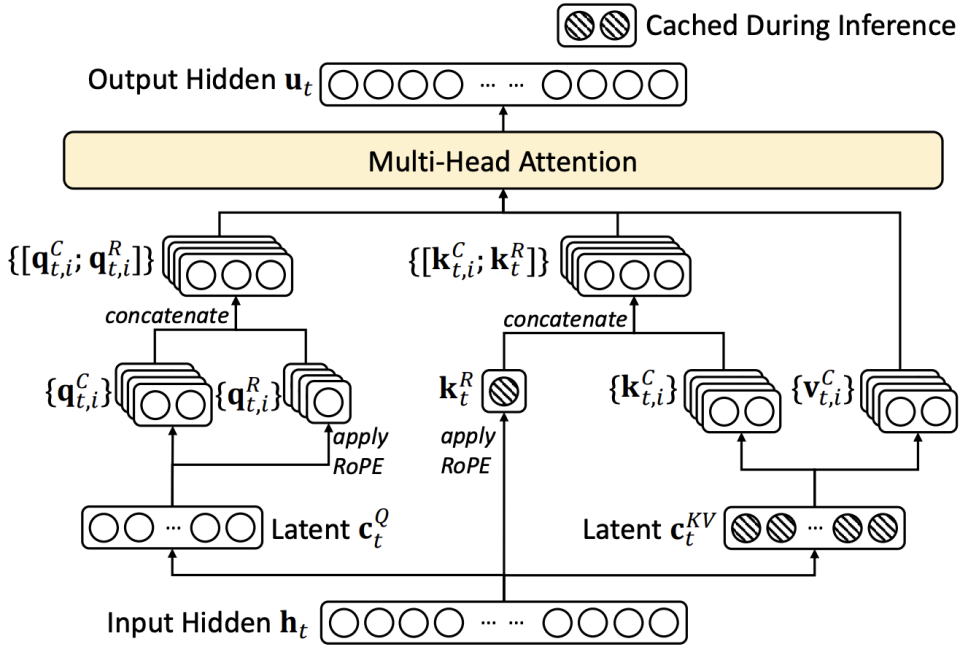
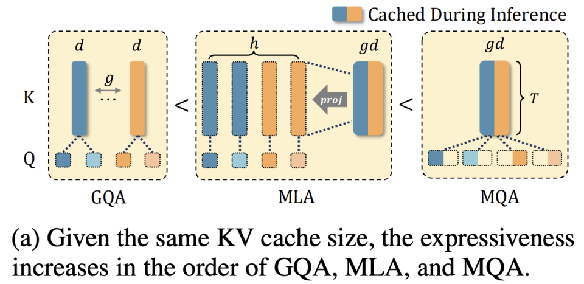
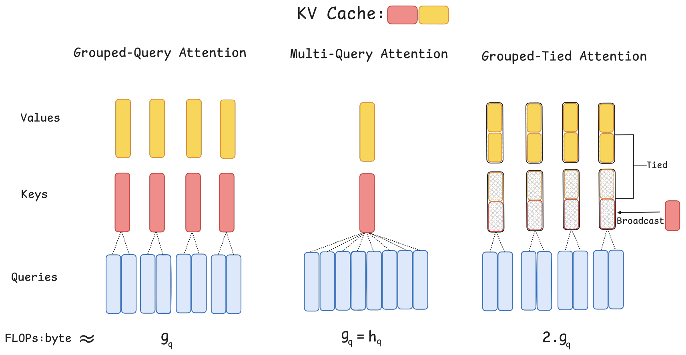
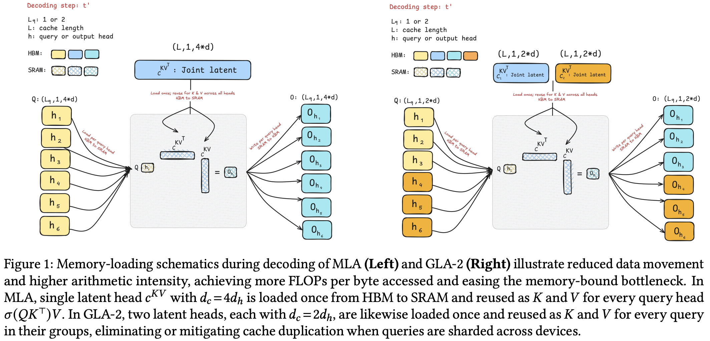

## 研究背景
1. long context length 对 KV cache 空间的大小提出了新的要求。
2. test-time inference 的效率高度依赖模型的推理友好性。

## 研究 scope
1. 只考虑基础架构特性，不涉及动态 KV cache 压缩方案。
2. 推理友好性主要考虑推理场景下的计算密度、并行度等。

## 代表方案
- MHA、GQA、MQA

- Deepseek MLA

    训练、推理场景下的等价性：[缓存与效果的极限拉扯：从 MHA、MQA、GQA 到 MLA](https://spaces.ac.cn/archives/10091)

## 观察
1. 模型的 attention 计算量只与 $h_q$ 有关。
2. KV 头数的压缩带来两个好处：
   a) 直接减少缓存量，容纳更长文本、更大 batch；
   b) 在容易 memory bound 的推理场景下提高计算密度。GQA 的计算密度为 $g_q$，MQA 和 MLA 分别为 $h_q$ 和 $2 \times h_q$（由于 RoPE dim 的存在，实际略小）。
3. 固定 KV cache 大小下，模型的理论 expressiveness 大小关系：GQA < MLA < MQA。基于此，已有 TransMLA 等工作。

4. 考虑并行性：
   - GQA 可以受限地 TP（取决于 $g_q$）。
   - MLA、MQA 常采用 DP Attention（或 TP+DP，TP 会冗余复制 KV cache，而 DP 则会冗余复制 Attention 权重）；序列并行不受影响。
5. 考虑推理友好性，MQA、MLA 和 $g_q > 16$ 的 GQA 可以在推理场景下充分使用 tensor core。

## Hardware-Efficient Attention for Fast Decoding
*Tri Dao 团队*

### 问题分析：解码阶段的瓶颈
- **KV 缓存是主要瓶颈**：自回归解码需缓存所有历史 token 的 KV 状态。随着批次大小（batch size）和上下文长度（context length）增加，KV 缓存大小线性增长，远超 HBM 容量。
- **内存访问主导延迟**：解码阶段的计算（GEMV）量小，但加载庞大的 KV 缓存耗时长，导致 GPU 计算单元（如 Tensor Core）利用率极低（可低至 7%），形成内存墙（Memory Wall）。
- **并行性受限**：解码的序列性限制了并行化机会，主要依赖注意力头的并行（TP）。现有优化方案（如 MQA、GQA、MLA）在并行扩展或模型质量上存在不足：
  - **MQA**：所有查询头共享一个 KV 头，大幅减小缓存但牺牲质量，且 TP 时 KV 头需全设备复制，抵消内存节省。
  - **GQA**：查询头分组共享 KV 头，是 MQA 与 MHA 的折中，但中等 TP 下每个设备的 KV 缓存仍较大，且大分组会降低质量。
  - **MLA**：通过低秩投影压缩 KV 为单个潜在头缓存，算术强度高，但单潜在头设计在 TP 时需全设备复制缓存，限制了并行扩展和内存节省。

### 核心设计原则：算术强度与并行性
- **计算强度是关键指标**：定义为计算量（FLOPs）与内存访问量（Bytes）之比。解码阶段需最大化算术强度（更多计算/字节），使计算从内存受限转向计算受限，充分利用 GPU 算力。
- **组大小是杠杆**：$g_q = h_q / h_{kv}$。增大 $g_q$ 可提高算术强度、减小 KV 缓存，但过大会损害并行性（需跨设备复制权重和缓存）。
- **KV 复用与并行友好**：理想方案需同时实现高算术强度、高效跨设备并行（零冗余或低冗余），且不牺牲模型质量。

### 提出的解决方案：两种新型注意力机制
#### Grouped-Tied Attention (GTA)
- **核心思想**：在 GQA 分组基础上，将 Key 和 Value 状态绑定（Tie）为一个共享状态，并仅对 Key 的部分维度应用位置编码（RoPE）。

- **实现**：
  1. 一个投影生成绑定 KV 状态（形状同单个 K 或 V 向量）。
  2. Value 路径使用整个绑定 KV 状态。
  3. Key 路径使用绑定 KV 状态的前半部分（不应用 RoPE） + 一个单独的单头投影（应用 RoPE）广播拼接而成。
- **优势**：
  - 相比同 $g_q$ 的 GQA，KV 缓存减半（因 K 和 V 共享状态）。
  - 算术强度翻倍（加载一次状态用于 K 和 V 计算）。
  - 保持 GQA 的并行友好性。
  - 实验证明质量匹配或优于 GQA（如 1.47B 模型，GTA-4 困惑度 10.12 vs GQA-4 的 10.20）。

#### Grouped Latent Attention (GLA)
- **核心思想**：改进 MLA，将潜在表示分组（$h_c$ 组），每组服务一个查询头子集，并减小每组潜在头维度。

- **实现**：
  1. 压缩 token 为 $h_c$ 个潜在头（而非 MLA 的单个头），每个头维度 $d_c = 2 \times d_h$（MLA 为 $4 \times d_h$）。
  2. 每个潜在头及其上投影矩阵重建其组内查询头的独立 K/V 特征。
  3. 解码时，潜在头可跨 TP 设备分片（如 $h_c = \text{tp}$ 时零冗余）。
- **优势**：
  - 与 MLA 总缓存相当（如 GLA-2 缓存 $2 \times 2 \times d_h = 4 \times d_h$），但 TP 时每个设备缓存减半（如 TP=2 时，GLA-2 每设备缓存 $2 \times d_h$ vs MLA 的 $4 \times d_h$）。
  - 算术强度高（$\approx 2 \times g_q$），与 MQA 相当但质量更好。
  - 并行友好：支持高效 TP 分片，避免 MLA 的缓存复制问题。
  - 实验证明质量匹配 MLA（如 1.47B 模型，GLA-2 平均下游准确率 60.0% vs MLA 的 59.1%），且更容忍负载不均衡。

## 小结
| 方案  | KV 缓存        | 算术强度       | 并行友好性                                     | 模型下游评测 |
|-------|----------------|----------------|-----------------------------------------------|--------------|
| MHA   | 最大           | 低             | TP 高效                                       | 49.65        |
| MQA   | 最小           | 高（≈$h_q$）   | TP 需复制全量 KV 缓存                         | 49.18        |
| GQA   | 中等           | 中等（≈$g_q$） | TP 受限                                       | 48.27        |
| MLA   | 小             | 最高（≈$2h_q$）| TP 需复制全量缓存                             | 49.24        |
| GLA   | 小             | 最高（≈$2h_q$）| TP 受限                                       | 49.29        |
| GTA   | 小于 GQA       | 高（≈$2g_q$）  | TP 受限                                       | 48.93        |

> **注**：下游评测为我们固定了模型的参数量、train token 量，在 lm-evaluation-harness 上得到的 average acc（由于只 train 了一组，所以实际可能略有浮动，仅作参考）。