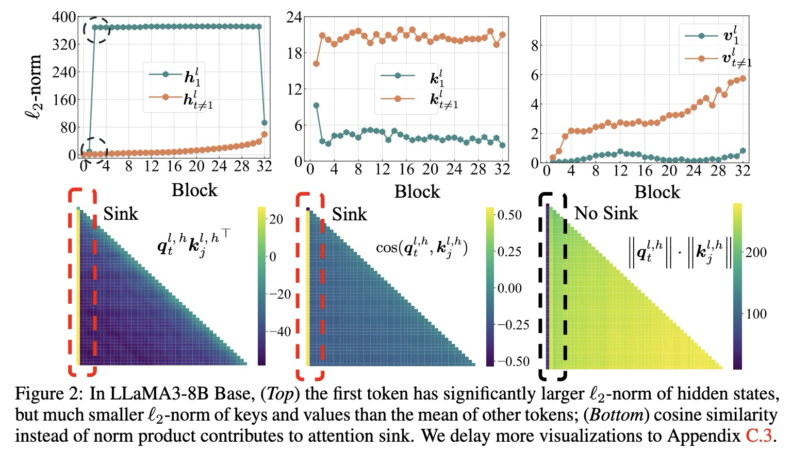
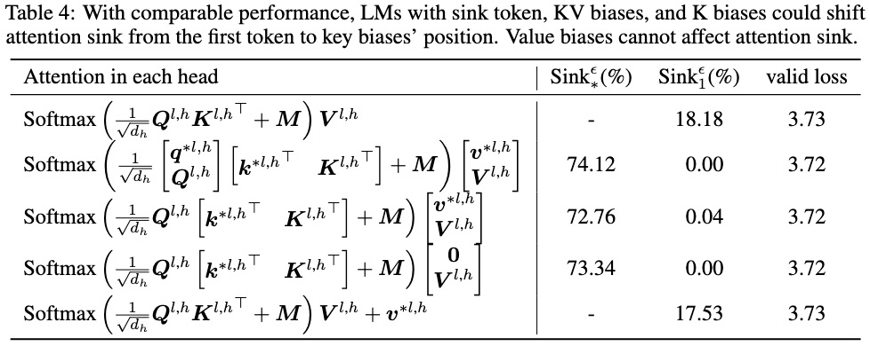

论文链接：**[ICLR 2025] [WHEN ATTENTION SINK EMERGES  IN LANGUAGE MODELS: AN EMPIRICAL VIEW](https://arxiv.org/abs/2410.10781)**

Github仓库：[https://github.com/sail-sg/Attention-Sink](https://github.com/sail-sg/Attention-Sink)

# 什么是Attention Sink？
在LLM计算时，经常会为一些特定的token位置分配非常高的attention score，从而在这些token位置形成垂直的attention pattern。最常见的位置就是首token，可以形式化表达为$\mathbf{A}_{i,1}^{l,h}\gg \text{mean}\left(\mathbf{A}_{i,j\neq1}^{l,h} \right)$。

已有一些工作尝试理解attention sink存在的原因，并尝试给出相关解释：

* StreamingLLM：initial tokens are visible to almost all subsequent tokens because of the autoregressive language modeling nature, making them more readily trained to serve as attention sinks.

# Attention Sink的特性
## 一、首token的特性

因此$h_1^l$以及相应的Q、K、V可以视为直接从word embedding得到的MLP输出。

* 计算特性：$h_1^l$以及相应的Q、K、V可以视为直接从word embedding得到的MLP输出。
    * 首token和其他后续的token计算有一个显著不同：第一个hidden state的计算不涉及self-attention$h_1^l = \text{FFN}(\text{LN}(o_1^l + h_1^{l-1})) + o_1^l + h_1^{l-1}$，$o_1^l = \text{LN}(h_1^{l-1})[W^{l,1} \quad W^{l,2} \quad \dots \quad W^{l,H}]W_O^l$。

* 数值特性：从特定层开始，$h_1^l$的$\mathcal{l}_2$范数会显著大于其他token $h_{t\neq 1}^l$。
* key, value数值：第一个token的key/value $\mathcal{l}_2$范数显著小于同一图中其他token的对应值。

**$\mathbf{QK}$的角度促进了attention sink**

对于第$t$个query，$q_t^{l,h} {k_1^{l,h}}^{\mathsf{T}}$通常比$q_t^{l,h} {k_{j \neq 1}^{l,h}}^{\mathsf{T}}$具有更大的值，考察促成这一现象的原因。注意到，qk内积可以表示为：

$q_t^{l,h} k_j^{l,h^{\mathsf{T}}} = \|q_t^{l,h}\| \|k_j^{l,h}\| \cdot \cos(q_t^{l,h}, k_j^{l,h})$

从Fig2的结果可以发现：

* l2范数的乘积$\|q_t^{l,h}\| \cdot \|k_1^{l,h}\|$较小。
* 角度项$\cos(q_t^{l,h}, k_1^{l,h})$非常大，导致了attention sink。

第一个词符利用其key作为偏置（bias），从而最小化$k_1^{l,h}$和$q_t^{l,h}$之间的角度，并表现出attention sink。

# 二、Attention Sink的测量方法
* 基于可视化的方法：绘制出num_head * num_layers个图像，难以处理。
* 设计一个观测attention head 的评估指标。

计算k-th token的重要性分数：

$\alpha_k^{l,h}=\frac{1}{T-k+1}\sum_{i=k}^{T}\mathbf{A}_{i,k}^{l,h}$

首先考虑首token的情况。给定阈值$\epsilon$，称一个head中存在attention sink如果首token的重要性分数$\alpha_1^{l,h}>\epsilon$。

计算LM的attention sink情况：

$\text{Sink}_k^\epsilon = \frac{1}{L} \sum_{l=1}^{L} \frac{1}{H} \sum_{h=1}^{H} \mathbb{I}(\alpha_k^{l,h} > \epsilon).$

为了不让选择过于严苛，且阈值不对序列长度T过于敏感，选择epsilon=0.3进行后续分析。

关键特性：

* 输入数据的领域对attention sink程度几乎没有影响。
* 超越自然语言：即便输入随机采样的序列也仍会出现。
* base model和chat model：经过instruction tuning后的模型的attention sink结果与预训练模型结果相似。
* model scale：从小模型(14M)到大模型(10B+)，attention sink均会出现。

**由于chat model和base model在sink到比例相似，attention sink很可能是在预训练阶段出现的。**

# Optimization对Attention Sink的影响

两个核心观察：

1. 当LM经过有效（充分）训练后，attention sink开始显现。
2. 减小学习率可以降低attention sink的比例以及增加的速度。

# 数据分布P_DATA对Attention Sink的影响
* 当LM在**充足的训练数据**上得到有效训练后，attention sink开始显现 。
* 通过修改数据分布 $p_\text{DATA}$​，可以将attention sink的位置**从第一个token转移到其他位置**。
    * 即使将第一个token随机重采样，attention sink依然存在，甚至可能更明显 。
    * 如果将输入序列的前几个token都进行随机重采样，sink token的位置可能会发生改变 。

Fix token(StreamingLLM)：在序列中添加一个global learnable token，作为repository for unnessary attention scores.

如果为序列添加fix token，那么attention sink会稳定出现在fix token所在的位置上。将其移动到其他位置也不会影响结果。

# 损失函数对Attention Sink的影响

* weight decay 会促进attention sink的出现。
    * 即便不用weight decay，attention sink仍然会出现，但是增大后attention sink会更加明显。

* 采用Prefix-LM时，attention sink出现在**prefix token中，而不仅仅是第一个token**。
    * 仍然只出现在一个token上，但这个token会是前缀中的某一个，而不是固定在全局的第一个token。

采用**滑动窗口注意力 (Shifted Window Attention)** 时，attention sink出现在窗口的“绝对”第一个token，而非“相对”第一个token。**较小的窗口大小会抑制sink的出现**。

如果一个token位于窗口范围内 (即 t≤w，其中 t 为token位置，w 为窗口大小)，它仍然能够注意到序列的第一个token，此时模型仍然会在第一个token上出现sink。当 t>w 时，该token只能注意到其窗口内的第一个token (即第 t−w+1 个token)，而这个“相对”的第一个token通常不会出现attention sink。减小窗口大小可以阻止sink的出现。

# 模型结构对Attention Sink的影响
* 位置编码的种类：
    * 测试了多种位置编码方式（包括无位置编码 NoPE、绝对位置编码、可学习位置编码、ALiBi 和 RoPE），结果显示，所有采用这些编码方式的语言模型，甚至那些没有明确位置编码的模型，都出现了attention sink 。

* Pre-Norm vs Post-Norm
    * Pre-norm：$\mathbf{H}^l=\text{FFN}\left( \text{LN}\left(\mathbf{O}^l+\mathbf{H}^{l -1}\right)\right)+\mathbf{O}^l+\mathbf{H}^{l-1},\ \mathbf{O}^l=\text{MHSA}(\text{LN}(\mathbf{H}^{l-1}))$
    * Post-norm：$\mathbf{H}^l=\text{LN}\left(\text{FFN}\left( \text{LN}\left(\mathbf{O}^l+\mathbf{H}^{l -1}\right)\right)+ \text{LN}\left(\mathbf{O}^l+\mathbf{H}^{l -1}\right)\right),\ \mathbf{O}^l=\text{MHSA}\left(\mathbf{H}^{l-1}\right)$
    * Pre-norm结构中，hidden state的数值可以由residual connection在层间传播。一层出现了massive value后，后面的层也很有可能保留。
    * 无论是pre-norm还是post-norm，attention sink都会存在。Post-norm的massive vlue出现在了Post-LN之前。

* Attention sink 更像是一种“key bias”

通过引入可学习的sink token（作为implicit bias）或直接在注意力机制中添加可学习的键值偏置 (KV biases) 或仅键偏置 (K biases, 此时$\mathbf{v}^{\star l,h}=\mathbf{0}$)，可以将sink token从第一个token转移到这些引入的bias上，且不会损害模型性能 。而仅使用value bias则做不到，sink会回到第一个token。

## Attention形式的影响
**Attention的一般形式：**

$v_i^\dagger = \left(\sum_{j'=1}^i \text{sim}(\phi(q_i), \phi(k_{j'}))\right)^{-1} \sum_{j=1}^i \text{sim}(\phi(q_i), \phi(k_j))v_j=Z_i^{-1} \sum_{j=1}^i \text{sim}(\phi(q_i), \phi(k_j))v_j$

对于Softmax-attention，$\text{sim}(\mathbf{q}_i, \mathbf{k}_j)=\exp\left(\mathbf{q}_i\mathbf{k}_j^T/\sqrt{d_h}\right)$,$\phi(\cdot)$是identity kernel。

设计空间：

* kernel function $\phi(\cdot)$：elu plus one; identity; MLP;
* 相似度函数$\text{sim}(\cdot, \cdot)$
* 是否使用归一化项

结论：当**放宽注意力分数之间的内部依赖关系**时，attention sink便不再出现 。

* 允许注意力分数为负数
* 不要求注意力分数归一化为1
* 使用MLP作为kernel function

不仅如此，在消除掉attention sink的同时，massive value也被消除了。

# 核心观点和feature
文章从各个层面，探讨了attention sink出现在首token时的各种现象，提供了：

* 评估attention sink程度的指标
* 优化、数据分布、损失函数、模型结构等对attention sink的影响
* 指出attention sink的作用类似于一种key bias，用于储存多余的注意力分数，对计算贡献不大

# 可能有什么优化方向、有哪些优化的可能
1. 使用attention sink的评估指标，评估稀疏注意力训练后模型的attention sink是否明显。
2. 指导稀疏注意力的设计，能否通过通过合理的设计消除掉sink token。