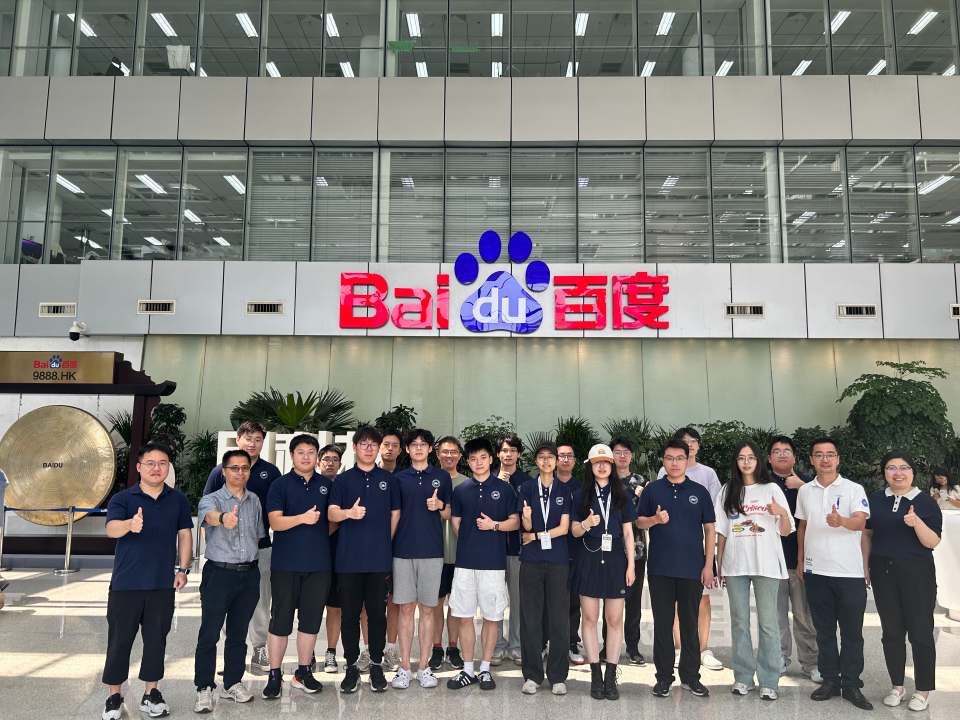
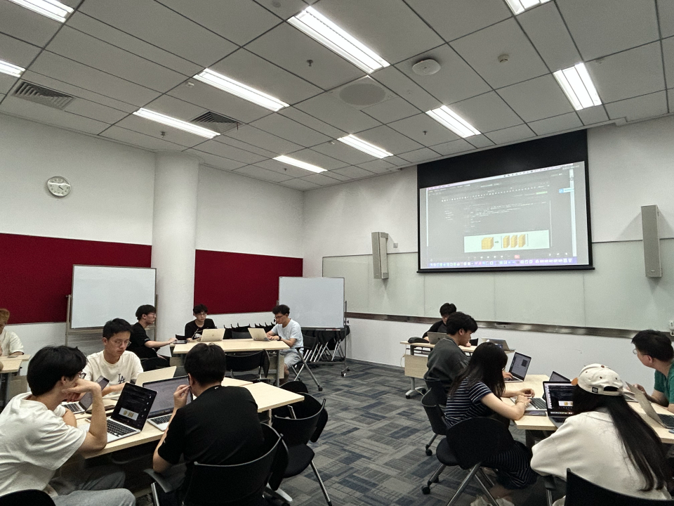
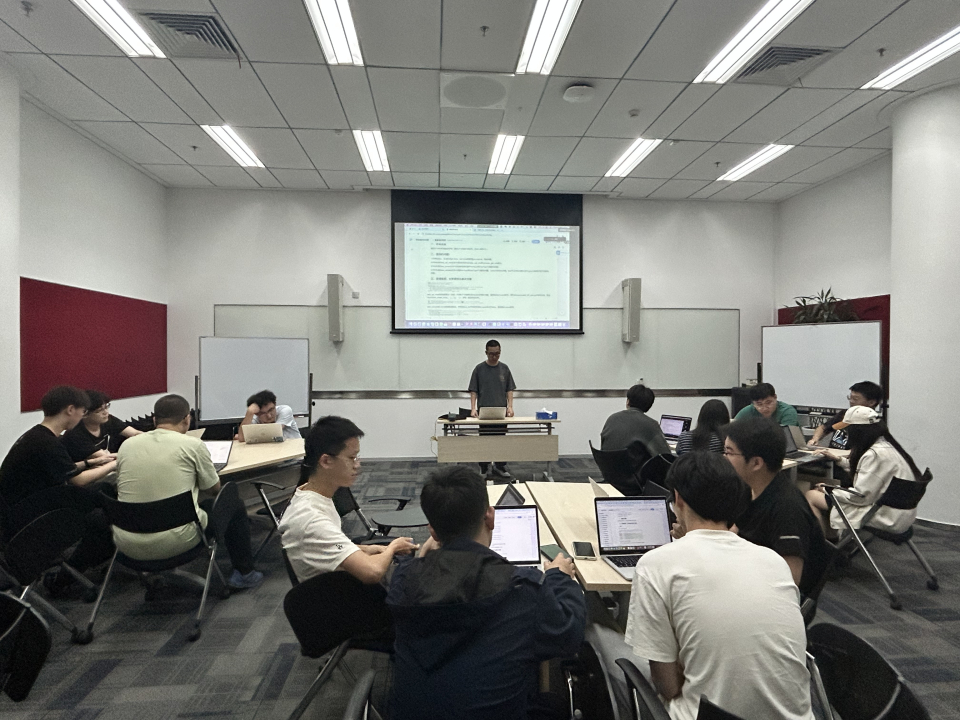
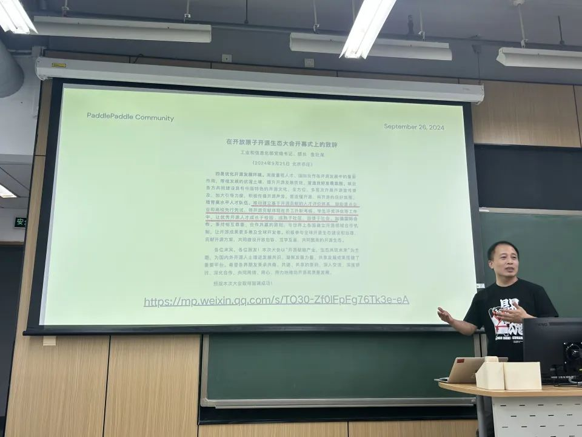
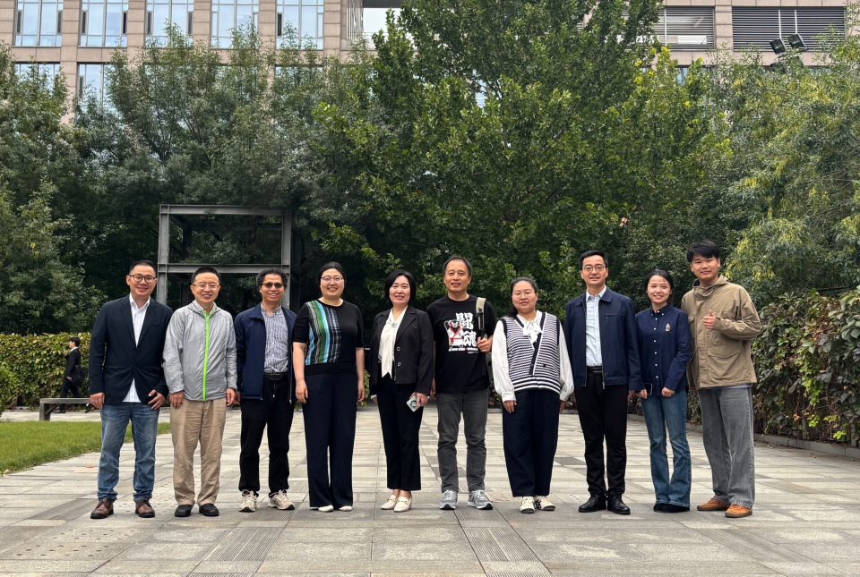

真实项目历练+开源实践，打造高校人才培养标杆。

<!-- more -->

---

面对产业界对掌握AI知识与技能的复合型人才需求的持续攀升，今年7月至9月，飞桨联合北京航空航天大学人工智能学院，试点将“开源贡献”与“校企合作实习”结合的实践人才培养新模式。首期优选包含“强基计划”等15位优秀学生，开展为期8周的线下线上相结合的「启航计划」实习项目，参与飞桨一线工作，在参与真实项目中锻造自己的AI科研与实战能力。

在长达8周的实习中，15位同学累计合入426个PR，平均每人28.4个PR，极大提升了自身的代码实践能力。实习结束后，2名同学正式加入百度长期实习，3名同学加入飞桨核心框架贡献者俱乐部（PFCC）长期参与开源贡献。本次飞桨&北航「启航计划」实习项目，充分展示了校企合作在提升学生实践能力方面的巨大潜力，百度飞桨期望通过此类深度合作，不断探索与高校共同培育AI人才的新路径。

## 硬核的实习生感悟

在飞桨实习期间同学们都有较深的体会，下面是答辩前三名同学与我们分享的感悟：

### 1.阮一洲 

> 北航人工智能学院21级77班 信息与计算科学（强基计划）专业直博生

在担任百度飞桨开源共建实习生期间，我专注于PIR专项团的开发任务，着重学习了IR和PIR的运行机制，为原IR下的单测适配PIR进行修复和迁移。除此之外，我优化了大量的报错信息，学习了有关PADDLE ENFORCE宏和CHECK宏的使用规则，使得报错信息更加清晰完备。我还参与了Ruff代码风格修改的相关工作，为飞桨运行的python环境进行了预升级。我深刻地体会到了企业中团队协作的重要性，感受到了在百度的强运算能力的开发机和庞大知识库的支持下带来的工作效率的飞升，也感受到了国产深度学习框架飞桨的便捷高效。在未来的学习、科研乃至于工作生涯中，我会继续使用飞桨和其他深度学习框架来提高自己的开发效率。

### 2.奚嘉文

> 北航人工智能学院21级77班 信息与计算科学（强基计划）专业直博生，目前转入深度学习技术平台部-基础框架研发组实习 

“我在实习期间学习了百度飞桨基础知识与工作流程，包括静态图、动态图模式的知识，CINN符号化推导代码开发流程等。公司的实习更加系统、严谨，同时提PR和review的流程也是学校实习所没有的。在这段实习期间，我不仅仅提升了自己的代码能力，通过查找报错栈堆，逐层定位问题；也认识到了在解决问题的过程中，要积极与同学和部门导师沟通，这样才能高效地解决工作中遇到的问题。”

### 3.刘煦东

> 北航人工智能学院21级214211班学生，现保研到北航人工智能学院

“我曾在飞桨实习期间深入学习了深度学习框架飞桨的相关技术和应用。飞桨实习提供了更为丰富和深入的技术实践机会。飞桨基础框架团队共同开发的经历不仅深化了我对深度学习技术的理解，还让我参与了多个关键项目的开发与优化——PIR模式下单测问题修复与适配、CINN编译器符号推导扩量、报错日志体系优化以及引入Ruff作为Python端代码风格检查/自动修复工具等等，让我在技术、团队协作和问题解决能力上都取得了显著进步。

## 周密的学生实习全过程管理

飞桨为北航「启航计划」制定了详细的实习计划，多部门协同，保障实习计划的完美落地。该计划包括硬核产业真实课题、百度工程师全程培训与指导、实习任务体系化设计与科学的过程管理、生活关怀、结营答辩与激励等，确保每位同学都能在实习过程中有所成长与收获。

1. 硬核产业真实课题本期实习所有任务均来源于飞桨真实产业需求，同学们任务完成十分出色，对飞桨3.0发版做出了杰出贡献：
  
  - **初级难度任务：** 共完成了2986个报错优化任务、254个PEP585标准集合泛型支持升级任务、406个Ruff新rule引入任务、233个TypeHint类型标注任务；
  - **中高难度任务：** 共完成了 228个编译器符号化扩量推全任务和 74个PIR单测修复任务。

2. 百度工程师全程培训与指导实习同学均由研发亲自带队指导，累计开展了8次周会与3次集体技术培训，由浅入深和循序渐进地为同学们讲授飞桨的相关知识和技术要点，注重学生们的能力成长与知识水平提升；并设立答疑通道，确保任务完成中的卡点得到及时疏解。

3. 实习任务体系化设计与科学的过程管理飞桨为实习同学制定了难度层次递进的实习计划和对应的考核标准，建立个人日报、个人周报和例会分享制度，引导实习同学定时汇报工作进度，及时反思自己的表现，关注自己在哪些方面存在不足，并明确还有哪些进步的空间。飞桨期望通过这样的汇报和反思，能够激发实习同学的自我驱动力，促进个人成长。

4. 学院领导来厂看望，举办生活工作专题座谈会🎉

5. 来百度胖N斤系列🍕

6. 欢乐的结营答辩与开源讲座🙋🏻‍♀️
实习结束后，组织实习同学进行结营答辩，向学校和公司展示个人实习成果，激励实习同学勇争先锋。

百度飞桨框架产品负责人张军老师做开源讲座

## 持续合作 共绘拔尖人才培养蓝图
百度飞桨与北京航空航天大学在课程共建、竞赛联办等方面有较为深厚的合作基础。2023年与北京航空航天大学联合成功申请国家人工智能产教融合创新平台。以本次实习生计划为起点，飞桨将与北航进一步共探开源人才培养融入学分课、飞桨领航团建设、学生实习及硕博人才一体培养等多种人才培养新方式，促进产学研的深度融合。在未来，飞桨将继续通过持续扎实的合作，携手高校，共同培育AI人才，真实赋能学生的能力水平提升。

## 启航计划往期回顾
往期启航计划，在爱好开源的开发者的热情参与下，取得了丰富的成果：

1. 前三期线上集训营共有 48 位营员合入了超过 270 个 PR。
2. 前三期线上集训营共有 36 名开发者通过集训项目成为飞桨开源社区新的开源贡献者。
3. 前三期线上集训营共有 42 名营员成功通过考核、顺利结营，数名优秀营员加入百度进行正式实习，或者通过护航计划参与飞桨开源贡献。
4. 第三期启航计划集训营与北京航空航天大学合作，招募 15 名优秀同学加入百度开展为期 8 周的“线上+线下”混合实习实训，累积已合入 426 个 PR，为飞桨 3.0 发版做出了杰出贡献。

不要错过这个提升技术、结识同行、赢取奖励的好机会！让我们携手共创开源未来，马上行动起来吧！期待与你在开源的世界中相遇！🤗

联系我们请戳：ext_paddle_oss@baidu.com

以下是附件部分啦~

> ⭐️ [附本次实习Github PR总链接](https://github.com/PaddlePaddle/Paddle/pulls?q=is%3Apr+label%3A%22HappyOpenSource+Pro%22+BUAA+is%3Aclosed)
>
> ⭐️ 同学代表PR：[阮一洲](https://github.com/PaddlePaddle/Paddle/pulls?q=is%3Apr+author%3AMarcusRYZ+is%3Aclosed)、[奚嘉文](https://github.com/PaddlePaddle/Paddle/pulls?q=is%3Apr+author%3Acrazyxiaoxi+is%3Aclosed)、[刘煦东](https://github.com/PaddlePaddle/Paddle/pulls?q=is%3Apr+author%3Atlxd+is%3Aclosed+)