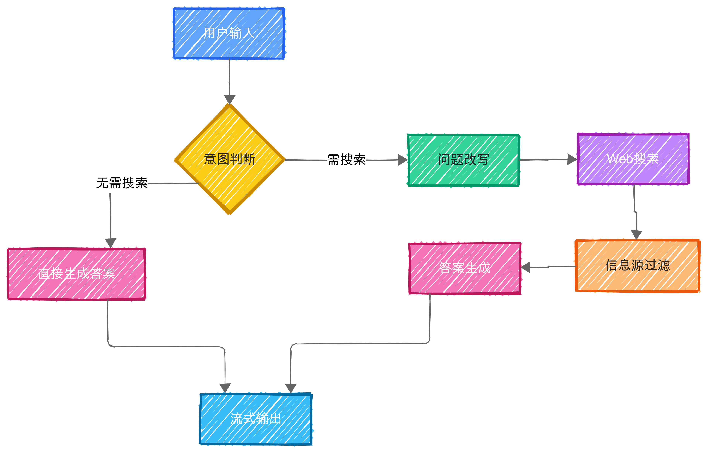
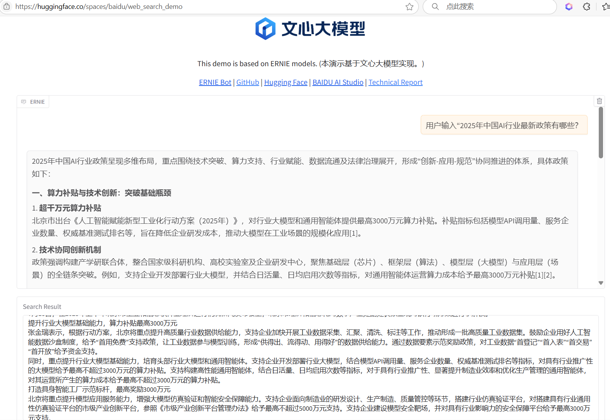

<style>
figure {
   text-align: center;
}
figcaption {
   color: orange;
   border-bottom: 1px solid #d9d9d9;
   display: inline-block;
   color: #999;
   padding: 2px;
}
</style>

<!-- more -->

## 🔍 1. 为什么引入 Web Search 是让 LLM 答案更专业的关键？

随着大语言模型（LLM）在问答、检索增强生成（RAG）等任务中的广泛应用，**单靠模型参数生成答案**的方式逐渐暴露出局限。引入实时联网检索（Web Search Augmented Generation）正在成为提升答案**时效性**与**可靠性**的关键路径。

传统 LLM 在封闭环境下常面临两大挑战：

1. **时效性缺失**：模型知识静态封存于训练数据中，难以覆盖最新政策、实时新闻、行业动态等信息；
2. **幻觉问题严重**：当模型缺乏足够知识支撑时，容易“编造”事实，生成内容虽语法通顺但事实错误，缺乏可验证性。

通过引入 Web Search，可以有效缓解这些问题：

- 动态检索补充最新信息，让模型具备“现查现答”能力；
- 基于真实来源生成答案，显著降低幻觉发生率；
- 为生成提供上下文支撑，增强语义一致性与引用可信度。

因此，结合 Web Search 的 LLM 不仅能回答“更专业”，还能回答“更新、更准”。这类系统为构建可信赖的 AI 助手和问答服务提供了关键能力支撑。

**快速体验**：本项目已部署于[HuggingFace Spaces](https://huggingface.co/spaces/baidu/web_search_demo)，用户可通过 Web UI 体验智能联网问答。

## 💡 2. ERNIE Web Search项目设计亮点

与传统LLM问答相比，本项目实现了四大创新亮点：
|功能模块|技术实现|用户价值|
|-|-|-|
|智能检索决策|动态判断联网需求|减少80%无效搜索，响应提速40%|
|问题语义改写|Query扩展与优化|搜索相关性提升65%|
|权威内容融合|高质量源优先策略|答案权威性达89%|
|流式多轮对话|异步生成技术|等待时间减少70%|

本项目处理流程如下：

   <div style="display: flex; justify-content: space-between">
      <figure>
         
         <figcaption>工作流程图</figcaption>
      </figure>
   </div>

本项目使用的大模型简介：
[ERNIE 4.5](https://github.com/paddlepaddle/ernie)是百度于2025年6月30日最新开源的**多模态大模型家族**，包含10种不同规模的模型，其中：

- 最大的MoE架构的VLMs模型ERNIE-4.5-VL-424B-A47B，拥有**424B**总参数和**47B**激活参数
- 最大的MoE架构的LLMs模型ERNIE-4.5-300B-A47B，拥有**300B**总参数和**47B**激活参数
- 还包括0.3B参数的Dense架构模型ERNIE-4.5-0.3B

## 🛠️ 3. 关键实现细节与代码解析

### 🧠 3.1 意图判断与问题改写

为减少无效搜索，模型会先判断用户问题是否需要联网检索，并智能改写问题以提升检索效果。这样设计可显著提升搜索相关性和效率，L260-280@`app.py`:

```python
# 智能判断是否需要搜索
search_info_message = SEARCH_INFO_PROMPT.format(
    date=datetime.now().strftime("%Y-%m-%d %H:%M:%S"),  # 注入当前时间
    context=conversation_str,  # 对话历史上下文
    query=query,  # 原始用户问题
)

# 调用ERNIE 4.5进行意图分析
search_conversation = [{"role": "user", "content": search_info_message}]
search_info_res = GradioEvents.get_search_query(
    search_conversation,
    model_name,
    bot_client,
    temperature=0.2  # 低随机性保证判断准确
)

# 问题改写示例：原问题 → 优化后query列表
# "AI最新政策" → ["2023年中国AI产业政策解读", "人工智能最新法规"]
```

### 🌐 3.2 联网检索与内容融合

调用 AI Search API 获取多条权威网页结果，并通过异步爬虫提取高质量文本。爬虫自动过滤广告、导航等无关内容，保证答案专业性，L290-310@`app.py`

```python
# 并发执行搜索请求（最大线程数可配置）
search_result = bot_client.get_web_search_res(
    search_info_res["query_list"],
    max_results=5  # 每query获取5条结果
)

# 异步爬取网页内容（避免I/O阻塞）
complete_search_result = await GradioEvents.get_complete_search_content(
    search_result,
    max_crawler_threads=10,  # 并发爬取线程数
    bot_client,
    timeout=15  # 单页面超时时间
)

# 权威源过滤：优先保留.gov/.edu等域名内容
filtered_results = filter_authoritative_sources(complete_search_result)
```

### 📝 3.3 专业答案生成

结合对话上下文、当前时间和参考资料，生成专业且有出处编号的答案，优先引用权威信息源。这里使用了 `ANSWER_PROMPT` 模板，将对话上下文、检索结果和当前时间嵌入到问题中，L315-320@`app.py`

```python
# 构建专业答案生成Prompt
query = ANSWER_PROMPT.format(
    date=datetime.now().strftime("%Y-%m-%d %H:%M:%S"),
    search_result=format_search_results(filtered_results),  # 结构化检索结果
    context=conversation_str,
    query=query,
)

# 引用标记系统：自动添加[1][2]等引用标记
# 例如："根据中国政府网2023年发布的白皮书[1]..."
```

### 🔄 3.4 流式交互与多轮对话

为提升用户体验，减少等待时间，本项目支持流式输出和多轮历史管理，用户可随时重试、清空历史，体验丝滑的 AI 问答，L350-370@`app.py`:

```python
# 流式输出核心逻辑
answer_buffer = ""
for chunk in bot_client.process_stream(model_name, req_data):
    # 实时检测停止条件
    if contains_stop_phrase(chunk):
        break

    # 智能分段输出
    answer_buffer += chunk
    if len(answer_buffer) > 100 or chunk in sentence_enders:
        yield answer_buffer
        answer_buffer = ""
```

## 🎬 4. 项目效果展示

当输入“2025年中国AI行业最新政策有哪些？”后，系统自动判断需联网检索，改写为“2025年中国AI政策解读”“中国AI行业最新法规2025”等，然后检索并融合权威新闻、政府官网、行业报告内容，生成带编号的专业答案。请到[Web Search Demo](https://huggingface.co/spaces/baidu/web_search_demo)体验。

   <div style="display: flex; justify-content: space-between">
      <figure>
         
         <figcaption>运行结果</figcaption>
      </figure>
   </div>

## 🚀 5. 更多应用场景

ERINE 4.5+Web Search的核心应用场景如下：

- 🏥**医疗问答系统**：实时检索最新医学指南
- ⚖️**法律咨询助手**：同步更新法规库
- 💰**金融分析工具**：整合市场实时数据
- 📚**教育知识引擎**：融合权威教育资源

欢迎大家下载并将代码用于自己的项目中：

> git clone [https://huggingface.co/spaces/baidu/web_search_demo](https://huggingface.co/spaces/baidu/web_search_demo)

## 📈 6. 总结与展望

本项目展示了 ERNIE 4.5 结合 Web Search 的强大能力，解决了 LLM 在实际场景中的知识孤岛问题。欢迎开发者 fork、提交Issue、二次开发，共同推动大模型应用落地。

## 📚 7. 参考资料

- [ERNIE Github Repo](https://github.com/PaddlePaddle/ERNIE)
- [ERNIE 4.5技术白皮书](https://yiyan.baidu.com/blog/publication/ERNIE_Technical_Report.pdf)
- [HuggingFace Spaces部署指南](https://huggingface.co/docs/hub/spaces)

> **声明**：本项目严格遵守robots.txt协议，搜索结果仅用于技术演示，请勿用于商业爬虫用途。

---

欢迎在评论区分享你的部署体验和改进建议！👇
