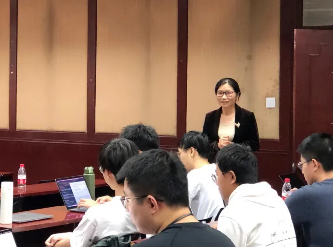
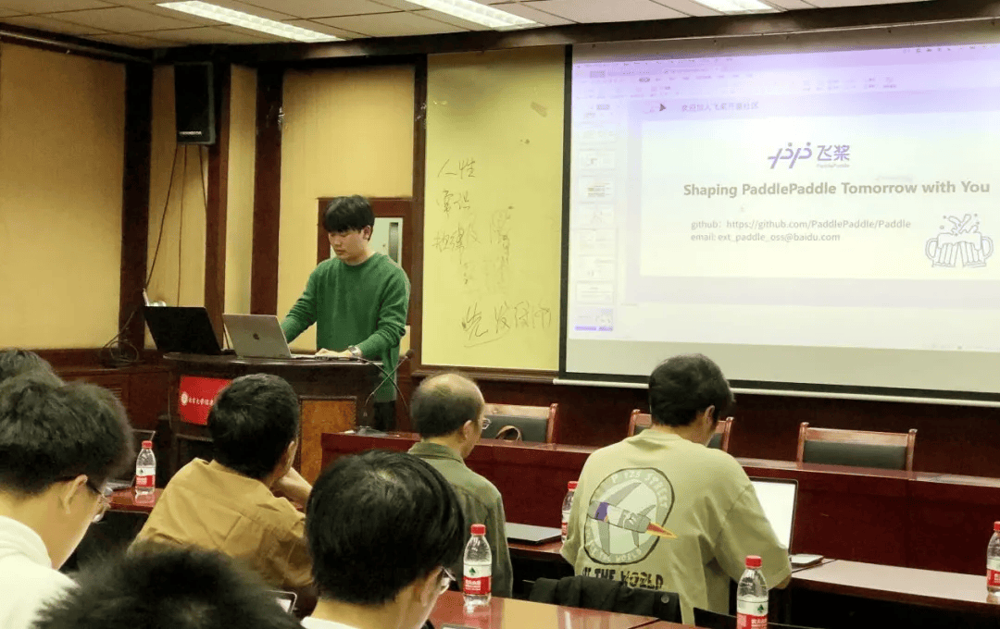
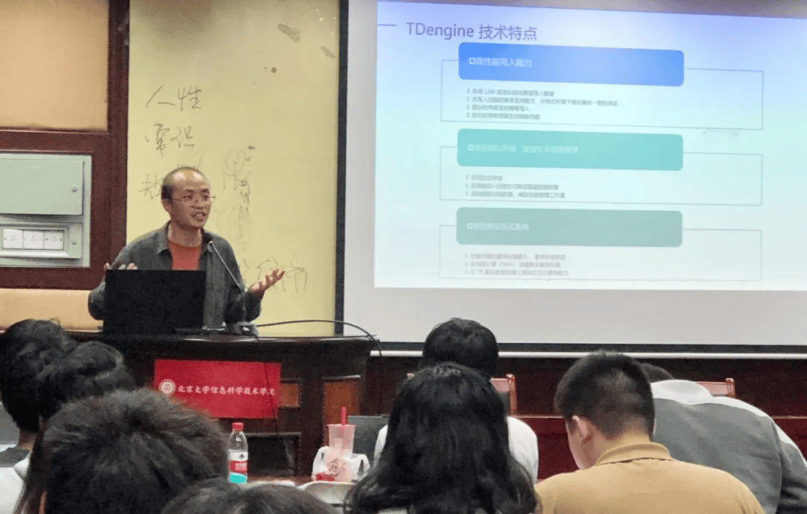
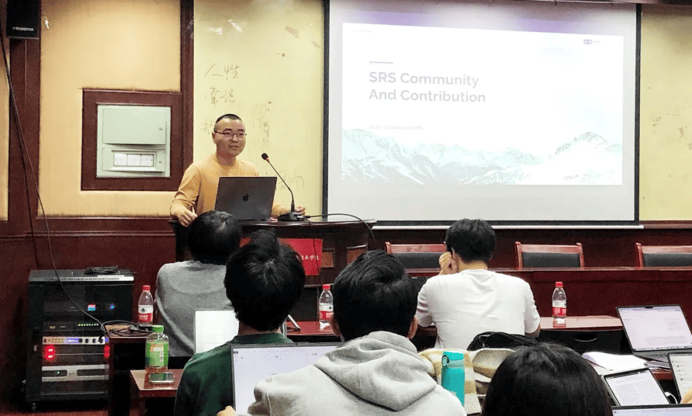
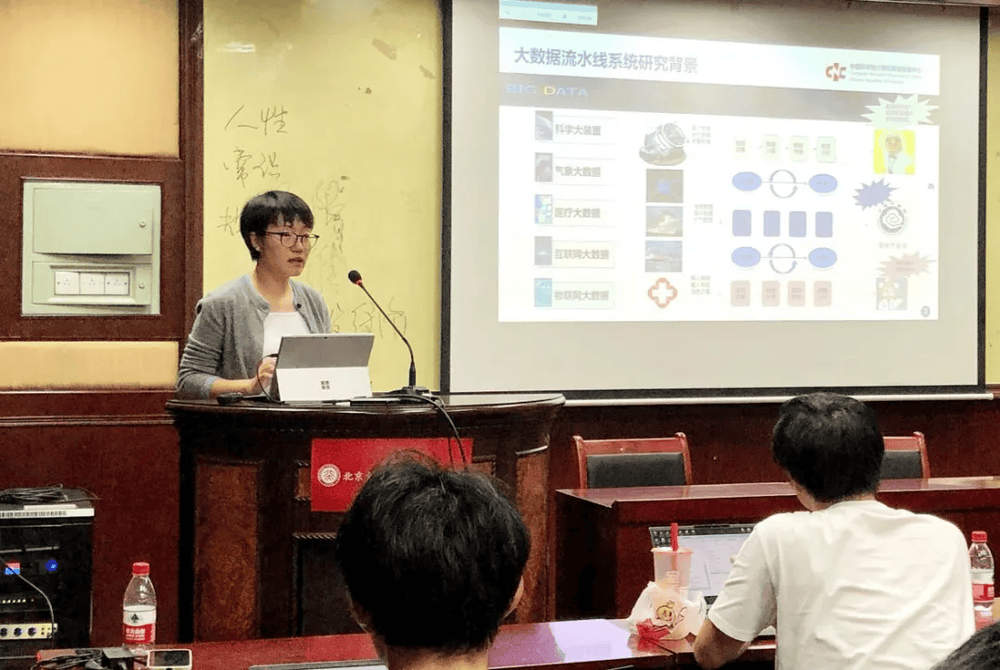
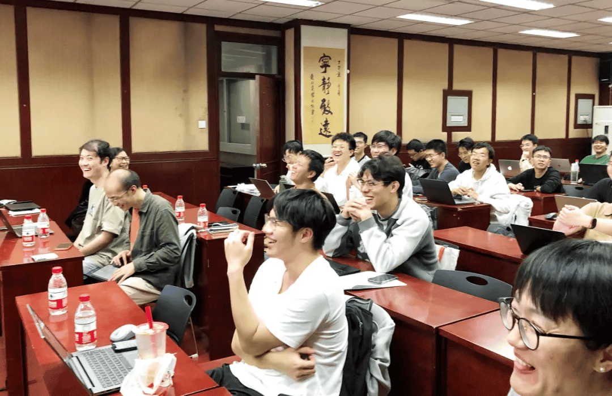
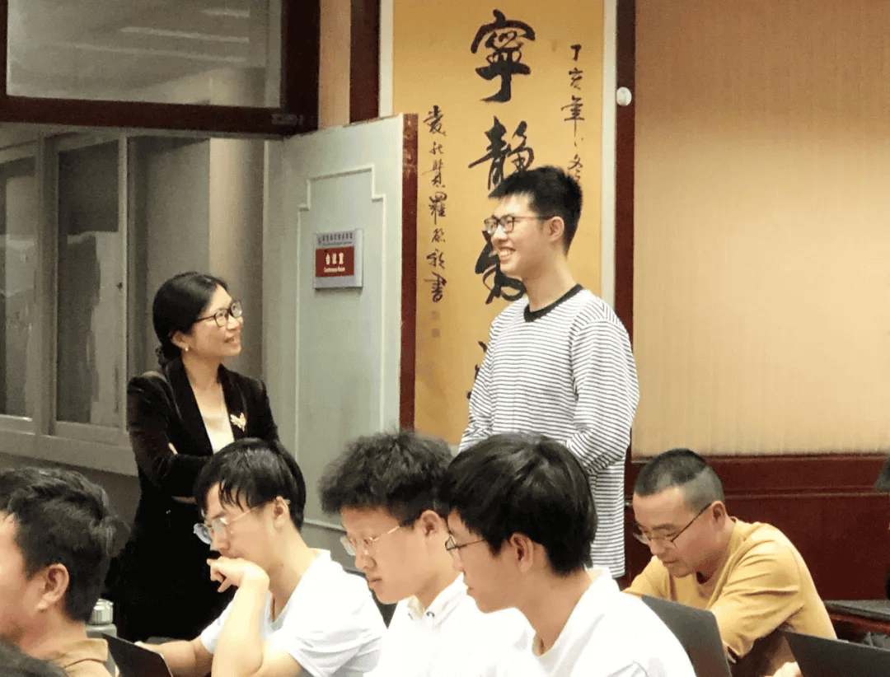
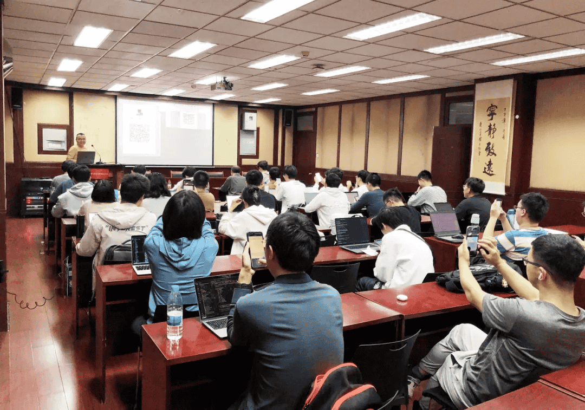
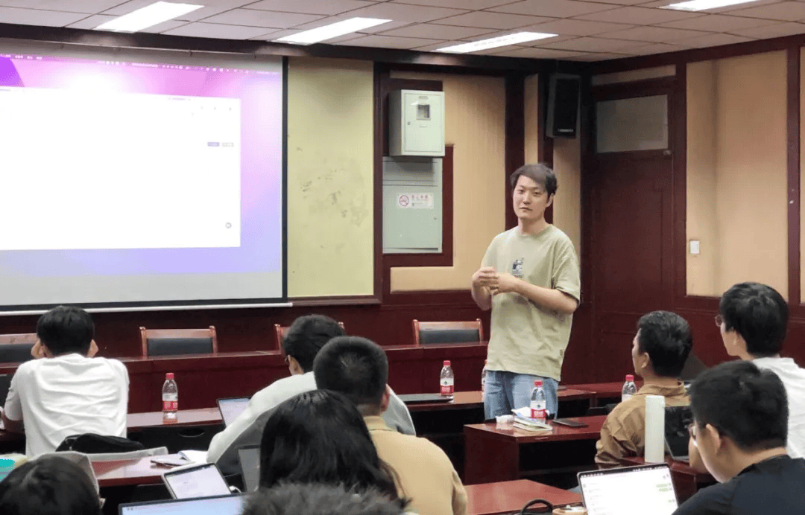
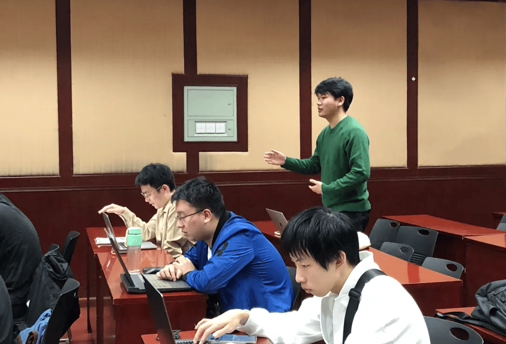

10 月 9 日下午，CCF"开源高校行"第二十八期暨"木兰技术开放日"在北京大学成功举办。

<!-- more -->

---

活动作为北大信科《开源软件技术》课程的特别环节，邀请了四位业界专家带来重磅分享：百度工程师龚少田介绍了飞桨新一代中间表示技术与神经网络编译器，涛思数据联合创始人廖浩均分享了 TDengine 时序数据库的发展历程，SRS 创始人杨成立讲解了开源流媒体服务器的技术创新，中科院计算机网络信息中心高级工程师朱小杰展示了大数据流水线系统πFlow 的应用实践。活动通过专题报告和互动答疑，加深了师生对开源技术的理解，推动了开源文化在高校的传播，为开源人才培养搭建了良好平台。

## 主题报告

### 1. 飞桨新一代中间表示技术与神经网络编译器

百度工程师龚少田作了以《飞桨新一代中间表示技术与神经网络编译器》为主题的报告（代张军）。本报告重点介绍了知名开源 AI 框架飞桨的前世今生，介绍其技术架构及其跟其他知名 AI 框架的异同，并介绍如何参与飞桨开源社区。

### 2. TDengine 时序数据库及开源参与介绍

涛思数据联合创始人廖浩均分享报告以《TDengine 时序数据库及开源参与介绍》为题，介绍了时序数据的特点，时序数据库 TDengine 的发展历程及其技术特征、TDengine 开源社区的运行情况，以及参与 TDengine 开源项目的方式。

### 3. SRS 简介和贡献指南

腾讯云工程师杨成立进行了主题为《SRS 简介和贡献指南》的报告，分享了 SRS 项目的基本情况，以及如何参与 SRS 项目。他介绍到 SRS 是一款开源的实时视频服务器，采用 MIT 协议，广泛应用于流媒体领域，支持 RTMP、WebRTC、HLS、SRT 等多种协议，实现高效的协议转换。

### 4. 大数据流水线处理与调度系统πFlow

中国科学院计算机网络信息中心，高级工程师，硕士生导师朱小杰以《大数据流水线处理与调度系统πFlow》为题，介绍了πFlow 功能、特性及如何加入社区。她介绍了复杂流程的大数据处理与分析多依托于流水线系统πFlow 是一款基于分布式计算框架研发的大数据流水线处理与调度系统，实现大数据采集、处理、存储与分析流程化配置、运行与智能监控，提供了 100+的标准化组件，支持面向领域的组件扩展，性能优越，适用于大数据处理与分析场景。

### 5. 答疑环节

活动安排了答疑环节，对于同学们的疑问，嘉宾们进行了详细的讲解，使得同学们对开源有更深的理解，对开源社区和开源文化的推广起到了良好的作用。

至此 CCF“开源高校行”第二十八期活动圆满落下帷幕。中国计算机学会开源发展委员会将持续在各高校进行系列活动，欢迎各位专家、老师和同学们积极参加其中。开源活动本身也是一个汇智、传播、分享的过程，相信开源高校行活动在开源专家、老师同学们的支持下会办得越来越好，做出更大的贡献。

## 写在最后

飞桨开源社区活动一直在进行中哦~~我们会不定期**走进校园、开展线下 Meetup，线上的启航计划、快乐开源以及进阶的飞桨黑客松**。欢迎大家持续关注飞桨的各种活动哦~O(∩_∩)O 哈哈~
对于对此有兴趣、愿意贡献力量的开发者，也可以联系[孙师傅](https://github.com/sunzhongkai588)

xxxxxxxx

aaaaa
