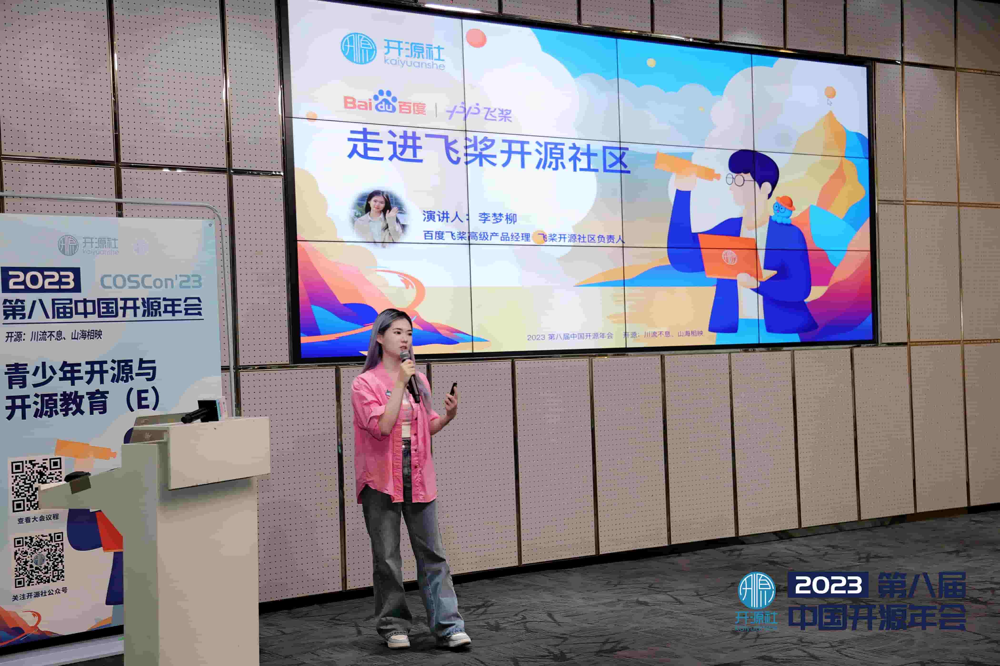
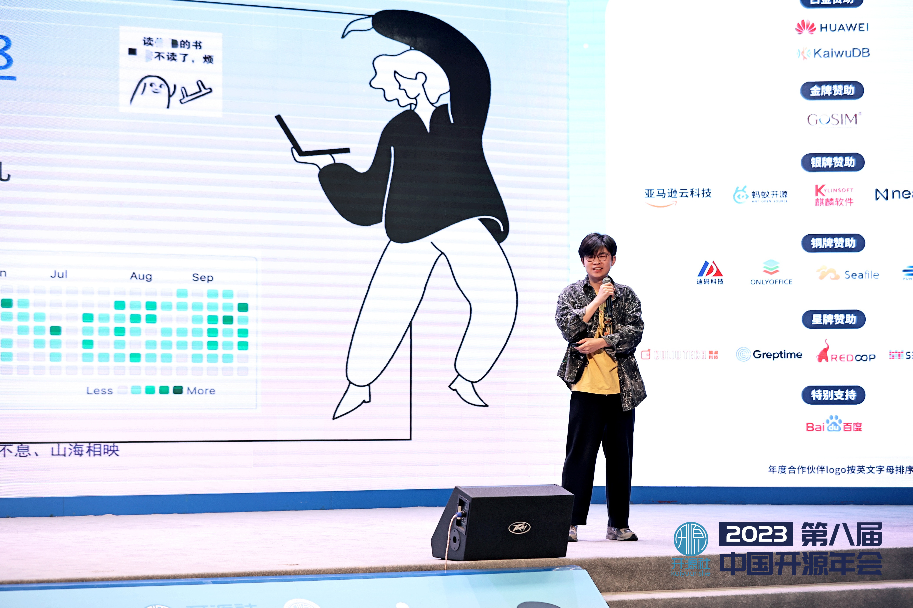
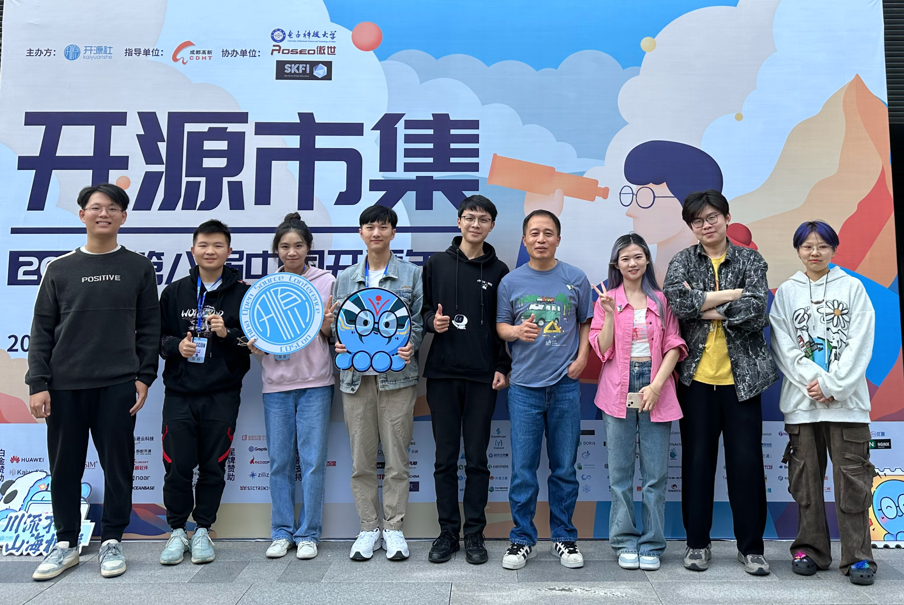
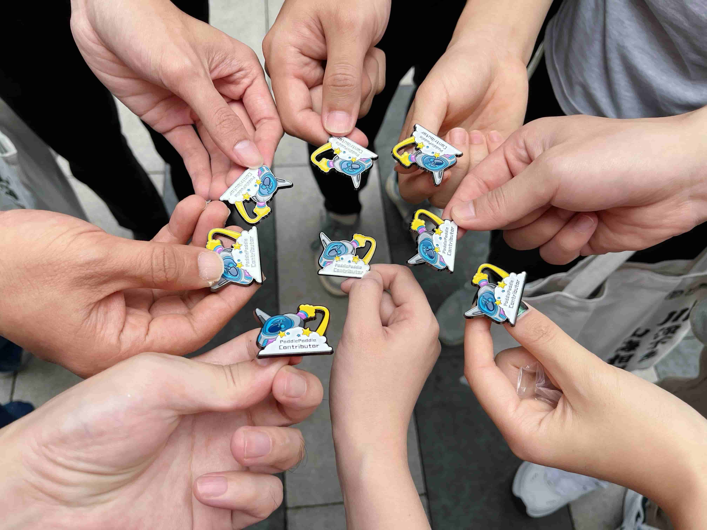

2023年10月28日、29日参加开源社举办的「第八届中国开源年会」的精彩瞬间，以及与咱 Paddle 社区成都开发者们的线下见面～

---

## 第八届中国开源年会

飞桨开源社区受邀参加第八届中国开源年会，梦师傅和我（孙师傅）都贡献了两场精彩的演讲 🎉。

28日的活动中，梦师傅在**青少年开源与开源教育**分论坛上，分享了主题为「**走进开源社区**」的演讲，向祖国的仙人掌们 🌵 宣传咱们充满趣味和活力的飞桨开源社区。

梦师傅还鼓励了很多青年开发者加入飞桨开源社区，其中甚至有一名刚年满15岁的初中学生，在活动后提交了 PR 并成功合入，成为了 Paddle 的 contributor [@BernieHuang2008](https://github.com/BernieHuang2008)。

29日的主论坛上，孙师傅进行了**闪电演讲**，分享了「**如何在开源社区摸 🐟**」，介绍了孙师傅工作 0.5kun年🐔 里总结的摸鱼心得。

演讲的详细内容将在后续的博客中分享，敬请期待～

## 飞桨社区成都开发者 Meetup

在29日，我们还相约飞桨社区成都的开发者们线下面基，以下是痛失真名的成都开发者（~~网友~~）：

-  卢畅 [@AndSonder](https://github.com/AndSonder)；陈思州 [@jjyaoao](https://github.com/jjyaoao)；王龙志 [@Wanglongzhi2001](https://github.com/Wanglongzhi2001)；谢俊霖[@PommesPeter](https://github.com/PommesPeter)

梦师傅还很贴心的给每位开发者赠送了 PaddlePaddle contributor 专属徽章 🥳。

期待未来与成都的伙伴们再次见面！

## 彩蛋 🎊

最后，我们还一起跟随军哥 [@jzhang533](https://github.com/jzhang533) 观看了一场外国小姐姐的 livehouse，很精彩哟！

