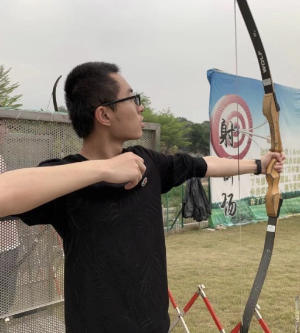
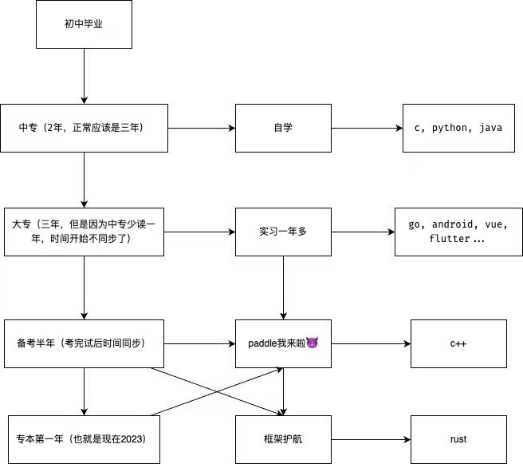
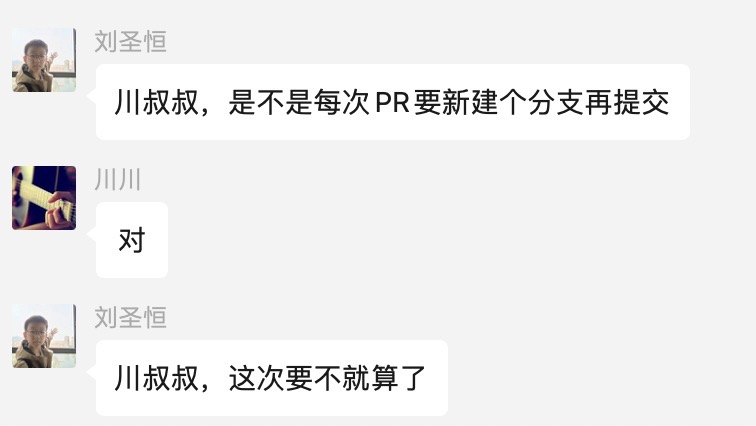
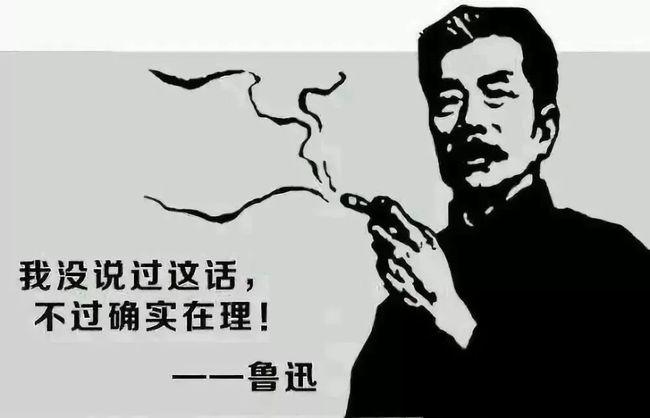

“桨声川水悠悠过，长路漫漫风光留”，这次我们要采访的是小伙伴们都熟悉的励志富哥儿——**川川师傅**✨

---

<!-- 导入聊天框功能 -->

<!-- 导入聊天框功能 -->

## 一、前言

> 按川川要求，以下均以 🍢🍢 代称川川。

川川目前是一名~~平平无奇的~~大学生🧑‍🎓，也是 Paddle 社区里的一名资深开发者。他~~精通~~（🍢🍢: 我没有，不是，别瞎说🐶）Java、Python、C++ 等多门编程语言，还掌握 Flutter、Android、Vue 等工具，可谓多才多艺！

川川加入 Paddle 社区后，从最简单的文档修改任务开始，到参与快乐开源、熟悉 paddle 框架，到参与充满难度和挑战的护航计划，到最终自己能够独立的拆解问题、发起社区项目（ruff 升级），我们亲眼见证了他一步步的成长 ~~（怎么有种养成系的感觉）~~。

在提升自我外，川师傅也多次热心地帮助新伙伴们解决 bug、回答问题。（所以大家如果有问题，可以**随时在群里骚扰他哦**）

然而当抛开“Paddle 社区开发者”“学生”等形象标签后，单独地看川师傅自身的人生经历，可谓是**非常的励志**。你敢相信，川师傅是从中专、大专一路读上来的吗？川师傅的经历像是一本精彩绝伦的探险故事集。接下来让我们来读读他的探险之旅吧！

    

> ！！！注意！！！上图为川川师傅の帅照，小伙伴们可以截图保存哦！😝😝😝😝

## 二、采访内容

1. **介绍一下自己吧，川川师傅 o(\_￣3￣)o ！**

   **🍢🍢:** 我的 AI Studio 账号是 gouzi，GitHub 的账号是 **gouzil**！o(￣ε￣\_)o

2. **作为一个 21 岁青春男大，平时有什么兴趣爱好？听说你喜欢出去玩，你在福建有什么推荐给大家打卡的景点么？哈哈~**

   **🍢🍢:** 爱好当然是出去走走玩玩，感受一下人间烟火气。打卡的话当然是福建的省会厦门啦🐶，在十里长堤跟着男女朋友看看夕阳，鼓浪屿的小巷子。平潭岛也挺不错的(🍢🍢没去过但是朋友圈已经发爆了，图中为蓝眼泪时期，需要特定的季节，且肉眼看不出来这种效果，需要相机长曝光，大家别跑空咯)。

    

      <ImageBox url="../images/chuan-story/chuan-04.jpg" description="厦门杏林大桥(来源: 川川相册)" centerStyle="width: 33%;" />
      <ImageBox url="../images/chuan-story/chuan-05.jpg" description="十里长堤(来源: 川川相册)" centerStyle="width: 33%;" />
      <ImageBox url="../images/chuan-story/chuan-06.jpg" description="鼓浪屿(来源:厦门文旅公众号)" centerStyle="width: 28%;" />
   

   <ImageBox url="../images/chuan-story/chuan-07.jpg" description="平潭（来源: 新华社 2023/04/29 ）"/>

3. **据我了解，你在初中时就用易语言写了个安卓 APP 给奶奶使用，你能详细讲讲这个 APP 的设计目的和功能么？你当时学习了些什么技术才把这个 APP 做成？那又是通过哪种方式（看书?上网学习?视频?）学习的呢？**

   **🍢🍢:** 1️⃣ 其实设计这个 APP 是因为奶奶不识字，但是又需要使用手机（而正常手机打电话都是看人的名字进行拨打）。这个 APP 可以理解为一个默认桌面，手机解锁后 APP 就打开，打开后是像下图一样的手机联系人的照片，其实就是把联系人名字变成对应的他们的图片，这样尽管奶奶不识字，也可以看照片进行操作了！🐶 2️⃣ 当时学了啥技术: 其实也没具体的学，因为易语言是中文，有一定的思维逻辑就能实现啦。3️⃣ 通过哪种方式: 翻翻编译器自带的易语言说明（那时候 bilibili 还没有那么火，也没有啥书，只有一台能跑安卓模拟器的电脑）。

    

       
    

4. **在 16 岁左右，你就陆陆续续自学了 Python、Java、C，后来又自学了 Go、Android 等等，在这个自学过程中你遇到了那些困难，又有想过放弃么？**

   **🍢🍢:** 遇到困难当然是有的，很难想象 C 我看了半年视频才学会的（有部分原因是我比较拖, 学习一门新的语言时长最好不要超过两周, 因为后续的项目会慢慢的补上来的）。每次接触一门新的语言都会对计算机有更深的理解，理解不同语言为什么要这么做，这么做的优缺点，这也是不断学习的动力吧。想过放弃么: 没有，我还挺感兴趣的，兴趣是最好的老师。

5. **能简单聊聊你的这几年的学习经历么？**

   **🍢🍢:** 下图最右侧那一列就是学习的顺序啦（学那么多真没啥用，学好一个精通它就行）。也没啥经验，顺其自然就好啦，等学完技术应该也更新了。最快的方式就是跟着项目走，不断的优化它 ~~（最后就会发现：我写的什么玩意，要不要重构🐶）~~ 。不过倒是有几个提升比较大的时间段，一个是去参加了云计算比赛，让我会了 linux 和 docker 这些。一个是实习的那一年，让我整明白了网站这一套（B/S，C/S）。

   

6. **现在社区开发者都认为你的编程能力很强，和学历形成了很大反差，能透露一下当时是为什么会上中专呢？是因为偏科吗？**

   **🍢🍢:** 不是偏科啦，我差的很平均🐶。顺带说一下厦门的初升高录取率为 45%，现在好些了 50%，卷不动卷不动，当然更多是因为我比较菜。

7. **事实上在目前的舆论环境里，“专科生”是一个很遭受非议的标签😮‍💨，而作为一个亲历者，你内心的是怎么面对的呢？你当时又做了哪些方面的努力？**

   **🍢🍢:** 关于这个标签的话，我只想说：你说的对。没啥必要在乎别人的看法，做自己热爱的事情就好啦。

8. **作为目前考上本科的计算机应用技术专业的学生，你对未来的职业发展有怎样的规划和期望✊✊✊？**

   **🍢🍢:** 我更喜欢做一些底层的工作，不太喜欢做应用层。规划：~~入职百度，重构 paddle~~。

9. **作为厦门领航团的一员，你当时是什么契机接触 Paddle 社区的？在 Paddle 社区做的第一个开源项目是什么？**

   **🍢🍢:** 说到这个契机啊，非常简单，你的上司是厦门领航团团长就行。第一个开源项目当然是我们孙师傅（@[sunzhongkai588](https://github.com/sunzhongkai588)）的 docs 啦，当然非常感谢佳维姐姐（@[dingjiaweiww](https://github.com/dingjiaweiww)）和梦师傅（@[Ligoml](https://github.com/Ligoml)）的鼓励和协助我完成了在 paddle 的第一个 pr。

10.   **在社区里如何和其他开发者进行互动的？有没有什么特别有意思的经历或故事？**

      **🍢🍢:** 我一般有碰上问题就出来回答啦，或者一些技术讨论。特别的故事：五年级的小朋友叫我叔叔算嘛

      

11.   **对于 Paddle 框架护航计划，可以分享一下你的面试经历和感受吗？你觉得到达什么水平可以通过护航计划的面试？**

      **🍢🍢:** 经历的话，放心研发大哥不会难为你的，真诚就行。感受 emmm，大家一定要提前准备啊，刷刷算法什么的。什么水平 emmm，我也不太清楚，但是最好是熟悉 padlle，或者你的能力超级无敌强。

      > 编者注✍️：「护航计划」可以简单理解为飞桨的远程实习项目，可参考 [护航计划集训营说明](https://github.com/PaddlePaddle/Paddle/issues/57264)

12.   **参与护航计划时，有什么不一样的感受吗？实际开发过程有没有遇到困难，是怎么解决的？**

      **🍢🍢:** 最大的感受就是，终于从应用层转向了框架层。困难是肯定有的，也有非常多不会的，但是这没关系，问研发大哥就行。就像昆昆（@[2742195759](https://github.com/2742195759)）说的: 你尽管问，我就是你的文档。

13.   **在 Paddle 社区中，你参与的哪个项目（或活动）你印象最深刻，能简单描述一下这个项目么？这个项目让你收获了什么？**

      **🍢🍢:** 印象最深的项目是下一个项目，下一个项目可以把之前项目的经验集结起来，也可以学到一些新的知识。当然 PaddleSOT 印象也挺深的，这也是我护航计划的项目。收获更多的是技术的进步吧。有时候看看喵喵（@[SigureMo](https://github.com/SigureMo)）的修改会发现，噢原来还能这么写。

      

14.   **对于深度学习领域，你有哪些想法和研究方向？目前有没有感兴趣的方向？**

      **🍢🍢:** 我其实更多的还是喜欢框架层，怎样才能让整个框架跑的更快，占用更低，更加的易用化。

15.   **发挥一下想象力，如果将深度学习比作一种食物，你觉得它会是什么？为什么？**

      **🍢🍢:** 可能是米饭吧，喂的越多越有力气，跑的越快，力大砖飞。

16.   **听说你使用飞桨解决过很多企业实际问题时，你遇到过最有趣的案例是什么？那么你是如何应用深度学习技术解决这个问题的？**

      **🍢🍢:** 我实习这个企业吧，他刚尝试深度学习，所以一般调调 API 就行了，更多的是怎样去分配资源，做到效率最大化 ~~（我司全是 1050 的卡，我能咋办，我也很绝望啊）~~ 。

17.   **除了深度学习，你还对其他领域感兴趣吗？有没有想过将深度学习与其他领域结合，创造出一些令人惊喜的应用？**

      **🍢🍢:** 其他领域其实有的，比如摄影和游戏，结合的话有想过，但是还没新建文件夹就不说了🐶

18.   **如果你有机会和 Paddle 社区 or 深度学习领域 or 计算机领域 的一位顶级专家进行合作，你希望和他/她一起研究什么问题？为什么？**

      **🍢🍢:** 这可就太多了，比如：不同语言的通信，怎么做到程序的相对安全，怎样去减少硬件之间的瓶颈。为什么 emmm，可能是因为自己对这方面感兴趣吧。

19.   **如果让你形容一下你和 Paddle 社区的关系，你会怎么说？**

      **🍢🍢:** 相互促进，~~互相成就~~（更多还是 paddle 社区的大佬单方面带着我）

20.   **最后，作为一个热情、励志的年轻人，你想对 Paddle 社区里的开源者们说些什么呢？**

      **🍢🍢:** 放开那道题，让我来🐶

## 三、“鲁迅之我确实说过这话”专区

同样我们也邀请了一些和川川很熟悉的、有过合作经历的朋友们，贡献一下和川师傅相关的故事，或者他们对川师傅的评价～以下均为真心话，请放心看！

### by 散步（[sanbuphy](https://github.com/sanbuphy)）

<!-- 尝试使用聊天框功能实现采访内容 -->
<MessageBox>
   <Message name="散佬" github="sanbuphy">
   和川川交流还算比较多，川川基本上有空都会帮你解决任何疑问，甚至是看代码。虽然是年轻的富哥，但很努力上进，甚至比孙师傅还努力🐶；总体来说算很善良的小哥，教过我很多东西。希望能和他一起学习成长，向他多学习请教一些代码之道，早日都一起为中国开源社区多做一些更有价值的事情。 在我无数个老师中，他肯定是我印象深刻的老师之一。
   </Message>
</MessageBox>

### by 卢师傅（[AndSonder](https://github.com/AndSonder)）

<MessageBox>
   <Message name="卢畅" github="AndSonder">
   有幸在今年暑期上海 meetup 上认识了川师傅，很低调的技术大佬。在川师傅身上能看到对开源活动的热情，各大活动上都能看到川师傅的身影。希望以后还有机会和川师傅线下面基，迪迪小组再次出发！
   </Message>
</MessageBox>

> 编者注✍️：迪迪小组是上海 meetup 期间，相约去迪士尼玩的小分队

### by 一师傅（[SigureMo](https://github.com/SigureMo)）

<MessageBox>
   <Message name="喵喵" github="SigureMo">
   自川子参与第一期护航计划开始已经马上就要 6 个月了，我和川子也算是深度交流了 6 个月。从护航计划来看，川子始终保持十足的热情，在 PaddleSOT 那时候还是以开源任务的形式发放，但每次有任务川子都会第一时间认领。之后到现在动转静单测推全，我的 review 速度都赶不上川子提 PR 的速度了……此外川子涉猎甚广，在交流的过程中我也学到了很多东西，川子也会参加各种开源任务，你基本上可以在任何「角落」里看到川子的身影～
    
   川子这 6 个月也是成长了很多，从早期每个任务都需要细致沟通到现在发完任务基本就心照不宣了，也能独立完成很多任务了。比如 Ruff 的升级优化，目前川子对 Ruff 的了解程度已经仅次于我了，再比如 OpResult 方法的 patch 补全，以及动转静单测机制，基本都是川子独立完成的。对于大多数任务，现在我已经能放心地说：「川子，这个就交给你了」
    
   另外，「提前」说一下，川子贼有钱～
   </Message>
</MessageBox>

### by 花花（[Tulip-hua](https://github.com/Tulip-hua)）

<MessageBox>
   <Message name="花花" github="Tulip-hua">
   我愿称川川为飞桨开源社区小天使
   </Message>
</MessageBox>

## 四、特别栏目——爱在何方之川川相亲帖

接下来，有请男嘉宾——小富哥儿川川来进行一段自我介绍✨。

<MessageBox>
   <Message name="🍢🍢" github="gouzil">
   报菜名环节，身高179cm，体重65kg(±5kg)，来自福建厦门，2002年出生，目前在福州读书，不抽烟，不喝酒。性格有点太温柔了，不太凶得起来。对陌生人有点社恐，熟悉了之后就好很多。有一点点宅，但不会非常宅，还是会出去走走（不然咋拍照片🐶）。有一点点强迫症，比如下面这张798的照片好像有点歪了。喔对了川川不会做饭。期望伴侣，可以稍微e一点，拉着我出去玩🐶。（🍢🍢: 咱就是说还有几个月才到22，也不至于这么着急吧🐶）
   </Message>
</MessageBox>

有意者，请扫码加入快乐开源群，联系川川师傅（找头像即可）。

    

## 彩蛋 🥚

最后让我们欣赏一下川大摄影师的大作吧 📷

<ImageBox url="../images/chuan-story/chuan-14.jpg" description="北京 798 艺术区"/>
<ImageBox url="../images/chuan-story/chuan-15.jpg" description="福州三江口大桥"/>

   <ImageBox url="../images/chuan-story/chuan-16.jpg" description="福州烟台山" centerStyle="width: 49%;"/>
   <ImageBox url="../images/chuan-story/chuan-17.jpg" description="厦门中医院附近" centerStyle="width: 49%;"/>

---

## 写在最后 💡

**【开源江湖闲聊录】** 是一项专门为 Paddle 社区的开发者打造的特色访谈栏目📚。在这里，我们邀请到每一位别具一格且富有热情的开发者，通过文字或语音的方式进行深入采访 🎙️，探索并展现他们背后独一无二的故事，将他们的经历、见解和创意整理成精彩内容，呈现给整个社区。

---
