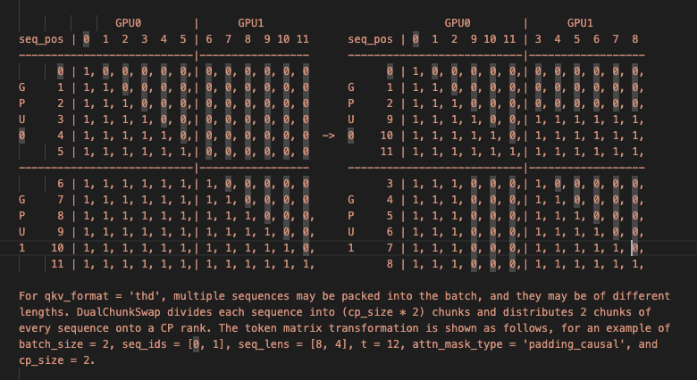
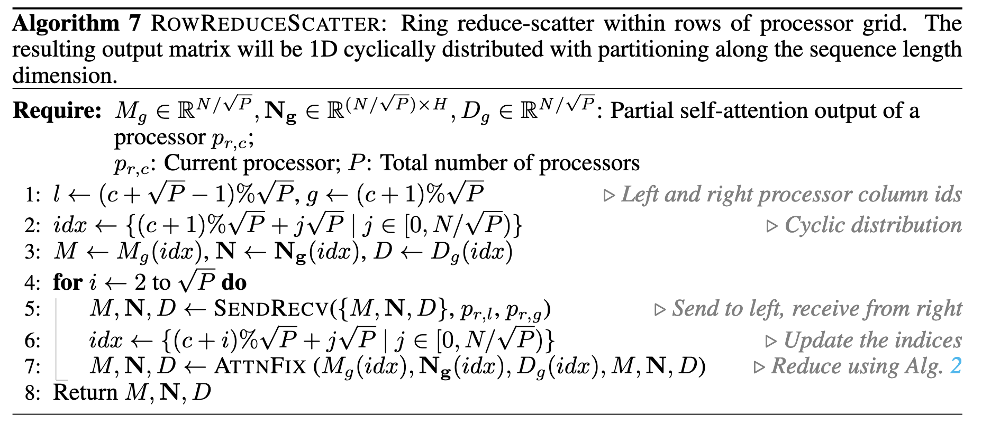
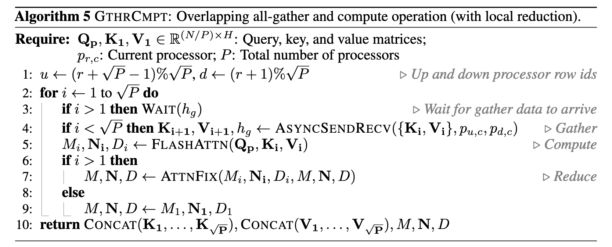
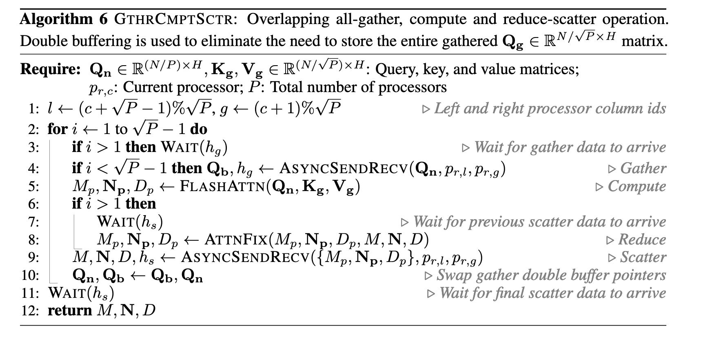

## 1.前言

随着多模态模型的崛起，因为处理和理解视频、音频等非文本数据需要更远超传统文本处理的需求的庞大的上下文空间，目前生成式人工智能正朝着上下文长度不断增长的方向发展。谷歌的 Gemini 2.5 Pro 支持 100 万 token 的标准上下文窗口。 Meta 的 Llama 4 系列也推出了支持 100 万 token 上下文的 Maverick 和高达 1000 万 token 的 Scout 版本。Qwen 也紧随其后，部分模型支持高达 100 万 token 的上下文长度。

当模型需要处理极长序列时，内存占用是其主要挑战之一。对于单层的 bs = 1，num_q_head =64，num_kv_head = 8，headsize=128，seqlen=128K，datatype=bf16 的 attention 算子，其在训练中需要存储 2GB 的 Q 矩阵、各 0.5GB 的 K、V 矩阵、2GB 的 O 矩阵。

序列并行是一种将输入序列沿其长度维度进行切分，并将不同的子序列分配到不同的设备上进行处理的并行方法。每个设备只处理部分序列的计算，从而显著降低单设备的内存需求。目前主流的序列并行方法是 ring-attention[1] 与 deepspeed-ulysses[2]，也有一些工作同时集成了 ulysses 与 ring-attention，如 usp[3] 与 loongtrain[4]。前面已经有同学分享过了 ring-attention 的实现与基于 ring-attention 的在序列并行中高效支持不同 mask 的论文，而本文将介绍 ring-attention 及其后续演进、deepspeed-ulssyes 的实现以及结合 ring-attention 与 deepspeed-ulysses 进行混合序列并行等在 attention 算子层上进行序列并行的工作。

## 2.ring-attention 及其后续演进

### 2.1 ring-attention 简介

ring-attention 的核心在于将长序列分块，并将这些块分布到多个设备上，每个设备负责处理其中一个或几个块的 Query (Q) 矩阵。这些设备形成一个环形拓扑结构，数据（主要是 Key 和 Value 块）在这个环中依次传递，同时进行计算。ring-attention 的关键在于，将注意力计算与设备间的数据通信（K/V 块的传递）overlap 起来。当一个设备在计算当前 Q 块与接收到的 K/V 块的注意力时，它可以同时将自己持有的 K/V 块发送出去，有效地隐藏了通信开销。

### 2.2 ring-attention 后续演进

初始版本的 ring-attention 存在负载不均衡的问题，同时也没有与 fa2 结合起来。BurstAttention[8] 把 ring-attention 与 fa2 的思想进行了结合，提出了 LAO 方法，megatron-LM 也支持了在使用 fa3 的同时进行序列并行操作。针对负载不均衡的问题，megatron-LM 的实现代码[5]中把序列位置靠后的 token 与序列位置靠前的 token 两两配对，放在了同一个设备上来缓解负载不均问题，如下图所示。

而 striped-attention[6] 则把 token 划分为不同的 strip ，用更细的粒度上的方法进行负载均衡，相比于 ring-attention 的原始实现，striped-attention 在 token/s 指标上取得了约 40%～50% 的加速比。striped-attention 的负载均衡策略示意图见下。

此外，Distattention[7]（又称 lightseq）也提出了一种负载均衡的方案，付出了一定的总通信量的开销后，它把一些序号靠后的卡需要进行的计算放在了前面的卡中进行，减少了总迭代次数的同时进行了负载均衡，同时，其对 megatron-LM 的梯度检查点位置进行了优化，减少了 recompute 过程中 attention 前向的重复计算，这两个策略结合使其相比 megatron-LM 有了约 10%～50% 的加速比。
Distattention 的负载均衡策略示意图见下。

初始版本的 ring-attention 的单卡通信量，参考下图所示，为 $O\bigl(N \cdot hs \cdot \tfrac{P-1}{P} \cdot \tfrac{N}{P} \cdot \tfrac{1}{c}\bigr) = O\!\bigl(\tfrac{N^2 \cdot hs}{P \cdot c}\bigr)$（hs 为 head size，N 为 seqlen，P 为设备数量，c 为 ring-attention 中的分块大小），其在每次外层迭代中都会重新 load 一遍完整的 K 、V 矩阵，引入了大量通信开销。而在 llama3 [9] 与 megatron 的部分实现中，每个设备在进行分块计算前都会对 K 、V 进行一次 all gather 操作一次性获取本设备所需的完整 K 、V 矩阵，以额外的内存开销与舍弃了计算通信 overlap 的代价降低了通信量，此时的单卡通信量为 $O(N \cdot hs)$。ring-attention 通信量示意图见下。

### 2.3 attention2D

在 ring-attention 中，由于只在 Q 维度上进行了并行，因此每个设备需要通信的 K/V 矩阵通信量并不会随着设备数的增加而减少。 为了解决这个问题，微软在 2025 年提出了 Attention2D[10]，其在 kv 维度上同样进行了切分与并行。给定 P 个设备，Attention2D 会把 attention 的处理过程划分为$\sqrt{P}$\* $\sqrt{P}$ 的 grid 进行并行计算，由于同时在 kv 维度与 q 维度上进行了等分，该算法本身就带有负载均衡的特性。Attention2D 的原理示意图见下

Attention2D 在不进行 overlap 情形下的详细算法如下所示，其中 M 为最大值向量，N 为未进行归一化时的注意力输出，D 为归一化分母。

同 ring-attention 一样，attention2d 也可以进行通信-计算的 overlap，详细算法如下所示：

与 ring-attention 相比，attention2D 的方法虽然额外引入了 Q 矩阵的通信开销，但却在单层 attention 计算中把矩阵的通信开销的复杂度从 $O(BNMH)$ 降低为了 $O(BNMH/\sqrt{P})$（B 为 batchsize，N 为序列长度，M 为头数，H 为 headdim，P 为设备数）。下面对内存复杂度进行讨论。在上文提到的 attention2D 的算法中，在前向计算时每个设备的单层网络的单个头持有的 Q、K、V 矩阵块 $Q_{g}$、$K_{g}$、$V_{g}$ 占用内存的空间复杂度为 $O(NH/\sqrt{P}$)。在一次 attention 计算完成后，当前设备在该层该头需要长期保有以供反向传播使用的矩阵块如 $Q_{p}$ 的空间复杂度为 $O(NH/P)$ 。因此在整个模型训练过程中，峰值显存占用为单次计算占用与长期保有矩阵显存占用之和，其复杂度为 $O(BLMNH /P + BNH /\sqrt{P})$（L 为层数）。当 $LM > \sqrt{P}$ 的场合，其空间复杂度可简化为 $O(BLMNH /P)$ ，与 ring-attention 相同。

attention2d 的实验结果如下：

与 ring-attention 相比，attention2d 始终拥有 2x 以上的加速比。同时可以看出，在大多数场合下 attention2d 的非 overlap 实现相比于 overlap 实现有着更好的性能。据论文作者描述，性能差距主要在于以下两点：1）fa3 不支持 overlap 实现下的阶梯状 mask，算法 6 中的第 5 行需要拆分成多次 attention 循环，每次 attention 计算单独一块 q 与其配对的 kv 块。而非 overlap 实现可以使用 causal mask 来一次性完成计算。 2）overlap 实现的 attention2d 采用了环形通信（ring-based），虽适应性强但未充分利用底层网络拓扑优化；而非 overlap 实现使用的 all-gather 可以利用 NCCL 等库的拓扑感知优化来提升性能。

## 3.deepspeed-ulysses 简介

ring-attention 与一系列基于其的工作在进行 Q、K、V 的本地分块存储与 attention 计算时都是在 seqlen 维度上进行的，而与 ring-attention 几乎同时发布的 deepspeed-ulysses 则使用了不同的思路。deepspeed-ulysses 虽然在本地存储时仍然使用在 seqlen 维度上进行了分块存储，但在计算时却使用了在 head 维度上进行切分的切分方式。如下图所示，在 ulysses 的实现中，本地以[N/p,d]方式进行分块存储的 Q、K、V 矩阵在经过 a2a 操作后，在每个设备上以 [N,d/ p] 的方式进行了分块。每个设备负责处理在单个头的完整序列长度的 Q、K、V 分块矩阵。

ulysses 的单卡通信量相比优化后的 ring-attention 较少，为 $O(N / P * d)$，但 ring-attention 实现了通信与计算的 overlap 的操作。此外， ring-attention 需要多次 launch kernel，而 ulysses 只用 launch 一次 attention kernel，可以减少 kernel launch 的开销。但需要注意的是，ulysses 可以并行的最大维度为 head 数量，在并行程度上相较于 ring-attention 有所不足。

## 4.混合序列并行

ring-attention 与 deepspeed-ulysses 在不同维度上进行了序列并行，二者是正交的，天然可以进行组合。在 2024 年，USP: A Unified Sequence Parallelism Approach for Long Context Generative AI 首次提出了混合序列并行，其主要算法如下所示。其在 ring-attention 中使用的负载均衡方案与上文中提到的 megatron-LM 负载均衡方案一致。

USP 比较了其与多种并行方法的通信量与内存占用量，如下表所示，其中，P 为 fp16 格式的参数，G 为 fp16 格式的梯度， OS 为优化器状态（包含 fp32 格式的参数副本、动量与方差），Act 为不用长期保存的中间张量。

USP 在文章中提出了多个观点，总结如下：

1. 建议使用 Unified-SP 替代 SP-Ring 和 SP-Ulysses，因其可以结合两者的优势且没有任何损失，还可以避免了 ulysses 的并行程度受 head_num 的限制。
2. 优先考虑使用数据并行（DP），仅在 batch size 不足时再考虑 SP。DP 与 SP 消耗内存一致，且可以避免中间的 act 通信开销。
3. 使用 SP 时应配合 ZeRO-1/2，也可考虑 ZeRO-3 和 Offload 技术。ZeRO 是一种分布式参数管理方法，通过在多台设备之间切分优化器状态（ZeRO-1）、梯度（ZeRO-2）和参数（ZeRO-3），从而降低每个设备的存储空间需求。优化器状态、梯度和参数的内存开销都可以减少到原来的 1/N。ZeRO 也可以在 SP 进程组内工作，因为沿 batch 维度（bs）或序列长度维度（L）进行切分对于 ZeRO 的方法来说是等价的。
4. 大规模下，SP 通信成本优于 TP-sp，GQA 可进一步降低 SP 通信成本。这是由于在 Tp 中对 attention 层的 TP 切分一般是在 head 维度上进行的，与 ulysses 一样受到 num_head 的限制。此外，TP-sp 的通信量也相较于 USP 有着较大提高，且不能进行计算-通信的 overlap，也无法如 ulysses 一般随并行性增加而减少通信量。 Tp-sp 是 Megatron-LM 中使用的一种并行策略，TP 将模型的参数在多个计算设备之间切分。在 TP 的中间激活张量部分，并不是所有激活张量都会被分割并分布到多个计算设备上。因此，其所需的内存成本用 αA 表示，其中 0<α<1。Megatron-LM 还通过了 SP 对 TP 进行了进一步优化，用 allgather 和 reducescatter 替换了 TP 中的 allreduce，从而将激活内存成本降低到 A/P，但代价是在 attention 和 FFN 中需要重新执行两次 allgather。
5. 从 TP-sp 切换到 SP 并不能提升可训练序列长度，SP+ZeRO3 能训练与 TP-sp 相当的长度。TP 是内存效率最高的方法之一，但它会与通信效率较高的 ulysses 竞争 num_head 维度上的并行数，因此当追求尽可能长的上下文长度时应启用 TP 并尽可能多地在 TP 维度上分配 num_head。
6. 使用 USP 可通过提升 SP 并行度（如增大 ring degree），在更多设备上训练更长序列，这是 TP-sp 无法实现的。
7. 4D( TP SP DP PP) 混合并行时，进程组维度排序应为 TP、SP-Ulysses、SP-Ring、ZeRO-DP、PP。TP 的通信最为频繁且通信量高，应当设置在最内维度，尽量在单机内使用高效 nvlink 进行。SP-Ulysses 使用了 all to all 通信，也应当尽量在机内完成。dp 与 pp 一般并行程度限制较少，不启用 ZeRO-3 时通信频率也较低，应当设置在最外层。

USP 同样探索了多种混合并行策略的效果，如下表所示。

## 参考资料

[1] Liu, Hao, Matei Zaharia, and Pieter Abbeel. ‘Ring Attention with Blockwise Transformers for Near-Infinite Context’. arXiv, 27 November 2023. [https://doi.org/10.48550/arXiv.2310.01889](https://doi.org/10.48550/arXiv.2310.01889).

[2] Jacobs, Sam Ade, Masahiro Tanaka, Chengming Zhang, Minjia Zhang, Shuaiwen Leon Song, Samyam Rajbhandari, and Yuxiong He. ‘DeepSpeed Ulysses: System Optimizations for Enabling Training of Extreme Long Sequence Transformer Models’. arXiv, 4 October 2023. [https://doi.org/10.48550/arXiv.2309.14509](https://doi.org/10.48550/arXiv.2309.14509).

[3] Fang, Jiarui, and Shangchun Zhao. ‘USP: A Unified Sequence Parallelism Approach for Long Context Generative AI’. arXiv, 2 July 2024. [https://doi.org/10.48550/arXiv.2405.07719](https://doi.org/10.48550/arXiv.2405.07719).

[4] Gu, Diandian, Peng Sun, Qinghao Hu, Ting Huang, Xun Chen, Yingtong Xiong, Guoteng Wang, et al. ‘LoongTrain: Efficient Training of Long-Sequence LLMs with Head-Context Parallelism’. arXiv, 26 June 2024. [https://doi.org/10.48550/arXiv.2406.18485](https://doi.org/10.48550/arXiv.2406.18485).

[5] [https://github1s.com/NVIDIA/TransformerEngine/blob/main/transformer_engine/pytorch/attention/dot_product_attention/context_parallel.py](https://github1s.com/NVIDIA/TransformerEngine/blob/main/transformer_engine/pytorch/attention/dot_product_attention/context_parallel.py)

[6] Brandon, William, Aniruddha Nrusimha, Kevin Qian, Zachary Ankner, Tian Jin, Zhiye Song, and Jonathan Ragan-Kelley. ‘Striped Attention: Faster Ring Attention for Causal Transformers’. arXiv, 15 November 2023. [https://doi.org/10.48550/arXiv.2311.09431](https://doi.org/10.48550/arXiv.2311.09431).

[7] Li, Dacheng, Rulin Shao, Anze Xie, Eric P. Xing, Xuezhe Ma, Ion Stoica, Joseph E. Gonzalez, and Hao Zhang. ‘DISTFLASHATTN: Distributed Memory-Efficient Attention for Long-Context LLMs Training’. arXiv, 31 March 2024. [https://doi.org/10.48550/arXiv.2310.03294](https://doi.org/10.48550/arXiv.2310.03294).

[8] Sun, Ao, Weilin Zhao, Xu Han, Cheng Yang, Zhiyuan Liu, Chuan Shi, and Maosong Sun. ‘BurstAttention: An Efficient Distributed Attention Framework for Extremely Long Sequences’. arXiv, 6 June 2024. [https://doi.org/10.48550/arXiv.2403.09347](https://doi.org/10.48550/arXiv.2403.09347).

[9] Grattafiori, Aaron, Abhimanyu Dubey, Abhinav Jauhri, Abhinav Pandey, Abhishek Kadian, Ahmad Al-Dahle, Aiesha Letman, et al. ‘The Llama 3 Herd of Models’. arXiv, 23 November 2024. [https://doi.org/10.48550/arXiv.2407.21783](https://doi.org/10.48550/arXiv.2407.21783).

[10] Elango, Venmugil. ‘ATTENTION2D: Communication Efficient Distributed Self-Attention Mechanism’. arXiv, 28 June 2025. [https://doi.org/10.48550/arXiv.2503.15758](https://doi.org/10.48550/arXiv.2503.15758).

[11] [https://zhuanlan.zhihu.com/p/707204903](https://zhuanlan.zhihu.com/p/689067888)

[12] [https://zhuanlan.zhihu.com/p/689067888](https://zhuanlan.zhihu.com/p/689067888)
