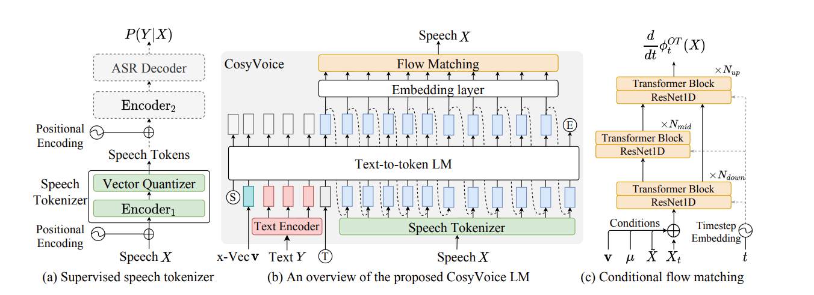

**CosyVoice: A Scalable Multilingual Zero-shot Text-to-speech Synthesizer based on Supervised Semantic Tokens**

- 论文链接：[https://arxiv.org/pdf/2407.05407](https://arxiv.org/pdf/2407.05407)
- 项目链接：[https://github.com/FunAudioLLM/CosyVoice](https://github.com/FunAudioLLM/CosyVoice)

<!-- more -->

---

## 速览

CosyVoice 1 是阿里通义实验室于 2023 年推出的多语种语音生成模型，核心目标为 ​​实现零样本语音克隆并提升语义一致性​​。其采用监督式语义 Token 提取（Whisper Encoder + 向量量化 VQ），通过小型 Token Predictor 与自定义 Encoder 架构生成语音。然而，其 Tokenizer 存在利用率低、冗余高的问题，且仅支持​​非流式离线生成​​，导致在实时场景中面临显著延迟瓶颈。

### 1. 模型规模与训练​​

- 基于​​万小时级多语种数据​​（9 种语言）训练，支持中、英、日等语言的零样本克隆。

### 2. ​​性能评测​​

- ​​语义一致性​​：在 SEED-TTS 评测集上表现优异，内容一致性超越传统模型，接近人类水平；

- ​​延迟表现​​：因缺乏流式支持，端到端延迟显著高于后续版本（如 CosyVoice 2 首包延迟优化至 150ms）；

- ​​错误率​​：CER/WER 高于后续版本，CosyVoice 2/3 通过架构改进进一步降低 30%-50%

---

## 摘要

1. CosyVoice1 主要针对传统 TTS 模型在​​实时交互​​与​​细粒度控制​​上的局限性进行优化。传统模型如 FastSpeech 虽通过非自回归架构提升推理速度，但无法支持流式生成，导致首包延迟高（通常 >500ms），难以满足实时语音交互需求，而其他端到端模型 VITS 虽通过端到端建模提升自然度，但对多语言混合、方言及情感表达的控制依赖额外模块（如 Emo-VITS）灵活性不足。CosyVoice1 通过​​双向流式建模​​实现逐句生成，首包延迟压降至 150ms，同时引入​​自然语言指令控制​​（如方言切换、情感标记），用户仅需输入文本指令（例如“用四川话说”）即可动态调整语音风格，无需重新训练或复杂参数配置，显著降低实时场景的应用门槛。

2. 较于传统模型，CosyVoice1 的优势集中于​​多语言泛化​​与​​资源效率​​。其采用​​监督式语义标记技术​​（Whisper + 矢量量化），从多语种 ASR 数据中提取强语义表征，支持中、英、日、韩及粤语等方言的无缝切换，音色相似度达 90%+，显著优于 VITS 在多语言场景下的适配成本

3. 在资源利用上，CosyVoice1 结合 ​​TensorRT 加速与动态批处理​​，RTF（实时因子）稳定在 0.2 以下，同等硬件下较 FastSpeech 提速 40%，且支持 6GB 显存设备部署，而 VITS 通常需 16GB 显存以上

## 模型结构框架

### 1. ​​文本编码器（Text Encoder）​​

- ​​功能​​：将输入文本映射到与语音语义对齐的隐空间向量，支持多语言文本（如中、英、日、韩）。
- ​​技术实现​​：
   - 基于 BERT 等预训练语言模型提取上下文语义。
   - 融合韵律标记（如停顿、重音）增强语音自然度。

- ​​创新点​​：无需强制对齐器或音素转换模块，直接生成富文本表征。

### 2. ​​语音 tokenizer（Speech Tokenizer）​​

- ​​功能​​：生成​​监督语义 token（S³ tokens）​​，作为连接文本与声学的中间表示。
- ​​技术实现​​：
   - 在多语言 ASR 模型（如 Paraformer）的编码器后插入​​矢量量化层（VQ-VAE）​​，将语音特征离散化为 token。
   - 监督训练确保标记显式捕获语义信息（如内容一致性），区别于无监督编解码器（如 EnCodec）。
- ​​创新点​​：标记与文本强对齐，提升零样本克隆的内容保真度。

### 3. ​​大语言模型（Text-to-Token LLM）​​

- ​​功能​​：以自回归方式将文本编码器输出解码为 S³ token 序列，重构语音语义流。
- ​​技术实现​​：
   - 基于 GPT 架构的自回归 Transformer，输入为文本向量+历史 token，预测下一 token。
   - 支持参考音频特征注入（如说话人嵌入），实现音色克隆。

- ​​创新点​​：将 TTS 任务转化为序列生成问题，简化流程并支持长上下文建模。

### 4. ​​条件流匹配模型（Conditional Flow Matching）​​

- ​​功能​​：将 S³ token 转换为梅尔频谱图，融入音色与情感控制。
- ​​技术实现​​：
   - 基于常微分方程（ODE）的扩散模型，学习从噪声到目标频谱的确定性路径。
   - 输入包括：S³ token 序列、说话人特征（x-vector）、情感标签（可选）。

- ​​创新点​​：避免随机扩散的不稳定性，提升合成效率与音色相似度。

### 5. ​​声码器（Vocoder）​​

- ​​功能​​：将梅尔频谱图转换为最终语音波形。
- ​​技术实现​​：采用预训练的 HiFiGAN，支持 48kHz 高保真输出。

## 语音 tokenizer​

### 1. ​​监督语义标记的生成逻辑​​

- ​​核心目标​​：将语音信号转换为​​强语义关联的离散标记​​，作为连接文本与声学的中间表示。
- ​​实现路径​​：
   - 基于预训练的 ​​SenseVoice-Large ASR 模型​​（阿里自研的多语言语音识别模型），在其编码器的​​前六层后插入矢量量化层（Vector Quantization, VQ）​​。
   - 输入梅尔频谱图后，先通过前半部分编码器（Encoder1）生成上下文感知的隐层表示 H，再通过 VQ 层将其离散化为索引序列（即 S³ tokens）。
- ​​数学表达​​：$s_t​=argmin_k​∥e_k​−h_t​∥^2​$ ​其中 $h_t$ 为第 t 帧的隐层向量，$e_k$ 为码本（Codebook）中的嵌入向量，$s_t$ 为输出的离散标记。

### 2. ​​多层级位置编码增强​​

- ​​基础位置编码​​：在输入梅尔频谱时添加标准位置编码，保留时序信息。
- ​​量化后增强编码​​：在 VQ 层输出后​​额外添加位置编码​​，强化离散标记的时间连续性，避免解码时语义断裂。

### 3. ​​端到端监督训练​​

- ​​监督信号来源​​：VQ 层输出的量化表示输入至剩余编码器（Encoder2）和 ​​ASR 解码器​​，通过预测文本标签的交叉熵损失和 CTC 损失进行反向传播。
- ​​码本更新机制​​：采用​​指数移动平均（EMA）​​ 动态优化码本嵌入，提升标记表示的稳定性： $e_k​←αe_k​+(1−α)\frac{∑t​_I(s_t​=k)h_t}{∑t_​I(s_t​=k)​​}$ 其中 α 为衰减系数（通常设为 0.99）。

   | 维度​​         | ​​传统无监督标记（如 HuBERT）​​ | ​​CosyVoice S³ Tokenizer​​      |
   | -------------- | ------------------------------- | ------------------------------- |
   | ​​语义对齐​​   | 依赖自监督学习，语义关联弱      | 通过 ASR 损失强制对齐文本与语音 |
   | 数据鲁棒性     | 需高质量纯净语音数据            | 支持噪声数据（利用 ASR 伪标签） |
   | ​​标记利用率​​ | 部分标记冗余或语义模糊          | 码本嵌入经 EMA 优化，利用率更高 |
   | ​​多语言泛化​​ | 需为每种语言单独训练            | 共享多语言 ASR 编码器，泛化性强 |

## Text-to-Token LLM（大语言模型）

基于 ​​GPT 架构的自回归 Transformer​​，以前缀条件（Prefix Conditioning）方式逐步预测下一个 token 此过程持续迭代，直至生成结束符（<\EOS>）或达到最大长度

### 一. ​任务定义​​

Text-to-Token LLM 将语音生成任务重构为 ​​渐进式语义解码问题​​：

- ​​输入​​：文本编码器生成的 ​​富语义向量​​（融合语言标识符和韵律标记）。
- ​​输出​​：离散化的 ​​S³ tokens 序列​​（由语音标记器生成），表征语音的语义内容与上下文信息。
- ​​目标​​：避免传统 TTS 的音素强制对齐，实现端到端的语义到声学映射。

### 二、​​架构设计细节​​

1. ​​多模态输入融合​​

- ​​文本语义注入​​：文本编码器输出的 ​​256 维低秩向量​​（压缩传统 512 维以降低计算负载）作为初始输入。
- ​​参考音频条件化​​：通过 ​​提示语音标记（Prompt Speech Tokens）​​ 注入目标音色特征：
   - 参考音频经语音标记器转换为 S³ tokens，拼接在文本向量后作为前缀条件。
   - 例如：跨语言生成时，忽略参考音频的文本内容，仅保留其音色 tokens。

2. ​​语言标识符控制​​
   在输入序列起始处添加 ​​语言标识符​​（如 <\zh>、<\en>），引导模型切换多语言表征空间，确保跨语言合成的稳定性

### 三、​​训练策略与优化​​

1. ​​教师强制训练（Teacher Forcing）​​

- ​​训练阶段​​：输入为 ​​文本向量 + 左移一位的真实 S³ tokens​​，强制模型学习 token 间的时序依赖关系。
- ​​损失函数​​：采用 ​​交叉熵损失​​ 最大化下一个 token 的预测概率：$L=−t∑​logP(s_t​∣s_{<t}​,text\_emb,prompt\_tokens)$ 其 $s_t$ 为第 t 帧的真实 S³ token。

2. ​​零样本学习的工程实现​​

- ​​提示语音缓存​​：参考音频的 S³ tokens 作为 ​​预生成内容​​ 输入 LLM，后续生成的新 token 直接拼接其后，形成完整语义流。
- ​​说话人特征增强​​：额外注入 ​​x-vector 说话人嵌入​​，与 S³ tokens 共同输入后续流匹配模型，提升音色相似度。

## 条件流匹配模型（Conditional Flow Matching）

CosyVoice 1 中的 ​​条件流匹配模型（Conditional Flow Matching）​​ 是其语音合成流水线的核心声学生成模块，负责将大型语言模型（LLM）输出的 ​​监督语义标记（S³ tokens）​​ 转换为高保真梅尔频谱图。该模块通过结合 ​​最优传输理论​​ 与 ​​条件生成技术​​，显著提升合成效率与语音质量。

### ​一、基础总览

1. ​​任务定义​​

- ​​输入​​：LLM 生成的 S³ tokens（50Hz 离散序列）、说话人嵌入（x-vector）、可选情感标签。
- ​​输出​​：80 维梅尔频谱图（帧率 50Hz）。
- ​​核心目标​​：将离散标记映射为连续声学特征，同时融入音色与韵律控制。与传统扩散模型（如 DDPM）相比，流匹配模型通过 ​​确定性路径​​ 替代随机噪声注入，实现 ​​高效采样​​（10-15 步 vs. 50+步）。

2. ​​常微分方程（ODE）框架​​

- ​​概率密度路径​​：定义从先验分布 $p_0$​（高斯噪声）到数据分布 $p_1$​（目标梅尔频谱）的平滑转换路径，由时间依赖的向量场 $p_0$ ​驱动：$\frac{d}{dt}​ϕ_t(x)=v_t​(ϕ_t​(x))$,其中 $ϕ_t​$ ​表示时间 t∈[0,1]的流变换。
- ​​最优传输（OT）约束​​：强制 $v_t$ ​与 ​​最小化传输代价​​ 的路径对齐，避免扩散模型的迂回路径，加速收敛。

### ​二、架构设计细节​​

1. ​​多模态条件融合​​

- ​​语音标记投影​​：S³ tokens 通过 ​​ResNet-1D 块​​ 提取时序特征，再输入 Transformer 层生成标记嵌入向量。
- ​​说话人控制​​：x-vector 说话人嵌入与时间步编码拼接，通过 ​​线性投影层​​ 注入向量场预测网络。
- ​​掩码梅尔频谱​​：训练中随机遮蔽输入频谱的连续帧（起止点随机），强制模型学习上下文鲁棒性。

2. ​​向量场预测网络​​

- ​​骨干网络​​：基于 ​​U-Net 架构​​，包含：
   - ​​下采样块​​：3×3 卷积 + GroupNorm + SiLU。
   - ​​上采样块​​：转置卷积 + 跳跃连接（融合深层语义）。
   - ​​时间步条件​​：余弦位置编码嵌入每层卷积。

- ​​条件注入方式​​：说话人向量与标记嵌入在 U-Net 的瓶颈层 ​​通道拼接​​（channel-wise concat）。

   | 维度​​         | ​​扩散模型（如 VITS） | ​​CosyVoice 流匹配模型       |
   | :------------- | :-------------------- | :--------------------------- |
   | ​​采样效率​​   | 需 50-100 步迭代      | ​​10-15 步​​（提速 3-5 倍）  |
   | ​​训练稳定性​​ | 梯度爆炸风险高        | ODE 路径平滑，​​收敛更快​​   |
   | ​​条件融合​​   | 依赖拼接或注意力      | ​掩码频谱 + CFG​​ 增强鲁棒性 |
   | ​​音色保真度​​ | 说话人相似度 ≈85%     | ​93%+​​（x-vector 精准控制） |

- ​​零采样语音克隆​​：内容相似度 92.1%（CER 2.3%），说话人相似度 MOS 4.2/5.0。
- ​​实时因子（RTF）​​：在 NVIDIA V100 上达 ​​0.18​​（对比扩散模型 RTF>0.5）。
