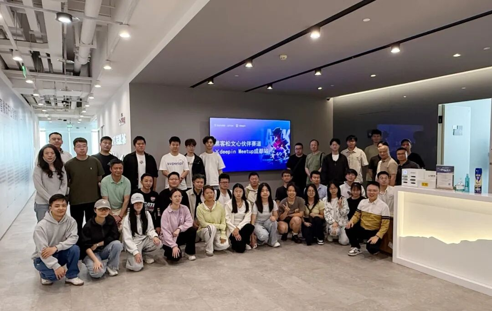
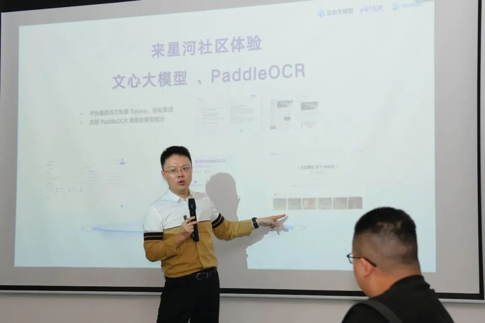
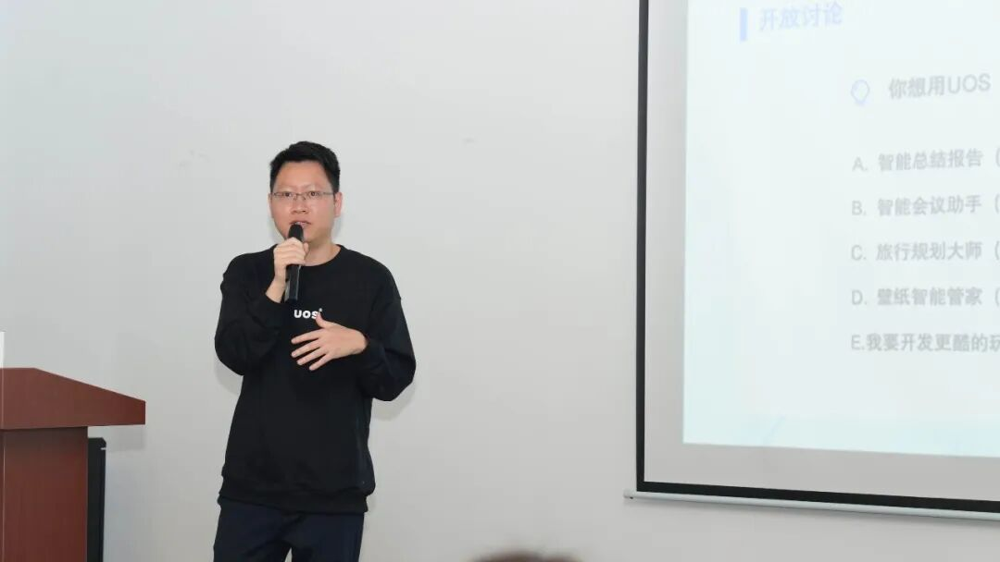
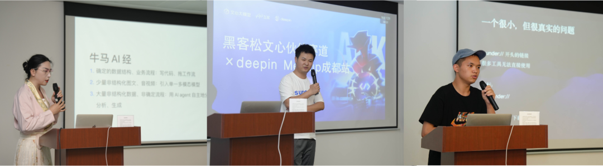
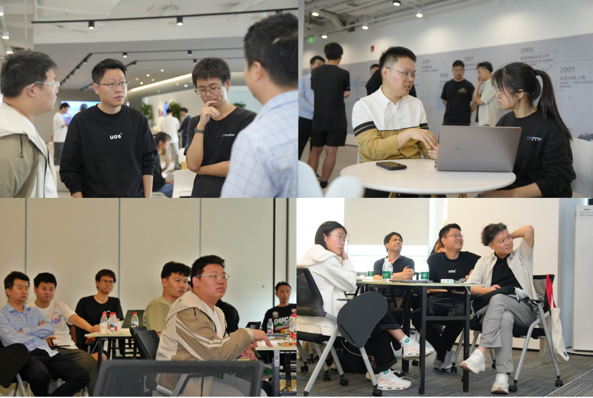

> 4月18日，成都IFS高楼之上，一场关于 AI 与国产开源操作系统的碰撞正在发生。

2026年4月18日下午，文心飞桨社区与统信 deepin 携手，在成都举办了一场线下 AI 开发者技术沙龙。来自高校、企业和开源社区的 40 余位开发者聚集于成都 IFS 二号楼 43 楼水调歌头会议室，共同探索「操作系统 + 大模型」的技术前沿。

这是 PFCC（飞桨框架贡献者俱乐部）首次与国产操作系统社区联合举办线下活动，也是飞桨黑客松第十期文心合作伙伴赛道向成都开发者社区的一次深度延伸。

<!-- more -->

<figure>

<figcaption>活动全体合影——40+ 开发者齐聚成都 IFS</figcaption>
</figure>

---

## 百度视角：AI 生态从"框架"到"工具链"

沙龙开场，文心飞桨社区**王师傅**率先登台，带来了一场关于「百度 AI 生态赋能」的深度分享。

王凯从飞桨深度学习框架的演进讲起，梳理了从底层训练框架到大模型产业工具链的完整路径——包括飞桨深度学习框架、文心大模型、PaddleOCR 等一系列产品。他结合自身经验，将"宏大的 AI 生态"翻译成开发者视角下的具体路径：**可上手、可实践、可创造**。

<figure>

<figcaption>王师傅介绍文心大模型与 PaddleOCR 产品体系</figcaption>
</figure>

---

## deepin 视角：操作系统的"智能化转型"

deepin 资深桌面研发工程师**卢桢**的分享将视线拉回到桌面端。

在《deepin AI OS 应用探索》环节，卢桢没有讲系统底层架构，而是聚焦于**用户行为与 AI 交互**的结合点：当 AI 能力真正融入全局系统，操作系统正在从"工具"悄然演变为"智能助手"。他对全局 AI 交互范式的思考，引发了现场开发者的强烈共鸣。

<figure>

<figcaption>deepin 工程师卢桢分享 AI OS 应用探索，现场互动踊跃</figcaption>
</figure>

---

## 飞桨黑客松深度解析：deepin 赛道通关手册

下午 15:30，活动进入核心环节——飞桨黑客松第十期文心合作伙伴赛道的「deepin 专属赛题讲解」。

deepin 专家上阵，从两个维度拆解赛题：

- **赛事机制**：大赛流程、激励机制（千元现金奖励）、提交要求
- **技术方向**：系统级 AI 交互的核心维度、底层接口调用到高层开发思路的具体建议

对于想参赛但不知道从哪里下手的开发者，这一环节提供了切实的"破题路径"，现场提问踊跃。

👉 黑客松报名入口：https://github.com/PaddlePaddle/Paddle/issues/78485

---

## 闪电演讲：三位开发者，三种成长路径

茶歇结束后，三位社区开发者带来了各具特色的闪电演讲：

<figure>

<figcaption>三位闪电演讲嘉宾同台，干货密集、高潮迭起</figcaption>
</figure>

**水歌**（idea2app 创始人、fCC 成都社区主理人）
《数据驱动的飞书 AI 应用实践》——以真实业务场景为背景，演示如何用 AI 搭建数据驱动的飞书工作流，引发大量"这个我能复用"的实战讨论。

**裴薪宇**（西南交通大学）
《我用 AI 开发了一个 500+ stars 的开源工具：从想法到落地》——以在校学生的视角展示 AI 如何全程赋能一个开源项目的从零到一，让不少开发者重新审视"一个人也能做成事"的可能性。

**程诗杰**（社区极客）
《从路人甲到社区之光的思考与行动》——讲述从一个普通社区参与者，成长为核心贡献者的心路历程，对刚刚踏入开源世界的新人极具感召力。

---

## 40+ 极客的惬意下午

茶歇与自由交流环节是这场活动能量最密集的时刻。

参会者向百度专家探讨黑客松参赛思路，与 deepin 团队畅想智能操作系统的未来，与演讲嘉宾深入延展技术话题。来自高校、创业团队和大厂的开发者们在这里相遇，话题从赛题跑到 AI Agent，从飞桨聊到国产 Linux 生态。

<figure>

<figcaption>茶歇交流时刻——开发者们热烈互动，意犹未尽</figcaption>
</figure>

成都特有的那种"轻松而不浅薄"的氛围，在这个高楼的下午被诠释得恰到好处。

---

## 写在最后

这次与统信 deepin 的联合活动，是文心飞桨社区在"AI × 国产操作系统"这一交叉地带的一次有益探索。

对于 PFCC 来说，它的意义不仅在于一场活动，更在于验证了一种可能：**当国产框架、国产大模型与国产操作系统相遇，开发者社区本身就是最好的"融合实验室"**。

期待下一站，在你所在的城市见面。

---

*感谢 deepin 社区、idea2app、fCC 成都社区、蜀鸿会对本次活动的支持。*
*飞桨黑客松第十期文心合作伙伴赛道仍在火热进行中，欢迎报名参赛！*
