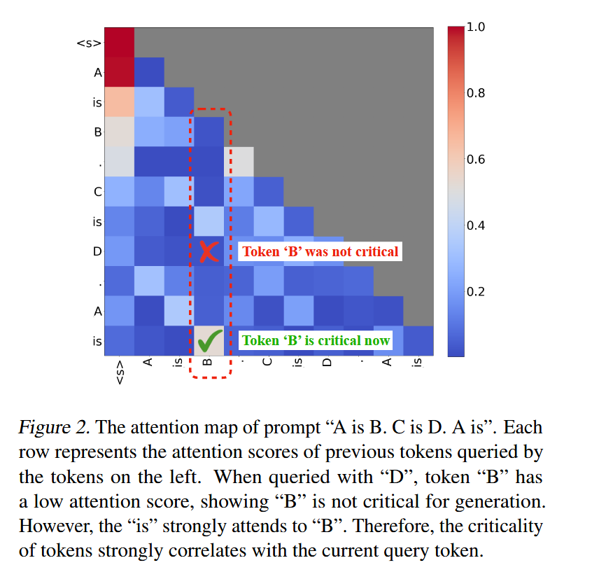
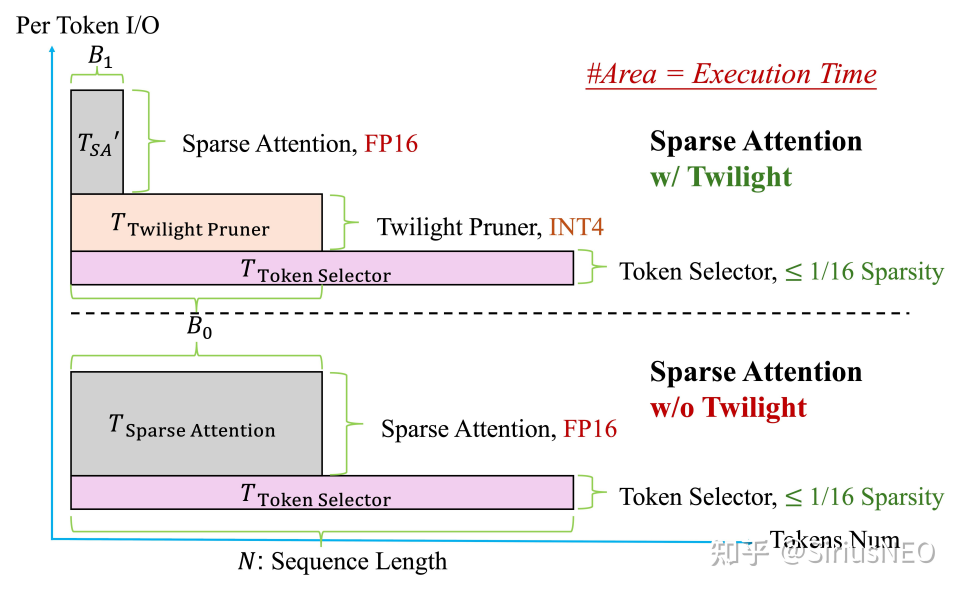

<!-- more -->

## 前言

随着深度学习模型，尤其是 Transformer 架构在自然语言处理、计算机视觉等领域的广泛应用，注意力机制成为了建模长距离依赖和捕捉全局信息的核心方法。然而，标准注意力机制在输入序列很长时会面临显著的计算和存储瓶颈。在 decoding 阶段中，这表现为 kvcache 长度的增加带来的存储开销增加以及进行 Attention kernel 的计算时带来的 load kv cache 与计算开销的增加。

在实践中，研究者们观察到注意力的分数具有较高的稀疏性，在注意力计算中，并非所有历史 token 都同等重要，一小部分关键的 token 会主导最终的注意力输出结果，因此可以只对关键 token 进行计算来加速注意力计算。目前在 decoding 阶段的使用注意力稀疏性的方法主要有两种思路：

1. kv cache 压缩（驱逐）技术：这类技术通过选择性地保留 kv cache 的方法来进行加速，其一般通过一些策略（如固定模式、计算注意力分数然后取 top k 个分数较高的 kv 对等）选择出需要保留的 k、v 条目，并丢弃掉不需要的条目。这种方法在加速 decoding 计算步骤的同时也可以节省一些 gpu 空间
2. 稀疏注意力技术：这种方法同样利用了注意力的稀疏性，在 decoding 阶段中通过仅选择部分 kv 条目进行计算的方法来进行注意力计算的加速，但与 kv cache 驱逐技术不同的是，它不会丢弃 kv cache 中保留的信息，而是完整保存 kv cache 并在计算时选择性进行 load kv cache。与上述方法相比， 该技术不能减少 kv cache 的存储开销。但是由于保留了完整的 kv cache 信息，可以避免当前被驱逐的 kv 对的信息被未来的计算用到这种情况发生，通常来说其准确率相比 kv cache 驱逐技术来说是更高的。

这两种思路都通过减少注意力计算阶段时 load kv cache 时 load 的数量的方法来减少 decoding 开销，区别在于是否驱逐当前不需要的 kv 条目，进行了一个 acc 与 kv cache 存储阶段的 trade-off，下文将重点介绍第二种方法。

## Quest: Query-Aware Sparsity for Efficient Long-Context LLM Inference

https://arxiv.org/abs/2406.10774

### 发现

论文在观察到注意力的稀疏性的同时进一步指出了这么一个关键现象：一个 token 的注意力分数是动态变化的，并且依赖于当前的 query 。换言之，对于不同的查询 token，其关注的上下文重点（即关键的 KV 缓存部分）是不同的。因此，简单地保留一组静态的或基于历史注意力得分的“重要”token 是不够优的。

此外，作者也发现在模型中不同层也会表现出不同的稀疏度。可以以此设计 layer-wise 的稀疏策略，在这篇文章中只对第二层以后的 layer 进行了稀疏处理。

### 方法

**阶段一：关键性评估 (Criticality Estimation)**

- 为了避免全量扫描庞大的 KV cache，Quest 以页为单位来管理 KV cache。对于每一个 KV 缓存页，它会预先计算并维护一个轻量级的元数据，该元数据包含了该页内所有 key 向量在每个维度上的最小值和最大值。这两个最值向量可以看作是该缓存页内所有 Key 信息的一个紧凑“摘要”。
- 当一个新的 query 到来时，Quest 并不会直接与页面内所有的 Key 进行计算。取而代之的是，它将查询向量与每个页面的最小和最大 Key 向量元数据进行元素级乘积等计算，以快速估算出该页面对于当前 query 的“关键性”得分。

**阶段二：稀疏注意力计算 (Sparse Self-Attention)**

- 根据第一阶段计算出的关键性得分，Quest 会筛选出得分最高的 Top-K 个 KV 缓存页。
- 随后，系统仅将这 Top-K 个页面的 KV 数据从内存中加载到计算单元，并与查询向量执行标准的自注意力计算。由于只处理了整个 KV 缓存的一个小子集，内存传输和计算的开销都得到了显著降低。

### 实验结果

#### Longbench 评估得分

#### 注意力计算阶段加速(vs flashinfer)

#### 端到端加速(vs flashinfer，time per out token)

## Twilight: Adaptive Attention Sparsity with Hierarchical Top-p Pruning

https://arxiv.org/abs/2502.02770

### 发现

注意力稀疏度是动态变化的,对不同的输入序列，在模型的不同层上，注意力分数的分布模式和稀疏程度都不同。使用 top-k 策略选取 k v 对时，由于固定的 k 的取值，设置的 k 值如果较小，会让保留的上下文信息不足，导致准确率损失。而过大的 k 值会提高内存访问和计算的开销。而这个问题可以使用大模型采样阶段所使用的 top-p 采样来解决。

### 方法

1. **第一步：粗选（Token Selector）**：首先，利用一个已有的基于 top-k 的基础稀疏注意力算法，并为其设定一个相对宽松、保守的预算，来初步筛选出一个可能包含所有重要 token 的较大候选集。进行这一步是由于 top-k 策略只关心数值的大小，对精度的要求没有 top-p 高，可以使用更为激进的量化策略。

2. **第二步：精筛（Twilight Pruner）**：接着，Twilight Pruner 对这个候选子集进行二次剪枝。它会计算候选集内 token 的注意力分数，并应用 top-p 筛选方法 来进行筛选，这里维护了一个额外的 int4 量化后的 key cache。只保留那些累积概率和达到预设 p 值的最核心的 token。

在这一步中，作者实现了一个较传统 top-p 算法并行度更高的 top-p 选择策略。不同于传统的排序按降序对元素进行排序，并将其累加，直到总和达到阈值的选择方法，这篇文章中，作者把问题转变为求解一个概率阈值 l，满足所有大于 l 的元素之和与 p 值误差小于误差阈值的问题，并设计了一个二分查找的思路，以便于并行计算。

3. **第三步：执行稀疏注意力计算**：最后，将经过 top-p 精筛后的 token 索引传递给稀疏注意力计算核心（Sparse Attention Kernel），执行最终的注意力计算。

### 实验

#### longbench 得分

#### ruler 得分

#### 注意力计算阶段加速

#### 端到端加速(tpot)

## vAttention: Verified Sparse Attention

https://arxiv.org/abs/2510.05688

### 发现

研究者观察到一个关键现象：top-k 和随机采样这两种主流方法具有天然的互补性。

- 当注意力分数分布主要由少数几个关键的 token 主导时，Top-k 方法表现出色。
- 当注意力分数分布各个 token 的重要性相对均匀时，随机采样则能提供更准确的估计。

### 方法

1. **识别重要 token（确定性部分）**：首先，通过确定性策略选出一批被认为是注意力分数中比较重要的 token。这部分可以整合任何现成的近似 top-k 方法来实现，其索引集合 I_f 包括：
   - **Attention Sinks** (I_s)：一些固定位置的索引，通常是序列的开头。
   - **局部窗口索引** (I_l)：当前查询位置附近的 token。
   - **预测的 Top-k** (I_t)：通过近似算法（如 HashAttention）预测出的最相关的 token。

2. **近似长尾 （随机性部分）**：在移除了重要 token 之后，剩余的 token 构成了 “长尾” 部分。vAttention 不会完全忽略它们，而是从这些剩余的索引中进行均匀随机采样，形成动态索引集 I_dyn。
3. **自适应采样与保证**：在进行随机采样的时候，根据用户设定的 (ε, δ) 来动态调整采样的大小，以确保对分子（value 向量的加权和）和分母（归一化因子）的估计都满足精度要求，从而为最终的注意力输出提供可靠的误差界限。
