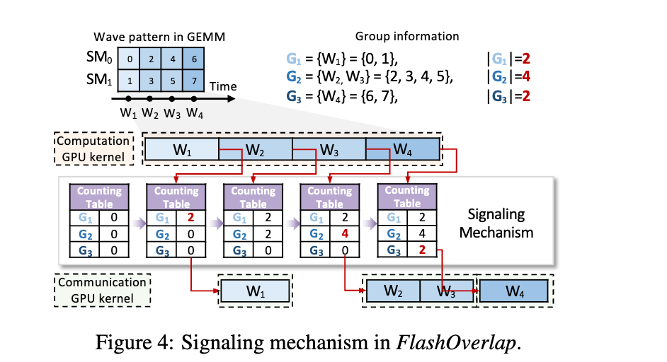
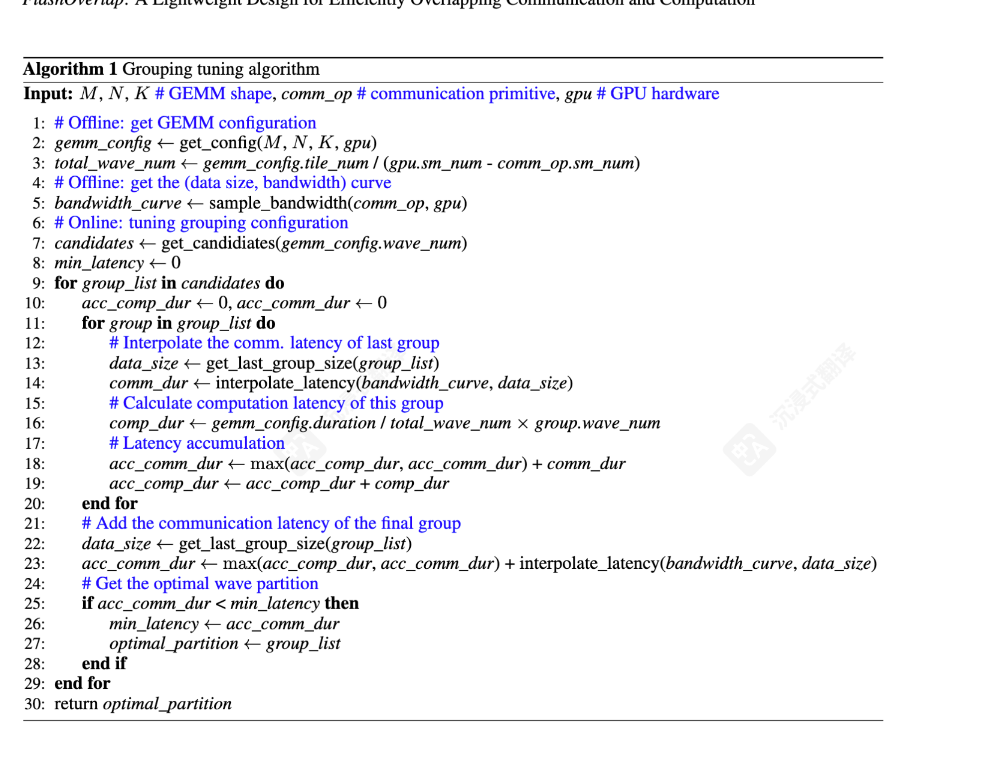

FlashOverlap 所关注和聚焦的具体重叠场景是：一个计算操作后面跟着一个和计算结果存在依赖的通信操作（Overlapping Communication and Dependent Computation）

> 通信是并行的代价

<!-- more -->

---

- [开源仓库地址](https://github.com/infinigence/FlashOverlap)
- [技术报告](https://arxiv.org/abs/2504.19519)
- 读论文前可以先看作者中文讲解的[博客](https://zhuanlan.zhihu.com/p/1897633068380054002)，好理解一些，然后再看论文

---

## 如何重叠？

目前主流相关工作分为了两大类

**一、基于张量分解的方法**

1. 思路：将依赖的计算和通信分为多个子操作，将子操作流水化执行

   - 例如：矩阵乘法产生张量 T
      - 分解为 N 个子矩阵相乘，得到 N 个子张量 T₁ ~ Tₙ，将一次对 T 的通信分解为对 N 个子张量的 N 次子通信
      - 然后第 K 个矩阵乘法和第 K-1 个通信操作进行 Overlap

2. 限制与问题：切分存在要求。切分的子张量必须显存连续，才能直接调用 NCCL
   - 导致：
      1. 为了保证切分出来的乘法结果的连续性，切分维度受限，难以支持 Tile-wise 的重叠
      2. 切分对计算性能有害，小矩阵乘法无法打满 GPU，导致子矩阵的计算耗时大于原先的矩阵乘法

**二、基于算子融合的方法**

1. 思路：

   - 将计算和通信融合为一个算子，挖掘 tile 之间的依赖
   - 在 kernel 内部实现细粒度的通信和计算 overlap

2. 限制与问题：
   - 算子融合导致官方的高度优化的矩阵乘法、通信算子被打乱，对原有矩阵乘法和通信算子侵入过大，需要非常细致的优化和调整
   - 导致开发难度大，耦合带来的复杂度高
   - 针对不同的通信原语还要专门进行不同的开发和调优

一个高效且适应性强的重叠设计方案，应该满足：

1. 支持 tile-wise 的重叠，以最大化重叠效果；
2. 尽量少侵入计算部分，对计算无干扰，最小化对计算部分的伤害，保持原始的计算性能；
3. 尽量对不同的通信原语和基于拓扑的优化技术正交，以最小化对通信部分的伤害，最小化不同通信原语的适配成本（人话：通信无关，减少针对不同通信原语的开发负担）

| 方法/特性          | Tile-wise 调度 | 计算侵入性 | 通信正交性 |
| ------------------ | :------------: | :--------: | :--------: |
| 基于张量分解的方法 |       ❌       |     ❌     |     ✅     |
| 基于算子融合的方法 |       ✅       |     ❌     |     ❌     |
| 基于信号的方法     |       ✅       |     ✅     |     ✅     |

## 新思路：基于信号的计算通信重叠方法

核心 idea：**如果计算 Kernel 能够在完成一部分计算结果之后自动发出一个就绪的信号，然后接收到该信号之后我们发起一次针对就绪部分数据的 NCCL 的通信**

### 一、基于信号的 overlap 实现机制

两个 Stream，一个 Stream 里是计算，另一个 Stream 里是通信。

- 在计算 Kernel 里轻量的加入一些 Flag 变量，当 _“部分计算结果”_ 算完之后，将其对应的 Flag 置为 True。
- 与此同时，另外一个 Stream 里首先插入一个用于等待阻塞的 Kernel（几乎不占用计算资源），当该 Kernel 读到 Flag 置为 True 之后会退出，然后紧跟其后的通信算子被调用。

一个实际的 Timeline：

上图中计算流为轻量化加入 Flag 信号的 cutlass kernel，通信流中被打碎的通信部分，每一个 NCCL 通信之前有一个阻塞 Kernel 等待数据就绪。

### 二、“部分计算结果”如何界定

1. 首先最直观和简单的设计是，每个 Tile 算完，我们就把结果发出来

- Tile 的定义：矩阵乘法和其他重要计算在 CUDA 实现中的一个基本并行单元，矩阵 C 被分为了多个 Tile。
  

- 但每次发一个 Tile，小数据，性能不友好，通信带宽利用率低，调度和优化空间有限。

2. 所以，积攒多个 Tile 一起

- 一起发就要求数据连续，Tile（block）执行顺序和完成顺序以及物理内存上的连续性无法保持一致。
- 比如：上图绿色的四个块，如果被选中为一组，就需要改成连续存储，才能通信。

3. 为了保证正确性，引入了 MapTable

- 记录 Tile 应该存储的位置和步骤二引起的实际存储位置的映射关系。
- 模型的计算和通信后往往有 逐元素算子，将 map table 的逻辑融入到了逐元素算子中。
- map table 需要提前获取。

4. 如何选取 tile 组

- GPU 执行模型：N 个 block 的 kernel 发射到 GPU 上，GPU 会根据 kernel 编译期信息知道一个 block 占用的 SM 资源，从而知道一个 SM 可以并行执行的 block 个数。同时发射到 GPU 上的 block，在时间序列上呈现**wave 现象**，下图左 4 个 wave，图右两个 wave，实际上不会完全如此整齐划一的对齐，但相差不会太大。
  

- 矩阵乘法也存在这种 wave 现象：每一个 wave 中包含的 tile 和 swizzling 算法相关。
  
- 针对一个矩阵乘法进行观察结果如下图，横坐标是 block id，纵坐标是 block 完成时间：可以发现一个 wave 里的 block 的完成时间基本差不多，给选取 tile 组提供了事实依据。

   - 选取同一个 Wave 的 Tile 作为一个组是一个非常不错的选择。这是由于同一个 Wave 内的 Tile 基本能整整齐齐的结束，很显然选择他们作为一个 Group，一起发一次通信效果会更好。
   - 事实上是：当给定一个矩阵乘法和 GPU 之后，**很容易提前得出 Block 的发射顺序从而获得 Wave 信息**
     

      - 根据 gemm 的参数（tile 大小，swizzling 模式）提前生成 map table，记录 tile 到 wave 的关系（也就是提前知道了某个 tile 属于哪一个 wave）

      - 上图是 RTX4090 上观察 wave 现象的结果图，C 矩阵有 512 个 tile，SM 数量 128 -> 512 / 128 = 4 个 wave
         - 还观察到，tile 的完成顺序和内存地址是不对齐的（意思就是不是连续地址）

5. 选一个 wave 作为 tile group 是不是最优选择

- 否，存在调优空间

   - 一方面：希望一次通信数据要多，这样通信效率高，一个 group 尽量包含可能多的 tile；
   - 另一方面：希望切分的要碎，算完就传，通信启动的越早越好，这样一个 group 尽量包含少的 tile。

- 存在 trade-off -> 调优出现了，通过调优选择合适的 tile group，**具体调优过程提出了一个搜寻算法**。

### 基于信号的计算通信 overlap 方案图

基于分解的 overlap 是 gemm 完成后通信，然后进行下一个分块的 gemm 再通信；基于融合的则是在 kernel 内部细粒度的调度计算和通信的执行。 这两种都要修改原生的 gemm 计算过程

本文方案：不改原生 gemm 计算流水、只轻量地添加一个 signal，另一个 stream 等 signal，等到了就启动通信

- 黄色：矩阵乘法；浅绿色：通信
- 示例包含 6 个 tile，分为了 3 个 group
   - group1：tile0 tile5
   - group2：tile2 tile4
   - group3：tile1 tile3
- 每个 group 计算结束，就发起一次 NCCL 通信，同时将 map table 传到后面的逐元素算子，回复对重映射的影响
  

## “设计空间”

### tile -> wave -> wave group 如何确定每个 group 的大小？

波组内波的个数如何界定的方式

- 引入了一个 tile 计数表 来 track 矩阵的计算过程，按 group 记录完成的 tile
- 计数表长为 P，表示 tile 被分进了 P 个 Group G_1 ... G_P
- 当 G_i 中的 tile 完成，则 G_i 表项+1，如果这个值达到|G_i|这个设定值，那么通信开启，Flashoverlap 通过 tile 索引判定属于哪个 group

Flashoverlap 不在 tile 触发通信，也不在 wave 触发通信，而是在完成了几个 wave（wave group）时触发通信
为了保证连续性，在通信前会 reorder 将数据写入连续地址，通信后会 reorder 复原
wave group 的大小选择 -> 组成了一个**设计空间**，论文提出了一种基于预测模型的预测搜索

### 调优必要性

把一次一个 wave 作为 group 通信作为 baseline 进行观察，这种方案是最细粒度的 overlap，发现无法提供最佳性能

- 4090 上测了 50 个形状的 gemm，只有 4% 基线是最优，平均有 17% 的性能下降
- 原因：分段的通信带宽利用率低，频繁调用通信 api 开销大

所以，不同的 wave 分区对整体 overlap 的**性能有很大影响，需要调优**

### 直接调优开销巨大

M=4096，N=8192，K=7168 -> 1024 个 tile（256\*128）

4090 有 128 个 SM，1024/128=8 个 wave -> T=8

所以有 2^{8-1}=128 中 wave group 的分区方案，在线执行并 profile 的时间超过一分钟，端到端系统不可接受

### 实时调优方法

提出了一种预测搜索方法，去解决 wave 该如何 partition，将设计空间从 2^{T-1} -> O(2^{T-2})，通过一种延迟预测器替代的线上 profile

- 所谓 2^T-1 的意思就是，如果我们有 T 个波，那么我们将有这么多种分 group 的方案，对每中方案都做 online profile 代价太大，端到端不可接受
- 通过这两个方法能够实时的生成 wave 的 partition

方法：
通过先验知识，进行缩减

- 考虑一个该方案的正常时间线，重叠的计算和通信部分，占据了中间的大部分时间线，因此头尾两个单独的非重叠部分对整个时间线有着比较大的影响，所以最后一个和第一个 group 不能过大，避免冷启动和长尾问题，从而缩减了设计空间的大小

将 online profile 替换成一个预测延迟的 cost model

### 最终算法

#### 离线阶段

- 根据 GPU 信息、矩阵信息，得到 wave 个数
- 根据通信类型，通信数据大小，得到通信曲线

注意资源的竞争，用于 gemm 的 sm 个数是减去掉 nccl 占用的 sm 个数的

#### 在线阶段

1. 根据 wave 个数，产生一种 wave partition 的候选 （2^(T-1)中的一种）
2. 预测性搜索最优的 group partition 方式

## 实现

gemm

- 通过 cutlass 的 gemm 实现了
- 保留了计算主循环
- tile 顺序的 re map 过程融入到了 gemm 的 epilogue 中，避免主循环性能下降（轻量）

信号机制

- 使用 cuda kernel 实现，定期查计数表

通信

- NCCL api

计算 + 通信

- 通过 cuda stream 管理

## 效果与性能

FlashOverlap 提供了 69‑98% 的理论性能，并通过计算 ‑ 通信重叠实现了高达 1.65× 的加速。

图 10：在大多数情况下，FlashOverlap 实现了超过 80% 的理论加速比。由于（ 1 ）分段通信导致带宽利用率低下和（ 2 ） SM 竞争导致的计算延迟延长，该比率低于 1

图 11:

- 平均误差比分别为 3.41% 和 3.44%
- 比较了搜索分区和最优分区之间的性能。基于高精度的预测器，搜索分区实现了最优分区的 > 99% 性能

## 核心观点和 Feature

- 如果计算 Kernel 能够在完成一部分计算结果之后自动发出一个就绪的信号，然后接收到该信号之后我们发起一次针对就绪部分数据的 NCCL 的通信。
- 分解的 overlap 方式存在难以支持 tile-wise 重叠、对计算效率有害的问题，融合的 overlap 方式存在开发难度大，侵入强的问题。
- 一个高效且适应性强的重叠设计方案，应该满足三点：
   1. 支持 tile-wise 的重叠，以最大化重叠效果；
   2. 少侵入计算部分，对计算无干扰，最小化对计算部分的伤害，保持原始的计算性能；
   3. 通信无关化，以减少针对不同通信原语的开发负担（通信无关的设计使得 FlashOverlap 能够通过标准 API 调用直接利用 NCCL 的通信，甚至也可以调用 mscclang 和 deepep）

## 可能有什么优化方向、有哪些优化的可能

目前刚开始读这方面的论文，积累不足，主要起到一个抛砖引玉的作用，大家多多讨论，跟大家多学习

- 通信无关性这点，应该也可以结合 nvshmem 进行通信，可能在某些场景比 NCCL 更好一点
