<!-- more -->

# FLUX: Fast Software-based Communication Overlap On GPUs Through Kernel Fusion

FLUX: Fast Software-based Communication Overlap On GPUs Through Kernel Fusion

- [https://arxiv.org/pdf/2406.06858](https://arxiv.org/pdf/2406.06858)
- [https://github.com/bytedance/flux](https://github.com/bytedance/flux)

## 一、背景

### **(1) AllReduce 算子实现**

AllReduce 是集合通信中常见的分布式计算操作，用于多个设备（比如多个 GPU）之间聚合数据的场景，可以包含 Sum、Min、Max 等操作。对于常见的基于 Ring 的 AllReduce 实现中，通常可以把 AllReduce 操作看成为一个 ReduceScatter 和一个 AllGather 操作，如下图所示：具体的 ReduceScatter 操作如下，每个设备（GPU）发送一部分数据给下一个设备，同时接收上一个设备的数据并累加。这个过程进行 K-1 步（假设有 K 个设备），ReduceScatter 后每个设备都包含一部分数据的 Sum：

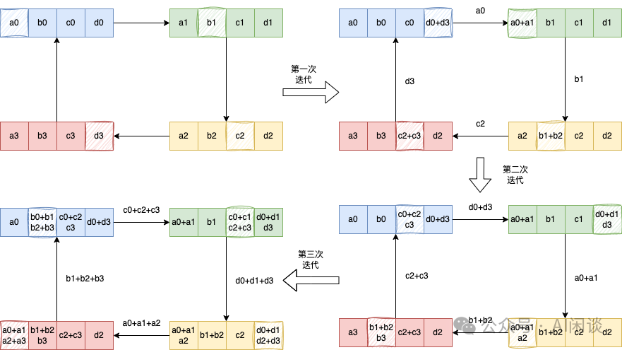

具体的 AllGather 操作如下，每个设备将其持有的部分结果发送给下一个设备，同时接收上一个设备的部分结果，逐步汇集完整的结果，同样需要 K-1 步。AllGather 后，每个设备都包含全量的数据：

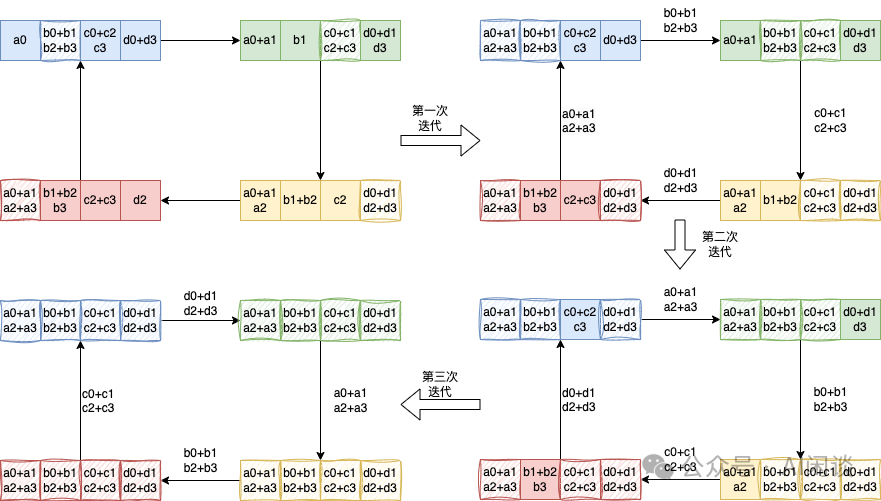

### **(2) ReduceScatter 算子实现**

如下图所示为 Ring ReduceScatter 的优化，可以等效为一个 All2All 操作实现数据的重排，然后在 Local 进行 Reduce 操作。此过程只有一个 All2All 的整体通信操作，虽然实际上与 Ring 实现的方式的通信量和计算量没有变化，但可以避免 K-1 个 Ring Step 的同步，进而可以有效降低时延。

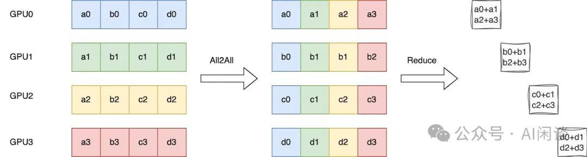

### **(3) 通信具有较高占比**

相比于流水线并行提高吞吐量，张量并行可以缩短延迟，这对于推理至关重要。由于张量并行将层划分到多个设备上，可能需要跨设备进行额外的数据通信，以便收集或重新分配正确的数据，特别是当连续的层采用不同的划分策略或跨分区消耗数据时。下图显示了在训练和推理中应用张量并行时，通信时间在总体运行时间中占据的显著部分，表明了减少通信时间暴露的动机和强烈需求。

- 可以看出，在 PCIe 设备中通信占比很高；而 H800 NVL 相比 A100 NVL 的算力提升更多，通信带宽提升较少，也就导致通信占比更高。在 PCIe 设备中 TP 通信占比甚至达到 40%-60%。

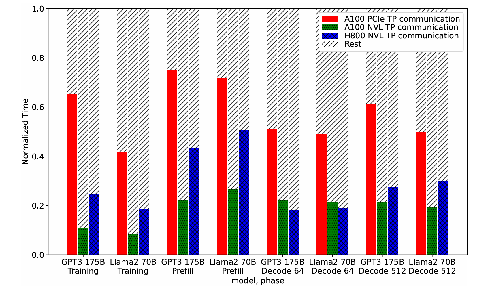

图 2 展示了 MLP 示例在前向传播中的常见通信分区模式。第一个 GEMM 操作沿行方向分片权重（W1），并在 GEMM 之前沿列方向全收集（AllGather）分片的输入激活；第二个 GEMM 操作沿列方向分片权重（W2），并沿列方向归约分散（ReduceScatter）输出激活。在反向传播中，AllGather 和 ReduceScatter 操作顺序互换。图中显示，这两个 GEMM 操作的维度取决于张量并行的程度（N）。

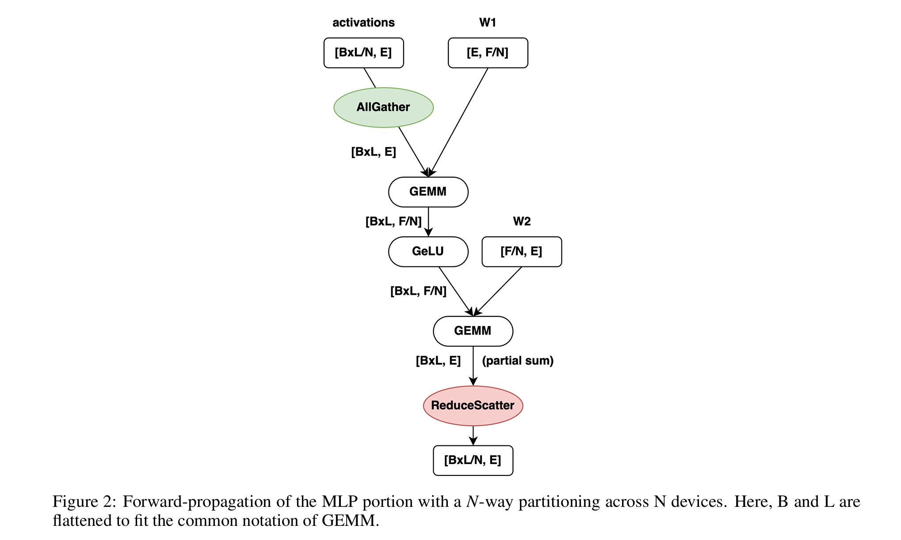

## 二、Motivation

### (1) 传统通信重叠策略

传统方法将原始计算和通信操作分解为多个块，然后通过精心调度操作来潜在地重叠通信与计算。**分解中的分区数量与张量并行中的设备数量一致**（或是其两倍，以更好地利用双向数据传输）。限制分区数量可以避免复杂的调度并减少可能的调度开销。图 3 展示了一个 ReduceScatter 重叠的场景。理想情况下，通信可以完全被 GEMM 计算隐藏。

这些方法在 TPU 上可能效果很好，但在 GPU 上效果不佳。原因在于：

- **涉及许多流和事件的 GPU 环境难以控制：**这些方法的性能严重依赖于独立分区的执行顺序、并发执行和执行时机。虽然可以通过流和事件实现 GPU 内核之间的执行顺序和并发执行，但大多数 GPU 编程模型无法轻松控制执行时机。单个操作的时间变化可能稳定可控，但在涉及许多流和事件的实际生产环境中通常变得不可预测
- **切分来做 overlap 带来了额外的同步**：ReduceScatter 重叠通常需要在 GEMM 操作之间执行额外的计算操作（如图 3 中的加法操作），这会产生数据依赖，阻止通过 GPU 多路复用并发执行多个 GEMM 内核。虽然可以进一步将加法操作与通信融合，但仍阻止多个 GEMM 内核的并发执行。
- **切分来做 overlap 导致无法打满 GPU**：将一个大型 GEMM 内核拆分为多个小型 GEMM 内核，即使分区数量与设备数量相同，也很可能导致 GPU 流处理器（SMs）未被充分利用，特别是在张量并行扩展时。

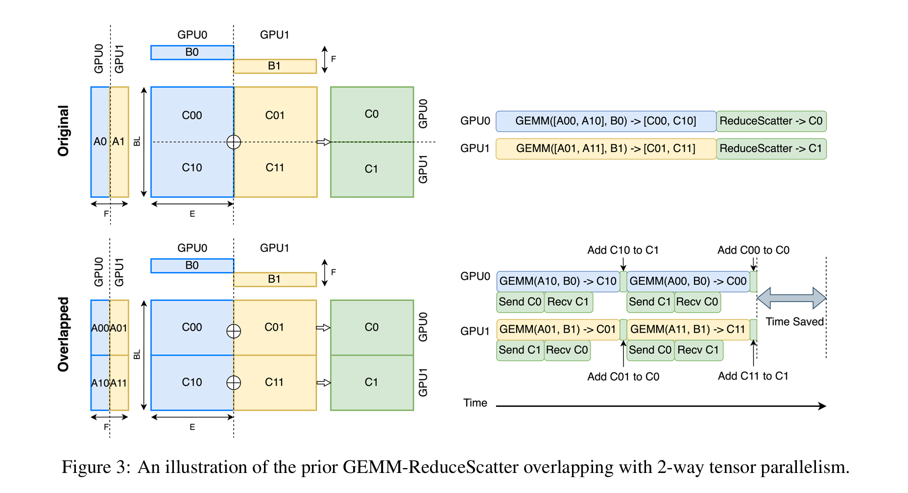

### (2) 对比指标：

衡量通信重叠方法的性能并不简单。重叠方法通常将通信与计算混合，使得直接测量重叠时间变得困难。此外，将一个 GEMM 内核拆分为多个小内核会增加计算时间，但更长的计算时间可能提供更多机会来重叠通信，最终可能不会缩短总时间。

总体时间是一个公平的性能指标，但不同方法可能使用不同的 GEMM 算法和实现，影响总时间。作者提出了有效通信时间（ECT），以公平比较不同方法并突出通信时间。有效通信时间定义为总时间减去最佳非拆分 GEMM 计算时间：

为了最小化 GEMM 内核的影响，作者在所有评估中使用作者所知最快的 GEMM 内核。由于在不同方法中使用相同的最快 GEMM 内核，给定问题的形状，使得 GEMM_non-split 在不同方法中相同，有效通信时间只是总时间的一个偏移，但更突出通信。在有效通信时间的基础上，作者进一步定义了重叠效率（E_overlap）：

## 三、Flux 设计

相较于传统方法在 GPU 上更具优势。不同于现有方法将计算和通信划分为设备数量或其两倍，Flux 将计算和通信过度分解为多个小块。由于计算操作是 GEMM，而大多数高性能 GEMM 内核在 GPU 上使用如线程块或 warp 的 tiling 技术，作者的分解可以自然地映射到现有内核的 tiling 中。

Flux 将相关的通信和/或等待逻辑融合到一个 GEMM 内核中，只启动一个融合内核，而不是像之前的方法那样启动多个拆分的 GEMM 内核。考虑到 Flux 比之前的方法粒度更细，本文将之前的方法称为中等粒度分解，而将提出的方法称为细粒度分解。

### (1) GEMM 步骤分解：

- Prologue（前奏）：做准备工作，比如加载常量、分配寄存器、设置指针等。
- Mainloop（主循环）：进行核心的分块矩阵乘法（tile-based multiply-accumulate），不断把 A、B 的 tile 搬到寄存器/共享内存，做乘加，累加到 accumulator（acc）。
- Epilogue（尾声）：  把累加器（acc）里的结果做最后处理（如加 bias、激活、量化、归一化、通信等），并写回输出矩阵 C

### (2) ReduceScatter 重叠：

ReduceScatter 被实现为 GEMM 内核的尾部融合。具体来说，ReduceScatter 通信被融合到 GEMM 内核的尾部。算法 1 展示了融合了 ReduceScatter（或 AlltoAll）的 GEMM 伪代码，用于计算 C = A x B，其中 A 和 B 是两个输入矩阵，C_s 是张量并行中所有设备上的输出矩阵指针集合。

与标准 GEMM 内核只有一个输出指针不同，融合 GEMM 内核中的输出指针数量增加到张量并行中的设备数量 NTP，这些指针可以通过对应 PyTorch 操作的初始化阶段的进程间通信收集。

- TileCoord：根据线程块 id 和 rank_id，决定当前线程块负责输出矩阵 C 的哪一块（tile）
- GetOutput：在多卡并行时，输出 C 不再是单一指针，而是一个指针数组（每个卡一个），根据 tile 位置和 rank_id 选出本 tile 的目标输出
- Reduce/Write：

  - 如果是 ReduceScatter，先做 AlltoAll 通信再本地 Reduce（Reduce 分支）。
  - 如果只是 AlltoAll，直接 Write（Write 分支）。

把 ReduceScatter/AlltoAll 通信融合进 GEMM 的 epilogue，即 GEMM 每算完一块 tile，就立刻发起通信，而不是等整个 GEMM 结束，主循环继续算下一个 tile。ReduceScatter 操作可以进一步分解为 AlltoAll 操作和一个归约操作。因此，将 AlltoAll（写入分支）融合到 GEMM 尾部通常足以重叠通信，而归约融合（归约分支）仅提供边际性能提升。

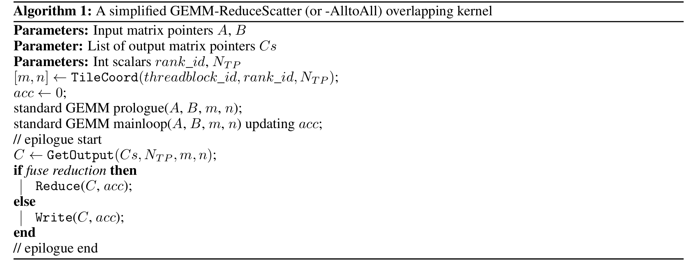

### (3) AllGather 重叠：

与 ReduceScatter 不同，AllGather 被实现为 GEMM 内核的前置融合。具体来说，AllGather 信号检查被融合到 GEMM 内核的前置部分。算法 2 展示了融合了 AllGather 的 GEMM 伪代码，用于计算 C = A_agg x B，其中 A_agg 是通过 AllGather 聚合的输入矩阵缓冲区， B 是另一个输入矩阵，C 是输出矩阵。算法 3 展示了对应的主机端通信。

在 kernel 端，GEMM 的 tile 计算被函数 WaitSignal 阻塞，直到信号中的值被设置为 true。信号通过 GetSignal 从信号集合（signal_list）中选择，基于输出坐标 m 和 n 以及张量并行中的设备数量 NTP。每次通信的信号只有在输入张量的对应部分（通信 tile）准备好时，才在主机端被设置为 true，意味着该部分已在运行融合内核的设备上接收。

- TileCoord：确定当前线程块负责的输出 tile。
- GetSignal：为每个 tile 关联一个信号（signal），信号表 signal_list 由 host 维护。
- WaitSignal(signal)：GEMM kernel 在计算本 tile 前，先等待对应的信号变为 true（即数据已到位）。
- standard GEMM：信号满足后，正常做 GEMM 计算。

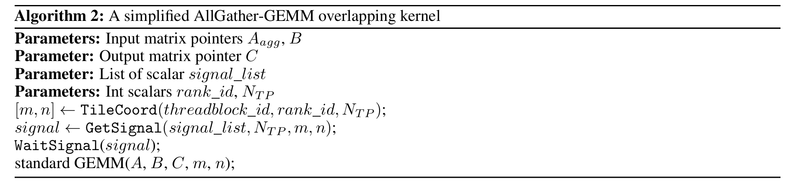

host 端（无论是拉取还是推送）执行 tile 通信操作（DataTransfer）并异步设置相应的信号（SetSignal）为 true。基于 pull 的方法通过 GetRemotePtr 函数和 GetLocalPtr 函数从远程设备 pulling tiles，从 tiles A 矩阵列表（A_list）和聚合矩阵缓冲区列表（Aagg_list）中选择正确的指针，然后设置本地信号，信号由 GetSignalHost 依据通信分块索引从信号集合（signal_list）中选取。另一方面，push 方法通过将 tiles 推送到远程设备然后设置远程信号。注意，拉取版本中的 signal_list 仅包含本地信号，而推送版本中的 signal_list 包含远程设备的信号。这两种变体的选择被视为一个调优选项

- tilescomm：通信的 tile 列表（可以和 GEMM tile 不同步）。
- DataTransfer：通过网络/PCIe/NVLink 等把数据从远端拉到本地（pull）或从本地推到远端（push）。
- SetSignal(signal)：数据传输完成后，设置对应信号为 true，通知 device 侧 kernel 可以继续。

本质上：host 侧异步分 tile 通信，device 侧 kernel 只等信号，数据 ready 就算，通信和计算流水线重叠。

在 AllGather 方法中，作者将通信的等待逻辑融合到 GEMM Kernel 中，而非整个通信操作。因此，AllGather 并不必然依赖 P2P 通信。同时，在 AllGather 中，通信的分块策略（tilescomm）与 GEMM 计算的分块策略相互解耦。这一设计提供了一种灵活的权衡方式，能够在不损害 GEMM 效率的前提下，选择 Overlap 机会与通信效率之间的最佳平衡。

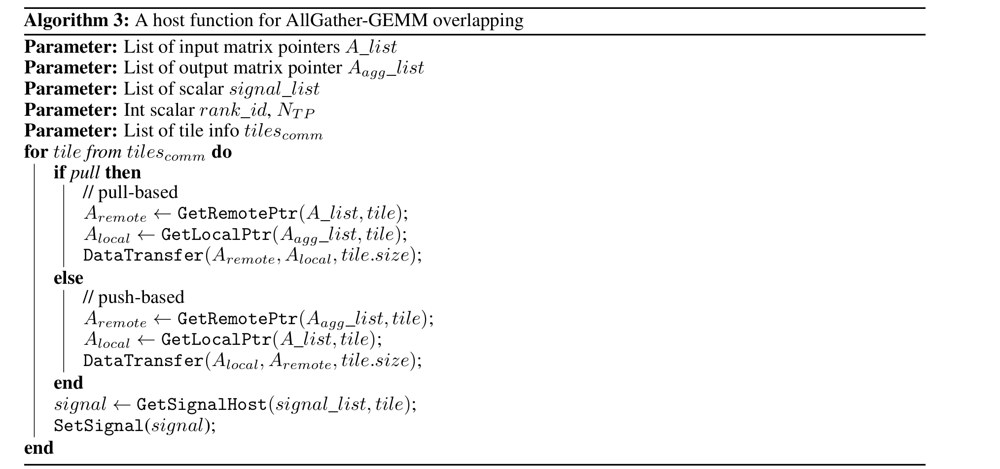

### (4) 不同重叠技术的主要差异

ReduceScatter 中：

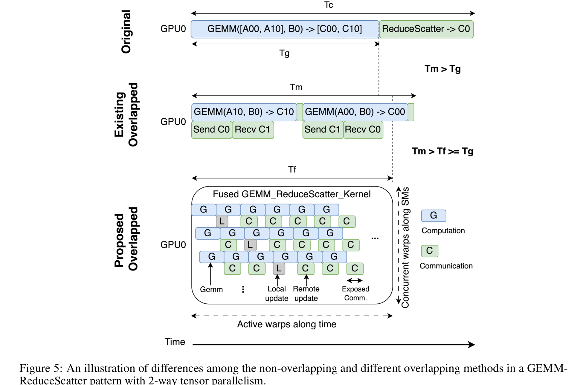

然现有的重叠方法 T_m 可能比原始的粗粒度方法 T_c 更快，但通常仍然比原始 GEMM 时间 T_g 慢。主要原因是将一个 GEMM 内核分解为多个较小的 GEMM 内核会降低 GPU 的 GEMM 效率。GEMM 通常需要足够大的矩阵以充分利用 GPU 的计算能力。数据依赖性使得这些较小的 GEMM 操作无法通过 GPU 多路复用并发运行，因而张量并行度越高，GEMM 效率越低

Flux 的 T_f 可以以几乎与原始 GEMM 操作 T_g 相同的速度执行，且开销很小。其细粒度的分解策略与现代 GPU 设计的特性完美契合，能够在上下文切换 warp 和 SMs 中数百个并发活跃 warp 之间隐藏延迟，如底部放大的视图所示。最终，作者的方法仅在执行的尾部暴露出少量通信，而不影响 GEMM 计算效率。

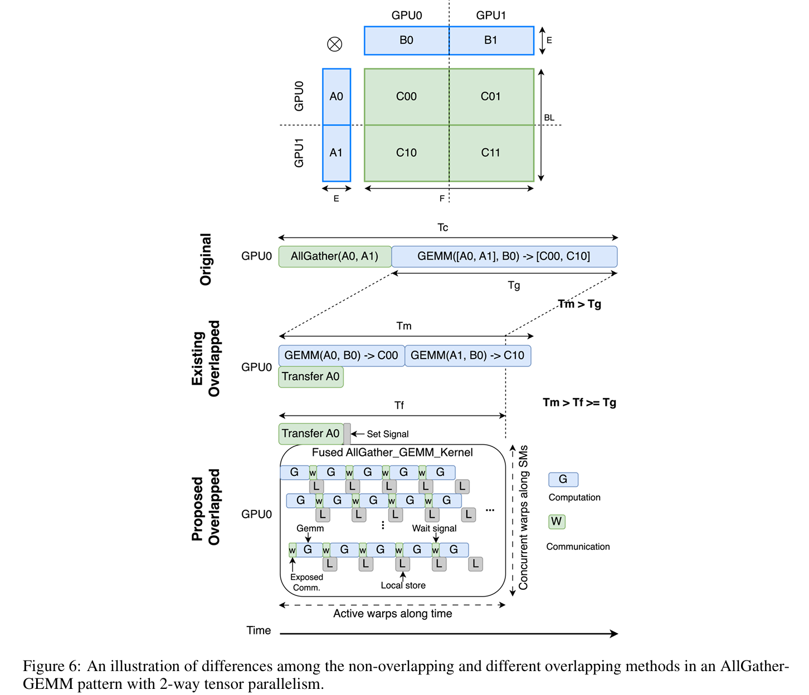

AllGather 中不同重叠技术的主要差异。同样，现有的重叠方法 T_m 可能比原始的粗粒度方法 T_c 更快，但由于 GPU GEMM 效率较低，仍然比原始 GEMM 时间 T_g 慢。AllGather 中的长延迟指令来自等待信号，这发生在每个 warp 的开始，因为 WaitSignal 被融合在前置部分。其延迟取决于对应数据传输的到达时间。对于数据已经到达的 tile，延迟接近于零。对于数据未准备好的 tile，warp 之间的上下文切换可以隐藏延迟。值得一提的是，本地 tile 的信号总是预设为 true，因此总有一些 warp 不需要等待信号。最终，作者的方法仅在执行的头部暴露出少量通信，而不影响 GEMM 计算效率。

## 四、优化和实现细节

### (1) tile 坐标的 swizzling

高效的 GPU 内核依赖于 tiling 来利用并行性和局部性。因此，内核具有从线程块索引到 tile 坐标的映射逻辑，如算法 1 和 2 中的 TileCoord。受优化良好的 GEMM 中用于最大化内存效率的映射逻辑启发，Flux 探索了 tile 坐标的 swizzling，以进一步提高融合内核的效率。Swizzling 在这里指的是对 tile（块）分配到线程块/设备的顺序做有意识的“打乱”或“偏移”，而不是简单的线性分配。

- 在融合的 GEMM-ReduceScatter 中，tile 坐标与设备 rank 索引一起偏移，以避免不同设备上运行的内核产生写请求冲突，从而最大限度地减少每个设备上内存控制器的可能争用。

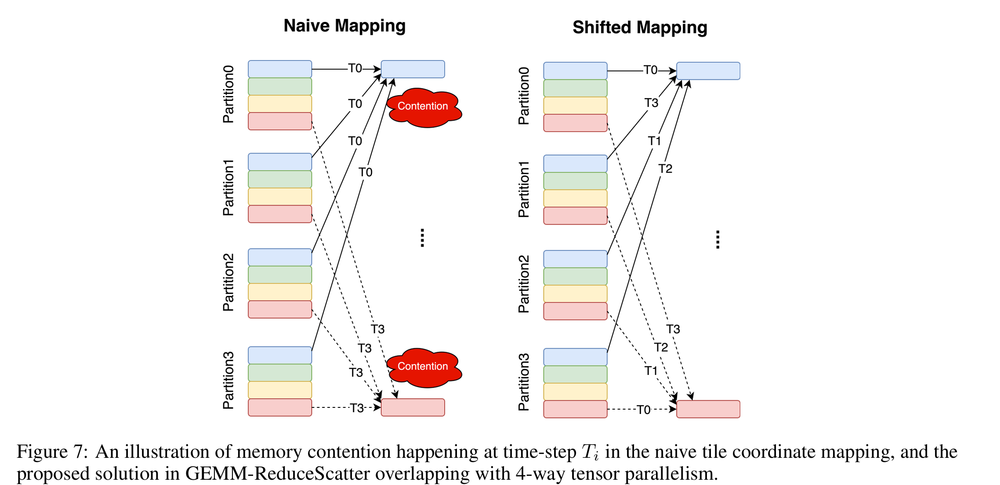

- 融合的 AllGather-GEMM，以最小化线程块等待，从而减少整体延迟。融合的 AllGather-GEMM 需要 tile 坐标 swizzling（TileCoord）与信号到达顺序对齐，该顺序由主机端的通信顺序决定（由算法 3 中的 tilescomm 控制）。在实现中，这两种顺序根据网络拓扑一起选择，以最小化整体延迟
  - host 侧通信（tilescomm）决定了数据到达的顺序。
  - kernel 侧 TileCoord swizzling 让线程块优先等那些最早到的数据。
  - 这样，kernel 线程块不会因为 tile 分配顺序不合理而长时间 idle。

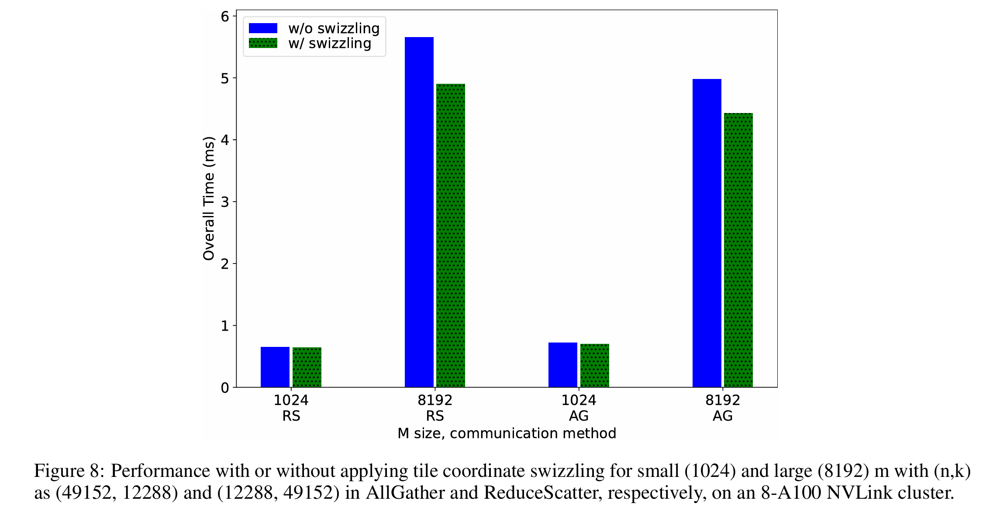

### (2) ReduceScatter 的实现细节
[paper sharing] Flux
**(a) 写操作:**

在本地 GPU 或节点内的 P2P GPU 上写入数据的实现包括：

- 使用所有变体的 `st` 指令（包括向量版本）将数据从寄存器存储到全局内存。
- 使用 `cp.async.bulk` 指令或 Hopper GPU 上的 `cp.async.bulk.tensor` 指令将数据从 scratchpad 存储到全局内存。
- 对于节点间的远程 GPU 写入，使用 NVSHMEM，通过各种 put API 实现。这些方法使用 CUTLASS EVT 模板实现，模板参数在自动调优期间选择。

**(b) Reduce:**

1. 如果 GPU 支持 P2P 内存访问，可以使用 `red` 或原子指令直接在设备内存上实现归约，而无需更改代码结构或引入过多开销。这些指令有用，但可能不支持所有数据类型或所有 GPU。因此，作者仅对支持的 GPU 和数据类型应用这些指令。
2. 在 Hopper GPU 上，使用 warp 或线程块专门化实现归约，每个 GPU 将部分结果写入其本地内存，然后由专门的 warp 或线程块拉取就绪的远程数据，在目标 GPU 上执行本地归约。这种 warp 或线程块专门化的归约方法在 Hopper 上与专门化的 GEMM 内核配合良好。
3. 对于节点间远程 GPU，仅在内核中融合 AlltoAll，并执行离散归约。所有方法也使用 CUTLASS EVT 模板实现，模板参数在自动调优期间选择

### (3) AllGather 的实现细节

**(a) 数据传输：**

虽然提出的 AllGather 算法不需要 P2P，但作者仍然区分有 P2P 和无 P2P 的实现。对于支持 P2P 内存访问的 GPU，可以通过 cudaMemcpy API 实现基于拉取或推送的传输。主要区别在于指针：拉取使用本地目标指针和远程源指针，而推送则相反。对于不支持 P2P 访问的 GPU，使用 NCCL 的 send/recv。由于 NCCL 的 send/recv 是配对的，因此没有拉取或推送的区别。

**(b) 信号设计：**

使用常规的 32 位 GPU 内存来实现信号。所有信号连续分配，以便于预设和重置，它们在相应的 PyTorch 操作初始化时预设，或在相应的 GEMM 计算后通过流和事件重置，避免数据竞争。在主机端，通过 cuStreamWriteValue API 与流一起设置信号，而在内核中，WaitSignal 通过自悬实现。

**(c) 通信 tile 大小：**

在 AllGather 中，通信 tiling 与 GEMM 计算 tiling 分离，以避免干扰 GEMM 的 tiling，因为 GEMM 性能对 tiling 敏感。独立调整通信 tiling 使作者能够在重叠机会和通信效率之间找到最佳平衡，最小化有效通信时间。在调优过程中，作者从中等粒度分区的 tiling 大小开始（如图 10 中的 chunksize 所示），即 tiling 大小等于 m 除以张量并行度，然后不断除以二直到等于 GEMM 的 tile 大小。图 10 显示通信 tile 大小确实影响整体性能。然而，由于没有明显的趋势表明一种大小总是优于其他，因此应用自动调优来选择最佳的 tiling 因子。

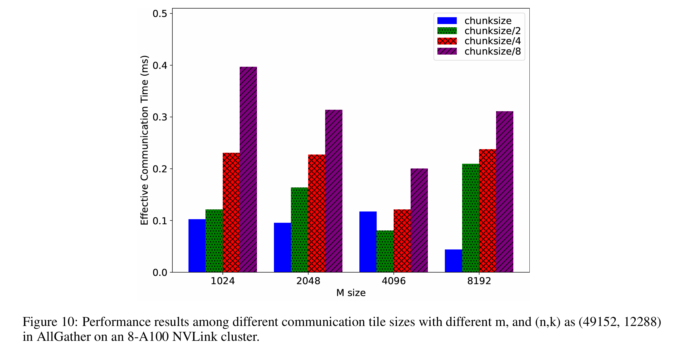

**(d) tile 间的通信顺序：**

主机端的通信顺序与 tile 坐标 swizzling 对齐，并根据网络拓扑选择以最小化整体延迟。节点内的 NVLink 互连采用从本地 rank 开始的环形顺序进行直接通信。例如，给定 8 路张量并行中的本地 rank 索引 5，其通信顺序为 6, 7, 0, 1, 2, 3, 4。节点内的 PCIe 互连使用基于环的通信来高效利用单节点张量并行的 PCIe 带宽。

### (4) GEMM 实现与自动调优

由于 Flux 中的 GEMM 规则 tiling 不受张量并行度的限制，tiling 大小可以调整而不影响正确性。Flux 使用 CUTLASS 实现，以完全控制 GEMM 的 tiling 以及相应的前序或后序融合。类似于传统的 GEMM 库根据矩阵形状、数据类型和 GPU 架构进行调优和选择 GEMM 内核，所有 forward、backward、GEMM 算法和调优选项都写在模板中，可以通过选择合适的模板参数来自动调优内核

## 五、实验

### (1) 测试环境：

Flux 使用 CUTLASS 3.4.1 和 NVSHMEM 2.10.1 实现，评估使用 bfloat16 在三个不同的集群上进行：

- A100 PCIe 集群：每个节点 8 个 GPU，使用 PCIe 进行节点内互连，2 个 100Gbps 的节点间互连（每 4 个 GPU 和 1 个 NIC 连接到一个 CPU 核心）。
- A100 NVLink 集群：每个节点 8 个 GPU，使用 NVLink 进行节点内互连，4 个 200Gbps 的节点间互连（每 2 个 GPU 共享 1 个 200Gbps 的节点间互连）。
- H800 NVLink 集群：每个节点 8 个 GPU，使用 NVLink 进行节点内互连，8 个 400Gbps 的节点间互连（每个 GPU 有一个专用的 400Gbps 节点间互连）。

### (2) 测试 overlap：

评估的 GEMM 尺寸选自 GPT-3 175B，因此在 AllGather 和 ReduceScatter 中，(n, k)分别为(49152, 12288)和(12288, 49152)。使用(n, k)作为应用张量并行前的原始形状。评估了 m 从 1024 到 8192 的 GEMM，以模拟训练和预填充阶段的不同工作负载：

Flux 在 A100 PCIe 上可提供 1.20x 到 3.25x 的加速，在 A100 NVLink 上为 1.01x 到 1.33x，在 H800 NVLink 上为 1.10x 到 1.51x。就重叠效率而言，Flux 在 A100 PCIe 上可提供 41% 到 57%，在 A100 NVLink 上为 36% 到 96%，在 H800 NVLink 上为 37% 到 93%，而 TransformerEngine 在 A100 PCIe 上为-125% 到 36%，在 A100 NVLink 上为-99% 到 74%，在 H800 NVLink 上为-40% 到 80%。负的重叠效率意味着性能比非重叠基线更差。

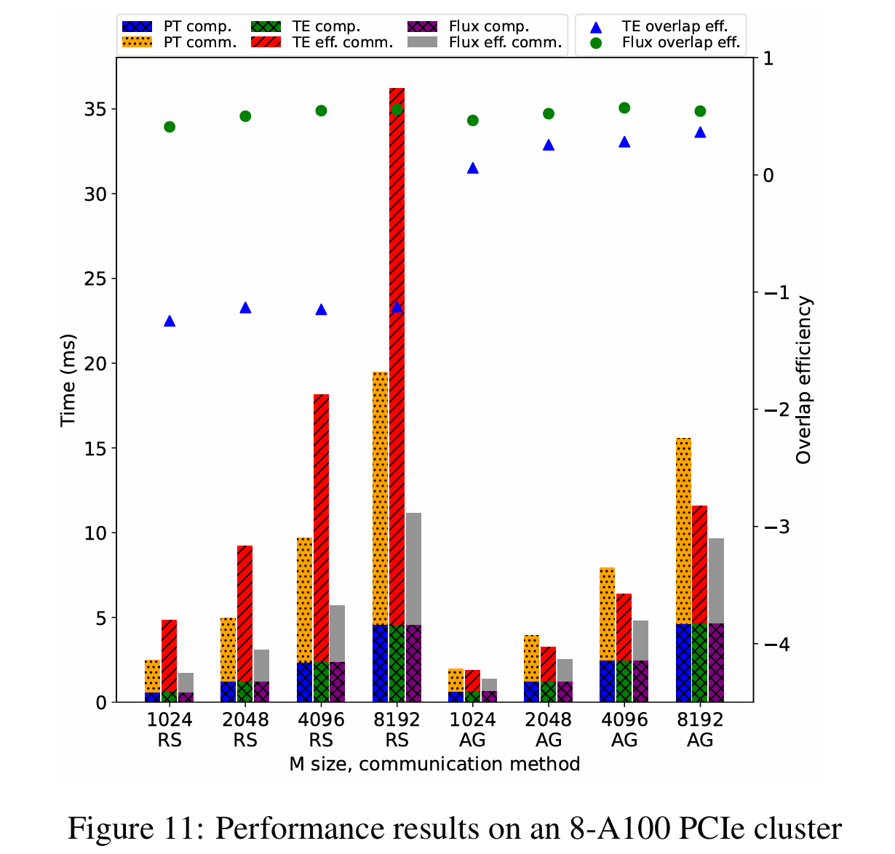

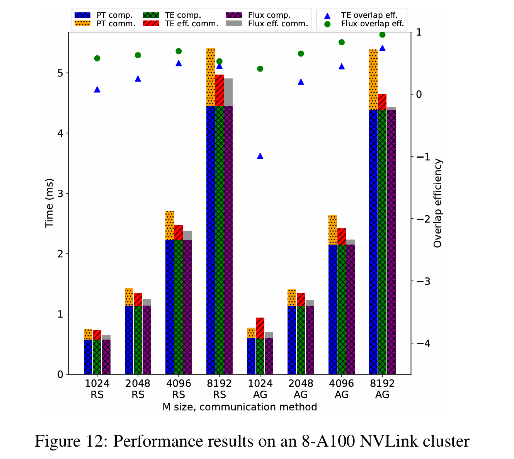

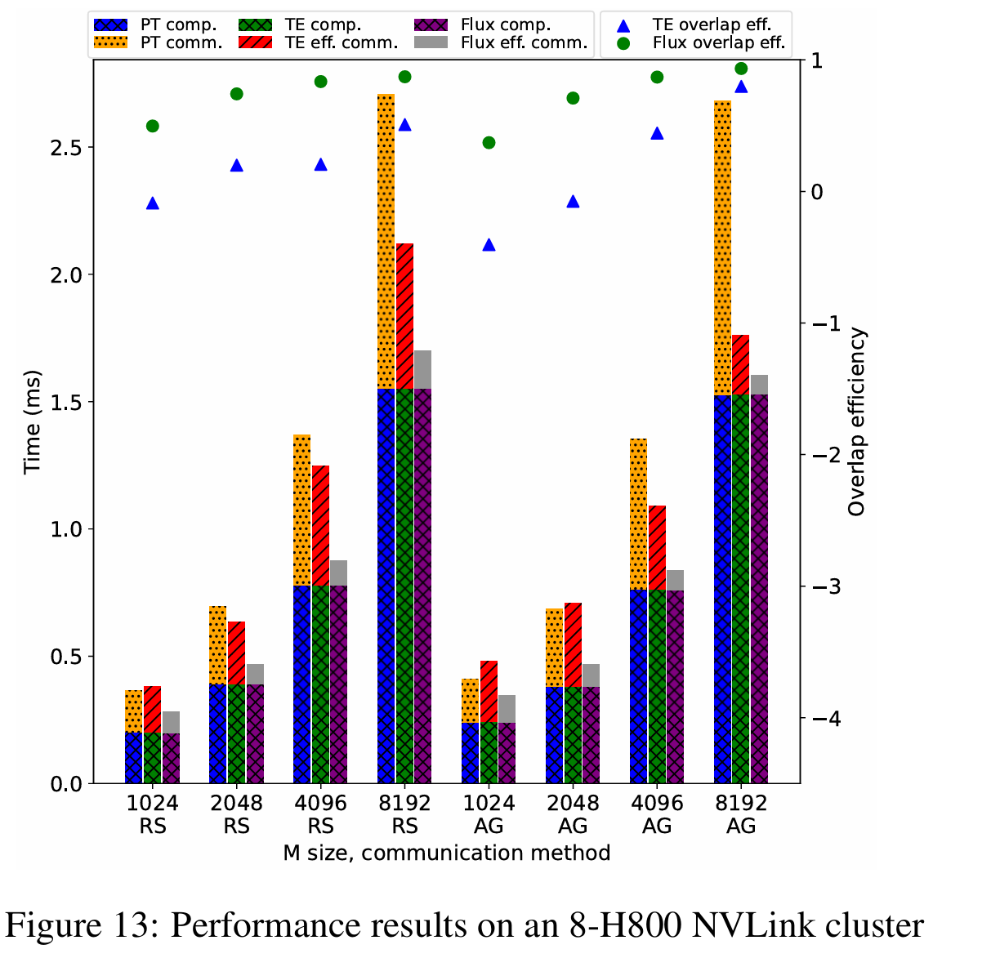

对于更小 m 尺寸：m 为 64 和 512 的小规模工作负载以模拟解码阶段。在这些评估尺寸下，Flux 在 A100 PCIe 上可提供 1.45x 到 3.21x 的加速，在 A100 NVLink 上为 1.33x 到 4.68x，在 H800 NVLink 上从 0.95x 减速到 1.03x 加速。就重叠效率而言，Flux 在 A100 PCIe 上为-2% 到 41%，在 A100 NVLink 上为 14% 到 88%，在 H800 NVLink 上为-165% 到-82%，而 TransformerEngine 在 A100 PCIe 上为-213% 到-36%，在 A100 NVLink 上为-325% 到-49%，在 H800 NVLink 上为-142% 到-93%。

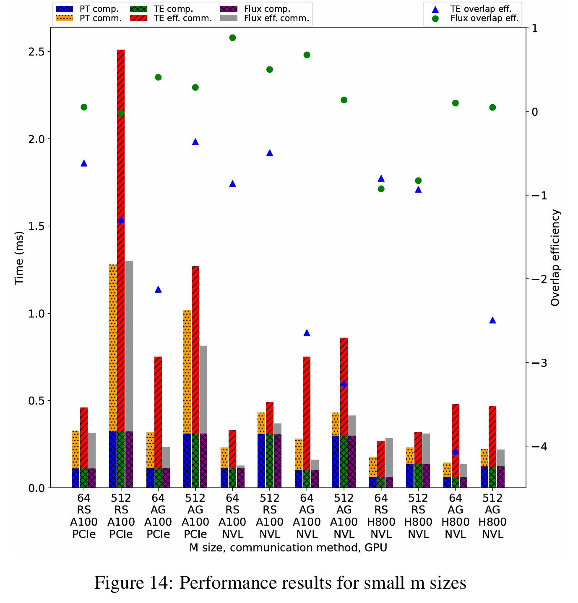

### (3) 测试训推：

评估的模型为 GPT-3 175B 和 Llama-2 70B，涵盖训练和推理。在训练中，作者使用 MegatronLM core r0.4.08 进行 GPT-3 175B 的训练，使用 Megatron-LLaMA 进行 Llama-2 70B 的训练，运行在 128-GPU 集群上，采用 2 路数据并行、8 路流水线并行和 8 路张量并行。报告的训练时间包括梯度和优化器阶段。在推理中，作者使用 vLLM 0.2.1，预填充阶段的批量大小为 8，序列长度为 2048，解码阶段的批量大小为 64 或 512。

- 相比 TransformerEngine，Flux 在 A100 PCIe 上可提供高达 1.37 倍的训练加速、2.06 倍的预填充加速和 1.69 倍的解码加速；在 A100 NVLink 上为 1.04 倍的训练加速、1.14 倍的预填充加速和 2.10 倍的解码加速；在 H800 NVLink 上为 1.05 倍的训练加速、1.18 倍的预填充加速和 1.76 倍的解码加速。
- 相比 Megatron-LM 和 vLLM 基线，Flux 在 A100 PCIe 上可提供高达 1.24 倍的训练加速、1.46 倍的预填充加速和 1.28 倍的解码加速；在 A100 NVLink 上为 1.05 倍的训练加速、1.45 倍的预填充加速和 1.30 倍的解码加速；在 H800 NVLink 上为 1.10 倍的训练加速、1.66 倍的预填充加速，但解码阶段没有加速。

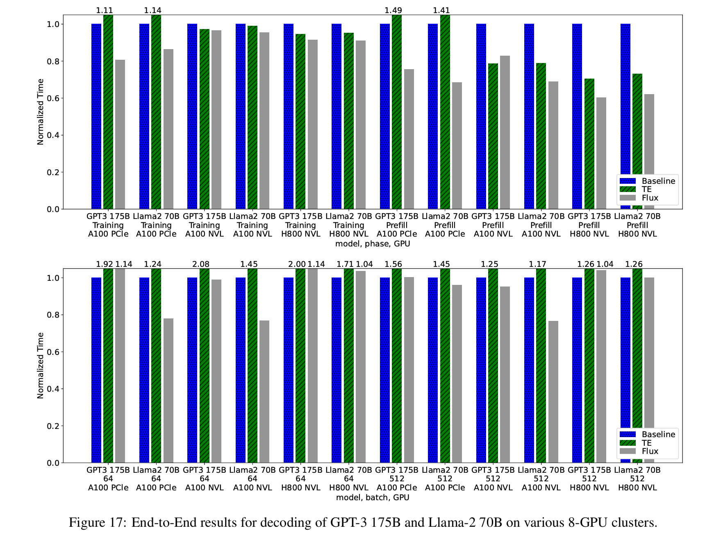

## 六、思考

- Flux 已将 AllGather (前置) 与 ReduceScatter (后置) 分别与 GEMM 内核融合，但对于更复杂的多步通信（如 AllReduce、AllToAll、分层 Ring、树型集体通信等）是否可以统一成一种泛化融合范式？比如自动识别并融合任意矩阵算子与上层通信语义。
- 目前主要覆盖张量并行，如果与流水线并行/数据并行更紧密地融合，例如跨 tensor-parallel stage tile 级流水优化，是否能够带来新的性能提升。
- 细粒度 tile 通信易导致更多中间 buffer 和信号变量管理，是否会对显存利用率和内存带宽提出新压力？
