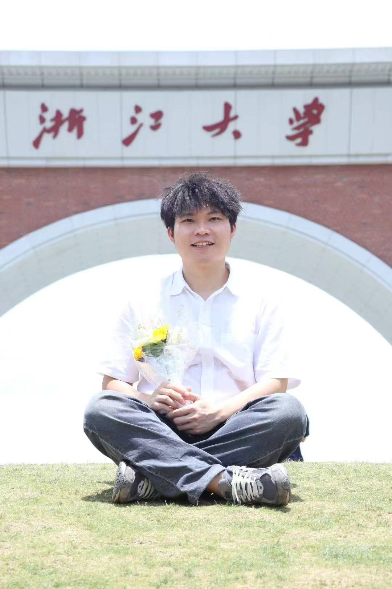
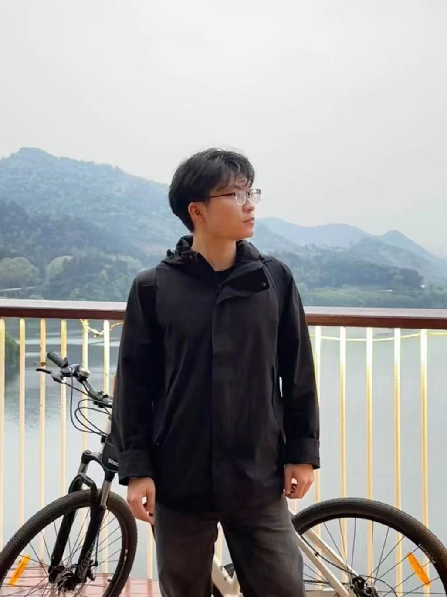
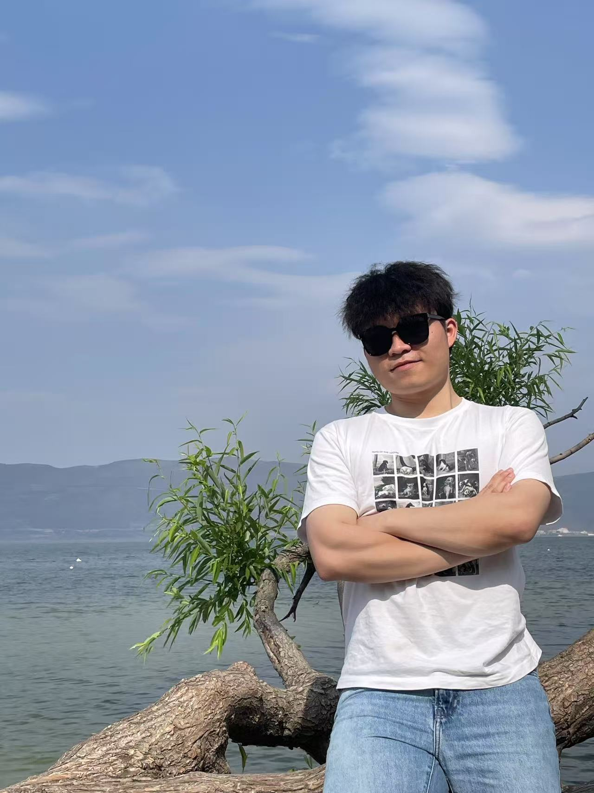

“我之前以为 GLCC 就是大厂开放一些边角料课题给在校生练练手，但参与之后发现，飞桨的赛题足够硬核，它的难度、复杂度、完备度都远超我的预期。最终，它给我的收获也远超预期。”

<!-- more -->

# GLCC 明日之星陆琦：从开源新人到飞桨核心框架贡献者的技术进阶之路

> “我之前以为 GLCC 就是大厂开放一些边角料课题给在校生练练手，但参与之后发现，飞桨的赛题足够硬核，它的难度、复杂度、完备度都远超我的预期。最终，它给我的收获也远超预期。”

说出这番话的，是 2023 届 GLCC 明日之星——陆琦。

从一名对开源世界满怀好奇的新人，到深入飞桨框架源码的核心贡献者，再到顺利斩获百度飞桨团队的实习 offer，陆琦在 GLCC 的舞台上，用短短几个月时间，完成了一次华丽的技术蜕变。

他的故事，或许能给正在技术道路上探索的你，带来一些新的启发与力量。

## 始于热爱，一个“蓄谋已久”的决定

谈及为何参加 GLCC，陆琦的回答清晰而坚定：**这是一个始于技术热爱，并结合了职业规划的“蓄谋已久”的决定。**

在校期间，陆琦和室友就常常关注“开源之夏”、“GLCC”这类面向学生的开源活动，希望通过实战项目锤炼技术，为简历增加一抹亮色。而他与飞桨的缘分，则更早一些。

- **兴趣的种子**：早在 22 年学习深度学习框架时，陆琦就发现，中文世界里关于框架内核的优质内容，“半壁江山”都来自飞桨。后来，他参与一家深度学习框架创业公司的项目，一位前飞桨员工的 Mentor 更是极力向他推荐 PaddlePaddle，建议他深入研究开放的源码和完善的技术博客。

- **明确的目标**：对于陆琦而言，参加 GLCC 不仅是为了提升技术，更是为了一个宝贵的职业机会。“我就想着能不能通过这次活动，一方面锤炼项目和技术能力，另一方面能有机会进入百度这样国内一流的 AI 团队去实习。”

最终，当 GLCC 的赛题放出时，陆琦毫不犹豫地选择了“足够硬核”的飞桨赛题，开启了自己的挑战之旅。

<figure style="text-align: center;">
  
  <figcaption>在浙大</figcaption>
</figure>



## 硬核挑战，一次深入源码的“攻坚战”


陆琦选择的赛题是“PyLayer功能支持动转静”——一个旨在支持模型中PyLayer的自定义层能够被动转静感知并正确地生成静态图Program，支撑转静训练和导出推理。

这是一个不折不扣的硬骨头。

“开发过程中最大的挑战，一是飞桨框架的源码体量大、结构复杂，完全看懂需要花费大量精力；二是我之前没有接触过动转静的技术原理，需要从零学起。” 陆琦回忆道，在项目的前半个月，他甚至没有写一行代码，全部时间都用来啃源码、读论文、和导师讨论技术方案。

面对挑战，他没有“闭门造车”。飞桨社区导师提供的强大支持，成为了他攻坚克难的关键：

- **高效的沟通机制和充分的技术方案讨论**：导师留杰从一开始就和他建立了**每周一次的线上 Meeting**，集中答疑、同步进度、评估风险，甚至会拉上内部的研发同学一起参与技术讨论。

- **开放的过程追踪**：导师建议他在 GitHub 上开设一个专门的 Repo，用来记录每一次的会议纪要、遇到的困难和技术进展。这不仅方便了导师的指导，也为后来者留下了一份宝贵的参考模板。

“我和 Mentor 的沟通几乎没有 gap，非常顺畅和高效，体验感很好！”陆琦感叹道。

## 超越预期，技术与软实力的双重蜕变

如果用三个关键词总结这次参赛体验，陆琦给出了他的答案：**技术挑战、团队协作、开源机遇。**

这场硬核的“攻坚战”带给他的，是远超赛前预期的巨大收获：

1.**技术的深度**：通过深入飞桨源码，他不仅攻克了动转静的核心原理，更做出了一项小小的技术突破——**在基于抽象语法树（AST）的转写方案中，成功支持了自定义 Python 算子，而这是当时许多竞品方案未能做到的。**

2.**协作的广度**：他学会了如何与一个专业的工程师团队进行高效的线上协同、项目管理和进度把控。“这对我后续的工作和学习非常有帮助。”

3.**社区的温度**：GLCC 为他打开了通往开源世界的大门，让他第一次真正与开源社区建立了紧密的联系，结识了许多志同道合的伙伴，并体会到了为开源贡献力量的成就感。

“从硬实力到软实力，再到一个宝贵的机会，这就是 GLCC 带给我的。”

<figure style="text-align: center;">
    
   <figcaption>骑行</figcaption>
</figure>

## 星光延续，从明日之星到飞桨核心框架贡献者

当得知自己获奖时，陆琦坦言“非常惊喜”。他原本只是抱着完成任务、锻炼能力的心态，没想到最终能在一众优秀的参赛者中脱颖而出，获得“明日之星”的荣誉。

而更大的惊喜，早已悄然降临——**凭借在比赛中的出色表现，他顺利获得了飞桨团队的实习 Offer！**

陆琦的开源之路越走越宽。他深度参与了飞桨静态图新**IR 核心机制的完善、分布式相关技术支持**等核心工作，对整个深度学习框架技术有了更全面、更深刻的认识。

GLCC，成为了他职业生涯一个闪亮的起点。

## 写给未来的你，“参赛通关指南”

作为“过来人”，陆琦也为新一届的参赛者们准备了一份真诚的“通关指南”：

- **心态上：勇敢投递！** 大部分课题的导师都非常友好，很愿意和同学们交流，不要因为觉得自己没经验而害怕。

- **选题上：匹配规划，选择完备课题。** 尽量选择与自己未来职业方向相关的、课题本身比较独立和完整的项目（如为框架新增一个独立 feature），这样做下来会更有成就感，项目经历也更有价值。

- **过程中：拒绝闭门造车，拥抱沟通！** 一定要和 Mentor 建立定期的沟通机制，及时反馈进度和问题。要有耐心，不畏难，努力吃透源码。

- **对于飞桨新手：** 多看官方文档，多和开源社区的大佬们交流，**大胆提 PR，大胆提 Issue！**

<figure style="text-align: center;">
   
   <figcaption>陆琦</figcaption>
</figure>

最后，如果用一句话安利 GLCC，你会怎么说？

> “GLCC 的课题覆盖面很广，从简到难都有。它既给了新手一个接触和感受工业界真实问题的绝佳机会，也为有一定基础、想要进阶的同学提供了在技术点上深度打磨的舞台。无论你是谁，都能在这里找到适合自己的挑战和成长。”

往期推荐：
[GLCC 往期优秀选手故事] (待补充)
[飞桨开源社区介绍文章] (https://pfcc.blog)
