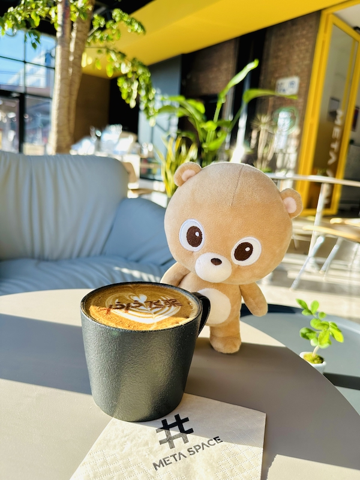

向大家快速介绍飞桨黑客松第五期开展以来的进展（11.4-12.1）

<!-- more -->

为了吸引社区开发者了解与参与飞桨深度学习开源项目与文心大模型开发实践，为飞桨框架、套件、大模型、合作伙伴等生态进行开源贡献，进一步扩大飞桨开源生态与文心大模型应用生态，我们组织了 **PaddlePaddle Hackathon 飞桨黑客松第五期活动**。活动开展 8 周的进展速览如下：

- **开源贡献个人挑战赛**：发布 110 个开源贡献任务，包括框架、科学计算、套件和合作伙伴方向，与 OpenVINO™、海光、Arm、高通、Zilliz、开放麒麟社区、9#AISoft 等合作项目共同出品，**全部任务完成认领，72 个任务提交作品，32 个任务已经完成**，框架方向提交率近 90%，科学计算方向提交率 70%+，进展超出预期，感谢各位开发者的积极参与，感谢各位导师的及时 review。
- **大模型应用与创意赛**：作为飞桨星河社区五周年预热活动，目标挖掘优质文心一言应用，共发布趣味创意与生产力工具 2 个方向的任务，**已有 22 名开发者产出基于 EB SDK 的应用 34 个，均已部署至应用中心**。
- **飞桨护航计划集训营**：共有 22 名社区开源开发者在社区导师的指导下，进行飞桨开源项目开发。 **按期完成了两期双周报提交，完成了 3 期技术分享，成果全部沉淀到开源社区**。

### 赛道一：开源贡献个人挑战赛

#### 进度看板

|     任务方向      | 任务数量 | 提交作品 / 任务认领 | 提交率 | 完成 | 完成率 |
| :---------------: | :------: | :-----------------: | :----: | :--: | :----: |
|      热身赛       |    11    |       10 / 11       | 90.91% |  4   | 36.36% |
| 框架 API 开发任务 |    31    |       28 / 31       | 90.32% |  6   | 19.35% |
| 框架其他开发任务  |    16    |       15 / 16       | 93.75% |  13  | 81.25% |
| 科学计算模型复现  |    11    |       8 / 11        | 72.73% |  4   | 36.36% |
|   套件开发任务    |    24    |       6 / 24        | 25.0%  |  3   | 12.5%  |
|   合作伙伴任务    |    17    |       5 / 17        | 29.41% |  2   | 11.76% |

#### 赛道亮点

- 尽管本期黑客松整体难度较往期提升，但社区开发者表现出了极大的专业能力和热情，任务已经 100% 被大家认领；
- 框架方向提交率近 90%，科学计算方向提交率 70%+，均高于往期黑客松。

#### 参与提示

- 在上面的看板中能看出来，套件开发任务和合作伙伴开发任务，提交率依然较低，欢迎社区的开发者选择这些任务来挑战。

更多详情请查看 issue：https://github.com/PaddlePaddle/Paddle/issues/57262

### 赛道二： 大模型应用与创意赛

#### 部分应用展示

我们收到了 270 人报名，提交了 34 个应用，在这里节选部分有趣的应用，欢迎大家在线体验。

- [基于文心一言 API + 文档的知识问答系统](https://aistudio.baidu.com/application/detail/8138)
- [海龟汤——逆向推理文字游戏](https://aistudio.baidu.com/application/detail/9577)

#### 赛道亮点

- 社区开发者们基于文心大模型的 SDK： [ERNIE Bot SDK](https://github.com/PaddlePaddle/ERNIE-Bot-SDK)，提交了种类多样，涵盖多领域作品，充分探索了使用文心大模型能做到的创意和创新。

#### 参与提示

- 欢迎大家继续发挥创意，提交更多有趣的应用。

更多详情请查看 issue：https://github.com/PaddlePaddle/Paddle/issues/57585

### 赛道三：飞桨护航计划集训营

#### 活动进展

集训营的同学已经完成了两次开源开发的双周报： [WeeklyReports 2023.10.25~2023.11.07](https://github.com/PFCCLab/Camp/issues/54)、 [WeeklyReports 2023.11.08~2023.11.21](https://github.com/PFCCLab/Camp/issues/77) 和三次[技术分享](https://github.com/PFCCLab/Camp/issues/14) 。

#### 集训营亮点

- 集训营将整个过程以开源的方式公开和协作，学员和导师在线研讨和互相促进。
- 社区开发者展现了极高的专业性和热情，详见导师点评：[@Aurelius84](https://github.com/PFCCLab/Camp/blob/main/WeeklyReports/19_RyanHuang/[WeeklyReport]2023.11.08~2023.11.21.md#导师点评)、[@From00](https://github.com/PFCCLab/Camp/blob/main/WeeklyReports/10_AndSonder/[WeeklyReport]2023.11.9~2023.11.22.md#导师点评)、[@RichardWooSJTU](https://github.com/PFCCLab/Camp/blob/main/WeeklyReports/06_Wanglongzhi2001/[WeeklyReport]2023.11.08~2023.11.21.md#导师点评)、[@Caozhou1995](https://github.com/PFCCLab/Camp/tree/main/WeeklyReports/12_Corle-hyz#导师点评)

#### 参与提示

- 欢迎大家到代码仓库: [Camp](https://github.com/PFCCLab/Camp) 里围观集训营的同学们的工作。

更多详情请查看 issue：https://github.com/PaddlePaddle/Paddle/issues/57264

## 彩蛋 🎊： 欢迎大家线下来见面

本周六（12 月 2 日）14:00 - 17:00 在 **北京 798** 举行飞桨开源社区 meetup，报名问卷：https://paddle.wjx.cn/vm/m1OLk4E.aspx# ，欢迎大家来聊天，飞桨定制咖啡等你打卡，梦师傅和花花在咖啡厅等着大家~

