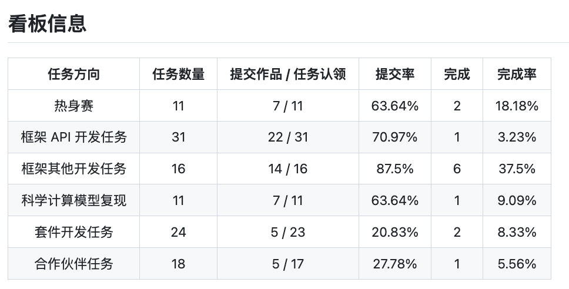
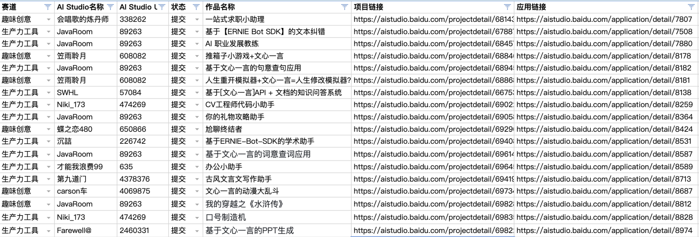
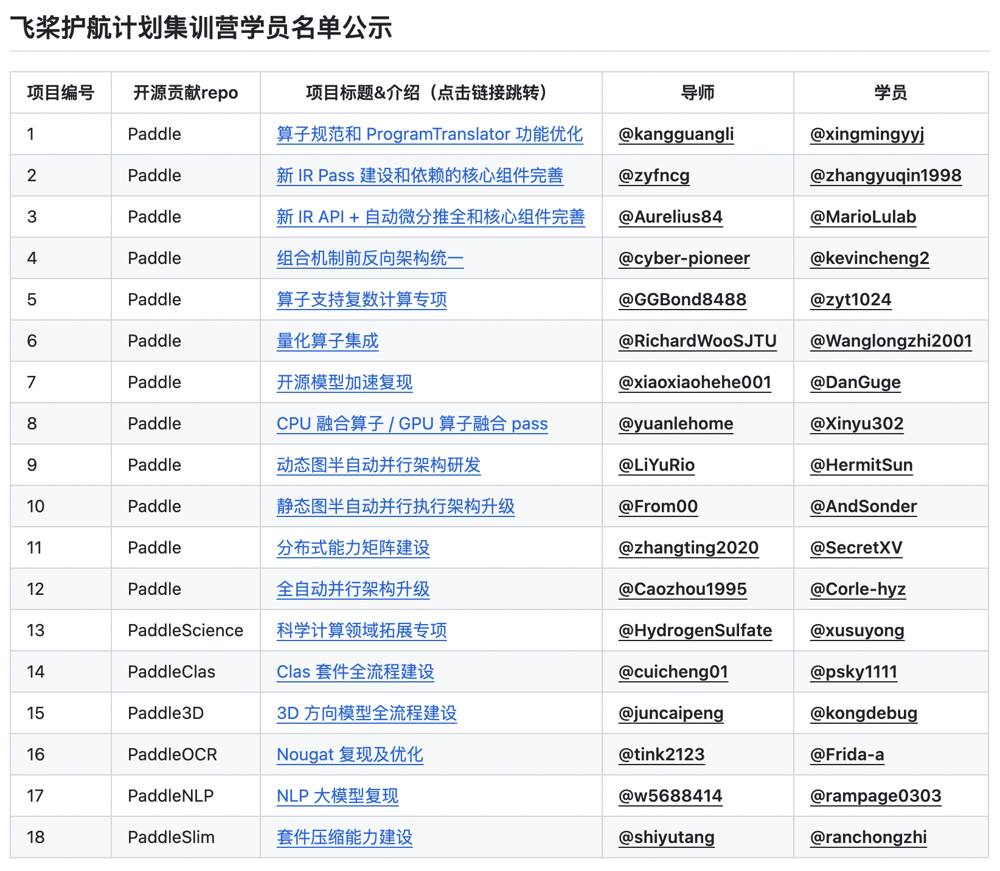

---

为了持续稳定与提升飞桨在开源深度学习框架领域的影响力，吸引社区开发者了解与参与飞桨深度学习开源项目与文心大模型开发实践，为飞桨框架、套件、大模型、合作伙伴等生态贡献代码，进一步扩大飞桨开源生态与文心大模型应用生态，组织了 **PaddlePaddle Hackathon 飞桨黑客松第五期活动**。第五期活动发布三大赛道：开源贡献个人挑战赛、大模型应用与创意赛、飞桨护航计划集训营，上线4周进展速览：

-  **开源贡献个人挑战赛**：发布111个开源贡献任务，包括框架、科学计算、套件和合作伙伴方向，与 OpenVINO™、海光、Arm、高通、Zilliz、开放麒麟社区、9#AISoft 等合作项目共同出品，**109个任务完成认领，60个任务提交作品，13个任务已经完成**，感谢各位开发者的积极参与，感谢各位导师的及时 review；
-  **大模型应用与创意赛**：作为飞桨星河社区五周年预热活动，目标挖掘优质文心一言应用，共发布趣味创意与生产力工具2个方向的任务，**已有12名开发者产出基于 EB SDK 的应用18个，均已部署至飞桨星河社区**；
-  **飞桨护航计划集训营**：发布18个框架与套件开发项目，1对1带教形式，已完成18名学员招募，并提交第一期周报，进展符合预期，周报详见 [[WeeklyReports] 2023.10.10~2023.10.24](https://github.com/PFCCLab/Camp/issues/34)，**是飞桨开源社区首次 Code Camp 形式的开源活动，由开发者担任助教**。

## 三大赛道进展同步

### 【开源贡献个人挑战赛】

任务issue：https://github.com/PaddlePaddle/Paddle/issues/57262

任务看板：

赛道亮点：

-  社区开发者参与热情高，活动发布1周认领率接近100%，提交率50%+；
-  [Tomoko-hjf](https://github.com/Tomoko-hjf) 开发黑客松小助手，自动更新任务榜单与看板，提升社区活动自动化水平；
-  直播活动圆满收官，已形成完整的飞桨开源贡献视频资料，详见 [issues#58125](https://github.com/PaddlePaddle/Paddle/issues/58125)；
-  本次活动英特尔作为赞助方，并与 OpenVINO™、海光、Arm、高通、Zilliz、开放麒麟社区、9#AISoft 等合作项目共同出品。

赛道风险：

-  套件任务提交率偏低，需要定向挖掘

### 【大模型应用与创意赛】

任务issue：https://github.com/PaddlePaddle/Paddle/issues/57585

进度统计：报名127人，提交应用18个，加精项目10个

赛道亮点：

-  全新赛道，作为飞桨星河社区五周年预热活动，推广重点产品星河社区 ERNIE Bot SDK；
-  完成情况符合预期，上线4周即提交18个 EB SDK 应用，作品种类多样，涵盖游戏娱乐、办公助手、知识科普等多领域，符合赛道初衷；
-  社群气氛活跃，新老选手积极交流，且建立了沟通产研的 EB SDK 反馈文档。

赛道风险：

-  暂无风险

### 【飞桨护航计划集训营】

任务issue：https://github.com/PaddlePaddle/Paddle/issues/57264

18个任务已全部完成招募，名单公示如下：

集训营亮点：

-  飞桨社区首次以 Code Camp 的形式招募远程开发者，吸引到很多新人，2周时间迅速完成学员招募与开营仪式；
-  学员 [MarioLulab](https://github.com/MarioLulab) 兼任助教，搭建开源项目 [PFCCLab/Camp](https://github.com/PFCCLab/Camp) 管理开发进度与周报提交，已完成第一期，周报详见 [[WeeklyReports] 2023.10.10~2023.10.24](https://github.com/PFCCLab/Camp/issues/34)；
-  搭建技术分享平台：每周一次源码解读，顺利完成第一期，分享人 [DrRyanHuang](https://github.com/DrRyanHuang)。

集训营风险：

-  暂无风险

## 活动运营与推广

### 【联合宣传】

与开源中国、启智、OpenVINO、思否、开源社、示说、InfoQ、白玉兰开源、开源之夏等合作伙伴以及海光、Arm、高通、Zilliz、开放麒麟社区、9#AISoft 等合作项目联合宣传。

### 【直播】

多平台同步直播，10场直播共计约1.4万人次观看，直播信息与学习资料已发布在开源社区，并整理成 AI Studio 专题课程： [深度学习开发指南——黑客松5.0 - 飞桨AI Studio星河社区-人工智能学习与实训社区](https://aistudio.baidu.com/course/introduce/30009)

| **日期**      | **主题**                                | **观看总人次** |
| ------------- | --------------------------------------- | -------------- |
| 10.16（周一） | 第五期飞桨黑客松来啦！                  | 1956           |
| 10.17（周二） | 新 IR Python API 适配升级               | 967            |
| 10.18（周三） | 模型复现和贡献指南                      | 975            |
| 10.19（周四） | OpenVINO 开源生态建设与贡献任务解析     | 884            |
| 10.20（周五） | 动转静全套件适配任务                    | 989            |
| 10.23（周一） | Arm 虚拟硬件助力边缘人工智能软件开发    | 1887           |
| 10.27（周五） | 跨平台推理框架 InfiniTensor             | 2049           |
| 10.30（周一） | 拓展 LLM 边界：使用向量数据库构建知识库 | 2193           |
| 10.31（周二） | Paddle 框架在昇腾平台上的推理优化分享   | 1097           |
| 11.1（周三）  | 飞桨硬件生态伙伴任务介绍                | 420            |

Best Regards

黑客松项目团队
