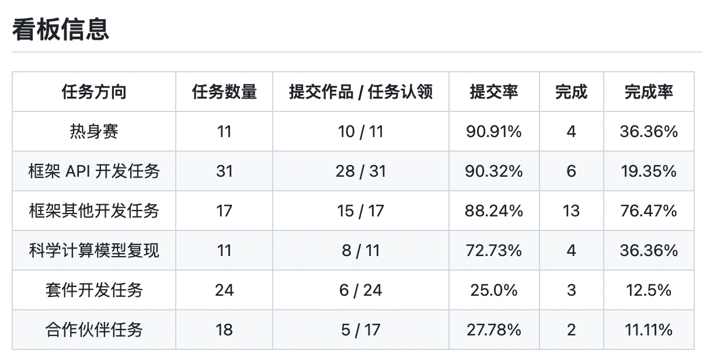
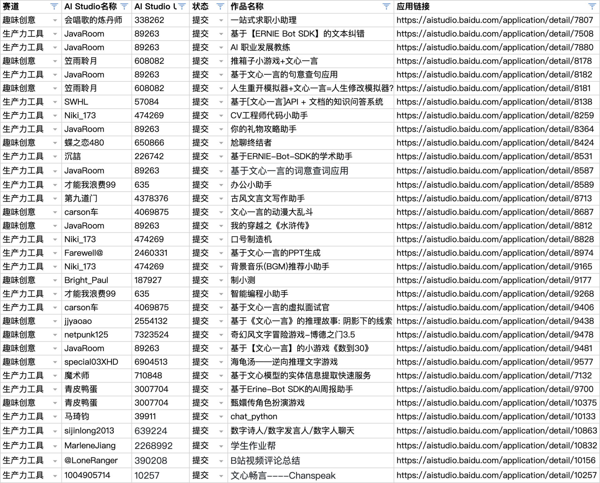

---

为了持续稳定与提升飞桨在开源深度学习框架领域的影响力，吸引社区开发者了解与参与飞桨深度学习开源项目与文心大模型开发实践，为飞桨框架、套件、大模型、合作伙伴等生态贡献代码，进一步扩大飞桨开源生态与文心大模型应用生态，组织了 **PaddlePaddle Hackathon 飞桨黑客松第五期活动**。第五期活动发布三大赛道：开源贡献个人挑战赛、大模型应用与创意赛、飞桨护航计划集训营，上线8周进展速览：

-  **开源贡献个人挑战赛**：发布110个开源贡献任务，包括框架、科学计算、套件和合作伙伴方向，与 OpenVINO™、海光、Arm、高通、Zilliz、开放麒麟社区、9#AISoft等合作项目共同出品，**全部任务完成认领，72个任务提交作品，32个任务已经完成**，框架方向提交率近90%，科学计算方向提交率70%+，进展超出预期，感谢各位开发者的积极参与，感谢各位导师的及时 review；
-  **大模型应用与创意赛**：作为飞桨星河社区五周年预热活动，目标挖掘优质文心一言应用，共发布趣味创意与生产力工具2个方向的任务，**已有22名开发者产出基于 EB SDK 的应用34个，均已部署至应用中心**；
-  **飞桨护航计划集训营**：发布18个框架与套件开发项目，1对1带教形式，**按期完成两期双周报提交，17+5个方向正常推进（1个方向学员因个人原因退出，合并管理5个日常护航计划学员），完成3期技术分享，成果全部沉淀到开源社区**。周报详见 [[WeeklyReports] 2023.10.25~2023.11.07](https://github.com/PFCCLab/Camp/issues/54)、[[WeeklyReports] 2023.11.08~2023.11.21](https://github.com/PFCCLab/Camp/issues/77)。

## 三大赛道进展同步

### 【开源贡献个人挑战赛】

任务issue：https://github.com/PaddlePaddle/Paddle/issues/57262

任务看板：

赛道亮点：

-  本期黑客松整体难度较往期提升，但社区开发者整体水平提高，活动认领率100%
-  框架方向提交率近90%，科学计算方向提交率70%+，均超出预期，高于往期黑客松

赛道风险：

-  套件任务与合作伙伴任务提交率偏低，需要定向挖掘

### 【大模型应用与创意赛】

任务issue：https://github.com/PaddlePaddle/Paddle/issues/57585

进度统计：报名270人，提交应用34个

赛道亮点：

-  推广重点产品ERNIE Bot SDK，完成情况超出预期，作品种类多样，涵盖多领域，符合赛道初衷
-  部分应用质量高，目前最高赞——基于文心一言API的文档知识问答系统浏览量3K+，喜爱度250+

（左：生产力工具；右：趣味创意）

赛道风险：

-  暂无风险

### 【飞桨护航计划集训营】

任务issue：https://github.com/PaddlePaddle/Paddle/issues/57264

活动repo：https://github.com/PFCCLab/Camp

周报提交： [[WeeklyReports] 2023.10.25~2023.11.07](https://github.com/PFCCLab/Camp/issues/54)、[[WeeklyReports] 2023.11.08~2023.11.21](https://github.com/PFCCLab/Camp/issues/77)

技术分享：https://github.com/PFCCLab/Camp/issues/14

集训营亮点：

-  开发者自治程度高，全过程开源，周报管理方式可低成本扩展到日常护航计划学员，统一管理
-  部分开发者产出优秀，超出预期，详见导师点评：[@Aurelius84](https://github.com/PFCCLab/Camp/blob/main/WeeklyReports/19_RyanHuang/[WeeklyReport]2023.11.08~2023.11.21.md#导师点评)、[@From00](https://github.com/PFCCLab/Camp/blob/main/WeeklyReports/10_AndSonder/[WeeklyReport]2023.11.9~2023.11.22.md#导师点评)、[@RichardWooSJTU](https://github.com/PFCCLab/Camp/blob/main/WeeklyReports/06_Wanglongzhi2001/[WeeklyReport]2023.11.08~2023.11.21.md#导师点评)、[@Caozhou1995](https://github.com/PFCCLab/Camp/tree/main/WeeklyReports/12_Corle-hyz#导师点评)

集训营风险：

-  暂无风险

## 活动运营与推广

本周六（12月2日）14:00 - 17:00 在 **北京798** 举行飞桨开源社区 meetup，报名问卷：https://paddle.wjx.cn/vm/m1OLk4E.aspx# ，欢迎大家来聊天，飞桨定制咖啡等你打卡~

Best Regards

黑客松项目团队
