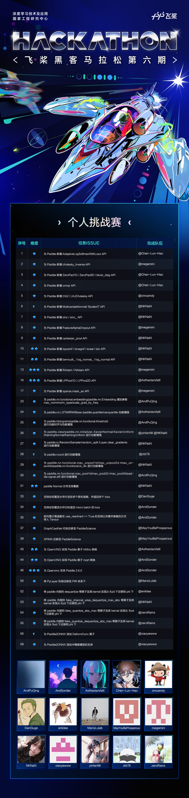
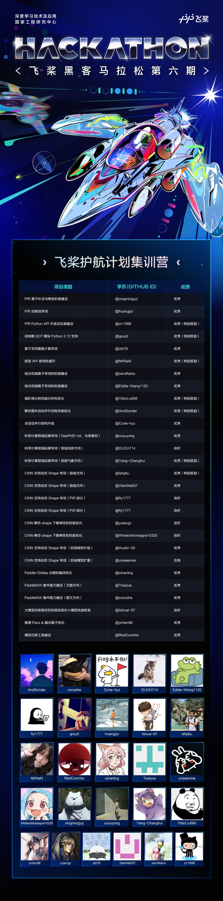
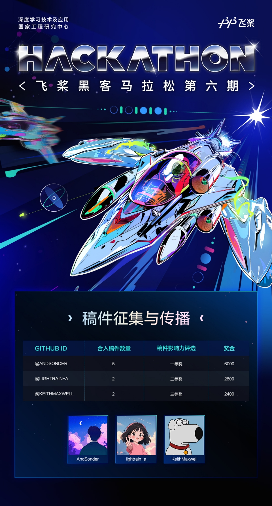
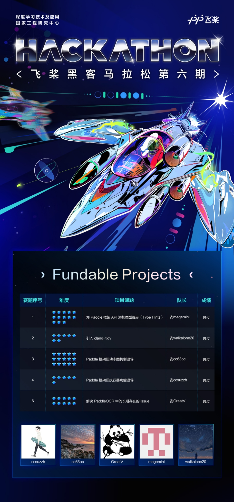

飞桨黑客马拉松第六期，新赛制，新玩法，难度更深，挑战更大！

<!-- more -->

不论是再次相遇的老朋友，还是志同道合的新朋友，每个人都可以在这里共同探索无限可能。

这是一场真正的 Hacker 盛宴，同时也是一次硬核的较量，更是与飞桨研发团队和社区伙伴协作的绝佳机会！

期待见证你在这个舞台上的成长和进步。

彻底释放你的创造力，“码”上见真章！

经过激烈的角逐，让我们看看哪些最强“Hacker”脱颖而出！

---

## 01 - 更硬核的飞桨黑客松活动

PaddlePaddle Hackathon 飞桨黑客马拉松（以下简称为“飞桨黑客松”）第六期于 2024 年 3 月 20 日正式上线。本期活动提高了整体难度和结题要求，并且受到了开发者的热情响应。他们前赴后继，挑战自我，最终在经过三个月的激烈竞争后圆满落幕！

本次飞桨黑客松延续了往期深受开发者喜爱的两大活动形式——开源贡献个人挑战赛和飞桨护航集训营，并首次引入了「Fundable Projects」赛道，专注解决飞桨框架的核心技术难题。在这一赛道中，社区高水平开发者领导并规划技术路线，号召社区共同完成课题项目。此外，还新增了「优秀稿件征集与传播」赛道，鼓励开发者撰写基于飞桨框架新功能的科技文章，进一步扩展飞桨的影响力。

共有 49 位社区开发者参与并完成本期飞桨黑客松的任务，**本次活动在任务完成难度、参与团队规模、项目类型丰富度等方面均有提升，充分展示了开发者们对于建设飞桨开源生态的热情和奉献精神。** 我们期待这些开发者团队在飞桨开源生态中继续迸发出光彩和力量，与飞桨一路同行，共同打造更加优秀的开源社区。

---

## 02 - 四大赛道 开源贡献

飞桨与生态伙伴 OpenVINO™ 携手，发布了四大赛道共计 46 个方向的开源贡献任务，从框架开发、套件建设、论文复现、基础设施到技术文章任务应有尽有。开发者们结合自己的兴趣与能力在不同方向为飞桨做出重要贡献，感谢你们！

### 总览

- 开源贡献个人挑战赛：共发布 55 个开源贡献任务，最终由 13 位开发者完成 38 个任务。
- 护航计划集训营：共发布 27 个实训项目，涵盖多个救技术方向，最终 28 位同学参与答辩并顺利结营，加速了飞桨的功能迭代。
- Fundable Projects：定位为硬核社区项目，本期由社区完成了 5 个关键技术项目的研发。
- 优秀稿件征集与传播：社区完成 9 篇高质量稿件，并在 CSDN 等平台传播。

### 一、开源贡献个人挑战赛

开源贡献个人挑战赛以开源贡献为核心，基于 GitHub 的飞桨及生态伙伴开源项目进行代码贡献。本期个人挑战赛发共布 55 个开源贡献任务，涵盖飞桨核心框架、科学计算、Paddle2ONNX 套件和生态伙伴项目，**所有任务均完成认领，43 个任务提交作品，38 个任务顺利完成，完成率 69%**。 感谢各位开发者的积极参与，致敬每一位开源贡献者！**本期完成的框架开发任务也将进入飞桨框架 3.0 发版流程，贡献者成果被全体飞桨框架用户共享**。

此外，本次黑客松 Paddle2ONNX 方向三道赛题的奖励（共 4500 元）均为社区捐赠，因此**最后的奖励由 Paddle2ONNX PMC 向社区热心开发者直接颁发**。感谢 Paddle2ONNX 社区的六位金主：[chenwhql](https://github.com/chenwhql)、[luotao1](https://github.com/luotao1)、[goocody](https://github.com/goocody)、[jeff41404](https://github.com/jeff41404)、 [jzhang553](https://github.com/jzhang533)、[ZhengBicheng](https://github.com/ZhengBicheng)。

> 更多详情请查看任务 issue 📄： https://github.com/PaddlePaddle/Paddle/issues/62905

### 二、飞桨护航计划集训营

飞桨护航计划集训营是本期黑客松的核心赛道之一，专注于为开发者提供一个实践、学习与成长的远程集训营。营员以远程的方式，导师 1 对 1 带教深度参与**飞桨重要开源项目开发实践。**本次计划分两批共发布 27 个实训项目，涵盖多个技术方向，完成招募 32 名营员。三个月集训期间共计**提交 6 期周报，组织 2 期技术分享会，最终 28 位营员参与答辩并顺利结营**，极大加速了飞桨的功能迭代。

> 集训营开源项目地址：<https://github.com/PFCCLab/Camp>，所有学习笔记与周报记录均留痕～

本期飞桨护航计划集训营开发项目内容硬核，既包括 PIR、CINN、组合算子等专项机制建设工作，也包括模型迁移工具建设、框架 API 易用性提升、CMake 治理和编译优化、分布式自动并行架构升级和性能优化等框架核心组件开发工作，还有科学计算领域拓展专项、PaddleMIX 多模态大模型能力建设等重要套件能力建设工作...营员们的开发能力、开源热情与丰富成果不仅得到了各位导师的高度认可，也获得了内部研发经理的肯定，并有多名同学获得百度正式实习生 Offer。

> 更多详情请查看任务 issue 📄：https://github.com/PaddlePaddle/Paddle/issues/61006

### 三、优秀稿件征集与传播

随着版本的更新，飞桨功能发生了非常大的变化，为了让更多的开发者了解这些信息，本期黑客松新增了**优秀稿件征集与传播赛道**。该赛道共开放了 7 个稿件选题，涵盖 0 维 Tensor、复数计算、稀疏计算、高阶微分等技术点的使用指南及学习心得。所有参赛选手共提交了 12 篇稿件，**最终 3 名选手合计 9 篇高质量稿件顺利通过审核并合入**，并在 AIStudio、CSDN 等内容社区平台进行推广，**帮助飞桨传播正面技术影响力。**

> 更多详情请查看任务 issue 📄：https://github.com/PaddlePaddle/Paddle/issues/62907

### 四、Fundable Projects

Fundable Projects 是本期黑客松的创新赛道之一，核心聚焦于攻克**飞桨面临的硬核技术课题**。参赛选手需要能够独立剖析复杂的任务需求、精心规划技术实施路径，并倡导携手社区力量，共同推进关键功能需求的落地实现。本赛道共发布了 6 个亟待解决的飞桨关键技术项目 —— 为 Paddle 框架 API 添加类型提示、引入 clang-tidy 工具、旧动态图和执行器机制清理、全套件模型实现动转静训练功能、解决长期存在的 PaddleOCR 问题。所有开发课题均已被社区积极认领，并且其中 5 个项目课题的研发在社区的共同努力下圆满完成。

鉴于 Fundable Projects 赛道在本期黑客松中取得的超乎预期的成功与影响力，我们决定在未来的黑客松活动中继续深化这一赛道，并诚邀所有怀揣技术梦想、勇于攀登技术高峰的社区成员加入这场硬核技术的挑战之旅。为了表彰并激励更多的优秀贡献，我们也将加大该赛道的奖励力度哦～

> 更多详情请查看任务 issue 📄：https://github.com/PaddlePaddle/Paddle/issues/62908

### 未来计划

- **个人贡献挑战赛：** 持续运转，征集并发布飞桨研发赛题，扩大开源声量。
- **护航计划集训营：** **重点开展**，扩大集训营的规模、批次，结合 GLCC、开源之夏共同运营远程实习项目。
- **Fundable Projects：** **重点开展**，尝试将更多硬核研发课题、产品新特性交由社区开发完成。
- **其他（待定）**

---

## 03 - 飞桨黑客松完成榜单

2024 PaddlePaddle Hackathon 飞桨黑客马拉松第六期由深度学习技术及应用国家工程研究中心主办，飞桨承办，英特尔作为顶级赞助方共同出品，以线上认领任务的形式进行。本次共有四大赛道：开源贡献个人挑战赛、飞桨护航计划集训营、Fundable Projects、优秀稿件征集与传播，多样的活动形式为大家提供丰富的深度学习开发体验。对飞桨黑客松第六期公示榜单如有异议，请于 2024 年 08 月 30 日 24 点前反馈至 [paddle-hack@baidu.com](mailto:paddle-hack@baidu.com) ，我们将在 08 月 31 日前对您的异议进行复核反馈。

恭喜完成开发任务的团队，将获得任务对应奖金以及飞桨黑客松结项证书，同时也可以获得百度招聘绿色通道。

---

## 04 - 新的身份等你点亮

在参与飞桨黑客松活动时，部分开发者们向飞桨框架提交 PR（Pull Request）参与开源贡献，成为飞桨框架的贡献者，并且有意愿为飞桨框架做出持续的贡献。他们接受了来自 PFCC 的邀请，正在用自己的方式参与飞桨框架建设，与飞桨共同成长。如果你也热爱开源、如果你有意愿成为飞桨开源社区的 Contributor，就快加入 PFCC 吧！

> **关于 PFCC**
>
> PFCC 全称 Paddle Framework Contributor Club ，意为飞桨框架贡献者俱乐部，是一个有兴趣、正在或者已经为飞桨开源框架做开源贡献的贡献者成立的虚拟组织。在这里，飞桨开源框架的贡献者进行讨论、交流和分享，并为飞桨框架做出持续的贡献。如果你有意愿加入我们，请发邮件到[ext_paddle_oss@baidu.com](mailto:ext_paddle_oss@baidu.com)，在邮件中附上自己的 GitHub ID、贡献详情与联系方式，会有工作人员邀请你加入。

**加入 PFCC，与我们一起参与到飞桨框架的开发中吧！**

戳这里看飞桨开源社区故事 ➡️ https://pfcc.blog/
