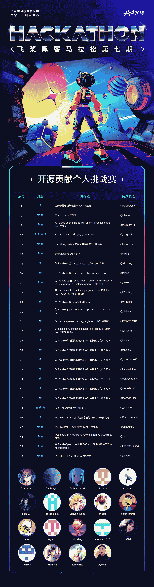
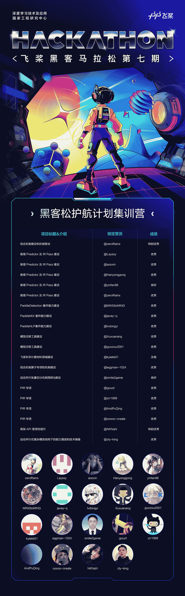
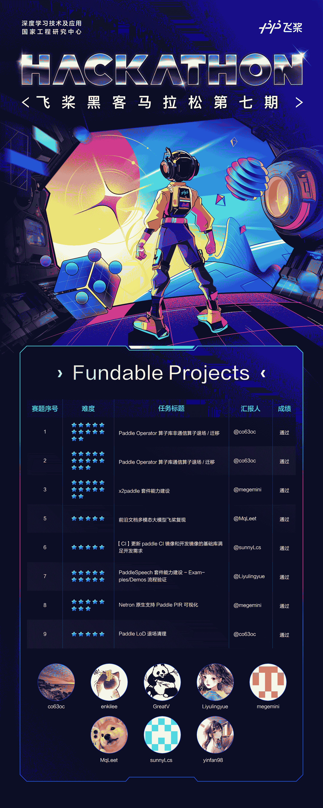

飞桨黑客马拉松第七期，老赛制，新赛题，熟悉的配方，不一样的味道！

<!-- more -->

无论是久别重逢的老朋友，还是初次相识的新伙伴，每一位热爱技术、渴望挑战的开发者，都能在这里共同探索无限的可能性！

这不仅是一场 Hacker 的盛宴，更是一场硬核较量。你将在这里，与飞桨研发团队及社区伙伴协作，共同碰撞出创新的火花。

飞桨框架 3.0，与你共同定义！沉寂已久的开发套件，因你焕发新生！

经过激烈的角逐，让我们看看谁能脱颖而出，成为最强“Hacker”！

---

## 01 - 更聚焦的飞桨黑客松活动

PaddlePaddle Hackathon 飞桨黑客马拉松（以下简称为“飞桨黑客松”）第七期于 2024 年 9 月 14 日正式上线。本期活动在延续经典的基础上更加聚焦，赛题难度全面升级，吸引了众多开发者踊跃参与。经过三个月的激烈角逐，这场技术盛宴最终圆满落幕！

本次飞桨黑客松延续了往期深受开发者喜爱的三大经典赛道——**开源贡献个人挑战赛、飞桨护航集训营，以及 Fundable Projects 硬核赛道**。同时，本期进一步升级，增加了 Fundable Projects 的赛题数量，聚焦解决飞桨框架中的核心技术难题，为开发者提供更多挑战与创新的空间。

共有 37 位社区开发者参与并完成本期飞桨黑客松的任务，**本次活动在任务完成度、课题难度、项目类型丰富度等方面均有提升，充分展示了开发者们对于建设飞桨开源生态的热情和奉献精神。** 我们期待各位在飞桨开源生态中持续焕发光彩，与飞桨携手前行，共同打造一个更加繁荣、优秀的开源社区！

---

## 02 - 三大赛道 开源贡献

飞桨黑客松组委会在三大赛道中分批次发布了共计 88 个开源贡献任务或课题，覆盖框架开发、科学计算、套件建设、论文复现以及基础设施建设等多个方向。开发者们结合自身兴趣与能力，在各领域为飞桨生态贡献了宝贵的力量。感谢每一位开发者的付出，你们的努力让飞桨更加出色！

### 总览

- 开源贡献个人挑战赛：共发布 58 个开源贡献任务，最终由 19 位开发者完成 27 个任务，展示了强大的技术能力与开源热情。
- 护航计划集训营：两个批次（提前批、正式批）共发布 19 个远程实训项目，涵盖多个技术方向。最终，19 位开发者成功参与答辩并顺利结营，大幅加速了飞桨功能的迭代升级。
- Fundable Projects：共发布 11 个硬核项目，社区开发者携手完成了其中 8 个关键技术项目的研发，为飞桨框架解决了多项技术难题。

### 一、开源贡献个人挑战赛

**开源贡献个人挑战赛**以开源贡献为核心，围绕 GitHub 上的飞桨及生态伙伴开源项目展开代码贡献，要求独立完成具有明确验收目标的任务。

本期个人挑战赛共发布 58 个开源贡献任务，涵盖飞桨核心框架、科学计算、开发套件及生态伙伴项目方向。其中，共有**34 个任务提交作品，27 个任务顺利完成，完成率 47%**。 感谢所有开发者的积极参与，致敬每一位开源贡献者！**本期完成的框架开发任务也将进入飞桨框架 3.0 发版流程，贡献者成果被全体飞桨框架用户共享**。

> 更多详情请查看任务 issue 📄： [#68244](https://github.com/PaddlePaddle/Paddle/issues/68244)

### 二、飞桨护航计划集训营

飞桨护航计划集训营是本期黑客松的核心赛道之一，专注于为开发者提供一个实践、学习与成长的远程集训营。营员以远程的方式，导师 1 对 1 带教深度参与**飞桨重要开源项目开发实践。**

本次计划分两批共发布 19 个实训项目，涵盖多个技术方向，完成招募 20 名营员。三个月集训期间共计**提交 7 期周报，组织 2 期技术分享会，最终 19 位营员参与答辩并顺利结营**，极大加速了飞桨的功能迭代。

> 集训营开源项目地址：<https://github.com/PFCCLab/Camp>，所有学习笔记与周报记录均留痕～

本期飞桨护航计划集训营开发项目内容硬核，既包括 PIR、CINN、组合算子等专项机制建设工作，也包括模型迁移工具建设、框架 API 易用性提升、自动并行张量切分机制预研等框架核心组件开发工作，还有 PaddleDetection、PaddleMIX 多模态大模型能力建设等重要套件能力建设工作...

营员们凭借出色的开发能力、开源热情和丰富的成果，不仅赢得了导师们的高度认可，还得到了内部研发经理的肯定。更令人振奋的是，多名同学因此获得了百度正式实习生 Offer，充分展示了本期集训营的价值与影响力！

> 更多详情请查看任务 issue 📄：正式批 [#67601](https://github.com/PaddlePaddle/Paddle/issues/67601)、提前批 [#65285](https://github.com/PaddlePaddle/Paddle/issues/65285)

### 三、Fundable Projects

**Fundable Projects** 是上一期黑客松的创新赛道之一，因广受资深开发者的喜爱，本期活动继续沿用并进一步优化。该赛道专注于解决**飞桨面临的硬核技术难题**，参赛者不仅需要具备独立剖析复杂任务需求的能力，还需精心规划技术实施路径，并倡导协作社区力量，共同推动关键功能需求的落地实现。

本赛道共发布了 11 个亟待解决的关键技术项目，包括 Paddle 框架旧算子清理、PaddleSpeech 和 X2Paddle 套件能力建设、CI 镜像更新、以及 Netron 支持 PaddlePIR 可视化等多个硬核课题。其中，经过社区开发者的共同努力，成功完成了 8 个技术项目的研发，为飞桨生态的持续优化贡献了重要力量。

未来，我们计划在黑客松活动中继续深化这一赛道，欢迎所有怀揣技术梦想、勇于挑战的社区成员加入这场硬核技术的攀登之旅！此外，为激励更多优秀贡献者，我们也将在该赛道中进一步加大奖励力度，共同打造一个更加繁荣的技术生态！

> 更多详情请查看任务 issue 📄：[#68245](https://github.com/PaddlePaddle/Paddle/issues/68245)

### 未来计划

- **个人贡献挑战赛：** 持续运转，征集并发布飞桨研发赛题，扩大开源声量。
- **护航计划集训营：** **重点开展**，扩大集训营的规模、批次，结合第三方赛事共同运营远程实习项目。
- **Fundable Projects：** **重点开展**，尝试将更多硬核研发课题、产品新特性交由社区开发完成。

---

## 03 - 飞桨黑客松完成榜单

恭喜以下完成开发任务的团队，将获得任务对应奖金以及飞桨黑客松结项证书，同时也可以获得百度招聘绿色通道。

对飞桨黑客松第七期公示榜单如有异议，请于 2025 年 01 月 30 日 24 点前反馈至 [paddle-hack@baidu.com](mailto:paddle-hack@baidu.com) ，我们将在 02 月 07 日前对您的异议进行复核反馈

---

## 04 - 新的身份等你点亮

在参与飞桨黑客松活动时，部分开发者们向飞桨框架提交 PR（Pull Request）参与开源贡献，成为飞桨框架的贡献者，并且有意愿为飞桨框架做出持续的贡献。他们接受了来自 PFCC 的邀请，正在用自己的方式参与飞桨框架建设，与飞桨共同成长。如果你也热爱开源、如果你有意愿成为飞桨开源社区的 Contributor，就快加入 PFCC 吧！

> **关于 PFCC**
>
> PFCC 全称 Paddle Framework Contributor Club ，意为飞桨框架贡献者俱乐部，是一个有兴趣、正在或者已经为飞桨开源框架做开源贡献的贡献者成立的虚拟组织。在这里，飞桨开源框架的贡献者进行讨论、交流和分享，并为飞桨框架做出持续的贡献。如果你有意愿加入我们，请发邮件到[ext_paddle_oss@baidu.com](mailto:ext_paddle_oss@baidu.com)，在邮件中附上自己的 GitHub ID、贡献详情与联系方式，会有工作人员邀请你加入。

**加入 PFCC，与我们一起参与到飞桨框架的开发中吧！**

戳这里看飞桨开源社区故事 ➡️ https://pfcc.blog/
