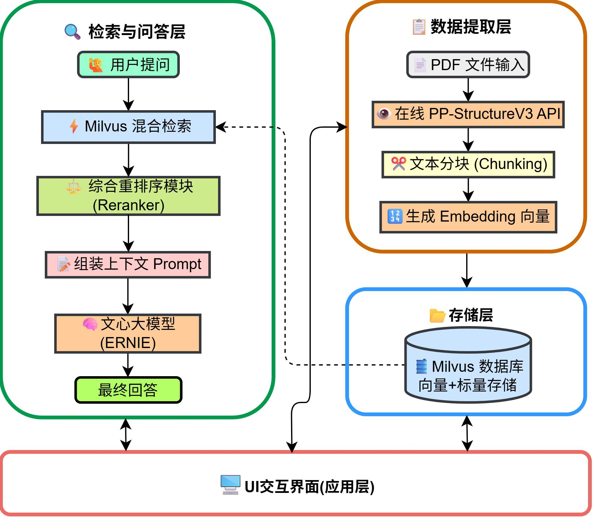
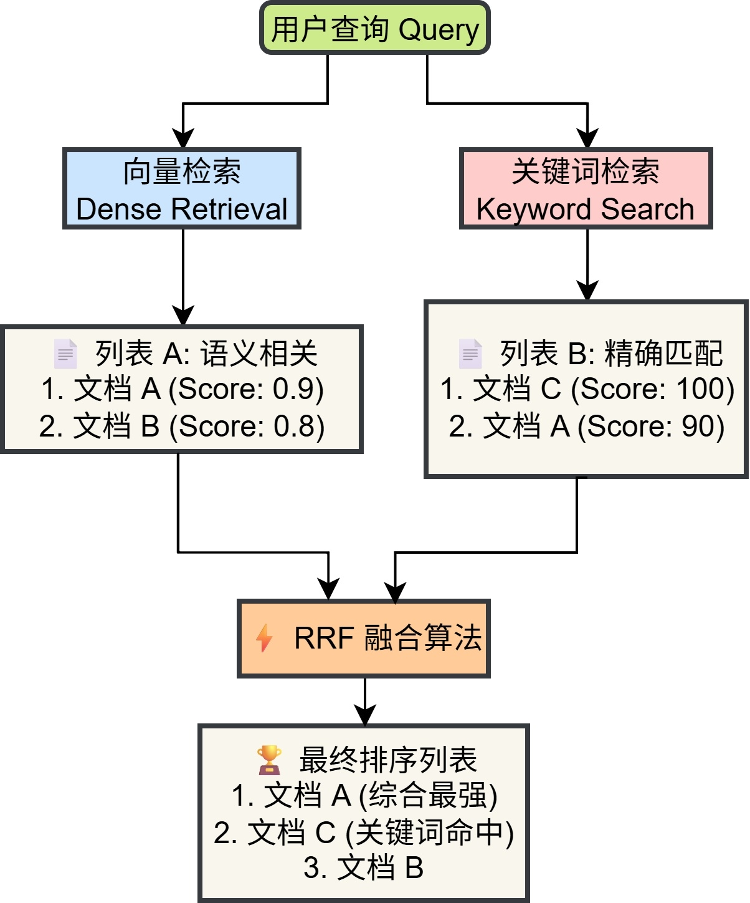
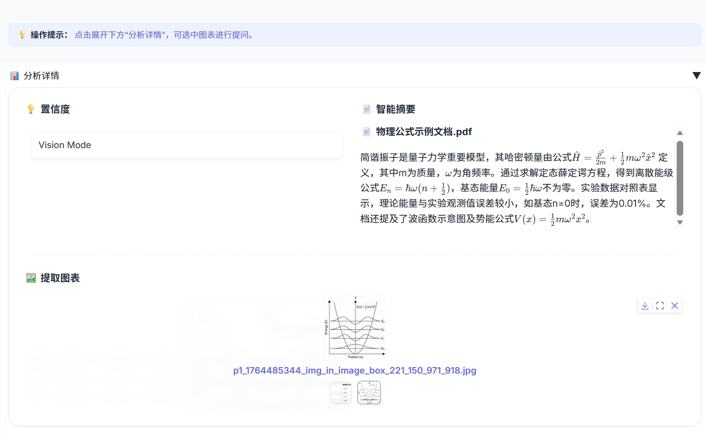
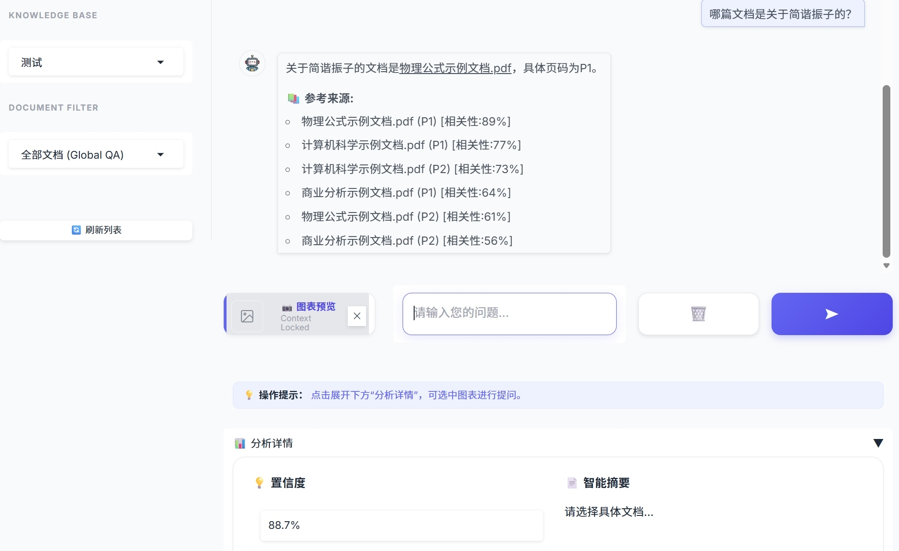
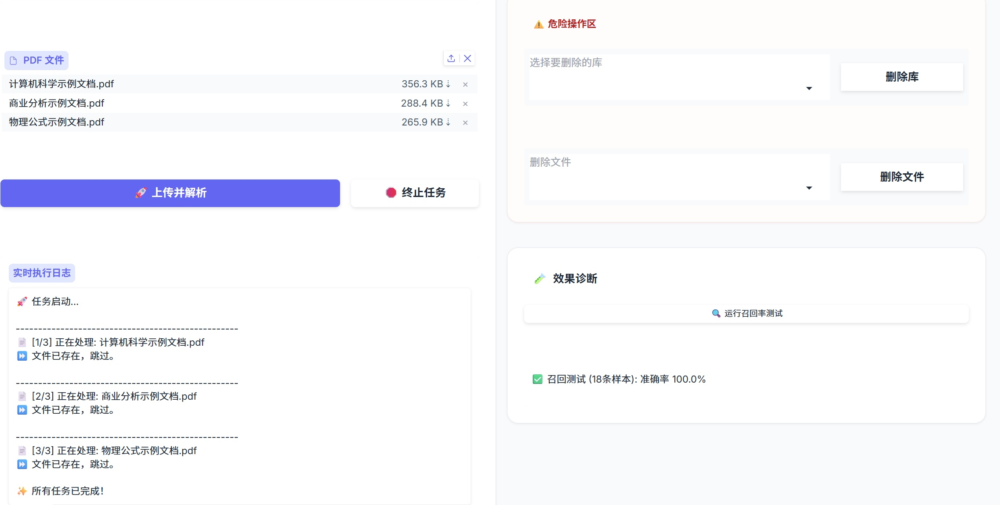
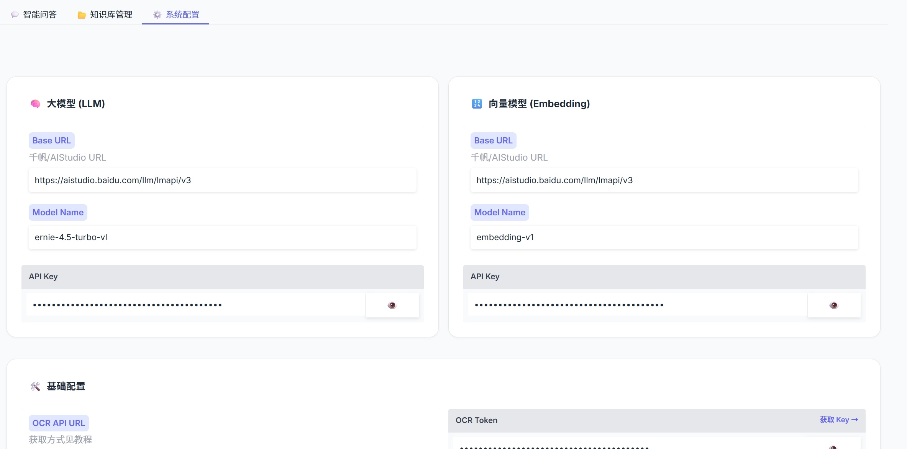

## 引言

在大型语言模型（LLM）的应用落地中，RAG（检索增强生成）是解决模型幻觉和知识时效性的关键技术。本博客将对本多文档高精度智能分析与问答系统的关键技术进行说明介绍。该系统集成了 **在线 OCR 解析**、**Milvus 混合检索（向量+关键词）** 以及 **多维度的重排序（Reranker）** 策略，旨在提升低资源环境下的检索准确率，以实现高精度多文档分析与问答。

## 1. 系统架构概览

本项目的系统主要由四个核心模块组成：

1. **数据提取层**：使用在线 OCR API 进行高精度的文档布局分析（Layout Parsing）。
2. **存储层**：利用 Milvus 向量数据库存储 Dense Embedding，同时维护倒排索引以支持关键词检索。
3. **检索与问答层**：实现向量检索与关键词检索的加权融合（RRF），集成 ERNIE 大模型 API 接口生成回答。
4. **应用层**：基于 Gradio 构建交互界面。
<div style="display: flex; justify-content: center;">
  
</div>

### 🔗 项目资源

- 🐙 GitHub 代码仓库：[点击访问](https://github.com/LiaoYFBH/Paddle-ERNIE-RAG)

- 🚀 星河社区在线应用：[立即体验](https://aistudio.baidu.com/application/detail/107183)

- 📓 星河社区 Notebook：[在线运行](https://aistudio.baidu.com/project/edit/9812333)

## 2. 关键技术实现

### 2.1 PP-StructureV3 文档解析

针对科研论文中常见的双栏排版、公式混排及图表嵌入问题，传统的 PyPDF2 等纯文本提取工具往往力不从心（容易导致段落乱序、表格崩坏）。

为此，本项目在 backend.py 中封装了 OnlinePDFParser 类，直接集成 PP-StructureV3 在线 API 进行高精度的文档布局分析（Layout Parsing）。

该方案具备三大核心优势：

- **结构化输出**：直接返回 Markdown 格式（自动识别标题层级、段落边界）。

- **图表提取**：在解析文本的同时，自动提取文档中的图片并转存，为后续的“多模态问答”提供素材。

- **上下文保留**：基于滑动窗口进行切分，防止关键信息在切片边界丢失。

#### 2.1.1 核心解析逻辑

在 backend.py 中，我们构建了 API 请求，将 PDF 文件流发送至服务端，并解析返回的 layoutParsingResults，提取出清洗后的 Markdown 文本和图片资源。

```python
# backend.py (OnlinePDFParser 类核心逻辑摘要)
def predict(self, file_path):
    # 1. 文件转 Base64
    with open(file_path, "rb") as file:
        file_data = base64.b64encode(file.read()).decode("ascii")

    # 2. 构造请求 Payload
    payload = {
        "file": file_data,
        "fileType": 1, # PDF 类型
        "useChartRecognition": False, # 根据需求配置
        "useDocOrientationClassify": False
    }

    # 3. 发送请求获取 Layout Parsing 结果
    response = requests.post(self.api_url, json=payload, headers=headers)
    res_json = response.json()

    # 4. 提取 Markdown 文本与图片
    parsing_results = res_json.get("result", {}).get("layoutParsingResults", [])
    mock_outputs = []
    for item in parsing_results:
        md_text = item.get("markdown", {}).get("text", "")
        images = item.get("markdown", {}).get("images", {})
        # ... (后续图片下载与文本清洗逻辑)
        mock_outputs.append(MockResult(md_text, images))

    return mock_outputs, "Success"
```

#### 2.1.2 滑动窗口文本分块

拿到结构化的 Markdown 文本后，为了避免语义被生硬切断（例如一句话跨了两个 chunk），我们实现了一个带有 overlap（重叠区）的滑动窗口分块策略。

```python
# backend.py
def split_text_into_chunks(text: str, chunk_size: int = 300, overlap: int = 120) -> list:
    """基于滑动窗口的文本分块，保留 overlap 长度的重叠上下文"""
    if not text: return []
    lines = [line.strip() for line in text.split("\n") if line.strip()]
    chunks = []
    current_chunk = []
    current_length = 0

    for line in lines:
        while len(line) > chunk_size:
            # 处理超长单行
            part = line[:chunk_size]
            line = line[chunk_size:]
            current_chunk.append(part)
            # ... (切分逻辑) ...

        current_chunk.append(line)
        current_length += len(line)

        # 当累积长度超过阈值，生成一个 chunk
        if current_length > chunk_size:
            chunks.append("\n".join(current_chunk))
            # 回退：保留最后 overlap 长度的文本作为下一个 chunk 的开头
            overlap_text = current_chunk[-1][-overlap:] if current_chunk else ""
            current_chunk = [overlap_text] if overlap_text else []
            current_length = len(overlap_text)

    if current_chunk:
        chunks.append("\n".join(current_chunk).strip())
    return chunks
```

### 2.2 Milvus 向量库与混合检索策略

#### 2.2.1 知识库命名的工程化处理

在实际部署中，Milvus 等向量数据库对集合名称（Collection Name）通常有严格的命名限制。为了解决这一问题，我们在后端代码中实现了一套透明的编解码机制。

1. **编码 (Encode)**：当用户创建如“物理论文”的库时，系统将其 UTF-8 字节转换为 Hex 字符串，并添加 `kb_` 前缀。
2. **解码 (Decode)**：在前端展示时，自动将 Hex 字符串反解为原始中文。

```python
import binascii
import re

def encode_name(ui_name):
    """把中文名称转为 Milvus 合法的 Hex 字符串"""
    if not ui_name: return ""
    # 如果是纯英文/数字/下划线，直接返回
    if re.match(r'^[a-zA-Z_][a-zA-Z0-9_]*$', ui_name):
        return ui_name

    # Hex 编码并加前缀 kb_
    hex_str = binascii.hexlify(ui_name.encode('utf-8')).decode('utf-8')
    return f"kb_{hex_str}"

def decode_name(real_name):
    """把 Hex 字符串转回中文"""
    if real_name.startswith("kb_"):
        try:
            hex_str = real_name[3:]
            return binascii.unhexlify(hex_str).decode('utf-8')
        except:
            return real_name
    return real_name
```

#### 2.2.2 向量化入库与元数据绑定

在 OCR 解析并将长文本切分为 Chunks 后，系统并非简单地将文本存入数据库，而是执行了 **“向量化 + 元数据绑定”** 的关键步骤。

为了支持后续的精确溯源（Citation）和多模态问答，我们在设计 Milvus Schema 时，除了存储 384 维的 Dense Vector 外，还强制绑定了 filename（文件名）、page（页码）和 chunk_id（切片 ID）等标量字段。

这一过程在 vector_store.py 中通过 insert_documents 方法实现，采用批量 Embedding 策略以减少网络开销：

```python
# vector_store.py
def insert_documents(self, documents):
    """批量向量化并写入 Milvus"""
    if not documents: return

    # 1. 提取纯文本列表，批量请求 Embedding 模型
    texts = [doc['content'] for doc in documents]
    embeddings = self.get_embeddings(texts)

    # 2. 数据清洗：过滤掉 Embedding 失败的坏数据
    valid_docs, valid_vectors = [], []
    for i, emb in enumerate(embeddings):
        if emb and len(emb) == 384: # 确保向量维度正确
            valid_docs.append(documents[i])
            valid_vectors.append(emb)

    # 3. 组装列式数据 (Columnar Format)
    # Milvus insert 接口要求各字段数据以列表形式传入
    data = [
        [doc['filename'] for doc in valid_docs],  # Scalar: 文件名
        [doc['page'] for doc in valid_docs],      # Scalar: 页码 (用于溯源)
        [doc['chunk_id'] for doc in valid_docs],  # Scalar: 切片ID
        [doc['content'] for doc in valid_docs],   # Scalar: 原始内容 (用于关键词检索)
        valid_vectors                             # Vector: 语义向量
    ]

    # 4. 执行插入与持久化
    self.collection.insert(data)
    self.collection.flush()
```

#### 2.2.3 混合检索策略

检索前，系统首先利用 LLM 生成的问题的双语翻译，避免中文问题询问英文文档，使得关键词不匹配，以最大化语义覆盖。随后并行执行两路检索：

1. **Dense (向量检索)**：捕捉语义相似度（例如“简谐振子”与“弹簧振子”的语义关联）。
2. **Sparse (关键词检索)**：弥补向量模型对专有名词或精确数字匹配的不足（例如精确匹配公式中的变量名）。

向量检索容易因语义泛化而召回错误概念（如“弹簧振子”与“简谐振子”），而关键词检索能确保专有名词的精确命中，从而大幅提升准确率。

然后执行：

- **RRF (倒排融合)**：系统内部使用倒排秩融合算法 (Reciprocal Rank Fusion) 将两路结果合并，确保多样性。

<div style="display: flex; justify-content: center;">
  
</div>

```python
# vector_store.py 中的检索逻辑摘要

def search(self, query: str, top_k: int = 10, **kwargs):
   '''向量检索(Dense+Keyword)+RRF 融合'''
   # 1. 向量检索 (Dense)
   dense_results = []
   query_vector = self.embedding_client.get_embedding(query) # ... (Milvus search code) ...

    # 2. 关键词检索 (Keyword)
    # 通过 jieba 分词后构建 like "%keyword%" 查询
    keyword_results = self._keyword_search(query, top_k=top_k * 5, expr=expr)

    # 3. RRF 融合
    rank_dict = {}

    def apply_rrf(results_list, k=60, weight=1.0):
        for rank, item in enumerate(results_list):
            doc_id = item.get('id') or item.get('chunk_id')
            if doc_id not in rank_dict:
                rank_dict[doc_id] = {"data": item, "score": 0.0}
            # RRF 核心公式
            rank_dict[doc_id]["score"] += weight * (1.0 / (k + rank))

    apply_rrf(dense_results, weight=4.0)
    apply_rrf(keyword_results, weight=1.0)

    # 4. 排序输出
    sorted_docs = sorted(rank_dict.values(), key=lambda x: x['score'], reverse=True)
    return [item['data'] for item in sorted_docs[:top_k * 2]]

```

### 2.3 综合重排序算法

检索回来的片段（Chunks）需要进一步精排。在 `reranker_v2.py` 中，设计了一套综合打分算法。
评分维度包括：

1. **模糊匹配（Fuzzy Score）**：使用 `fuzzywuzzy` 计算 Query 与 Content 的字面重合度。

2. **关键词覆盖率（Keyword Coverage）**：计算 Query 中的核心词在文档片段中的出现比例。

3. **语义相似度**：来自 Milvus 的原始向量距离。

4. **长度惩罚与位置偏置**：对过短的片段进行惩罚，对 Milvus 召回的排名靠前的片段给予位置奖励。

5. **专有名词**：
   - **英文（看“大小写”特征）：** 使用正则 `\b[A-Z][a-z]+\b|[A-Z]{2,}`，专门匹配**首字母大写**的单词（如 "Milvus"）或**全大写**的缩写（如 "RAG"），因为在英文中这些通常代表专有名词。

   - **中文（看“连续性”特征）：** 由于中文没有大小写，策略变成了 **“切分+长度”**：使用非中文字符作为分隔符切断句子，保留所有连续出现 2 个及以上的汉字片段（如“简谐振子”），将其视为潜在实体。

具体的分数占比见下图：

<div style="display: flex; justify-content: center;">
   
</div>

这种基于规则与语义结合的重排序策略，在无训练数据的情况下，比纯黑盒模型更具可解释性。

```python
# reranker_v2.py

def _calculate_composite_score(self, query: str, chunk: Dict[str, Any]) -> float:
    content = chunk.get('content', '')

    # 1. 字面重合度 (FuzzyWuzzy)
    fuzzy_score = fuzz.partial_ratio(query, content)

    # 2. 关键词覆盖率
    query_keywords = self._extract_keywords(query)
    content_keywords = self._extract_keywords(content)
    keyword_coverage = (len(query_keywords & content_keywords) / len(query_keywords)) * 100 if query_keywords else 0

    # 3. 向量语义分 (归一化)
    milvus_distance = chunk.get('semantic_score', 0)
    milvus_similarity = 100 / (1 + milvus_distance * 0.1)

    # 4. 长度惩罚 (偏好 200-600 字的段落)
    content_len = len(content)
    if 200 <= content_len <= 600:
        length_score = 100
    else:
        # ... (惩罚逻辑)
        length_score = 100 - min(50, abs(content_len - 400) / 20)

    # 加权求和
    base_score = (
        fuzzy_score * 0.25 +
        keyword_coverage * 0.25 +
        milvus_similarity * 0.35 +
        length_score * 0.15
    )

    # 位置权重
    position_bonus = 0
    if 'milvus_rank' in chunk:
        rank = chunk['milvus_rank']
        position_bonus = max(0, 20 - rank)

    # 专有名词额外加分 (Bonus)
    proper_noun_bonus = 30 if self._check_proper_nouns(query, content) else 0

    return base_score + proper_noun_bonus

```

### 2.4 API 速率限制与自适应保护

在调用 LLM 或 Embedding 服务时，偶尔会遇到 `429 Too Many Requests`。本项目在 `ernie_client.py` 中实现了自适应降速机制：

```Python
# 遇到限流时的处理逻辑
if is_rate_limit:
    self._adaptive_slow_down() # 永久增加请求间隔
    wait_time = (2 ** attempt) + random.uniform(1.0, 3.0) # 指数退避
    time.sleep(wait_time)

def _adaptive_slow_down(self):
    """触发自适应降级：遇到限流时，永久增加全局请求间隔"""
    self.current_delay = min(self.current_delay * 2.0, 15.0)
    logger.warning(f"📉 触发速率限制(429)，系统自动降速: 新间隔 {self.current_delay:.2f}s")
```

这保证了系统在大批量文档入库时的稳定性。

### 2.5 多模态问答

针对科研文档中包含大量关键图表（如实验数据、模型架构）的特点，本系统实现了“图表锁定”问答功能。核心技术实现包含以下三个维度：

1. **上下文增强 Prompt**
   后端在构建请求时，不仅发送图片本身，还检索该图片所在页面的 OCR 文本作为背景信息（Context）。Prompt 结构动态拼装了“图片元数据 + 背景文本 + 用户问题”，有效提升了模型对图表细节与上下文关联的理解能力。

   ```python
   # backend.py - 多模态问答核心逻辑

   # 1. 检索当前页面的 OCR 文本作为背景 (Context)
   # 系统根据文件名和页码，从 Milvus 中拉取该图所在的完整页面文本
   # page_num 来自前端图片文件名的解析 (e.g., "p3_figure.jpg" -> Page 3)
   page_text_context = milvus_store.get_page_content(doc_name, page_num)[:800]

   # 2. 动态拼装 Context-Enhanced Prompt
   # 关键点：将"视觉信息"与"文本背景"强制对齐，防止模型看图说话产生幻觉
   final_prompt = f"""
   【任务】结合图片和背景信息回答问题。
   【图片元数据】来源：{doc_name} (P{page_num})
   【背景文本】{page_text_context} ... (此处省略长文本)
   【用户问题】{user_question}
   """

   # 3. 发送多模态请求 (Vision API)
   # 底层会将图片转为 Base64，与 final_prompt 一起发给 ERNIE-VL 模型
   answer = ernie_client.chat_with_image(query=final_prompt, image_path=img_path)
   ```

2. **Vision 接口封装**
   底层客户端（`ernie_client.py`）实现了 OpenAI 兼容的视觉协议。系统自动读取本地图片并转换为 Base64 编码，通过 `image_url` 格式构建多模态消息体，实现了图像数据与文本指令的联合推理。

   ```python
   # ernie_client.py

   def chat_with_image(self, query: str, image_path: str):
      base64_image = self._encode_image(image_path)

      # 构造 Vision 消息格式
      messages = [
         {
               "role": "user",
               "content": [
                  {"type": "text", "text": query},
                  {
                     "type": "image_url",
                     "image_url": {
                           "url": f"data:image/jpeg;base64,{base64_image}"
                     }
                  }
               ]
         }
      ]
      return self.chat(messages)
   ```

3. **降级策略**
   为保障系统的高可用性，`backend.py` 中设计了自动回退机制。若多模态接口调用异常（如模型不支持或网络错误），系统将自动捕获异常并无缝切换至标准文本 RAG 通道，利用 OCR 文本继续回答，确保用户对话流程不中断。

   ```python
   # backend.py 中的降级逻辑

   try:
      answer = ernie.chat_with_image(final_prompt, img_path)
      # ...
   except Exception as e:
      print(f"⚠️ 模型不支持图片，准备切换至文本模式。")
      # 降级：使用提取出的文本作为 Context 继续问答
      answer, metric = ask_question_logic(final_prompt, collection_name)
   ```

## 3. 界面交互与效果

### 3.1 深度 CSS 定制

前端基于 Gradio 搭建（`main.py`），采用自定义 CSS (`modern_css`) 搭建了美观的 UI 界面。重点改进了输入区域的视觉层级：将默认的灰色背景改为白底圆角卡片，并为发送按钮添加了渐变色与悬浮阴影，使其在视觉上更加现代与聚焦。

```css
/* main.py - modern_css 片段 */

/* 强制输入框白底圆角，模拟现代 Chat APP */
.custom-textbox textarea {
   background-color: #ffffff !important;
   border: 1px solid #e5e7eb !important;
   border-radius: 12px !important;
   box-shadow: 0 4px 12px rgba(0, 0, 0, 0.05) !important;
   padding: 14px !important;
}

/* 渐变色发送按钮 */
.send-btn {
   background: linear-gradient(135deg, #6366f1 0%, #4f46e5 100%) !important;
   color: white !important;
   box-shadow: 0 4px 10px rgba(99, 102, 241, 0.3) !important;
}
```

### 3.2 LaTeX 公式渲染

为了保证公式在 UI 界面上能正常渲染出来，首先定义一套完整的 LaTeX 识别规则，涵盖行内与行间公式.这套配置被同时配置到对话框（Chatbot）和摘要区（Markdown），确保无论是模型的回答还是文档的摘要，公式都能被渲染：

```python
# main.py 配置 LaTeX 规则
latex_config = [
    {"left": "$$", "right": "$$", "display": True},   # 识别行间公式
    {"left": "$", "right": "$", "display": False},    # 识别行内公式
    {"left": "\\(", "right": "\\)", "display": False}, # 标准 LaTeX 行内
    {"left": "\\[", "right": "\\]", "display": True}   # 标准 LaTeX 行间
]
```

随后，在实例化组件时将此配置注入：

```python
# 在 Chatbot 中启用 LaTeX
chatbot = gr.Chatbot(
    label="Conversation",
    # ... 其他参数 ...
    latex_delimiters=latex_config  # 关键配置：启用公式渲染
)

# 在摘要显示区启用 LaTeX
doc_summary = gr.Markdown(
    value="*暂无摘要*",
    latex_delimiters=latex_config
)
```

### 3.3 可解释性设计

在实际体验中，为了打破 RAG 系统的“黑盒”属性，本应用在界面中设计了两个维度的评价指标，分别对应微观与宏观视角：

- **相关性 (Relevance)**：出现在聊天框的【参考来源】列表中。这是一个**微观指标**，它直接展示了 `Reranker` 给每一个具体文档切片打出的 `composite_score`（基于向量+关键词+规则的综合得分）。它的作用是告诉用户：_“为什么系统引用了第 3 页这段话，而不是第 5 页那段？”_

```python
# backend.py - 构建参考来源列表
sources = "\n\n📚 **参考来源:**\n"
for c in final:
    # ... (去重逻辑) ...
    # 直接 Reranker 计算出的单片得分
    sources += f"- {key} [相关性:{c.get('composite_score',0):.0f}%]\n"
```

- **置信度 (Confidence)**：展示在【分析详情】面板中。这是一个**宏观指标**，系统提取 **Top-1 切片**的得分并进行归一化（Capped at 100%）作为本次问答的整体评分。它的作用是预警：_“系统对自己生成的答案有多大把握？”_ 如果置信度低于 60%，即便模型生成的文字再通顺，用户也应警惕可能存在的“幻觉”风险。

```python
# backend.py - 计算整体置信度
# 1. 获取重排序后的 Top-1 片段
final = processed[:22]
top_score = final[0].get('composite_score', 0) if final else 0

# 2. 归一化处理 (封顶 100%)，作为本次问答的"置信度"
metric = f"{min(100, top_score):.1f}%"
```

实现的 UI 界面效果如下，在回答中显示了相应来源向量的页数和相关性：






## 4. 总结

### 4.1 功能亮点

- **高精度问答**：集成 百度文心一言（ERNIE Bot） 大模型 API，利用 ERNIE 大模型卓越的语义理解与生成能力，配合“向量+关键词”双路混合检索与 RRF 重排序算法，确保回答的精准度与鲁棒性。
- **多知识库管理**：支持动态创建、切换和删除知识库。
- **召回率自测**：内置 `test_self_recall` 函数，自动从库中抽取样本验证检索准确率。
- **实时反馈**：上传大文件时，通过进度条实时显示 OCR 解析与 Embedding 入库进度。

### 4.2 未来改进

通过结合 Milvus 的向量能力与传统的关键词匹配技术，并辅以细粒度的重排序策略，本系统在低成本下实现了较高精度的文档问答。未来的优化方向将集中在：

- 引入本地 BGE-Reranker 模型替代规则打分。
- 利用提取的图片信息增强多模态问答能力。

## 致谢

衷心感谢张晶老师帮助我理解项目需要实现的目标，并给予在系统设计与实现细节上的指导，使得我能够完成项目。

感谢杨有志老师在星河社区部署上线过程中的大力支持。

感谢李成龙老师在 Milvus 向量检索方面提出的建议。

很荣幸参与启航计划（第 6 期），未来我将持续深耕，为开源社区贡献更多力量。
