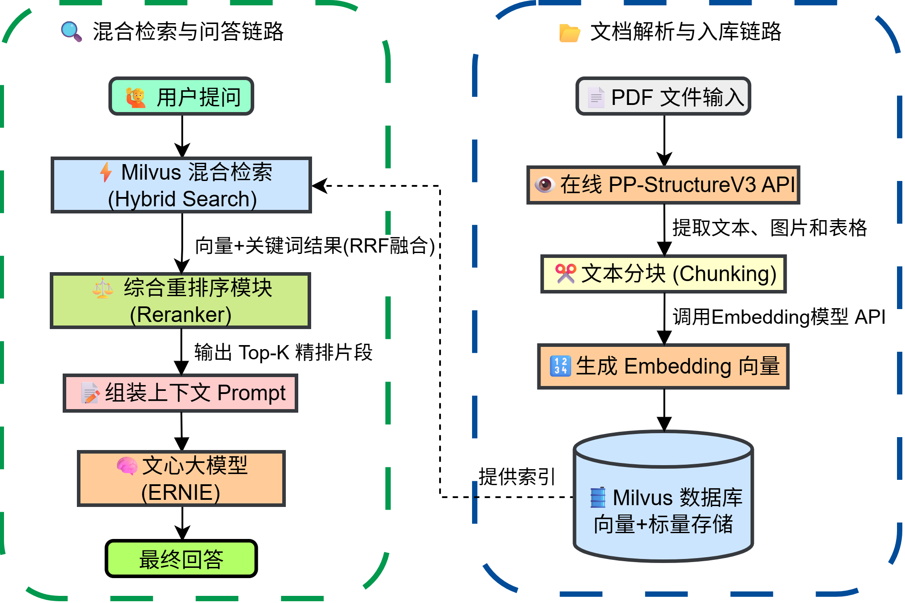
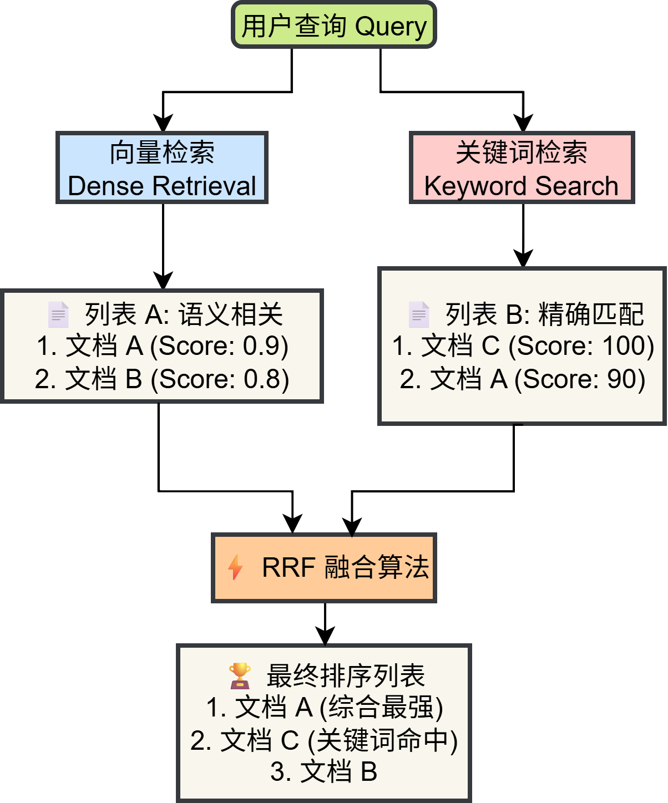
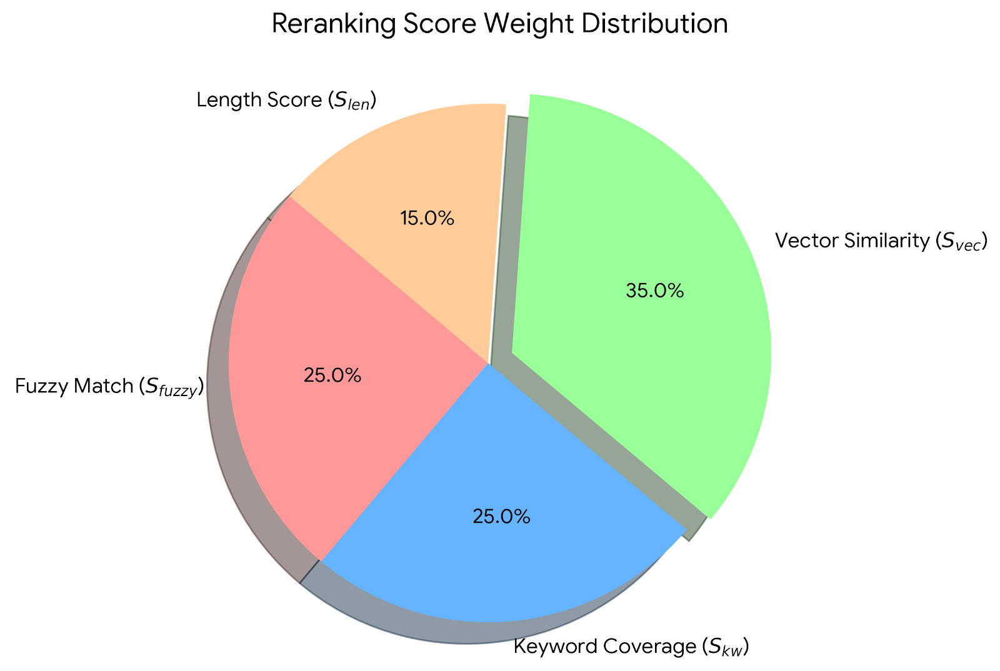
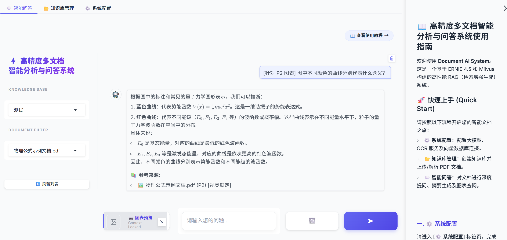
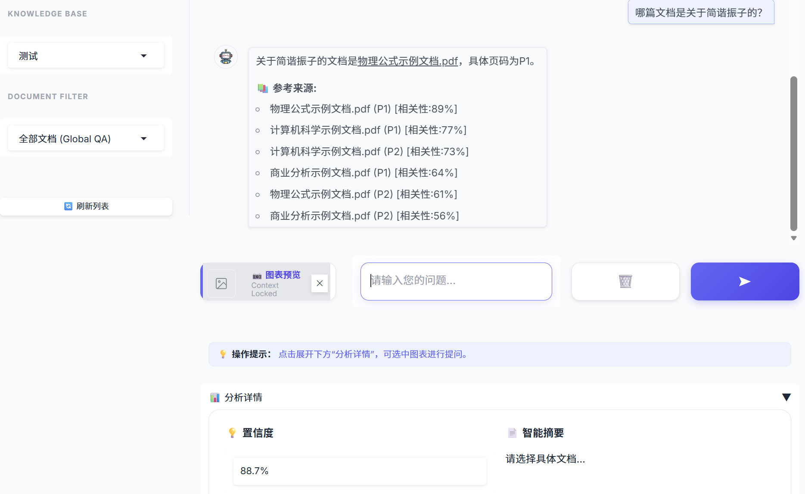
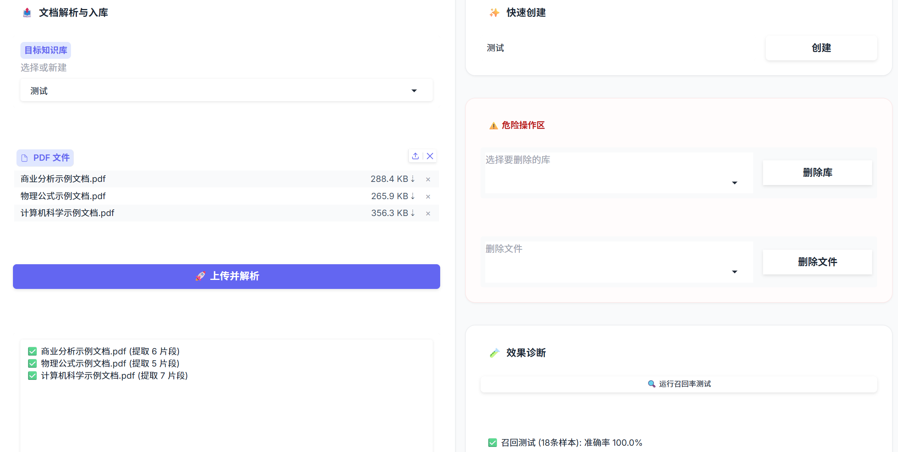
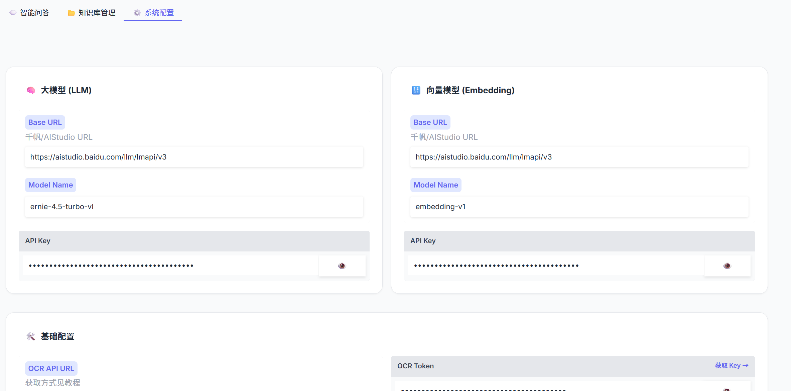

# 构建基于百度文心 ERNIE 与 Milvus 的高精度多文档分析与问答系统

## 项目介绍

在大型语言模型（LLM）的应用落地中，RAG（检索增强生成）是解决模型幻觉和知识时效性的关键技术。然而，面对复杂的 PDF 文档和专业领域的查询，简单的“分块+向量检索”往往难以满足精度要求。

本文将介绍一个基于 Python 开发的多文档智能分析与问答系统。该系统集成了 **在线 OCR 解析**、**Milvus 混合检索（向量+关键词）** 以及 **多维度的重排序（Reranker）** 策略，旨在提升低资源环境下的检索准确率。

## 🔗 项目资源

- 🐙 GitHub 代码仓库：[点击访问](https://github.com/LiaoYFBH/Paddle-ERNIE-RAG)

- 🚀 星河社区在线应用：[立即体验]()

- 📓 星河社区 Notebook：[在线运行]()

## 1. 系统架构概览

本项目的系统主要由四个核心模块组成：

1. **数据摄入层**：使用在线 OCR API 进行高精度的文档布局分析（Layout Parsing）。
2. **存储层**：利用 Milvus 向量数据库存储 Dense Embedding，同时维护倒排索引以支持关键词检索。
3. **检索层**：实现向量检索与关键词检索的加权融合（RRF）。
4. **应用层**：基于 Gradio 构建交互界面，集成ERNIE大模型API接口生成回答。



## 2. 关键技术实现

### 2.1 Milvus 向量库与混合检索策略

#### 知识库命名的工程化处理

在实际部署中，Milvus 等向量数据库对集合名称（Collection Name）通常有严格的命名限制。为了解决这一问题，我们在后端代码中实现了一套透明的编解码机制。

1. **编码 (Encode)**：当用户创建如“物理论文”的库时，系统将其 UTF-8 字节转换为 Hex 字符串，并添加 `kb_` 前缀。
2. **解码 (Decode)**：在前端展示时，自动将 Hex 字符串反解为原始中文。

```python
import binascii
import re

def encode_name(ui_name):
    """把中文名称转为 Milvus 合法的 Hex 字符串"""
    if not ui_name: return ""
    # 如果是纯英文/数字/下划线，直接返回
    if re.match(r'^[a-zA-Z_][a-zA-Z0-9_]*$', ui_name):
        return ui_name

    # Hex 编码并加前缀 kb_
    hex_str = binascii.hexlify(ui_name.encode('utf-8')).decode('utf-8')
    return f"kb_{hex_str}"

def decode_name(real_name):
    """把 Hex 字符串转回中文"""
    if real_name.startswith("kb_"):
        try:
            hex_str = real_name[3:]
            return binascii.unhexlify(hex_str).decode('utf-8')
        except:
            return real_name
    return real_name
```

#### 混合检索策略

检索前，系统首先利用LLM 生成的问题的双语翻译，避免中文问题询问英文文档，使得关键词不匹配，以最大化语义覆盖。随后并行执行两路检索：

1. **Dense (向量检索)**：捕捉语义相似度（例如“简谐振子”与“弹簧振子”的语义关联）。
2. **Sparse (关键词检索)**：弥补向量模型对专有名词或精确数字匹配的不足（例如精确匹配公式中的变量名）。

然后执行：

- **RRF (倒排融合)**：系统内部使用倒排秩融合算法 (Reciprocal Rank Fusion) 将两路结果合并，确保多样性。

<div style="display: flex; justify-content: center;">
  
</div>

```python
# vector_store.py 中的检索逻辑摘要

def search(self, query: str, top_k: int = 10, \*\*kwargs):
   '''向量检索(Dense+Keyword)+RRF 融合'''
   # 1. 向量检索 (Dense)
   dense_results = []
   query_vector = self.embedding_client.get_embedding(query) # ... (Milvus search code) ...

    # 2. 关键词检索 (Keyword)
    # 通过 jieba 分词后构建 like "%keyword%" 查询
    keyword_results = self._keyword_search(query, top_k=top_k * 5, expr=expr)

    # 3. RRF 融合
    rank_dict = {}

    def apply_rrf(results_list, k=60, weight=1.0):
        for rank, item in enumerate(results_list):
            doc_id = item.get('id') or item.get('chunk_id')
            if doc_id not in rank_dict:
                rank_dict[doc_id] = {"data": item, "score": 0.0}
            # RRF 核心公式
            rank_dict[doc_id]["score"] += weight * (1.0 / (k + rank))

    apply_rrf(dense_results, weight=1.0)
    apply_rrf(keyword_results, weight=3.0)  # 关键词路权重更高

    # 4. 排序输出
    sorted_docs = sorted(rank_dict.values(), key=lambda x: x['score'], reverse=True)
    return [item['data'] for item in sorted_docs[:top_k * 2]]

```

### 2.2 鲁棒的重排序算法 (Robust Reranking)

检索回来的片段（Chunks）需要进一步精排。在 `reranker_v2.py` 中，设计了一套综合打分算法。
评分维度包括：

1. **模糊匹配（Fuzzy Score）**：使用 `fuzzywuzzy` 计算 Query 与 Content 的字面重合度。
2. **关键词覆盖率（Keyword Coverage）**：计算 Query 中的核心词在文档片段中的出现比例。
3. **语义相似度**：来自 Milvus 的原始向量距离。
4. **长度惩罚与位置偏置**：对过短的片段进行惩罚，对排名靠前的片段给予位置奖励。

这种基于规则与语义结合的重排序策略，在无训练数据的情况下，比纯黑盒模型更具可解释性和鲁棒性。

<div style="display: flex; justify-content: center;">
  
</div>

```python
# reranker_v2.py

def _calculate_composite_score(self, query: str, chunk: Dict[str, Any]) -> float:
content = chunk.get('content', '')

    # 1. 字面重合度 (FuzzyWuzzy)
    fuzzy_score = fuzz.partial_ratio(query, content)

    # 2. 关键词覆盖率
    query_keywords = self._extract_keywords(query)
    content_keywords = self._extract_keywords(content)
    keyword_coverage = (len(query_keywords & content_keywords) / len(query_keywords)) * 100 if query_keywords else 0

    # 3. 向量语义分 (归一化)
    milvus_distance = chunk.get('semantic_score', 0)
    milvus_similarity = 100 / (1 + milvus_distance * 0.1)

    # 4. 长度惩罚 (偏好 200-600 字的段落)
    content_len = len(content)
    if 200 <= content_len <= 600:
        length_score = 100
    else:
        # ... (惩罚逻辑)
        length_score = 100 - min(50, abs(content_len - 400) / 20)

    # 加权求和
    base_score = (
        fuzzy_score * 0.25 +
        keyword_coverage * 0.25 +
        milvus_similarity * 0.35 +
        length_score * 0.15
    )

    # 专有名词额外加分 (Bonus)
    proper_noun_bonus = 30 if self._check_proper_nouns(query, content) else 0

    return base_score + proper_noun_bonus

```

### 2.3 PP-StructureV3文档解析

为了处理包含复杂排版和图表的文档，本项目在 `backend.py` 中集成了在线PP-StructureV3的API进行文档解析。

与传统 PyPDF2 等库不同，PP-StructureV3不仅能提取文本，还能：

- 识别 Markdown 结构（标题、段落）。
- 提取文档中的图片并保存，便于后续多模态扩展。
- 通过 `split_text_into_chunks` 实现基于滑动窗口的文本分块，保留上下文重叠（Overlap）。

```python
# backend.py
def split_text_into_chunks(text: str, chunk_size: int = 300, overlap: int = 120) -> list:
    """基于滑动窗口的文本分块，保留 overlap 长度的重叠上下文"""
    if not text: return []
    lines = [line.strip() for line in text.split("\n") if line.strip()]
    chunks = []
    current_chunk = []
    current_length = 0

    for line in lines:
        while len(line) > chunk_size:
            # 处理超长单行
            part = line[:chunk_size]
            line = line[chunk_size:]
            current_chunk.append(part)
            # ... (切分逻辑) ...

        current_chunk.append(line)
        current_length += len(line)

        # 当累积长度超过阈值，生成一个 chunk
        if current_length > chunk_size:
            chunks.append("\n".join(current_chunk))
            # 回退：保留最后 overlap 长度的文本作为下一个 chunk 的开头
            overlap_text = current_chunk[-1][-overlap:] if current_chunk else ""
            current_chunk = [overlap_text] if overlap_text else []
            current_length = len(overlap_text)

    if current_chunk:
        chunks.append("\n".join(current_chunk).strip())
    return chunks
```

### 2.4 API 速率限制与自适应保护

在调用 LLM 或 Embedding 服务时，偶尔会遇到 `429 Too Many Requests`。本项目在 `ernie_client.py` 中实现了自适应降速机制：

```Python
# 遇到限流时的处理逻辑
if is_rate_limit:
    self._adaptive_slow_down() # 永久增加请求间隔
    wait_time = (2 ** attempt) + random.uniform(1.0, 3.0) # 指数退避
    time.sleep(wait_time)
```

这保证了系统在大批量文档入库时的稳定性。

## 2.5 多模态问答

针对科研文档中包含大量关键图表（如实验数据、模型架构）的特点，本系统实现了“图表锁定”问答功能。核心技术实现包含以下三个维度：

1. **上下文增强 Prompt**
   后端在构建请求时，不仅发送图片本身，还检索该图片所在页面的 OCR 文本作为背景信息（Context）。Prompt 结构动态拼装了“图片元数据 + 背景文本 + 用户问题”，有效提升了模型对图表细节与上下文关联的理解能力。

2. **Vision 接口封装**
   底层客户端（`ernie_client.py`）实现了 OpenAI 兼容的视觉协议。系统自动读取本地图片并转换为 Base64 编码，通过 `image_url` 格式构建多模态消息体，实现了图像数据与文本指令的联合推理。

   ```python
   # ernie_client.py

   def chat_with_image(self, query: str, image_path: str):
      base64_image = self._encode_image(image_path)

      # 构造 Vision 消息格式
      messages = [
         {
               "role": "user",
               "content": [
                  {"type": "text", "text": query},
                  {
                     "type": "image_url",
                     "image_url": {
                           "url": f"data:image/jpeg;base64,{base64_image}"
                     }
                  }
               ]
         }
      ]
      return self.chat(messages)
   ```

3. **降级策略**
   为保障系统的高可用性，`backend.py` 中设计了自动回退机制。若多模态接口调用异常（如模型不支持或网络错误），系统将自动捕获异常并无缝切换至标准文本 RAG 通道，利用 OCR 文本继续回答，确保用户对话流程不中断。

   ```python
   # backend.py 中的降级逻辑

   try:
      answer = ernie.chat_with_image(final_prompt, img_path)
      # ...
   except Exception as e:
      print(f"⚠️ 模型不支持图片，准备切换至文本模式。")
      # 降级：使用提取出的文本作为 Context 继续问答
      answer, metric = ask_question_logic(final_prompt, collection_name)
   ```

## 3. 界面交互与效果

前端基于 Gradio 搭建（`main.py`），采用自定义 CSS (`modern_css`) 搭建了美观的UI界面。

```python
/* main.py - modern_css 片段 */

/* 强制输入框白底圆角，模拟现代 Chat APP */
.custom-textbox textarea {
    background-color: #ffffff !important;
    border: 1px solid #e5e7eb !important;
    border-radius: 12px !important;
    box-shadow: 0 4px 12px rgba(0,0,0,0.05) !important;
    padding: 14px !important;
}

/* 渐变色发送按钮 */
.send-btn {
    background: linear-gradient(135deg, #6366f1 0%, #4f46e5 100%) !important;
    color: white !important;
    box-shadow: 0 4px 10px rgba(99, 102, 241, 0.3) !important;
}
```

为了保证公式在UI界面上能正常渲染出来，首先定义一套完整的 LaTeX 识别规则，涵盖行内与行间公式：

```python
# main.py 配置 LaTeX 规则
latex_config = [
    {"left": "$$", "right": "$$", "display": True},   # 识别行间公式
    {"left": "$", "right": "$", "display": False},    # 识别行内公式
    {"left": "\\(", "right": "\\)", "display": False}, # 标准 LaTeX 行内
    {"left": "\\[", "right": "\\]", "display": True}   # 标准 LaTeX 行间
]
```

随后，在实例化组件时将此配置注入：

```python
# 在 Chatbot 中启用 LaTeX
chatbot = gr.Chatbot(
    label="Conversation",
    # ... 其他参数 ...
    latex_delimiters=latex_config  # 关键配置：启用公式渲染
)

# 在摘要显示区启用 LaTeX
doc_summary = gr.Markdown(
    value="*暂无摘要*",
    latex_delimiters=latex_config
)
```

功能亮点：

- **高精度问答**：集成 百度文心一言（ERNIE Bot） 大模型API，利用ERNIE大模型卓越的语义理解与生成能力，配合“向量+关键词”双路混合检索与 RRF 重排序算法，确保回答的精准度与鲁棒性。
- **多知识库管理**：支持动态创建、切换和删除知识库。
- **召回率自测**：内置 `test_self_recall` 函数，自动从库中抽取样本验证检索准确率。
- **实时反馈**：上传大文件时，通过进度条实时显示 OCR 解析与 Embedding 入库进度。

实现的UI界面效果如下：






## 4. 总结

通过结合 Milvus 的向量能力与传统的关键词匹配技术，并辅以细粒度的重排序策略，本系统在低成本下实现了较高精度的文档问答。未来的优化方向将集中在：

- 引入本地 BGE-Reranker 模型替代规则打分。
- 利用提取的图片信息增强多模态问答能力。

## 致谢

衷心感谢张晶老师帮助我理解项目需要实现的目标，并给予在系统设计与实现细节上的指导，使得我能够完成项目。

感谢杨有志老师在星河社区部署上线过程中的大力支持。

感谢李成龙老师在Milvus向量检索方面提出的建议。

很荣幸参与启航计划（第6期），未来我将持续深耕，为开源社区贡献更多力量。
