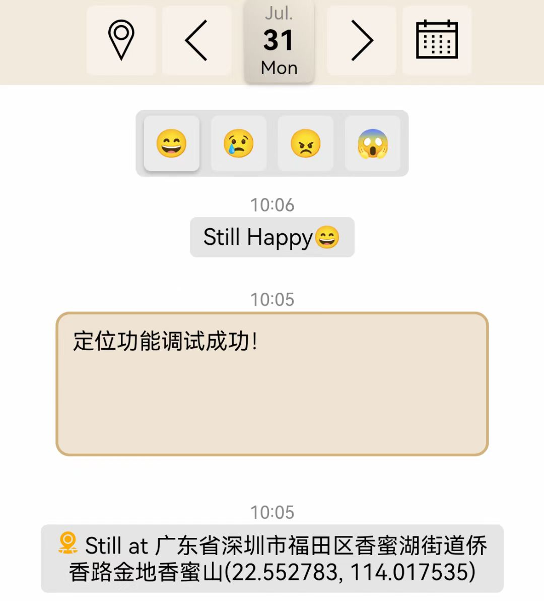
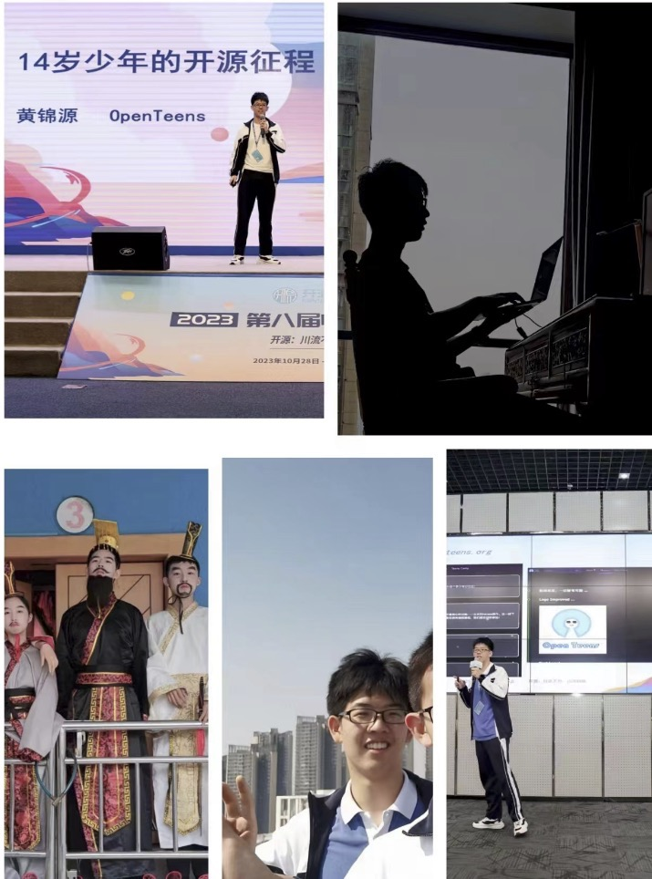
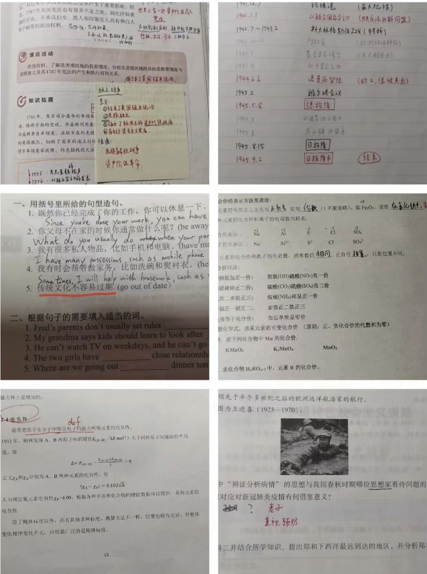
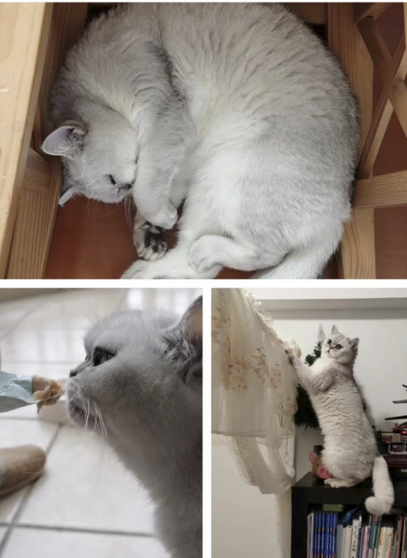

他来了，他来了，他带着满满的故事，迈着自信的步伐向我们走来了！虽然刚满 15 岁，但**小小黄瓜**的开源史却已有好几年！学校趣事？开源经历？迷人帅照？成山作业？你都能在本篇博客看到！

<!-- more -->

<!-- 导入聊天框功能 -->

<!-- 图例样式 -->

## 一、前言

**Berniehuang2008**（人送外号：黄瓜），是深圳一位 15 岁的初中生，同时也是 OpenTeens（全国甚至全世界第一个青少年开源社区）创始人之一。黄瓜曾贡献过开源项目 SearXNG 和 GestureX 等，是一位优秀的青少年开发者。他在 10 月加入 Paddle 社区，并且以迅雷不及掩耳之势合入 PR，成为 Paddle 社区的 contributor。现在，他正在准备参加 Paddle 黑客松，让我们一起看看他的故事吧😀~

## 二、采访内容

1. **简单介绍一下自己吧！**

   <MessageBox>
   <Message name="黄瓜🥒" github="Berniehuang2008">
   我叫黄锦源，外号黄瓜，是深圳的一个初三学生。
   </Message>
   </MessageBox>

2. **现在是一名初三学生，课程学习忙么？有什么喜欢的科目没有？😁😁**

   <MessageBox>
   <Message name="黄瓜🥒" github="Berniehuang2008">
   忙啊，当然忙。每天周考，从四点半考到六点，放学回家一堆卷子烦的要死。最喜欢的是数学，没有原因，就是喜欢😳。
   </Message>
   </MessageBox>

3. **学校最近有什么有趣的事情可以和大家分享一下！**

   <MessageBox>
   <Message name="黄瓜🥒" github="Berniehuang2008">
   emmm，有趣的事情？没啥，天天考试有啥有趣的。。。不过昨天我还骑车来着，扫了一辆小黄车就一路骑到深圳湾，14 公里，挺开心的。我们几个朋友还去烧纸，哇塞，烧数学书真解气！（黄瓜自注：我们数学课从来不用书）
   </Message>
   </MessageBox>

4. **当初你是如何被编程和开源世界吸引的？是什么驱使你成为了一名青少年开发者和开源社区创始人呢？**

   <MessageBox>
   <Message name="黄瓜🥒" github="Berniehuang2008">
   我是从 Scratch 学起的，一开始就感觉 Scratch 这玩意很有意思，想让他干啥他就干啥，有一种掌控世界的感觉。后来，Scratch 写了一百多个游戏之后玩无聊了，转行 Python，才发现这玩意比 Scratch 好玩 10086 倍！
    
   初一的时候，被我们学校信竞老师征召入伍，但我对竞赛类的东西不感冒，学了一年就退坑了。
   </Message>
   </MessageBox>

5. **之前看你的 GitHub 主页里，有对 SearXNG 提交过 PR，这是一个怎样的项目？你在 SearXNG 项目中的具体贡献是什么？你最喜欢的部分是什么？这个经历让你有什么样的收获？**

   <MessageBox>
   <Message name="黄瓜🥒" github="Berniehuang2008">
   SearXNG 是一个开源的搜索引擎，我当时对搜索引擎算法特别着迷，就找了一个，最后发现这玩意就是从 Google、Bing 上面爬数据然后整理！
    
   不过既然点进去了，索性就帮他们修个 bug 吧，结果这就成为了我第一个参与的开源项目。现在越做越深入，跟 Maintainer 已经算得上认识了 hhh
   </Message>
   </MessageBox>

   > 编者注✍️：现在初中生都已经开始接触算法了吗！

6. **除了在 SearXNG 项目中的贡献，我发现你还设计了一些开源小程序（eg：Dairy APP），能否分享一下你最引以为傲的作品是什么？你觉得这个作品的意义是什么？**

   <MessageBox>
   <Message name="黄瓜🥒" github="Berniehuang2008">
   addd，Diary app 确实是我前几周的重点。我比较喜欢创新新功能，比如说一打开就弹出一篇以往的日记，配上符合当时心情的音乐，让你朝花夕拾一下。
    
   现在嘛，我写了一个 Python 库，叫做 MercurySQLite，提供了一个高级的接口，能不用写 SQL 语句就能操作数据库，贼方便告诉你。
   </Message>
   </MessageBox>

<!-- Dairy APP -->
   

    <figure style="width: 40%;">
      
      <figcaption>Dairy APP 部分截图</figcaption>
    </figure>
   

7. **你如何了解到 Paddle 社区的，是什么吸引你加入这个社区并开始贡献？可以分享一下你和 Paddle 社区的小故事么？**

   <MessageBox>
   <Message name="黄瓜🥒" github="Berniehuang2008">
   我也忘了第一次看 Paddle 是哪年了。。。不过当时我应该处于“AI 发烧友”阶段。后来，一年前？文心不是火了吗？我就想再看看 AI，就算是对 Paddle 有了一个大概的了解吧。
    
   直到今年的中国开源年会，我不是办青少年分论坛吗？我们接下来就是教育分论坛，然后我听了梦老师的演讲，觉得“快乐开源”这档子活动挺有意思的。
    
   其实我几个月前看过黑客松，那玩意儿实在是太难了做不来，但是快乐开源就挺好的啊，又不难，改文档也能学到很多，比如说文档的语法之类的，我的那个 SQL 项目文档就是受到了这个的启发。。
   </Message>
   </MessageBox>

8. **加入 Paddle 社区后的第一次合并 PR 经历如何？有没有什么有趣的插曲或者教训🤓🤓🤓🤓？**

   <MessageBox>
   <Message name="黄瓜🥒" github="Berniehuang2008">
   哈哈哈，第一次我故意挑了一个最简单的任务做，只有几行代码，属于是投机取巧摸鱼了。。不过第二次——也就是现在正在进行的 PR——没那么轻松了。原文档的格式超级乱，我都不理解他是什么意思。然后又是 CI 的报错看不懂。。。现在差不多改完了，还有亿点点小问题，也快了
   </Message>
   </MessageBox>

   > 编者注✍️：文档任务很适合刚接触 Paddle 的开发者们，而相关的 PR 也很可能是大家在 Paddle 的第一个 PR。感兴趣可查看 ➡️[文档 Docathon 系列任务](https://github.com/PaddlePaddle/docs/issues/6165)

9. **你觉得今后 Paddle 社区对你的个人成长和技术发展有何影响？**

   <MessageBox>
   <Message name="黄瓜🥒" github="Berniehuang2008">
   Paddle 社区的技术实力肯定是没得说的。能跟这么多大佬在一起，我觉得不管是现在还是未来，都会对我有很大的影响。就比如说吧，虽然我现在还没有深入地接触到 Paddle 的技术层面，但是我只是在 PFCC 那个群里面苟着，就能学到很多东西，比如说 Paddle 的 CI 啊、代码规范啊之类的。
    
   然后我准备试着，只是试着哈，参加下一次的黑客松，或者是黑客松简单版。我相信，只需要一次任务，就可以把那一块的相关知识掌握熟练，然后社交技能也可以上来，这绝对是一举两得。
   </Message>
   </MessageBox>

10.   **作为一名青少年开发者，你一般是如何学习技术的，听说你曾经以 AI 学 AI？哈哈哈**~~

      <MessageBox>
      <Message name="黄瓜🥒" github="Berniehuang2008">
      以 AI 学 AI？试过，但是效果真的不咋地。那时候 GPT3.5 才刚出来，我问他啥都是乱答的。所以我还是觉得以前的学习方式比较好。我喜欢那种“在实际应用里学习”。也就是说，给我一个应用场景，或者是项目，然后我先想该怎么实现，遇到哪里有不懂的技术问题，再去搜，再去问别人（当然，嫌麻烦的话就问 AI /doge）
       
      我觉得这样的学习效率是最高的。
      </Message>
      </MessageBox>

11.   **在你的同龄人中，有多少人对编程和开发感兴趣？你是如何看待青少年参与开源的？**

      <MessageBox>
      <Message name="黄瓜🥒" github="Berniehuang2008">
      我的同龄人。。。如果你指的是我们学校的话。。。那么应该不多，应该不超过五个。所有学计算机的，基本上都是为了信竞。剩下的为数不多的四五个人，也只是用 GitHub 找找东西，玩玩游戏而已。
      </Message>
      </MessageBox>

12.   **你对于即将参加 Paddle 黑客松有什么样的期待和目标？你希望在黑客松中取得什么样的成绩？**
      <MessageBox>
      <Message name="黄瓜🥒" github="Berniehuang2008">
      我的目标就是试一下，看看自己的水平在哪，然后顺便学一些知识。所以？只能期待题目不要太难了 hhh
       
      至于成绩嘛，我也不奢求，能得一颗星就算是重大成就了，如果我是“有技术的”，也许可以尝试 may be 多弄一点星？？？
      </Message>
      </MessageBox>

13.   **那么在整个开源学习中，对你影响最深的是谁？为什么？（🤔🤔🤔）**

      <MessageBox>
      <Message name="黄瓜🥒" github="Berniehuang2008">
      这个问题很难答啊 hhh，说谁都不太好。
       
      但是如果要说真话，这就必须提到 SearXNG 那个搜索引擎的 Maintainer。他特别有耐心，还跟我闲聊，那段时间我初出茅庐啥也不懂，要不是他，我到现在还没入门呢！
       
      当然啦，我必须希望以后能有更多影响我的人，超越他，对吧？
      </Message>
      </MessageBox>

14.   **对于其他年轻开发者来说，你有什么建议？或者你想鼓励他们参与到开源社区，特别是 Paddle 社区中么？**

      <MessageBox>
      <Message name="黄瓜🥒" github="Berniehuang2008">
      我觉得开源社区的一大魅力就在于“社区”——你永远可以找到帮助，永远可以与志同道合的人一起 coding，Paddle 社区更是一个典型。
       
      在 Paddle，如果你有什么问题——无论白痴问题还是神级难度——都会有人来看，都会有人来帮助你解决。
       
      我觉得 Paddle 的一大优点就是他是任务式的这种贡献机制。你可以选择各种不同难度的任务，循序渐进，慢慢提升自己。任务式贡献也可以让你有一个明确的目标，甚至是一个明确的思路，该怎么解决这个问题。
      </Message>
      </MessageBox>

## 三、生活中的点点滴滴——黄瓜篇

<!-- life -->
   

    <figure style="width: 60%;">
      
      <figcaption>黄锦源同学的日常</figcaption>
    </figure>
   

 <!-- homework -->
   

    <figure style="width: 60%;">
      
      <figcaption>黄瓜的作业</figcaption>
    </figure>
   

 <!-- cat -->
   

    <figure style="width: 60%;">
      
      <figcaption>黄瓜的猫🐱</figcaption>
    </figure>
   

