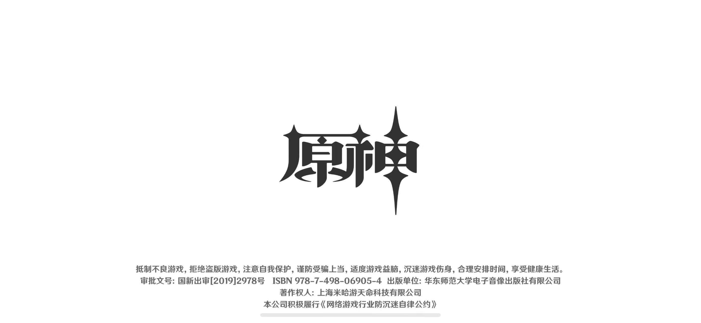
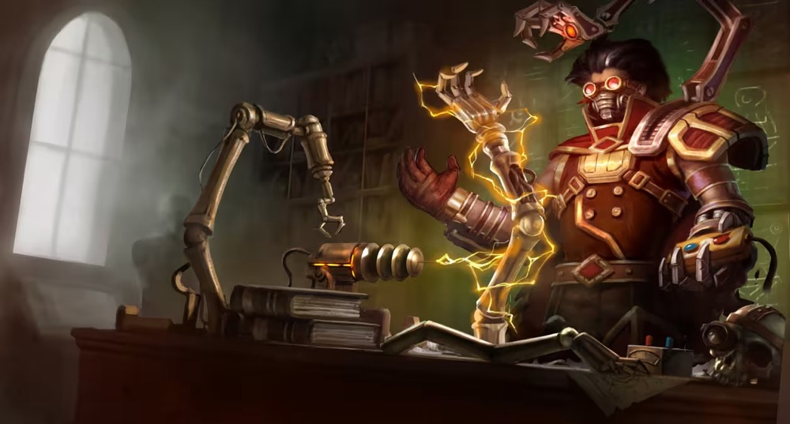
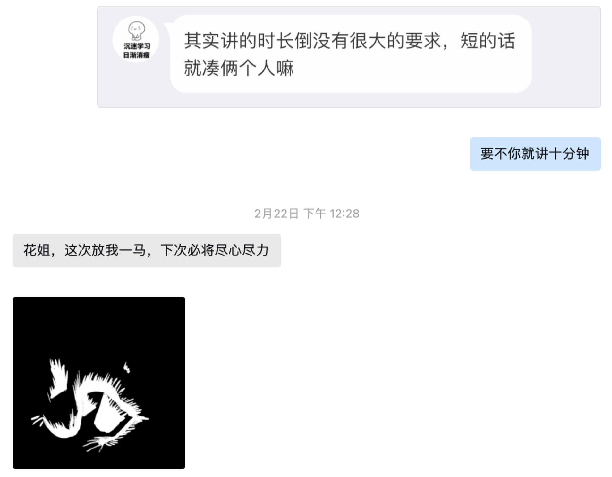
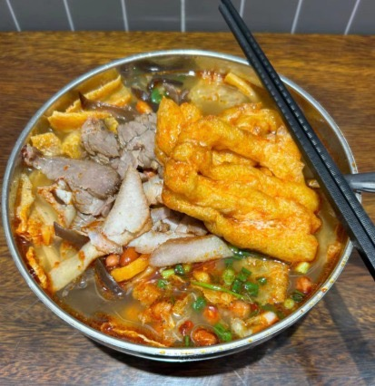
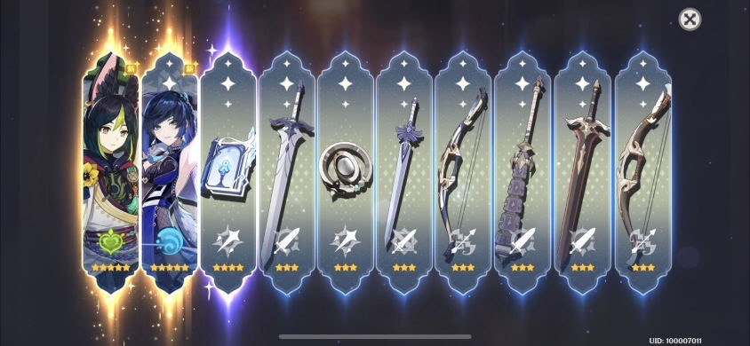

从积极参与社区开源任务，到加入飞桨成为 ~~（练习生）~~ 实习生，到最终正式成为飞桨研发团队的一员。以兴趣为起点， **黄济懿师傅** 将我们展示了一条通往职业的道路，希望他的故事能够激励所有对开源充满热情的开发者们。接下来，原神启动 🚀！

<!-- more -->

<!-- 导入聊天框功能 -->

<!-- 导入聊天框功能 -->

## 一、前言

黄师傅是一个地地道道的江西人，喜欢吃辣🌶️🌶️🌶️。他本科研究生都就读于广州的华南理工大学，现为电子信息专业，即将毕业前往 Paddle 工作。作为一名研究僧，他在空余时间喜欢吃吃美食或者玩玩游戏，像是**原神/LOL/金铲铲之战**（各位要是也在玩，可以找黄师傅哦～黄师傅求大佬带带！！）。

> 偷偷告诉你们：黄师傅最近的主线任务就是毕设，请务必多找他打游戏让他延毕（不是）

去年 11 月，他出于对深度学习框架的底层实现的兴趣，联系花花加入了快乐开源群。在这一年里，他陆续完成社区里各项开源任务以熟悉 Paddle 框架，期间他也把握住了来飞桨实习的机会，他不断积累开发经验，不断加深对 Paddle 的理解，最终，他通过了飞桨团队的面试，成功拿下了飞桨校招 offer！

黄师傅曾说："我将继续在飞桨开源活动完成一些任务，希望能够学到更多的同时也能为飞桨的建设做出小小的贡献"。事实上，黄师傅曾分别参与了 **PHI 算子库独立编译**、**算子定义自动生成**，**Fluid Kernel 函数式改造**等多个快乐开源活动项目以及飞桨框架计划，到目前为 Paddle 贡献了 100 多个 PR。抛开实习生和正式员工的身份，黄师傅自身也是飞桨社区的自发贡献者和推动者。接下来，就让我们来瞅瞅黄师傅的精彩 Paddle 之旅吧！！

> 原神，启动！！（请读者自行脑补 BGM）

## 二、采访内容

1. **介绍一下自己吧，黄师傅！(●'◡'●)**

   **黄师傅：** 我的 AI Studio 和 GitHub 的账号是 **huangjiyi**，也是我名字的全拼（黄济懿）。

2. **可以简单和大家分享一下你生活中有什么兴趣爱好吗⊙o⊙（游戏、旅游、运动等等）？**

   **黄师傅：** 我就是个死宅，平时就是打打游戏，刷刷 B 站，出门也就是找点好吃的。

3. **听说你本科研究生都在华南理工大学，你们学校周围有什么好吃的啊？🍔🍟🍿🥯🥪🥗🎂🍬🍹🍉**

   **黄师傅：** 因为在华工太久学校食堂已经吃腻了，我会经常出校找点吃的，但活动范围有限，学校周边我吃过比较好吃的不多，就川菜小炒、麻辣香锅、鸡公煲、螺狮粉、泰国菜这些。

4. **我了解到你平时有在玩 LOL，那么如果把 Paddle 比作一个英雄🦸，你觉得它最像谁？为什么嘞？**

   **黄师傅：** 我的答案是**维克托**，我的想象力有限，我只是觉得维克托的技能是会进化的，而 Paddle 也是在不断进化（更新）和扩展的，另外在维克托的背景故事里，他发明了很多具有智能的机械，比如蒸汽机器人，这和我们用 Paddle 来做的事比较相关，我只能想到这么多了。

<!-- 维克托图片 -->

    <figure style="width: 80%;">
      
      <figcaption>维克托</figcaption>
    </figure>

5. **你在加入飞桨开源群之前对 Paddle 的了解是什么样的？有没有听说过一些关于 Paddle 的传闻或者故事？**

   **黄师傅：** 我在加入飞桨开源社区之前，我主要是一个用 PyTorch 跑深度学习实验的研究牲，对 Paddle 的了解也是和 PyTorch 类似的深度学习框架。关于 Paddle 的传闻的话像是国内最早开源的深度学习框架，以及国内最好的深度学习框架。

6. **你第一个在 Github 上完成的 PR 是关于什么的呢？在 PR 的过程中你遇到了什么难题吗？**

   **黄师傅：** 我第一个在 GitHub 上完成的 PR 是 **PHI 算子库独立编译**开源活动的一个子任务，只需要进行简单的代码替换，没有遇到什么难题，只是第一次改这么大项目的代码有点担心会不会改出什么问题。

   > 编者注✍️：【[PHI 算子库独立编译](https://github.com/PaddlePaddle/Paddle/issues/47615)】是飞桨开源社区的快乐开源活动之一～我们社区有很多类似的、名字听起来很高大上但实际上难度不大的开源活动

7. **你觉得 Paddle 相比其他深度学习框架有什么优势？可以举个例子么？**

   **黄师傅：** 其他深度学习框架我主要使用过 PyTorch，从用户的视角来比较的话，Paddle 具有丰富的中文文档，包括一些 API 文档和框架开发的技术文档，同时在 AI Studio 上有很多开发者分享的基于 Paddle 实现的项目和以及开发心得可以参考，这些对于国内用户十分友好。另外 Paddle 还有很多开源的套件，用户能够使用这些套件更快地完成一些深度学习应用任务。

8. **飞桨的开源活动中，你完成的任务中有没有什么特别有趣或者有挑战性的项目？有没有什么技术难题让你觉得很兴奋或者很有成就感？**

   **黄师傅：** 我参加过的很多关于框架开发的开源活动都比较有挑战性，期间遇到的一些困难主要是一些编译问题，然后在通过调试定位问题所在代码、弄清楚问题原因、最后解决问题的时候会比较有成就感。

9. **据了解，你接触 Paddle 已经有一年多，那么你最欣赏 Paddle 团队中的哪些特点或价值观？为什么？**

   **黄师傅：** 我比较欣赏的一点是 Paddle 团队非常重视开源社区生态，这一点从丰富的社区活动可以看出来，社区开发者可以从中学习到很多东西同时能够获得丰厚的奖励。

10.   **我记得你说过花花和涛姐给了你很多帮助，你觉得他们是怎样的人呢（分别说说🫶🫶）？为什么？**

      **黄师傅：** 花花：飞桨最美运营，关键人家还很努力。
      涛姐：为了让开发者能一直有新鲜热乎的开源任务做操碎了心。

      > 编者注✍️：花花是飞桨社区顶尖运营，涛姐是飞桨社区顶尖研发。

11.   **你是怎么获得去 Paddle 实习的机会的呢？**

      **黄师傅：** 关于我如何获得去 Paddle 实习的机会，当时我刚开始做了一些开源任务，然后在和花花交流的时候以一种半开玩笑的语气问花花能不能去实习，结果没想到花花真的和涛姐提了，然后涛姐真的申请了，飞桨真的给我面试了，然后我面试也真的通过了，然后我就去实习了，一切都是这么突然。

      > 编者注✍️：其实目前已经有相当多的社区开发者，通过参与开源活动接触到 Paddle，并最终获得实习机会。另外，对于不方便线下实习的同学，我们也提供了远程实习的方案，可以了解往期【[护航计划](https://github.com/PaddlePaddle/Paddle/issues/57264)】。

12.   **在 Paddle 实习的时候，你是否参与了某个具体项目的开发？可以分享一下你在项目中的具体角色和贡献吗？**

      **黄师傅：** 我在实习期间刚开始是接着之前在社区参加的 **PHI 算子库独立编译**开源项目，完成剩下的一些比较困难的任务，花了一个多月的时间完成，剩下的大部分时间参与了**结构体 Kernel 注册统一**这个项目，期间也会接到一些其他小任务，一共实习了 3 个月吧，基本状态是要我干啥干啥，不会的就问。

13.   **你认为实习那段时间你最大的收获是什么？你认为这段实习经历对你以后的职业生涯规划有起到什么影响？**

      **黄师傅：** 收获很多，体验到了与在学校实验室不同的工作氛围，认识了一些研发大佬，深入了解了 Paddle 的一些机制，积累了一些编译调试和解决问题的经验。在 Paddle 的开源经历和实习经历让我找工作的目标从算法工程师转向了开发工程师，相比于具有不确定性同时很多时候凭借直觉的深度学习算法研究或者应用工作，我发现我更喜欢逻辑性更强且大多数问题都能找到原因的开发工作。

14.   **最后也恭喜你拿到 Paddle 的 offer 🎉，对于同样有志加入 Paddle 团队的学生党，你可以分享一些建议议、经验或者成功路径吗？**

      **黄师傅：** 我感觉我能拿到飞桨 offer 很大一部分原因是我在飞桨的实习经历和参加了一些开源活动，所以我的建议是在学习技术的同时多参加飞桨的开源活动，或者有机会去飞桨实习。

<!-- offer -->

    <figure style="width: 80%;">
      
      <figcaption>黄师傅的校招 offer 部分截图</figcaption>
    </figure>

## 三、“著名平台——虎扑评论”专区

这次，我们邀请了一些和黄师傅有过合作经历的朋友们（以及实习期间的导师🐶），贡献一下和黄师傅相关的故事，或者他们对川师傅的评价～以下均为真心话，请放心看！

> 编者注✍️：黄师傅有些社恐，所以认识的社区朋友不多，大家正好可以借此机会认识一下。

### by 涛姐（[luotao1](https://github.com/luotao1)）

<MessageBox>
   <Message name="骆涛" github="luotao1">
   我觉得黄师傅是运气真好，类似张无忌，各种捡到宝，当然实力也是重要的。他刚来的时候其实对深度学习框架基本上不了解，然后我们快乐开源刚好放了第一个大任务-phi算子库（解决cmake依赖不需要懂深度学习框架）。然后他做啊做，问我们有没有机会来实习，当时hc太太太少了，但我们刚做起来，就给他申请，然后他就开挂了
   </Message>
</MessageBox>

### by 日升（[YuanRisheng](https://github.com/YuanRisheng)）

<MessageBox>
   <Message name="元日升" github="YuanRisheng">
   这位同学的工程素养很高，学习能力很强，经常超预期推进项目，最近独立完成高难度项目：飞桨Flags工具库建设，开源成果丰硕。另外也是原神大佬，工作累了还能带你打游戏，梦幻队友。
   </Message>
</MessageBox>

### by 花花（[Tulip-hua](https://github.com/Tulip-hua)）

<MessageBox>
   <Message name="花花" github="Tulip-hua">
   原神60级大佬！还欠我一次开源社区分享，请记得！
   </Message>
</MessageBox>

<!-- 花花的证据 -->

    <figure style="width: 50%;">
      
      <figcaption>黄师傅欠花花一次分享的证据（花花强烈要求贴上来的）</figcaption>
    </figure>

## 四、生活中的点点滴滴——黄师傅篇

<MessageBox>
   <Message name="黄师傅" github="huangjiyi">
   一张螺狮粉照片，一张游戏截图，这两张图片就代表我大部分的生活了，我也就是个喜欢吃点美食、打打游戏、敲敲代码的普通人。
   </Message>
</MessageBox>

<!-- 螺狮粉 -->

    <figure style="width: 40%;">
      
      <figcaption>黄师傅力荐的他认为广州最好吃的《周成芝螺蛳粉》！</figcaption>
    </figure>

<!-- 原神抽卡 -->

    <figure style="width: 90%;">
      
      <figcaption>谁懂十连双黄的概念？黄师傅玩几年原神了就这一次</figcaption>
    </figure>

---

## 写在最后 💡

**【开源江湖闲聊录】** 是一项专门为 Paddle 社区的开发者打造的特色访谈栏目📚。在这里，我们邀请到每一位别具一格且富有热情的开发者，通过文字或语音的方式进行深入采访 🎙️，探索并展现他们背后独一无二的故事，将他们的经历、见解和创意整理成精彩内容，呈现给整个社区。

---
