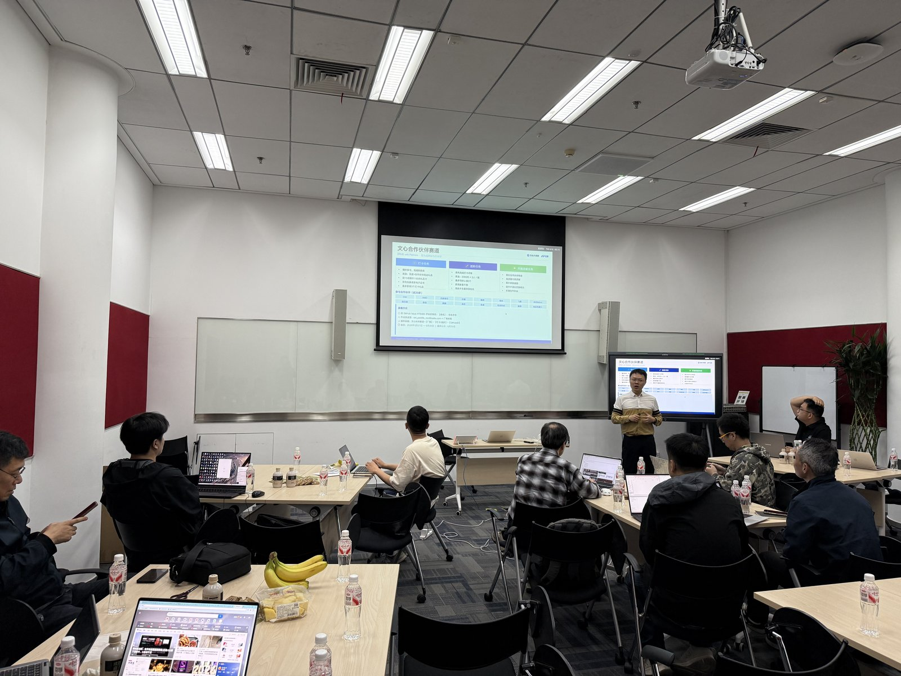
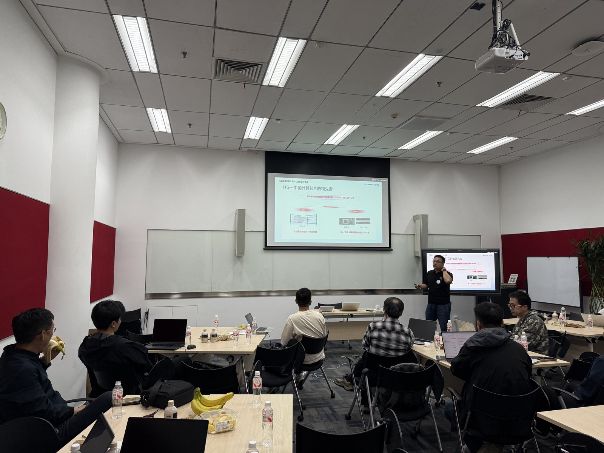
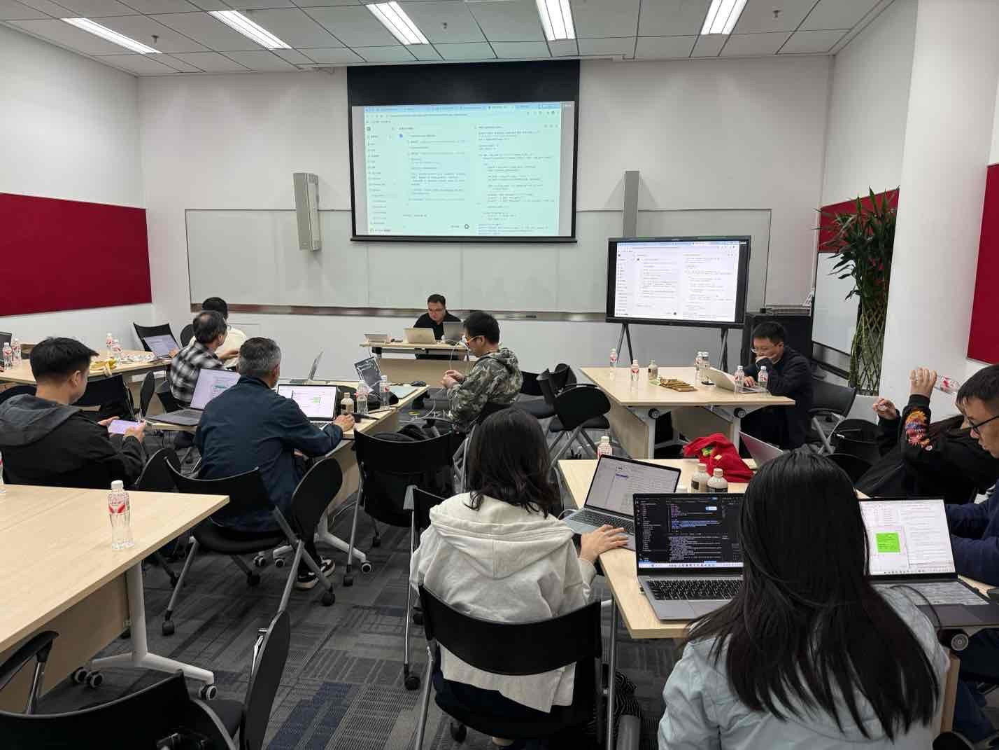

> 5 月 9 日下午，北京百度科技园 K2 号楼里，十余位开发者在算力券的支撑下，亲手跑通了海光 DCU 上的 PaddleOCR 任务——其中 7 人当场完成打卡，现场领走礼品。

2026 年 5 月 9 日（周六）13:30，飞桨黑客松第十期「文心合作伙伴赛道」联合海光，在百度科技园 K2 号楼举办了本赛季第二场线下 Meetup。此次活动聚焦海光 DCU 赛道，从赛事解读、硬件原理到现场实操，用四小时走完「了解—上手—完成」的完整路径。

<!-- more -->

---

## 赛事全貌：一张图看懂文心合作伙伴赛道

活动开场，百度飞桨高级产品经理王凯带来了赛道全景介绍。

第十期飞桨黑客松共设八大赛道，「文心合作伙伴赛道」是联合生态伙伴数量最多的赛道，目前已有近 20 家国产算力厂商参与。赛道分两层：打卡任务门槛友好，完成即可获得礼品和电子证书，最多可兑换 3 个礼品；进阶任务以研发深度为核，需先完成打卡，通过厂商面试锁定名额后协作开发，完成可获 2000 元奖金。

现场 PPT 以对比表格呈现两类任务的差异——在场开发者几乎同时掏出手机扫描报名二维码，部分人在这一刻完成了 GitHub Issue 的报名评论。

<figure>

<figcaption>百度飞桨团队介绍黑客松第十期赛事全貌</figcaption>
</figure>

---

## 经验分享：一个人 + 一套流水线 = AI 日更公众号

赛道介绍结束后，王凯分享了第二部分内容——用文心大模型搭建 AI 自媒体内容流水线的实战经验。

分享的核心是他运营「AI 每日参」公众号的幕后工具链。该号目前已稳定运行 40 余期，从热点抓取到微信草稿发布平均耗时仅 25 分钟。这套工具链已以 **newscraft** 的名字完整开源，主要分为四个环节：

- **信息获取**：自动抓取 HackerNews、Reddit、arXiv、IT 之家、36 氪等 20 余个信源，基于热度权重和历史去重算法筛选选题；
- **内容生成**：ERNIE-5.0 写稿，ERNIE-4.5 与 ERNIE-5.0 双模型交叉审稿，从事实核查到观点深度分三阶段把关；
- **配图生成**：ERNIE-image-turbo 自动生成封面图，差值哈希去重保证连续发布不撞款；
- **一键发布**：Markdown 转 HTML、图片上传素材库、创建微信草稿，全流程自动化。

> 「我不是在用 AI 替代创作，我是在用 AI 清除创作的障碍。」

现场开发者对 token 费用等细节追问最多，也有人当场在笔记本上为仓库点亮了小星星。

项目地址：https://github.com/onecatcn/newscraft （Apache-2.0 协议）

---

## 海光 DCU 与 SCNET：算力环境从"说清楚"到"跑起来"

赛道技术分享由海光工程师刘蕴主讲，围绕海光 DCU 硬件特性展开。

演讲聚焦两个核心问题：「用什么硬件跑」和「怎么配环境跑」。海光 DCU 的 SIMT 并行架构、对 PaddlePaddle 的支持路径、常见环境问题的排查思路——这些内容在纯线上文档里往往语焉不详，现场提问让工程师得以直接给出针对性解答。

<figure>

<figcaption>海光工程师刘蕴介绍 DCU 硬件特性与 SCNET 软件栈</figcaption>
</figure>

> 「收获颇丰，希望下次有机会还参加。」——现场开发者反馈

---

## 任务解析：从打卡到进阶的完整路线

第三个环节专门拆解海光赛道的任务结构。

**打卡任务（#6）**：海光 DCU PaddleOCR 应用。目标是在海光 DCU 环境中完成 PaddleOCR 模型的推理，并通过邮件提交截图。难度定位为「当天可完成」，现场提供算力券，参与者即刻可以动手。

**进阶任务（#18）**：PaddleOCR-VL 1.5 应用性能分析与调优。需要提交 RFC 设计文档并通过海光工程师面试锁定名额，深度参与推理性能优化。

主持人鼓励在场开发者先完成打卡，再按兴趣评估进阶任务的参与意愿——「先跑通，再深入」是这场 Meetup 的核心节奏。

---

## 实操环节：算力券 + 自带电脑 = 现场出成果

下午 15:30 进入全场最活跃的环节——现场实操。

海光工程师在场坐镇，两块大屏一块展示操作步骤，另一块实时显示 GitHub Issue 页面。开发者在各自笔记本上连接海光云端算力（SCNet），按步骤完成推理跑通、截图保存、提交验证的完整流程。

工程师们在各桌间来回走动，现场答疑覆盖了环境安装报错、模型加载异常、邮件提交格式确认等高频问题。整个实操环节氛围接近一场小型黑客马拉松，鼠标敲击声和偶发的「跑通了！」此起彼伏。

<figure>

<figcaption>开发者自带笔记本，现场连接海光算力完成打卡任务</figcaption>
</figure>

---

## 现场成果：7 位选手完成打卡，当场领走礼品

活动结束前，共 **7 位参与者**在现场完成了海光打卡任务（#6），并获得礼品和百度颁发的电子证书：

[@sunyet01](https://github.com/sunyet01)、[@HanazawaKanana](https://github.com/HanazawaKanana)、[@mingzhenghao](https://github.com/mingzhenghao)、[@alann2020](https://github.com/alann2020)、[@caifudou](https://github.com/caifudou)、[@Lzm124113](https://github.com/Lzm124113)、[@kylin1019](https://github.com/kylin1019)

活动结束后，不少参与者表示意犹未尽——「很好的一次学习体验，下次有机会还参加。」

---

## 写在最后

本次 Meetup 以「技术分享 + 现场实操」双轨并行的形式，让参与者在四小时内完成了从了解赛道到亲手跑通任务的完整体验。海光工程师的深度讲解、百度飞桨团队的现场支持，以及算力券提供的即时上手条件，共同促成了这个下午的成果。

海光 DCU 赛道（打卡 #6 / 进阶 #18）目前仍有名额开放，感兴趣的开发者欢迎在黑客松总览 Issue 中评论报名：https://github.com/PaddlePaddle/Paddle/issues/78485

---

_感谢海光信息技术、百度飞桨团队对本次活动的支持与协作。_
_飞桨黑客松第十期文心合作伙伴赛道持续进行中，欢迎报名参赛！_
