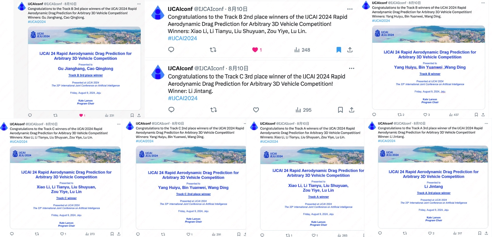

🎉🎉2024年8月8日，，IJCAI 2024: 任意三维几何外形车辆的风阻快速预测竞赛 ”在韩国济州国际会议中心(Jeju ICC)火热举行，并且取得了超级圆满的成功！💰💰价值35,000$的大奖到底花落谁家了呢？参赛选手们的技术方案是不是赛博朋克风爆棚？快来围观，别错过啦~
👀另外，就在前一天，2024年8月7日，飞桨开源社区也在IJCAI Industry Day论坛上进行了超赞的路演。在美丽又浪漫的韩国济州岛上（虽然天气有点热哈哈🔥），百度飞桨和海内外的科研人员、企业工程师以及AI开发者们成功“汇合”，和众多AI领域的大咖们进行了深度的交流，氛围超级愉快😊！

## 大赛背景
📚说到这个大赛的背景，开放原子开源基金会可是个致力于推动全球开源事业发展的非营利机构哦！他们的目标就是搭建一个前沿技术竞争、优秀人才选拔、创新成果展示、商业转化引导和对接交流合作的平台，广泛传播开源文化、普及开源知识、推广开源项目、提升开源技能，为推进全球开源生态的繁荣和可持续发展提供动力。
🤝而百度飞桨开源社区与开放原子开源基金会的目标和愿景可是高度重合的哦！所以他们自然而然地达成了合作办赛的意向。继2023年百度飞桨联合开放原子共建了“飞桨PaddlePaddle开源贡献挑战赛”后，这次飞桨团队再度受邀，和开放原子共同举办了这次超酷的竞赛！
🏁这个算法模型挑战赛可是有三个赛道哦！分别是基于ShapeNetCar的简化汽车数据、基于DrivAer复杂几何的工业级别汽车数据，以及多类型汽车融合数据。选手们需要使用AI进行快速分钟级的预测，看看汽车在不同工况下的风阻会是多少。要知道，风阻对汽车设计可是非常重要的哦！它可是会直接影响汽车的燃油和电池续航呢~（详情请参考：雷军“上课”讲风阻，小米汽车风阻全球量产车“最低”）🚗💨

🧠💻 选手们这次可是要放大招了！他们得把流体力学（哎呀，听起来就头疼🤯）和AI深度学习这两大领域的知识融合在一起，进行深度的模型设计和探索。这可不是闹着玩的，得在ABC三个赛道的测试数据集上，精准预测风阻，还得尽量减小风阻预测的L2误差。这可是个技术活🚀💨。

## 赛程回顾
大赛4月23日一上线，报名就火热启动了！经过两个半月的激烈打榜，选手们拼尽全力，终于在7月21日迎来了封榜时刻。之后，经过严格的代码审查和线上初审，我们最终在8月8日韩国济州国际会议中心迎来了超燃的决赛路演！
比赛过程中，选手们在官方交流群里可是热闹非凡，他们积极讨论、互帮互助，甚至还主动给官方提建议，帮我们改进比赛平台，真是太给力了😄！虽然中间有些小插曲，但只要我们一沟通，选手们的需求就能迅速得到解决，真是效率满满！

最终，大赛迎来了323支团队的热情报名！虽然赛题难度不小，但还是有15支超厉害的队伍成功提交了作品，其中9支队伍更是脱颖而出，入围了决赛答辩，真是让人热血沸腾啊！
选手们纷纷表示，流体仿真真是个“磨人”的活儿，太消耗资源和人力了（尤其是仿真工程师的头发和脑细胞，哈哈）！不过，大家也都觉得，能快速预测风阻的价值和意义非凡，绝对是值得努力的！

通过大家的开源以及互相学习，相信AI空气动力学通用模型能够早日实现。——— 赛道A第10名  hnu

## Industry Day  &  大赛-AI流体平行论坛 路演现场

* Industry Day

军哥（@jzhang533）他用全英文的PPT给大家带来了一场超级精彩的介绍，带着IJCAI会议的观众们一起领略了百度飞桨在NLP、自动驾驶等工业领域的落地应用和解决方案。那发音，标准又流畅，和海外的专家学者们问答沟通起来也是毫无压力，受到大家的一致好评，太起范了！ 😄🎉🎉🎉

* AI流体平行论坛

这次我们可是请到了几位大咖哦！北京航空航天大学软件学院的副教授周号益、惠尔科技的CEO常宇飞、NVIDIA的解决方案架构师况吕林，还有四川大学工程数值模拟基础算法与模型全国重点实验室的副研究员张明洁，他们都来到了现场做报告！介绍了AI在自动驾驶，汽车设计，气象预报，流体仿真等领域的应用，大家听得全神贯注，认认真真，一点都不敢错过呢！👏👏👏

此外在会场，也分别为大家呈现了第二届开放原子开源大赛赛项共建方招募的宣讲，和百度飞桨 PaddleScience的相关的科学计算产品建设和探索：
再给大家隆重介绍一下PaddleScience！这可是个发论文、打比赛的利器啊！它不仅面向AI领域的开发者们，还特别适合流体力学、材料科学、气象科学等领域的科研人员们使用。简直就是科研神器，有没有！大家赶紧来试试看吧！🎉🎉🎉
欢迎大家体验PaddleScience，并参与我们的共建计划    https://github.com/PaddlePaddle/PaddleScience （合作邮箱 paddle_science@baidu.com）

选手们也是个个都不含糊，纷纷展示了自己的解决方案，那场面可真是热闹非凡！获奖选手的代码仓库也已经在PaddleScience GitHub上公开啦，大家快去围观吧！链接在这里：
获奖选手代码仓库：https://github.com/PaddlePaddle/PaddleScience/tree/develop/jointContribution/IJCAI_2024

会后采访现场

## 比赛颁奖现场
比赛颁奖现场，一览选手风采~

恭喜所有的获奖队伍！🎉🎉🎉开源创新之路上飞桨与你们通行！🚀🚀🚀

## 平行论坛合影留念
平行论坛，热闹非凡，合影一张，留住精彩瞬间！📸🎉

## 百度+开放原子展台小分队
除了精彩的会议，百度还在IJCAI会场设置了一个超酷的展台！在这里，我们给海内外的科研人员和企业工程师们详细介绍了开放原子开源基金会、百度Apollo汽车、百度文心一言，百度飞桨框架和飞桨科学计算这些超棒的项目！
真的要感谢百度、开放原子、IJCAI的运营和宣发工作人员们，你们齐心协力，让这次活动如此成功！
话不多说，直接点赞！👍👍👍

最后最后，告诉大家一个好消息！新的比赛已经火热上线啦！这次可是CIKM 2024的大赛哦！主题是“AI辅助的先进空气动力学-优化汽车设计以实现最佳性能”，听起来就超级高大上有没有！大家快来报名吧，一起用AI的力量来优化汽车设计，挑战最佳性能！期待你们的精彩表现哦！🎉🎉🎉

报名链接：https://competition.atomgit.com/competitionInfo?id=cda4e961b0c25858ca0fd2a4bdf87520

aistudio快速开始：CIKM 2024: AI Aided Advanced Aerodynamic - 飞桨AI Studio星河社区

