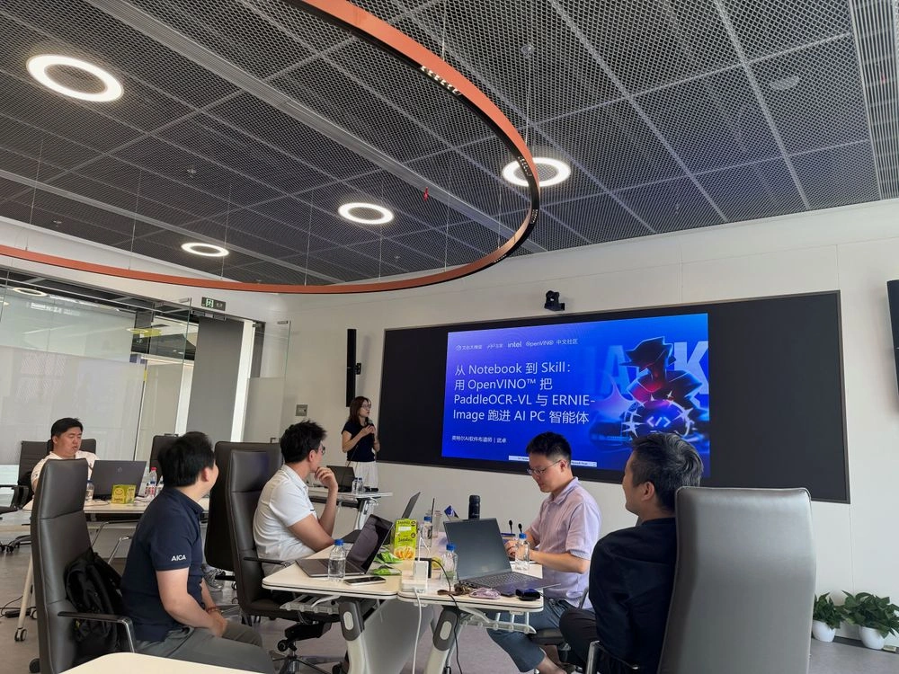
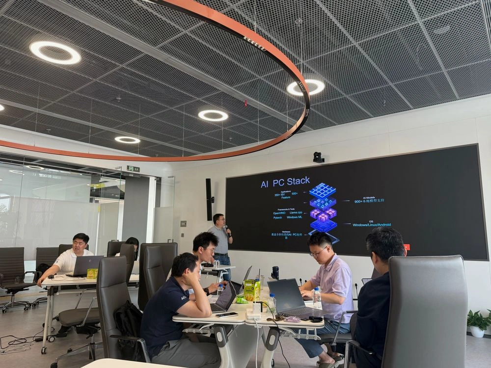

5 月 29 日下午，飞桨黑客松第十期「文心合作伙伴赛道」联合百度文心大模型、百度飞桨与英特尔（Intel），在上海市浦东新区张江人工智能岛举办 Intel Meetup 上海站。本次活动围绕 OpenVINO™ 推理加速、PaddleOCR-VL 多模态文档理解与 Intel AI PC 生态展开，帮助开发者理解并上手多模态 AI 在通用算力设备上的部署实践。

<figure>

<figcaption>Intel Meetup 上海站现场</figcaption>
</figure>

<!-- more -->

---

## 现场直击

活动开场，百度团队介绍了飞桨黑客松第十期「文心合作伙伴赛道」的整体赛程、任务体系与参与方式，帮助到场开发者快速了解打卡任务、进阶任务以及 Intel 相关赛题方向。

本次 Intel 方向聚焦基于 OpenVINO™ 的 PaddleOCR-VL 模型推理优化与多模态应用开发。开发者可以围绕文档解析、图文理解、结构化信息提取、智能问答等场景，探索 PaddleOCR-VL 与 ERNIE 在 Intel 生态中的应用方式。

<figure>

<figcaption>现场分享 OpenVINO™、PaddleOCR-VL 与 ERNIE 结合的实践路径</figcaption>
</figure>

随后，Intel 技术分享围绕酷睿 Ultra 硬件平台、OpenVINO™ 推理加速工具链和 AI PC Stack 展开，介绍了多模态模型在通用算力设备上的适配逻辑、部署流程与性能优化思路。

现场还分享了「从 Notebook 到 Skill：用 OpenVINO™ 跑 PaddleOCR-VL 与 ERNIE」的实践路径，展示如何从 Notebook 原型出发，把模型推理、文档理解和大模型能力组合成可复用的 Skill 或应用 Demo。

---

## 实操环节：从“看懂”到“跑通”

本次活动采用真机实操、现场答疑的形式。Workshop 环节中，技术导师围绕环境搭建、模型转换、推理测试、参数调优与作品提交进行讲解，帮助参与者理解从模型到应用的完整开发路径。

对很多开发者来说，OpenVINO™、PaddleOCR-VL、ERNIE 并不是孤立的技术点：OpenVINO™ 负责高效部署，PaddleOCR-VL 负责多模态文档理解，ERNIE 负责进一步的语义理解与生成。三者结合后，可以支撑票据识别、文档问答、办公自动化、AI Agent 工具调用等真实应用场景。

---

## 赛事仍在进行

飞桨黑客松第十期「文心合作伙伴赛道」仍在进行中。Intel 相关方向欢迎关注 AI PC、端侧推理、多模态文档理解和 OpenVINO™ 部署优化的开发者继续参与。

- **报名方式**：在 GitHub Issue #78485 中评论对应赛题编号，并按任务文档要求提交材料
- **文心合作伙伴赛道 Issue**：<https://github.com/PaddlePaddle/Paddle/issues/78485>
- **活动总览 Issue**：<https://github.com/PaddlePaddle/Paddle/issues/78292>

5 月 29 日，上海，开发者们用一个下午走近 Intel AI PC 与 OpenVINO™ 多模态部署实践。下一次把模型跑起来、把应用做出来的，也许就是你。
