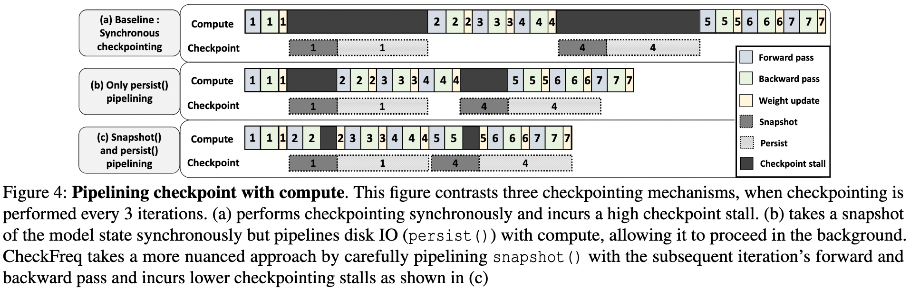
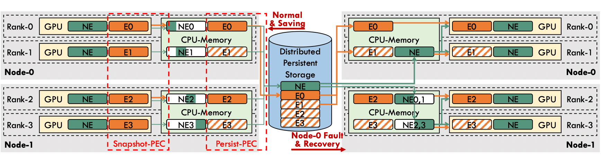

- [[ASPLOS 2025] MoC-System: Efficient Fault Tolerance for Sparse Mixture-of-Experts Model Training](https://arxiv.org/pdf/2408.04307)

- [[ASPLOS 2025] MoE-Lightning: High-Throughput MoE Inference on Memory-constrained GPUs](https://dl.acm.org/doi/pdf/10.1145/3669940.3707267)

## 训练

训练中会与I/O相关的点主要在于Checkpoint，尤其是在大规模训练的时候，Checkpoint不可或缺，且其开销也比较大的，在传统dense模型中就有过很多篇讨论把全量Checkpoint拆开，放在流水线pipeline的bubble过程中做的paper([CheckFreq](https://www.usenix.org/system/files/fast21-mohan.pdf)、[Gemini](https://dl.acm.org/doi/pdf/10.1145/3600006.3613145))，这里介绍一篇专门针对MoE做的Checkpoint优化。

<figure>
    
    <figcaption>CheckFreq的思路 其实只是优化了原始的CheckPoint流程</figcaption>
</figure>

> [[ASPLOS 2025] MoC-System: Efficient Fault Tolerance for Sparse Mixture-of-Experts Model Training](https://arxiv.org/pdf/2408.04307)

### Background

MoE模型享受了专家带来的参数扩展，但同样需要保存相较Dense更多的参数，这就意味着更久的snapshot和persist时间，从上图中可以看到persist其实不重要，因为这部分磁盘I/O可以与训练异步进行，依赖这一部分的只有recover。但snapshot的时间就比较关键了，因为训练中的参数更新会依赖于snapshot的时间（得在更新参数前把上一个iteration的参数存完），而MoE更多的参数量直接决定了需要更多的snapshot时间；除了参数量外，snapshot是走的PCIe到内存，这里的带宽速率也是瓶颈之一。因此CheckPoint优化工作的核心问题一般在于如何减少参数量？或者如何提高snapshot的速度？

<figure>
    
</figure>
MoC的工作集中在减少参数量上，思路也非常简单：

- Partial Experts Checkpointing (PEC) 每次只保存部分专家参数从而减少参数量
- 不同的CheckPoint保存不同的专家（确保每个专家都有CheckPoint）
- 选择被保存专家的不同策略(固定顺序/按热门度排序顺序)

### 一致性问题

有个很直接的问题，如果每次不是保存所有专家的话，不与模型完全一致？确实是这样的，所以MoC提出了一个指标：Proportion of Lost Tokens (PLT)来衡量这种影响。简单来说这一轮没有存的专家可以等效于这个专家这一itr没有处理任何token，因此可以直接用这些等效于被丢失的token数的比例来衡量。

MoC做了相关实验，得出的结论是当该比例 ≤ 3.75% 时，对 loss 的影响非常小。这其实比较符合实际情况，因为即使是在正常训练中，也有一些门控策略会出于一些原因主动丢弃一些token，例如GShard为了强制负载均衡就会丢弃一部分token。这就给异步CheckPoint提供了减少参数量的可能。

比较有意思的是，MoC给出的这个3.75%比例的token丢弃对应为只保存 2 个专家（总专家为8），这从另一个角度验证了MoE层中专家token分配不均的情况。

<figure>
    
</figure>

### 实验结果

通过保存部分专家确实可以有效的降低参数量，下左图中展示了只保存1个专家时，相较于保存完整模型的参数量只有42.3%。得益于参数量的减小snapshot的时间也能完全被Forward&Backward给overlap掉，可以实现一个无感的CheckPoint。

   

      <figure style="width: 22%">
         
      </figure>
      <figure style="width: 34%">
         
      </figure>
      <figure style="width: 41.5%">
         
      </figure>
   

CheckPoint的工作的motivation其实都有个比较大的问题，就是为什么需要如此频繁的做CheckPoint，如果几千个/几万个iteration再CheckPoint一次的话那么CheckPoint的开销再大也可以忽略。这个问题我一直没想明白（也就是没找到一个合适的场景），但后来有次开会了解到阿里云内部也在做这个，他们给的场景是大规模训练时的早期出现的难以发现的错误 例如位反转，[Understanding and Mitigating Hardware Failures in Deep Learning Training Systems](https://dl.acm.org/doi/pdf/10.1145/3579371.3589105) ，会需要这种频繁CheckPoint来做recover，在后期排查问题的时候可以通过iteration级别的CheckPoint来精确的定位到是哪发生问题了，这种情况下如果CheckPoint的对训练的时间影响能降到忽略不计，那肯定是越多CheckPoint越好。

## 推理

MoE训练优化关注的是计算/通信overlap，而推理由于KV cache的存在，I/O调度也是会高度影响性能的。更进一步，如果是内存受限场景下的话还会加一个专家的load/offload的调度，下面这篇讨论的就是这个场景：CPU-GPU异构平台的统一优化。

> [[ASPLOS 2025] MoE-Lightning: High-Throughput MoE Inference on Memory-constrained GPUs](https://dl.acm.org/doi/pdf/10.1145/3669940.3707267)

### Background

**Roofline model.** 由于训练/推理优化工作中挺多paper都有用到这个模型，且在实验过程中发现该模型确实能较好的符合真实情况，所以这边也简要介绍一下

**计算平台的两个指标：算力**π**与带宽**β

- 算力 π：也称为计算平台的**性能上限**，指的是一个计算平台倾尽全力每秒钟所能完成的浮点运算数。单位是 `FLOP/s`

   $\pi: \text{Maxinum FLOPs Per Second}$

- 带宽 β：也即计算平台的**带宽上限**，指的是一个计算平台倾尽全力每秒所能完成的内存交换量。单位是`Byte/s`。

   一般来说这里的带宽指的是访存速率，但实际上这里也可以看为一个包含通信速率在内的广义的带宽。

   $\beta: \text{Maxinum Memory Access Per Second}$

- **计算强度(**Arithmetic Intensity**)上限**$I_{max}$：两个指标相除即可得到计算平台的**计算强度上限**。它描述的是在这个计算平台上，单位内存交换最多用来进行多少次计算。单位是`FLOPs/Byte`。

   $I_{max}: \frac{\pi}{\beta}$

**模型的两个指标：计算量 与 访存量**

- **计算量：**指的是输入单个样本（对于CNN而言就是一张图像），模型进行一次完整的前向传播所发生的浮点运算个数，也即模型的**时间复杂度**。单位是 `#FLOP`。其中卷积层的计算量公式如下

   $\text{Conv Layer Time Complexity}:M^2 \cdot K^2 \cdot C_{in} \cdot C_{out}$

- **访存量：**指的是输入单个样本，模型完成一次前向传播过程中所发生的内存交换总量，也即模型的**空间复杂度**。在理想情况下（即不考虑片上缓存），模型的访存量就是模型各层**权重参数**的内存占用（Kernel Mem）与每层所输出的**特征图**的内存占用（Output Mem）之和。单位是`Bytes`。由于数据类型通常为`float32` ，因此需要乘以四。

   $\text{Conv Layer Space Complexity}:(K^2 \cdot C_{in} \cdot C_{out} +M^2 \cdot C_{out})\cdot4$

- **模型的计算强度**$I$：由计算量除以访存量就可以得到模型的计算强度，它表示此模型在计算过程中，每`Byte`内存交换到底用于进行多少次浮点运算。单位是`FLOPs/Byte`。可以看到，模计算强度越大，其内存使用效率越高。

<figure>
    
    <figcaption>Roofline model示意图</figcaption>
</figure>

由上图中可以看到，计算能力先由带宽上限限制，在带宽满足后才会由算力限制，而带宽和算力分别决定了前段roofline的角度和后段roofline的高度。roofline给定了平台计算能力上限，而计算任务需要根据其计算强度与访存强度来在图中找到对应的位置。

给个example，FasterMoE中roofline-model分析，并且给出了各种优化手段(降低访存量（通信量）/提高计算量)在roofline-model中的实际位置。

<figure>
    
</figure>
当然这个只是个理想值，实际的表现跟符合图中的semi-ideal的曲线。

[Roofline 模型优化理论](https://ku.baidu-int.com/knowledge/HFVrC7hq1Q/pKzJfZczuc/y5IvxvSXhP/uwBUBb44pSoHxq?t=mention&mt=doc&dt=doc)

**CPU+GPU异构平台的问题：** 高强度的I/O（KV cache、模型权重）以及带宽限制会导致CPU和GPU都很难跑到Compute bound；不同类型的I/O速率不同，没法用一个roofline model统一建模优化。

   

      <figure style="width: 36%">
         
      </figure>
      <figure style="width: 62%">
         
      </figure>
   

### 异构Roofline model (HRM)

上文中的roofline描述的是在统一计算平台中的性能，而推理框架考虑到成本因素，往往会有异构平台，这需要新的roofline model来描述该平台性能。 MoE-Lightning提出了HRM来描述异构平台的计算性能。与普通roofline不同的是，该模型的roof由多个memory roof和compute roof组成，根据实际情况选择具体的区域，具体的推导过程见原文。

> **Attention**：
> 以上图为例，GQA-Mixtral（所有KV cache均在CPU内存中）来说，CPU-GPU的异构能达到的计算性能点在P1，被CPU-GPU的mem bdw限制住了完全没有发挥GPU的计算效果。而int4量化KV cache的纯CPU计算其实已经很接近了P1，这种情况下与其把KV cache挪到GPU计算不如用纯CPU。

**MoE layer**

- FFN层的话相对来说就会麻烦一些，由于GPU内存有限，大小为N的一批数据通常需要分成几个大小为𝜇的micro-batch，以便通过GPU上单个内核执行来处理。会随着batch size N的改变而不同。
- 当 𝐼 小于 P1 对应的 𝐼 时，由于受限于 CPU-GPU mem bwd，将数据交换到 GPU 进行计算没有好处。许多以延迟为导向的应用就是这种情况，用户可能只有一两个prompt需要处理。在这种情况下，采用静态权重放置策略（例如，将 𝑚 个层中的 𝑛 个放在 GPU 上）并在数据所在位置进行计算，而不是来回交换权重，更有利。
- 当 𝐼 小于 P2 对应的 𝐼 时，计算受限于 CPU 到 GPU 内存带宽，无法达到 P2 的性能。根据是否有足够的 CPU 内存来容纳更大的批次，可以增加批次大小或将一些权重静态地放在 GPU 上，因为这两种策略都可以增加关于 CPU 上数据的 MoE FFN 计算强度。
- 继续增加N，当 𝐼 等于 P2 对应的 𝐼 时，可以达到的最大性能受限于 GPU 的计算能力。这之后就没有必要再增加 𝑁 了，达到的最大性能在平衡点等于 𝑃2。如果给 GPU 加载更多权重，会导致更高的峰值内存消耗，𝜇 将会降低从而导致GPU计算能力降低。因此最大性能将在 P2 的平衡点实现。

通过HRM的分析，我们可以找出一组较优的 N-𝜇-𝑛 的策略从而指导CPU-GPU异构平台的训练设置。

### GCOPipe

有了HRM的指导就可以来拼pipeline了，prefill全部在GPU阶段，这里主要集中于decoder阶段。

- pre-attention:attention前的一些操作，例如layer norm 和 QKV projection
- attention
- post-attention:紧接attention的MoE layer
- paged weights:切分过的MoE layer权重，需要在合适的时候load进GPU
- DtoH和HtoD可以直观的理解为I/O pipeline

### 实验结果

因为关注于decoder阶段，实验结果以吞吐量为主

## 总结

一般来说做优化大多关注在计算/通信相关部分，但其实I/O也是一个经常被忽视但优化空间很大的方向。可以在一些应用场景来挖掘这些平时不太被重视的优化点。
