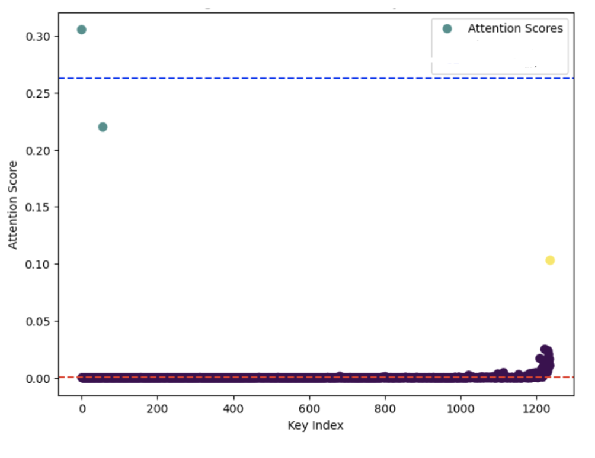
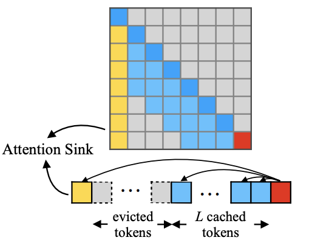
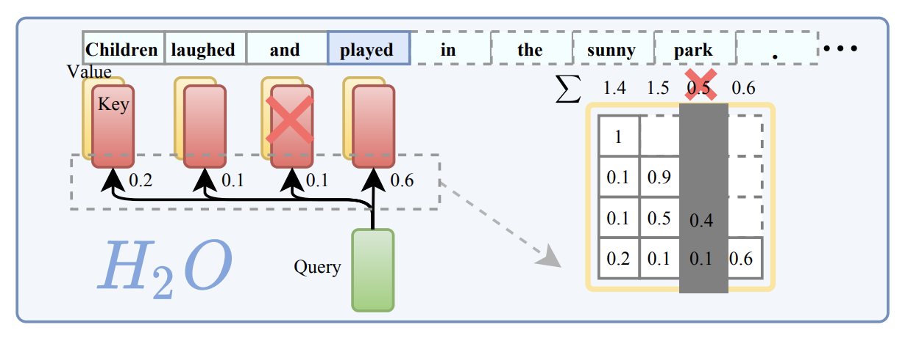
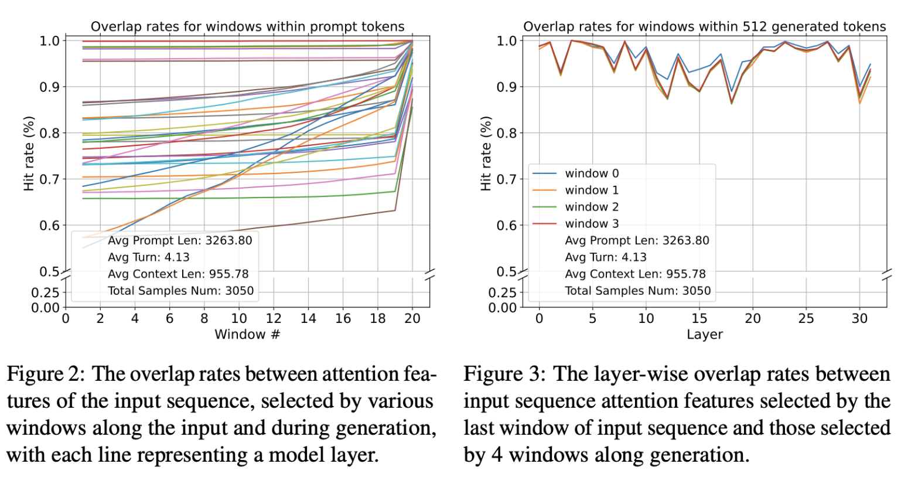
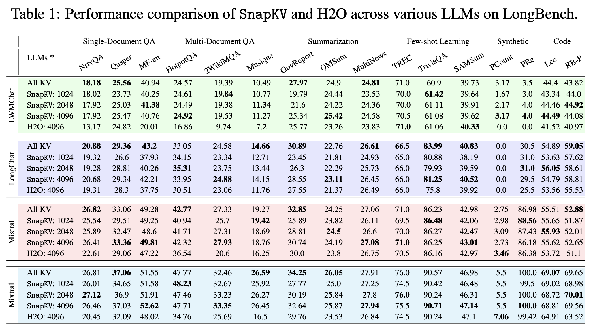
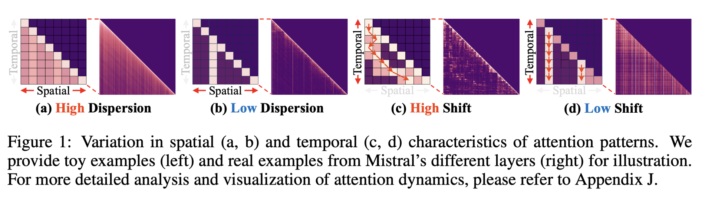
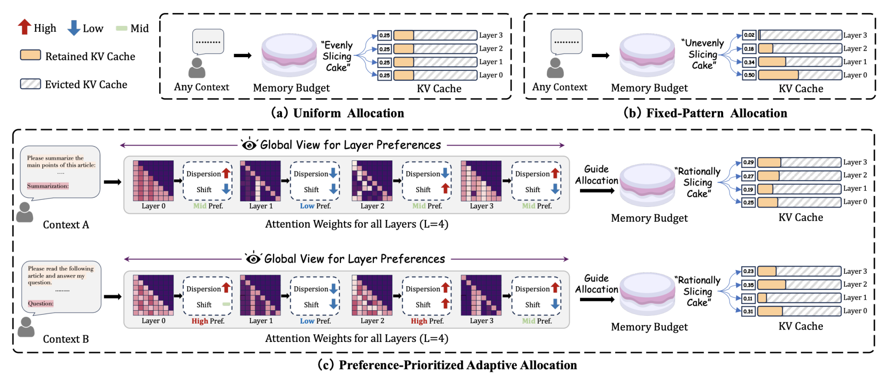
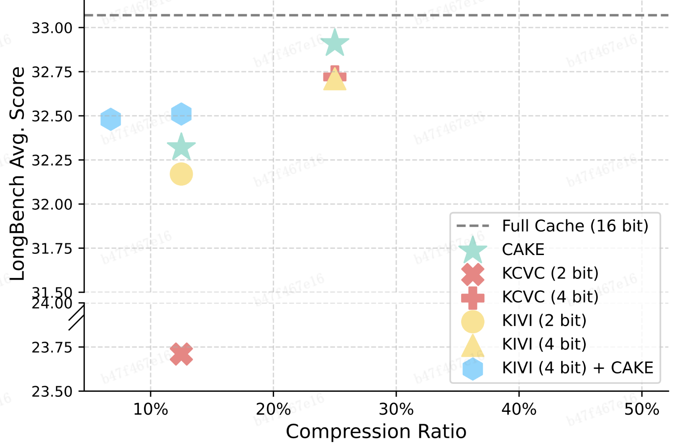

## 1. 引言：KV Cache 的压缩与优化挑战

在基于 Transformer 架构的大模型推理中，为了加速自回归生成，通常会缓存历史 token 的 key 和 value 张量（即 KV Cache）。随着上下文长度不断增长，KV Cache 的内存占用与访问带宽迅速攀升。
围绕着降低大模型推理过程中 KV Cache 带来的资源开销，有以下几种主流的方案：

1. 量化（Quantization）：将高精度 KV 向量转化为低位宽形式，节省存储空间，代表工作有 KIVI [1] 等 （ERNIE 4.5 的技术报告中也提到了这种 kv cache 量化技术）
2. 稀疏化（Sparsification）：剪枝不重要的 token 或 attention head，代表工作有 Minference [2]（Qwen3 技术报告中有提到 Qwen3 使用了这种方法）
3. 驱逐机制（Eviction-based Selection）：Prefill 阶段后动态或静态地丢弃不重要的 token，从源头减少 KV Cache 的规模。

本文将重点介绍基于驱逐机制（Eviction）的 KV 缓存压缩方法。相比于其他压缩策略，驱逐方法一般无需重新训练模型，有着即插即用的优点。

## 2. 注意力机制中的稀疏性现象

Transformer 模型之所以需要缓存大量 KV，是为了支持每一个新 token 在生成时都能访问先前所有上下文的表示。但多个研究发现：模型在实际生成中，并不会均匀利用全部历史信息，而是呈现出显著的注意力稀疏性特征。

大多数生成步骤中，只有一小部分历史 token 被频繁访问。如果 我们可以安全地驱逐那些被“忽略”的 KV 对，那么就不会明显影响最终生成效果。

## 3. 基于 KV Drop 的压缩方案当前面临的挑战

1. 准确识别“无关”KV 仍然困难

虽然历史 attention 分布可以作为参考，但未来 query 是未知的（生成是逐步发生的），prefill 时无法准确预测解码阶段的关注对象，attention 权重具有一定的非线性影响，低权重并不等于对输出影响为零。

2. KV Drop 易引发输出偏移

删除的 KV 一旦涉及关键信息，会引发输出偏移

3. Drop 策略与多头、多层结构的协同设计复杂

在不同 head / layer 间如何分配“保留预算”？

不同 layer 的 KV 冗余率差异大，统一策略效率低；

不同 head 关注不同位置，单 head 基础上做 drop 容易信息割裂

接下来，我们梳理一下主流驱逐机制的演进策略与代表工作。

## 4. KV Drop 的基本路径 —— 从 StreamLLM 到结构化注意力选择

为了缓解 KV 缓存的资源占用问题，最早一批工作尝试以最直接的方式进行 KV Drop，即只保留最近的部分上下文，其代表即为 StreamLLM。这种方法虽然极其简单，但也暴露了许多问题。随着研究深入，后续方法逐步发展出了基于注意力模式、层级结构、头部特征等更复杂的选择策略。

### 4.1. StreamLLM[3]：滑动窗口式 KV Drop 的代表

核心思路：仅保留最近 N 个 token 的 KV，其余直接删除（称为 sliding window attention）。生成过程中，KV cache 始终固定大小。

此外，StreamLLM 发现，如果直接裁剪历史 token，会导致 attention 缺乏 “归属感”（即没有稳定对齐对象）StreamLLM 的通过实验证明：如果同时 保留最初的几个 token 的 KV（称作“attention sink”），生成效果能显著恢复接近全上下文策略 。这个策略被很多 KV Drop 方法采用。

比较有意思的一点是之前有同学分享过如何消除 attention sink，因为 attention sink 可能会对量化策略产生影响，但是在 KV Drop 领域反而利用了 attention sink 来让 drop kv 之后的效果更好。

优点：

1. 实现简单，几乎不需要模型改动
2. 易于部署，无需额外计算或缓存重排

缺点：

1. 丢弃 token 是“盲删”，不考虑其实际语义重要性；
2. 对上下文依赖较长的任务（如问答、代码生成）性能下降明显；

### 4.2. H2O[4]：引入注意力热度的动态驱逐机制

H2O 是动态驱逐方案中非常经典的一篇工作，核心思路是：

持续监测每个 token 的历史关注（attention）累计得分，在 buffer 达到限制时，删除累计关注度最低的 token，从而在 runtime 中动态保留对模型长期输出贡献最大的 “heavy hitters”。

优点：

-  融入注意力信息，Drop 更有依据
-  在部分任务中可显著减少性能损失

缺点：

-  需要持续记录和更新得分，有额外开销
-  仍不能很好应对“未来关注”的 token

### 4.3. SnapKV[5]: LLM Knows What You are Looking for Before Generation

前面介绍的工作都有一个缺点，就是只能根据当前状态的注意力得分去 drop kv 对，但是当前状态的注意力得分并不一定可以反应未来 decode 过程中的注意力得分变化。

SnapKV 的作者发现 注意力机制在生成过程中都持续关注特定的注意力特征，这种稳定的模式可以从位于提示末尾的“观察”窗口中获得。

左边的图：

X 轴 (Window #)：代表了输入提示的不同窗口（或片段）。论文中将输入提示切分成了若干个窗口进行分析，分析的是最后 20 个这样的窗口。

Y 轴 (Hit rate (%))：表示命中率，也就是不同窗口选择的注意力与用全部 q 计算的重要注意力特征之间的重叠率（overlap rate）。重叠率越高，表示这些注意力特征越相似或重要性越高

从整体趋势来看，我们会发现一个有趣的现象： 随着“窗口编号”的增加（也就是我们看提示词越到后面、越靠近结尾的部分），命中率普遍会升高。这意味着，当我们输入的信息越接近结尾，模型在这些部分关注的重点，与它在生成答案时所关注的重点，重合度就越高。

右边的图：

X 轴：表示“层”（Layer）
Y 轴：表示“命中率（Hit rate）”

在模型生成回答的过程中，无论是在哪个 Layer，这些注意力特征的重叠率都保持在一个相对较高的水平，而且波动不大（大部分时间都高于 90%）。这说明模型在生成文本时，其内部不同层的注意力焦点是非常稳定和一致的，它能持续地关注那些重要的信息。

snapkv 的做法：利用 prefill 阶段最后一个 observation window 的 attention 分布，识别关键 tokens，并做一次性 KV 筛选；之后不再变化。

### 4.4. CAKE[6]: 层感知 + 时序驱逐 — 动态 Eviction

最开始的时候我们提到过，Drop 策略与多头、多层结构的协同设计是 KV Drop 领域一块难啃的骨头，Cake 提出了一套效果很好的方案。

图中分别展示了注意力在 空间（spatial）维度 与 时间（temporal）维度 的差异特征。

(a) High Dispersion：注意力分布分散，关注多个 token，代表更偏全局的层

(b) Low Dispersion：注意力高度集中，仅关注少量 token，代表更偏局部的层: 空间分散度决定了该层需要保留多少历史 token 才能保持上下文完整性

(c) High Shift：token 被关注位置随时间变化很大，说明该层具有高时序敏感性；

(d) Low Shift：注意力稳定集中于同一 token，不随生成进度大幅波动；

时间 shift 越高，意味着需要更多历史 token 缓存以避免语义漂移误差。

**CAKE 和其他方法比较：把 kv cache 分配比作切蛋糕**

(a) Uniform Allocation（平均分配）: 这是传统方法的做法，比如 StreamingLLM 和 SnapKV。每一层都分到相同大小的 KV Cache（比如每层都是 0.25）。这就好比“平均切蛋糕”，无论这层需不需要，都一刀切。

(b) Fixed-Pattern Allocation（固定模式）: 根据经验设定缓存比例，比如底层多、上层少（或相反），但对于不同模型或上下文，这种“预设形状”不能自适应调整。

(c) CAKE 提出的 Preference-Prioritized Adaptive Allocation（偏好优先的自适应分配）: 根据每一层注意力的空间离散度（dispersion）和时间变化（shift），动态评估每层对缓存的“偏好”，然后按比例分配。也就是说，缓存不是“平均切”也不是“盲目切”，而是“智能切”。

**注意力偏好评分公式**

$$
P=H^{1 / \tau_1} \cdot V^{1 / \tau_2}
$$

P：偏好评分，表示该层“想要”分配到多少缓存空间

H：该层注意力的空间离散度，通过注意力行向量的熵值（Entropy）计算，衡量每个 token 的关注是否分散

V：该层注意力的时间变化度（Shift），通过注意力列向量的方差（Variance）计算，衡量对某 token 的关注是否在时间上波动剧烈

直觉解释：

如果一个层的注意力很分散（高熵），它在一个时刻可能需要引用很多位置的 KV

如果一个层的注意力波动性高（高方差），说明它在不同时间步使用的 KV 不稳定，也值得保留更多 KV Cache 以应对动态变化

CAKE 实际流程:

Step1: 收集注意力矩阵

对于某一层 $l$，我们获取最近一段上下文（如最近 512 个 token）上的注意力矩阵 $A_l \in R^{T \times T}$ （同 SnapKV 的策略）。

其中 $A[i, j]$ 表示第 $i$ 个 token 对第 $j$ 个 token 的注意力权重。

对多头注意力，通常对各个 head 的矩阵取平均或最大池化。

Step2: 计算空间离散度$H_l$：衡量注意力是否分散

1. 对于每一行$A[i,:]$，表示第$i$个 token 在当前层关注上下文中各位置的权重分布。
2. 对每一行计算熵（entropy）：

$$
H_i=-\sum_j A[i, j] \cdot \log A[i, j]
$$

3. 将所有行的熵取平均，得出该层的空间离散度$H_l$

$$
H_l=\frac{1}{T} \sum_{i=1}^T H_i
$$

熵越高，表示注意力越＂铺得广＂，该层更依赖历史上下文。

Step3: 计算时间变化度$V_l$：衡量注意力是否波动

对于每一列 $A[:, j]$ ，表示其他 token 对第 $j$ 个 token 的关注程度。

对列向量计算时间上的方差：

$$
V_j=\operatorname{Var}(A[:, j])
$$

Step4: 计算偏好评分$P_l$：组合两个因素

$$P_l=H_l^{1 / \tau_1} \cdot V_l^{1 / \tau_2}$$

$\tau_1, \tau_2$ 是两个可调温度系数，控制$H$和$V$的权重。

Step5: 分配缓存预算（Cache Budget Allocation）

将每一层的偏好评分归一化：

$$B_l=\frac{P_l}{\sum_{k=1}^L P_k} \cdot B_{\text {total }}$$

整个流程非常像是在为每一层做“特征感知的资源优化”，而非盲目的平均切分。这种设计不仅更灵活，也能适应不同输入上下文下的注意力动态变化。

**与 KV Cache 量化算法结合**

基于 drop 的方法都可以和 kv 量化算法结合，以实现更大压缩率的情况下更高的性能。

## 5. 总结

KV Cache 驱逐机制已经从早期的“暴力裁剪”发展到如今能够感知上下文、层级动态分配的方案，目前可以在多个 benchmark 上实现较好的效果。但是目前业界 KV Drop 的方案却基本没有人使用，目前仅看到 vLLM 中有适配 Sliding Window 策略。可能的原因应该是当下的 KV Drop 方案和业界广泛使用的 动态批处理 + paged attention 策略冲突，目前的 kv drop 方案大多都是以 token 作为单位的，且需要在 prefill 之后引入一个比较长的处理时间，这个处理时间甚至会导致使用了 KV Drop 后端到端延时降低。

## 参考文献

[1] Zirui Liu, Jiayi Yuan, Hongye Jin, Shaochen Zhong, Zhaozhuo Xu, Vladimir Braverman, Beidi Chen, and Xia Hu. Kivi: A tuning-free asymmetric 2bit quantization for kv cache. arXiv preprint arXiv:2402.02750, 2024e.

[2] Huiqiang Jiang, Yucheng Li, Chengruidong Zhang, Qianhui Wu, Xufang Luo, Surin Ahn, Zhenhua Han, Amir H. Abdi, Dongsheng Li, Chin‑Yew Lin, Yuqing Yang, and Lili Qiu. MInference 1.0: Accelerating Pre-filling for Long-Context LLMs via Dynamic Sparse Attention. Spotlight paper at NeurIPS 2024.

[3] Guangxuan Xiao, Yuandong Tian, Beidi Chen, Song Han, and Mike Lewis. Efficient Streaming Language Models with Attention Sinks (StreamingLLM). arXiv preprint arXiv:2309.17453, 2023; accepted to ICLR 2024.

[4] Zhenyu Zhang, Ying Sheng, Tianyi Zhou, Tianlong Chen, Lianmin Zheng, Ruisi Cai, Zhao Song, Yuandong Tian, Christopher Ré, Clark Barrett, Zhangyang Wang, and Beidi Chen. H₂O: Heavy‑Hitter Oracle for Efficient Generative Inference of Large Language Models. NeurIPS 2023 (spotlight/oral), arXiv preprint arXiv:2306.14048.

[5] Yuhong Li, Yingbing Huang, Bowen Yang, Bharat Venkitesh, Acyr Locatelli, Hanchen Ye, Tianle Cai, Patrick Lewis, and Deming Chen. SnapKV: LLM Knows What You are Looking for Before Generation. arXiv preprint arXiv:2404.14469, 2024; also accepted at NeurIPS 2024 Main Conference

[6] Ziran Qin, Yuchen Cao, Mingbao Lin, Wen Hu, Shixuan Fan, Ke Cheng, Weiyao Lin, and Jianguo Li. CAKE: Cascading and Adaptive KV Cache Eviction with Layer Preferences. arXiv preprint arXiv:2503.12491, 2025; presented at ICLR 2025.
