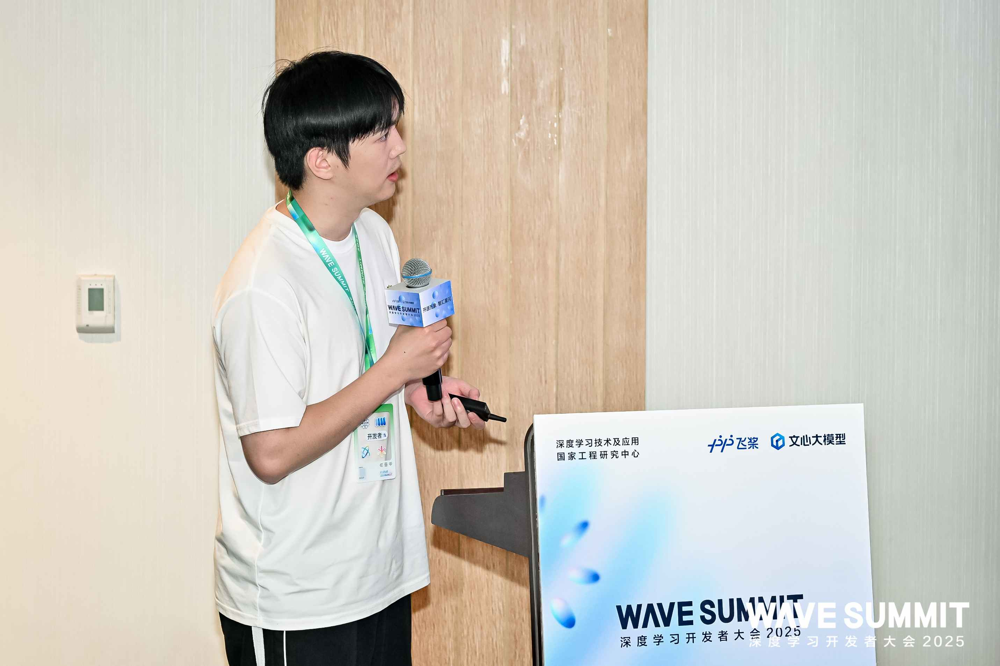

9 月 9 日下午，WAVE SUMMIT 开发者分论坛迎来了一场别开生面的分享环节——**“PaddlePaddle Contributor Lightning Talks” 技术快闪分享（开放麦模式）**。  
这是一个属于开源贡献者的舞台，也是一次关于热爱、技术与勇气的闪电碰撞。

现场汇聚了来自不同高校与背景的贡献者代表，他们用短短 5 分钟的时间，讲述与飞桨的相遇故事，分享技术思考、社区体验与个人成长。

<!-- more -->

---

## ⚡️ 闪电开启：把舞台交还给社区

主持人以一句“**代码可以改变世界，而开源社区正是汇聚这些改变力量的沃土**”拉开序幕。  
在热烈的掌声中，“PaddlePaddle Contributor Lightning Talks” 正式启动。

活动采取“5 分钟一位”的快闪形式，并特别设置了**开放麦（Open Mic）**，鼓励现场观众即兴上台发言。  
这是一个完全属于社区的开放舞台，每人 5 分钟，主题不限，但心意必须真诚。这里没有评委，没有评分，只有分享、共鸣与掌声。

---

## 🌟 五位预定分享者，闪电般的思维碰撞

本次活动的预定发言者，来自飞桨贡献者俱乐部（PFCC）的五位成员。他们既是开发者、研究者，也是社区共建者。

### 1. 唐汉霖：博士生的开源信仰

来自北京理工大学的唐汉霖，以“启航计划一等奖”的经历开启分享。他讲述了从学术研究走向开源实践的心路历程，也分享了自己在 NLP 方向的代码贡献经验。

> “开源，互助共赢 > 单打独斗。”

他的幽默与自信让现场气氛迅速升温。

<figure style="text-align: center;">
  
  <figcaption>唐汉霖演讲</figcaption>
</figure>

---

### 2. 聂宇旋：从‘卷王’到‘共创者’

接着登场的是本科生聂宇旋 (编者✍️注：聂师傅目前已经保研）。

他以“如何在学习与贡献间找到平衡”为题，用质朴的语言讲述了自己的学习方法与项目经验。

> “开源是额外负担，但也是一种责任。”

台下响起阵阵掌声，这位即将升入硕士的年轻开发者，用行动诠释了“成长型贡献者”的样子。

<figure style="text-align: center;">
  
  <figcaption>聂宇旋演讲</figcaption>
</figure>

---

### 3. 郑天宇：新生代的开源接力

来自电子科技大学的郑天宇，是护航计划的活跃助教。他分享了从“社区新人”到“贡献导师”的心路历程，鼓励更多同学迈出第一步。

> “在开源社区，要敢于尝试，先出发再修正。”

<figure style="text-align: center;">
  
  <figcaption>郑天宇演讲</figcaption>
</figure>

---

### 4. 张一乔：黑客松老将的技术沉淀

多次参与飞桨黑客松与开源赛事的张一乔，用轻松的方式讲述了在社区共创中的心路与成长。

> “从修 Typo 开始的深度学习+开发生活。”

<figure style="text-align: center;">
  
  <figcaption>张一乔演讲</figcaption>
</figure>

---

### 5. 邱睿桥：从研究者视角看开源生态

来自北京大学的邱睿桥博士，以“研究国内外开源生态”为主题，带来独特的学术视角。  
她分享了中国开源社区的成长趋势与飞桨生态的开放实践。

> “飞桨开源社区对于新手非常友好，社区氛围也温馨友善。”

<figure style="text-align: center;">
  
  <figcaption>邱睿桥演讲</figcaption>
</figure>

---

## 🎤 开放麦：属于每个人的 5 分钟

当主持人宣布开放麦开始后，台下的观众纷纷举手报名。  
两位社区同学勇敢登台，带来了即兴的真诚分享：

### 🌱 社区开发者 A 张磊：老程序员的新征途

第一位上台的，是一位自称“老程序员”的社区开发者。
他讲述了自己如何从传统开发者转型，在 AICA 中学习 AI 应用开发。
他在分享中笑着说：

> “我希望今年有机会的话可以再参与到百度其他的项目中”

<figure style="text-align: center;">
  
  <figcaption>社区开发者A张磊演讲</figcaption>
</figure>

### 社区开发者 B：被引路者

第二位上台的是一位年轻的社区成员。
他分享了自己被一位“引路人”带入 AI 领域的经历。

> “感谢我认识的每一个百度人”

<figure style="text-align: center;">
  
  <figcaption>社区开发者B演讲</figcaption>
</figure>

现场掌声不断，主持人不断以鼓励的语气带动氛围：“**这就是开源精神，说上就上！**”

---

## 💬 主持人的总结

> “开源的精彩，不止在于代码提交，更在于你勇敢发声的那一刻。”

Lightning Talks 的最后，主持人感谢所有登台的分享者，也邀请更多观众在未来成为社区故事的主角。

---

## 📸 活动现场

热烈的掌声、闪光的创意、自由的交流——这一刻属于飞桨贡献者。

<figure style="text-align: center;">
  
  <figcaption>活动现场</figcaption>
</figure>

合影定格的瞬间，也记录了开源社区的温度与连接。

<figure style="text-align: center;">
  
  <figcaption>合影留念</figcaption>
</figure>

---

## ✨ 尾声

飞桨社区的魅力，正在于它的开放、包容与真实。

无论你是博士、学生、老程序员，还是刚刚入门的开发者；

无论你贡献的是模型、文档，还是一次 Pull Request——

在这里，没有门槛，只有热爱。

每一份闪光，都值得被看见。

Lightning Talks 只是一个开始。

未来，我们期待更多来自社区的声音，在更多舞台上被听见。

> “开源不止步，Lightning Talks 不止一次。”
> 下一次，也许就轮到你。
