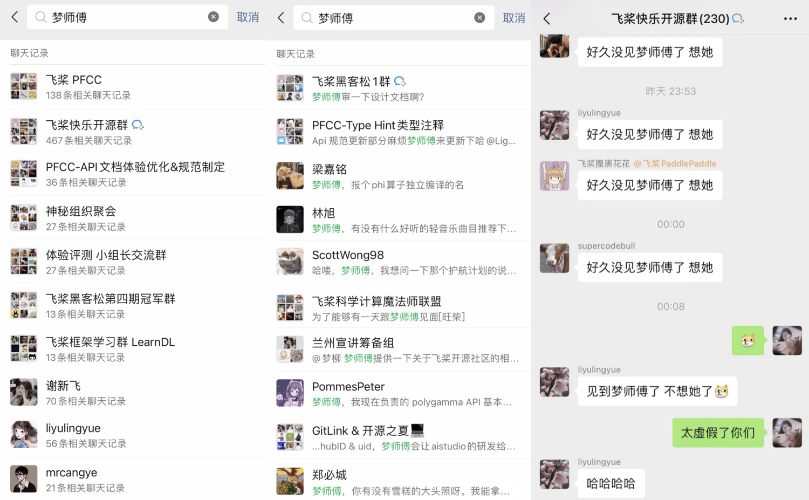
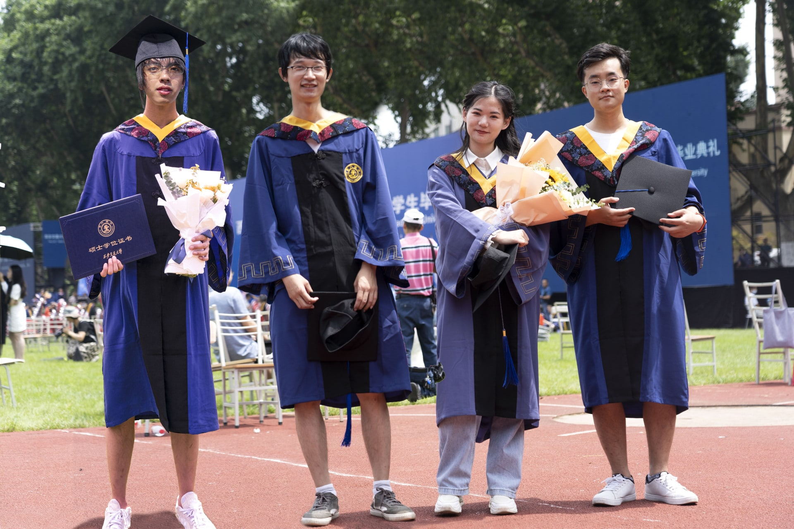
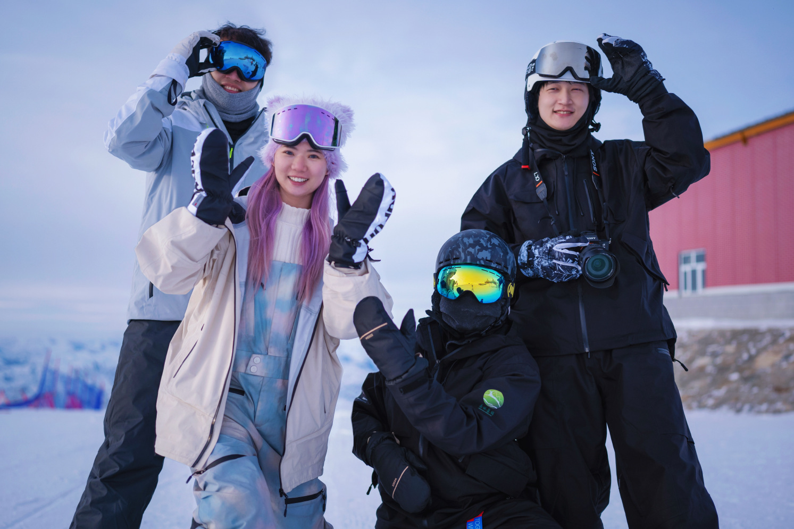
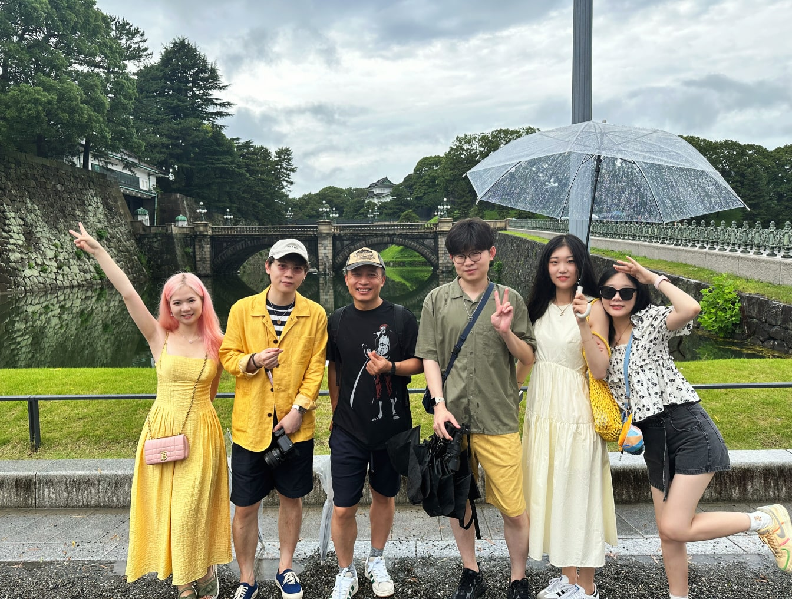
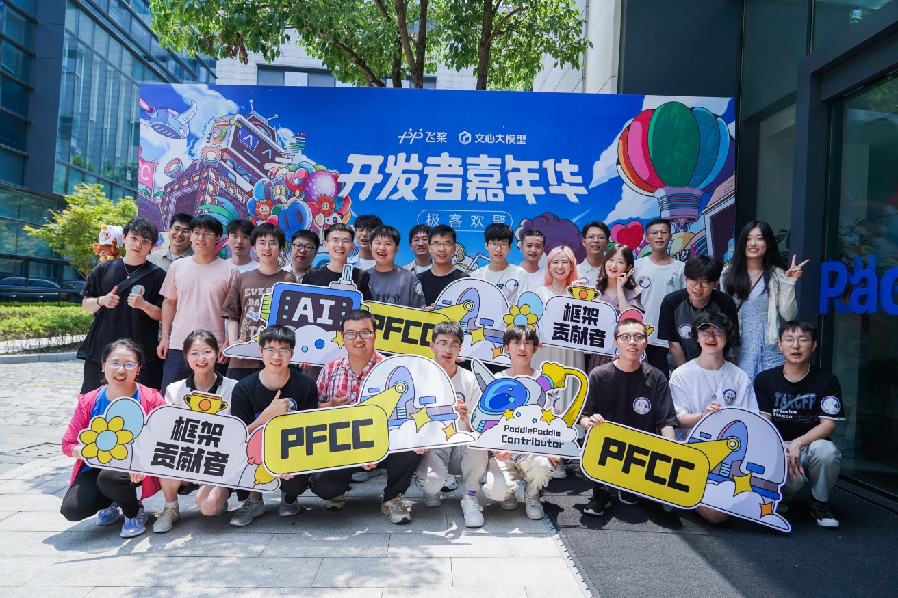
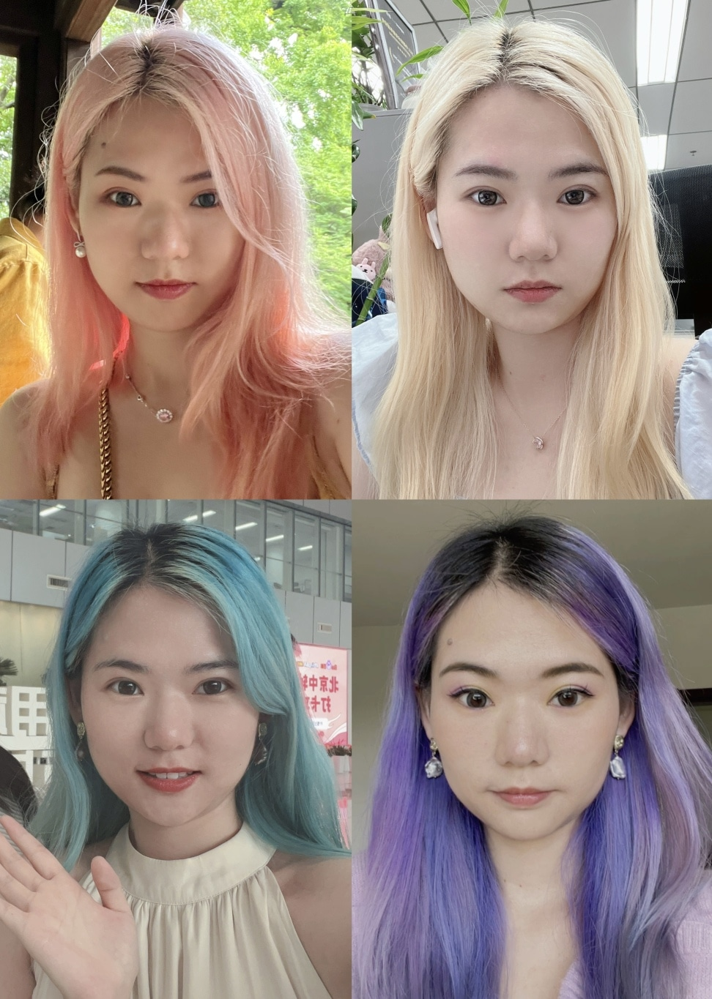

**All over the place was six pence, but he looked up at the moon.**

<!-- more -->

<!-- 导入聊天框功能 -->

<!-- 导入聊天框功能 -->

## 一、前言

> 省流总结：梦师傅跑路了，写篇 blog 庆祝一下 🎉

这是半个月前完成的采访，但应梦师傅的要求，文章在她的 last day（8 月 9 日）才发布。相信社区里的各位对梦师傅已经非常熟悉了。在飞桨开源社区的建设过程中，Ligoml 这个 GitHub ID 几乎无处不在，而她那一头粉色头发和猫猫更是给大家留下了深刻的印象。作为同事，她十分靠谱；作为朋友，她非常有趣。我还清晰地记得，刚来飞桨实习时接的梦师傅的活儿，当时她正好在毕业旅行，交接时跟我说她在雪山上信号不好...Anyway，希望梦师傅裸辞后身体健康，万事顺遂～

## 二、采访内容

1. **介绍一下自己吧！**

   **梦师傅：** 我叫李梦柳，前百度 AI 产品经理，GitHub ID：Ligoml，因为平时爱水群和答疑，大家都叫我梦师傅。

   <!-- WeChat -->
   <figure>
      
      <figcaption>微信截图</figcaption>
   </figure>

2. **都说 21 世纪是生物的世纪，为什么研究生跨专业学 CV 了？**

   **梦师傅：** 我本科专业是生物医学工程，当初选专业主要是两个原因，一个是生物学的最好，另一个是喜欢小动物（后来发现我只是单纯的喜欢猫）。

   进到大学以后参加了一些实验室项目，印象很深的一个项目叫：还原型谷胱甘肽控制金纳米棒制备研究，那时候感觉这个课题名称明明都是汉字，却那么难以理解。简单来说就是根据特定配方，把各种液体混合在一起，然后等 8 个小时后金纳米棒长出来，并试图解释电镜下的折线含义。其实很符合对生科人的刻板印象，穿着白大褂，操作移液枪，混合各种彩色液体（实际上是无色的），养细胞做实验。每一次的漫长等待，对结果的未知性，都在坚定我跑路的心。所幸我的成绩还不错，拿到了保研资格后，就找到了我的研究生导师，转投到了 CV 这个赛道，然后发现炼一次丹的时间，可能不止 8 小时……当然这就是后话了。

3. **听说大学期间你还当过某公司 CEO，细说**

   **梦师傅：** 对，那个时候在鼓励“大众创业，万众创新”，开公司的成本非常低，刚好我所在的社团有一些拍片子做网站的特长，有一个公司实体会方便一些，于是就和当时的几个社团负责人联合创立了一家公司，叫西咸新区挑战信息科技有限公司（因为社团名叫挑战网），我是法人代表。当时想的就是，只要我们不玩金融游戏，踏踏实实赚点生活费还是够活的。毕业以后把社团和公司一起留给学弟学妹了，现在应该还活着。当年一起开公司的伙伴们，直到现在也是我非常好的朋友，会约一起出去旅行什么的。

   <!-- 合照 -->
   

      <figure style="width: 63%">
         
         <figcaption>毕业典礼</figcaption>
      </figure>
      <figure style="width: 63%">
         
         <figcaption>可可托海</figcaption>
      </figure>
   

4. **为什么毕业加入了百度？以及为什么开始搞开源社区了？**

   **梦师傅：** 当时研究生毕业的时候手里有几个 offer，因为代码写的菜，不太想为难自己，所以选了做产品经理，这样可以指挥别人给我写代码，嘻嘻。

   作为校招生刚来，肯定是以培养为主的，经理就安排我去做开源社区的 issue 管理员，每天解答各种 issue，以及找人帮我解答 issue。那个时候飞桨刚发布 2.0 版本，易用性得到了极大的提升，具备了建设开源社区的技术基础，我的性格比较活泼，还懂点 AI 技术，就很顺理成章的被分配去搞开源社区了。我们飞桨的社区开发者个个都是人才，代码写得漂亮，说话又好听，每天上班跟大家水水群，还是蛮快乐的。

5. **建设开源社区的过程中，有没有遇到印象特别深的事或人？为什么？**

   **梦师傅：** 那可太多了，为此我还专门写了一篇博客 👉 https://pfcc.blog/posts/2023-os-report ，我就只提几个关键词，大家自己对号入座：春节 18 响 🧨，雪糕狂热粉丝 🐱，最强水群人📱，开源强迫症 001 👓，还有一些人菜瘾大的小甜水爱好者，请坐小孩那桌（误

   > 编者注 ✍️：春节十八响这些梗永流传了属于是

6. **搞开源社区的时候快乐吗（狗头）？对于开源社区的价值和意义是怎样理解的？**

   **梦师傅：** 是真的快乐，当时我还在厂内做了一场《我在飞桨 快乐开源》的演讲，很多同事都有印象。在开源社区，人的主体性得到了充分的尊重，我们相聚在一起，只是因为纯粹的热爱，只做自己感兴趣的东西，没有利益和投入产出的权衡，怎么会不快乐呢？

   我认为开源会给一个项目带来无穷的生命力，即使许久无人维护，后面的开发者仍旧可以基于这个开源项目去生长出其他有价值有意义的项目，大家共同为开源项目添砖加瓦，持续不断的推进技术向前发展。而且由于你需要把代码开源出来给大家看，那么就会有一些个人包袱在，会关注代码规范性、文档完整性，这样会使得整个生态良性发展，越来越好。

   > 编者注 ✍️：拿着工资上班水群确实挺快乐的

7. **厂长近期关于开源有一些表态（开源大模型会越来越落后），你怎么看？**

   **梦师傅：** ~~猜猜我为什么离职~~ 我觉得厂长应该是有自己的考虑，而选择了文心大模型走闭源的道路，这本身无可厚非，OpenAI 也没有开源 ChatGPT，但是踩一捧一就没有必要了吧，这样的发言也把开源的飞桨放到了一个尴尬的位置上，就很难评。

8. **在百度飞桨工作的三年里，最快乐的一件事&一些事？**

   **梦师傅：** 我还是蛮会在工作中找乐子的，遇到了好多合得来的同事朋友 👭，工作之余约个咖啡约个酒 🍹 什么的，都让我十分放松。最快乐的时光可能是去年的 7 月，先是去了日本团建 👗，然后五月天演唱会 🎤、梅西球赛 ⚽️，在上海办了开发者嘉年华 👻，面基了好多只认识 GitHub 🆔 的网友，我的头发也是那段时间变了很多颜色 🌈，差不多一周就会换一个，那时候的生活是非常多彩且自由的。

   > 注：换颜色的原因是我的护发素有颜色，不是每次都需要去理发店重新染的，而且因为是护发素所以不伤头发 hhh

   <!-- 合照 -->
   

      <figure style="width: 35%">
         
         <figcaption>日本团建</figcaption>
      </figure>
      <figure style="width: 39.5%">
         
         <figcaption>PFCC 线下 meetup</figcaption>
      </figure>
      <figure style="width: 18.8%">
         
         <figcaption>限定皮肤</figcaption>
      </figure>
   

9. **最想吐槽百度&飞桨&领导的是什么？至少说出一个百度最大的病症（狗头）**

   **梦师傅：** 经常有人评价百度：起个大早，赶个晚集。我对此有深刻的体会。百度其实不缺有想法有能力的人，整体的氛围也是鼓励探索的，所以我们经常能看到很多在厂内已经聊过做过的项目，成为了别家打造的爆款产品，互联网行业的黄埔军校名副其实。

   在我看来，上层定位不清晰，中层摇摆不定，会让我们这些一线打工人非常心累。以我后来做的 AI Studio 为例，不到一年时间平台定位更换了三四次，从学习与实训社区到大模型社区，再到个人开发工作台，现在回归了大模型学习平台，每一次的变更都会带来整体功能和交互逻辑的大调整，出走半生，归来仍在原地，甚至可能更差。这期间 ModelScope、HuggingFace、Coze 等平台均以自己准确的定位和优质的产品体验成为了各自领域的头部，我们输在哪了呢？

10.   **跑路的原因？裸辞之后有什么打算吗？**

      **梦师傅：** 卷不动了，想歇一段时间，刚好手里的工作告一段落，觉得现在离开会是一个比较负责任的时机，所以就提了离职。

      我其实很感谢百度能给我一个宽松的工作环境和成长空间，以及足够裸辞的存款作为底气。之后的打算嘛，应该还是会找个班上，想折腾点 AI 工具，搞点有意思的项目或者视频，我没做过的事情，都可以一试。

11.   **不考虑薪资，最想做的工作是什么？**

      **梦师傅：** 做开源应用仙人（别笑）。

      之前选择做产品经理，主要还是代码写的菜，那假如我基于别人的开源项目，让 AI 给我写呢？我就动动嘴皮子，搞点没啥用但是有趣的应用给大家玩，代码开源出来，感觉也挺有意思的，我甚至可以录个视频给大家当乐子。

## 三、来自社区的拷问

   <MessageBox>
   <Message name="ALL" github="PaddlePaddle">
   梦师傅跑路了？
   </Message>
   </MessageBox>
   <MessageBox>
   <Message type="right" name="梦师傅" github="Ligoml">
   跑路了💨
   </Message>
   </MessageBox>

   <MessageBox>
   <Message name="汪师傅：" github="GreatV">
   梦师傅头发换了几种颜色？
   </Message>
   </MessageBox>
   <MessageBox>
   <Message type="right" name="梦师傅" github="Ligoml">
   我数数啊，粉色、金色、蓝色、绿色、紫色、灰色、奶茶色、水蓝色、粉紫色、玫红色......
   </Message>
   </MessageBox>

   <MessageBox>
   <Message name="散步" github="sanbuphy">
   梦师傅会打算开小红书、b 站或者公众号吗？
   </Message>
   </MessageBox>
   <MessageBox>
   <Message type="right" name="梦师傅" github="Ligoml">
   全网都叫 Ligoml，不过是我的个人账号，我比较懒，还没有运营规划哈哈哈～
   </Message>
   </MessageBox>

   <MessageBox>
   <Message name="散步" github="sanbuphy">
   推荐几款酒和配酒的菜
   </Message>
   </MessageBox>
   <MessageBox>
   <Message type="right" name="梦师傅" github="Ligoml">
   你去坐小孩那桌
   </Message>
   </MessageBox>

   <MessageBox>
   <Message name="whisky-12" github="whisky-12">
   以后还有机会见到梦师傅的猫吗？
   </Message>
   </MessageBox>
   <MessageBox>
   <Message type="right" name="梦师傅" github="Ligoml">
   有的呀，想看可以群里@我，有趣的照片和视频我也会分享到朋友圈，看完记得点赞
   </Message>
   </MessageBox>

   <MessageBox>
   <Message name="张师傅" github="Liyulingyue">
   想问问梦师傅裸辞之后有机会来亦庄这边发展吗？
   </Message>
   </MessageBox>
   <MessageBox>
   <Message type="right" name="梦师傅" github="Ligoml">
   去开无人车嘛？
   </Message>
   </MessageBox>

   <MessageBox>
   <Message name="敏师傅" github="enkilee">
   转行当美食博主吗？
   </Message>
   </MessageBox>
   <MessageBox>
   <Message type="right" name="梦师傅" github="Ligoml">
   那恐怕有点困难，我只会煮方便面🍜
   </Message>
   </MessageBox>

   <MessageBox>
   <Message name="昱晨" github="yuchen202">
   问问梦师傅以后还打算从事AI相关工作吗
   </Message>
   </MessageBox>
   <MessageBox>
   <Message type="right" name="梦师傅" github="Ligoml">
   应该还是在AI这个圈子里吧，毕竟我也只会这个
   </Message>
   </MessageBox>

   <MessageBox>
   <Message name="花花" github="Tulip-hua">
   那你H2会给飞桨框架贡献代码吗？
   </Message>
   </MessageBox>
   <MessageBox>
   <Message type="right" name="梦师傅" github="Ligoml">
   我可以让文心一言替我写吗？
   </Message>
   </MessageBox>

   <MessageBox>
   <Message name="军哥" github="jzhang533">
   觉得社区里的哪个小哥比较帅？（如实回答）
   </Message>
   </MessageBox>
   <MessageBox>
   <Message type="right" name="梦师傅" github="Ligoml">
   我的审美还挺单一的，就喜欢高高瘦瘦长相清爽的男孩子，我们社区可多了，点名都点不过来（端水
   </Message>
   </MessageBox>

## 四. 大龄失业粉毛女青年旅行 Vlog

TBD（梦师傅：在做了）

## 写在最后 💡

**【开源江湖闲聊录】** 是一项专门为 Paddle 社区的开发者打造的特色访谈栏目 📚。在这里，我们邀请到每一位别具一格且富有热情的开发者，通过文字或语音的方式进行深入采访 🎙️，探索并展现他们背后独一无二的故事，将他们的经历、见解和创意整理成精彩内容，呈现给整个社区。

如果你有兴趣对社区的开发者进行采访，可以联系孙师傅，**急缺助手！**

---
