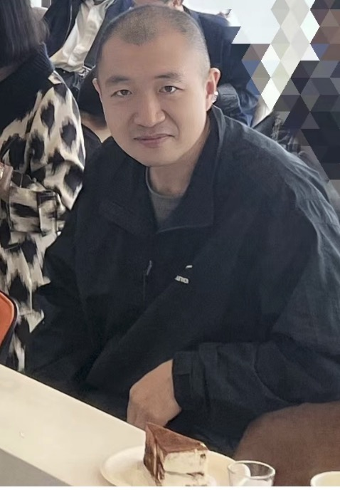
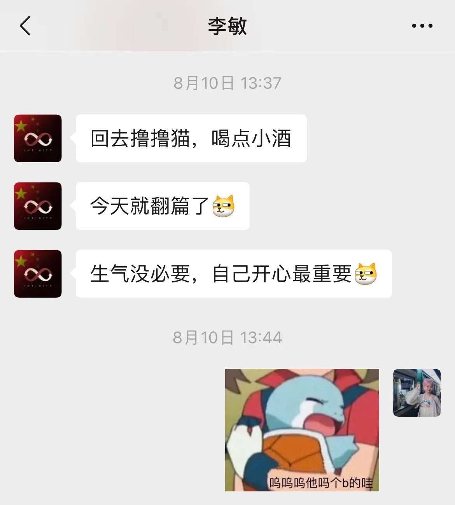
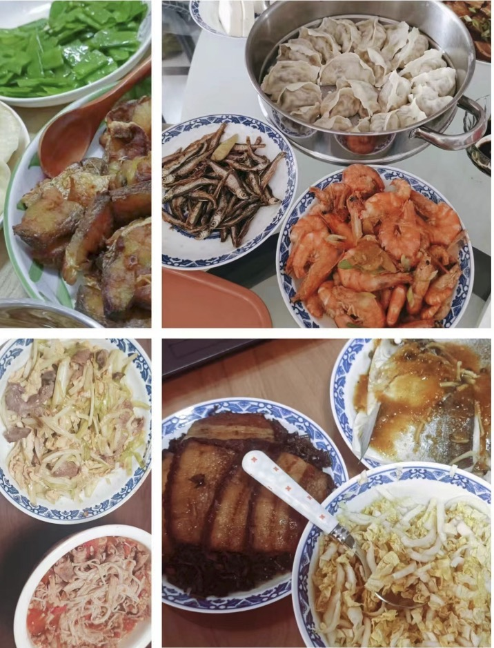
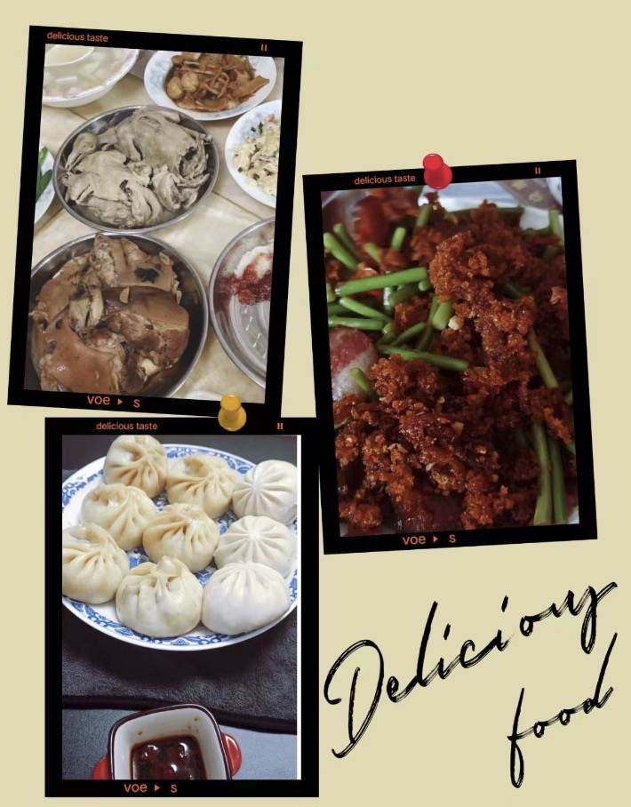

从对 Git 一窍不通到如今能够丝滑完成黑客松赛题，从曾经历鬼门关的生死挣扎到现在能够轻松跑几公里不喘气，从毕业于武大国软学的有志青年到佛系养生的新时代躺平中年，**敏师傅** 的人生经历就像是那瓶经年陈酿的老酒，醇厚细腻、回味无穷。

<!-- more -->

<!-- 导入聊天框功能 -->

<!-- 图例样式 -->

## 一、前言

是谁，天天说自己是 **“老咸鱼”** ？是谁，戏称自己是 **“快奔 4️⃣的老头子”**？又是谁，自诩为 **“摸🐟王者“**？是他、是他、就是他～我们的朋友——**敏师傅**！！！

> 匿名回复： 我没有，假的，都是假的

敏师傅毕业于武汉大学，目前在珠海某甲方企业工作。作为新时代中年人，敏师傅和许多开源者一样，喜欢躺平、宅家、吃吃吃！但敏师傅不仅喜欢吃，还喜欢做。不仅喜欢做，还擅长烹饪各式各样的美味佳肴，堪称“当代好男人”（敏：“相对的，比群里其他大佬差距还很大！”）、“顶级家庭煮夫”、“万千少女的理想老公🫰❤️（敏：“不是不是，我有主的，理想厨子是真！”）连米国五星上将麦克阿瑟见了都评价道：“不是米其林大厨请不起，而是李敏更具性价比！”

> 后文有敏师傅的厨艺展示哦～

在健身养身方面，李敏师傅也颇有经验。给他一根杠铃杆，他能撬动整个亚欧大陆！给他一套跑步装备，他能漫步宇宙！著名物理学家阿基米德曾说：“李敏所创造出来的物理奇迹足以改写人类此前所有的力学研究！”无论是极限深蹲、恐怖硬拉还是痛苦卧推，在李敏的面前都不过是老八进厕所手到擒来！

> 匿名回复： 没有没有，都是瞎说的，手无缚鸡之力！

而在开源方面，作为一个非专业的开源开发者，敏师傅从学习如何提交 PR 做起，到加入 Paddle 的 API 文档修改组，再到后面又积极参加一系列快乐开源活动和更具挑战性的黑客松。正如敏师傅所说：“自己在 Paddle 就像打怪升级一样做各种任务”。在这段 Paddle 的这段旅程中，他一点点精进了自己的技术，也结识了许多热爱开源的小伙伴。接下来让我们去瞧瞧这位多才多艺的“摸🐟老头子”（just kidding😉😉😉）！

   

      <figure style="width: 31%">
         
         <figcaption>左图：李敏师傅</figcaption>
      </figure>
      <figure style="width: 66%">
         
         <figcaption>右图：水群摸鱼日常</figcaption>
      </figure>
   

## 二、采访内容

1. **介绍一下自己吧，敏师傅！**

   **敏师傅：** 各位大佬好，专业摸鱼，日常躺平晒太阳的咸鱼就是我了。身高 183，体重 170。老胖鱼一条。

2. **敏师傅说个人爱好之一是宅，那么平时宅在家干什么呢？**

   **敏师傅：** 宅家追剧，鉴于囊中羞涩，又秉持开源，所以都是看免费的（大家不要学我，要支持正版，知识产权法在头顶）。有时会神经质发现地脏，就做个简单的扫除；有时就去公园跑跑步、做做拉伸，尽量让自己活的久点，要不然养老金白交了；要么小主想逛苍蝇馆子，就祭出地图精准定位去吃，吃完回家。

3. **你曾经有提到在机器学习的过程中自己差点 “见了太祖”，请给大家分享一下这次惊险的经历😮**

   > 匿名回复：不是学习中，是那会刚好在学基础，我出事跟学习无关啊～

   **敏师傅：** 某年，我在工作中，可能因为淋雨作业、感冒，加上伙食里有沙吧...多种原因叠加在一起，一天上午在办公室突然感到头昏。一开始估摸自己是低血压了，就去卫生队让值班人员量了个血压，结果 40/20。我估计自己身体出了大问题，赶忙让他们打了针 NE，然后喊队长把我送医院。

   到了医院迷迷糊糊的，不敢让自己睡着。一天下了 3 张病危，好像是急性胆囊炎合并肺炎，附加胸腔积液。指标各种超标，医生也不敢手术，一直发烧，让医生给打了丙球续命，中间因为升压药泵注射漏了，整个胳膊肿得不像样，让护士帮忙买土豆切片敷那吸收了才完事，同为三甲，简直了。

   过了 5 天医生估计受不了了，让转广州医院，还好领导派了个人跟着，就整了个车把我送到广总。那边直接说割胆囊，我怕，就说保守治疗，主任也同意了，就在广总住了一个多月。抽血都抽了三四十管，也没查出来病因，多科会诊好几次，像实验体一样躺着被几十人围观好几次。最后我看化验单，连非洲的传染病都查了，结果全是阴性。也就不了了之保守治疗了。先住传染科，然后呼吸内科，然后心内科。反正躺床上被推来推去，哈哈哈。

   那一个多月禁食，每天就是打营养针。就记得那脂肪乳，一瓶能打几个小时，每天从上午 8 点打到晚上 8 点。最后几天，医生才让吃流食，粥都不能喝，只能喝粥上面的米汤，唉。然后回到单位吃了半年的过汤菜（就是把所有菜都放水里洗洗尽量没有油），肚子上的肉都没了，皮都耷拉下来了😂

   > 编者注✍️：真・大难不死，必有后福啊。不过咱们社区开发者怎么什么离奇的经历都有...？

4. **听说敏师傅的工作经历也非常曲折有趣，能具体说说么？**

   **敏师傅：** 这个，也没啥。毕业稀里糊涂进了某集团，一开始说干计算机的事，结果一点不沾边，各种其他技能点点了个遍。架设卫星锅，招待上级，液压系统维修，汽车机油液压油更换，气路维修，强电弱电架设，挖坑种树等各种。

   全国各地的沙漠，森林，海岛跑了大半，格尔木睡沙漠，半夜帐篷被吹飞去追帐篷，靖宇睡森林，半夜下暴雨水淹帐篷急忙转移，跟着护林工逛森林，吃野果，挖人参，烧松子，反正东北比西北好玩的多。海岛就懵了，坐船就吐的昏天暗地，然后各种晒脱皮，最难受的地儿。

   后面几年总算是接触计算机，做了个仿真训练系统，抄了一堆网站，各种借调打黑工。然后就想着赶紧滚蛋啥都不想干了，躺平。后面就是学机器学习，接着住院，接着佛系养生。

5. **你最早接触开源是在什么时候？**

   **敏师傅：** 大学吧，那会为了看越狱、迷失、危机边缘那些。好用的播放器不多，关键是字幕。射手网开源了个播放器，就 SVN 拿下来看了看，支持各种制式视频，最大的特点是可以在线搜索字幕源并选择，在那个 RealPlayer 的年代，真的是非常的优秀。

6. **那你又是怎么加入到 Paddle 社区的？您对于开源社区的价值和意义是怎样理解的？你认为这些价值和意义在 Paddle 社区又是如何体现的？**

   **敏师傅：** 好像是查飞桨文档学习时，梦师傅的文档修改任务，然后就上了大船。
   我觉得在国内做开源真的挺不容易，毕竟开源在绝大部分人认为就是免费，其实也就是免费，而且大家都信奉拿来主义，开源协议那块也不关心。开源需要投入的人力物力财力都是不小的，投入少了，社区和维护不够，BUG 就多了。但绝大多数软件，都是从开源起家的，操作系统、中间件、数据库、应用软件等等，所有层面都有开源的身影，是开源让计算机发展的更迅速，微软都不得不妥协进行开源，可想开源的力量。

   价值和意义的话，就用我接触的几个大佬概括下吧：

   - **涛姐**，我所接触到飞桨负责开源的最高级别人物。涛姐从研发那割下来的开源任务，要考虑到我们的能力，不能太难，适众面又要广泛，对应负责的研发还要 Review，都是增加飞桨内部的工作量。然后做黑客松题目时发现，题目所需的，可以把开源题目串起来。这时才发现涛姐选题的前瞻性、系统性、大局观。对整体框架的全局把握才能轻车熟路深入浅出的发布出我们能做的题目。可想而知涛姐的能力有多强 👍。

   - **梦师傅**和**花花**，运营的核心 CP，原文档负责人，从任务发布、统计信息、数据到对接第三方，做过统计上报的都能懂，那就是个磨人想砸键盘的活，我们一堆人是一个个点，她们那是一整个面，但凡报上去的信息不对，就是反复的核实修改，线下的活动也组织的有声有色，从历次活动照片能看出参与者欢快的笑容，也反映出组织者的能力有多强。

   - **孙师傅**，现 Docathon 发起人和文档总负责任。虽然他总是潜水，而且使用者总说文档有错误。但反过来看，那还不是因为 API 更新快，参数修复多。孙师傅负责的是很庞大的费眼睛的项目，代码嘛，能跑就行，有的使用者只关心 API 怎么用。但文档，是所有人必须要看的，严谨系数其实比代码要高的多，孙师傅劳心劳力确实不容易。

   > 编者注✍️：梦师傅是产品经理，不是运营哈哈哈。~~另外，我潜水是因为沉迷工作~~

7. **作为一个非专业的开发者，一开始接触 Paddle 的时候你遇了过什么困难或者问题，是怎么解决的？**

   **敏师傅：** 刚开始，对流行的开发是一窍不通。对于 Git，只会把代码下下来自己用，从来没有提过 PR。那会在群里啥也不懂，连 PR 是啥也不知道，Git 其他命令也不会，只会 clone，后来在梦师傅和张师傅的帮助下，看教程。但是那会儿，前面几个 PR 只会在 GitHub 打开单文件修改提交，CI 流程过不去。后来看了张师傅的 PR 教程，才学会了命令提交。

8. **你有提到最初是看教程学习 Paddle 的，你觉得飞桨的文档和教程怎么样？**

   **敏师傅：** 飞桨文档和教程，在主线这块是维护的很及时的，就是对于分支一些，教程和代码的不同步还是很明显的，记得有个给黑白视频上色的教程，怎么都跑不下来，最后才知道，得用老的仓库代码才行。但教程里的代码，clone 下来必然是最新的。

9. **你参加过哪些飞桨的开源项目？你最喜欢哪个项目，为什么？**

   **敏师傅：** 参加的挺多，都是摸鱼做做边缘任务，最喜欢的应该是 001 带的任务，因为他基本 724 在线，改 PR 的速度赶不上他 Comment 的速度，哈哈哈哈哈哈。

   > 编者注✍️：001 ([SigureMo](https://github.com/SigureMo))是 Paddle 社区出了名的劳模，望周知。由于是第一位社区 commiter 而被大家称为 001。

10.   **听说你还参加了黑客松，那段经历一定很精彩，能否分享一下你在那期间遇到的有趣事情或者特别人呢？**

      **敏师傅：** 在婷姐带领下做了点 FP16 的任务，在花花带领下写了个 API，跟其他大佬比起来，我这基本就是小学生水平，就记得那会 CI 各种拥挤（当然，责任在我，因为我没环境，只能靠 CI，哈哈哈哈）。

11.   **你觉得 Paddle 社区在吸引和培养新的开发者方面做得如何？是否有一些改进的建议或者想法？**

      **敏师傅：** 我觉得一直都很吸引人，梦师傅、花花、酥酥、孙师傅各种活动都能面面俱到（虽然没实地参加，但看照片能看得出）。
      建议想法啥的，我这四肢不发达头脑简单的脑子就算了，跟着大家学就好。🙂

12.   **除了 Paddle 之外，您还参与过其他开源项目吗？如果有的话，您觉得 PaddlePaddle 与其他项目相比有哪些独特之处？**

      **敏师傅：** 其他的么，好像真没，MMEngine 算么，当时要找框架，所以提了 1 个还是 2 个 PR 吧，后面就放弃了，因为没有免费算力可以用😀，还是咱飞桨好用。

13.   **在与花花、孙师傅、梦师傅、涛姐和其他 Paddle 大佬的交流中，您学到了哪些知识和经验？对您的技术有哪些影响呢**？

      **敏师傅：** 平时怕他们忙，基本不主动找各位大佬。我们这都是点，她（他）们那是面，所以她们的工作量肯定是非常大的，能不打扰就不打扰。

14.   **对于在某甲方公司工作，敏师傅有没有一些摸鱼小技巧可以分享一下呢？你是如何平衡工作和生活的？**

      **敏师傅：** 摸鱼技巧？开会带本书，看看会议就过去了，反正路人甲一个，一般就用“三不”回答：**不会、不懂、不知道**。领导的决定都是对的，领导的决策都不会错，错了那也是我们马仔理解不够深，执行不彻底，落实不到位。

      平衡工作生活的话，下了班就 不干活，遵守 995，除了大值班，这都得参加，没啥说的。

      > 编者注✍️：学到了。

15.   **对于那些想要成为开源贡献者的人，您有什么鼓励和建议？**

      **敏师傅：** 不管是不是科班出身，大项目里开源一般有利无害的吧。我毕业太久，现在的应聘肯定卷出了天际，啥力扣 ACM 估计都是基操，能用开源项目加分的话，先进大厂实习再氪肝留大厂也是条路吧。说的不一定对，请客观看待。

16.   **最后，敏师傅还有什么想和大家说的么？**

      **敏师傅：** 有新手怪的话，大佬们给我留点。我还是砍砍史莱姆和稻草人就好😀。

## 三、著名大型评论平台——虎扑评论专区

敏师傅和太多的人打过交道了。由于篇幅的原因，我们邀请了部分和敏师傅有过合作经历的朋友们，贡献一下他们和敏师傅发生的故事，或者对敏师傅的评价～以下均为真心话，请放心食用！

### by 孙师傅（[sunzhongkai588](https://github.com/sunzhongkai588)）

<MessageBox>
   <Message name="孙钟恺" github="sunzhongkai588">
   一开始对敏哥印象深刻，是因为敏哥的微信昵称拼音——讷言敏行（nè yán mǐn xíng），总共 4 个，有位前同事能把其中 2 个读错成 nà ... ... háng。🤣
    
   之后，从提文档修复的 PR 开始，就能明显感觉到敏哥的进步，再到后来敏哥能一口气把好多快乐开源任务都认领完成了，真的非常厉害。
   </Message>
</MessageBox>

### by 婷姐（[zhangting2020](https://github.com/zhangting2020)）

<MessageBox>
   <Message name="张婷" github="zhangting2020">
   敏师傅领题目、push 研发超积极。最厉害的是自己不做测试的，都是一把改完 push 上去看 CI 结果，也不需要 GPU 算力（手动狗头），以充分利用婷姐的脑力资源为主。
   </Message>
</MessageBox>

### by 汪师傅（[GreatV](https://github.com/GreatV)）

<MessageBox>
   <Message name="汪昕" github="GreatV">
   敏师傅，当然是实力超强的摸鱼仙人
   </Message>
</MessageBox>

### by 花花（[Tulip-hua](https://github.com/Tulip-hua)）

<MessageBox>
   <Message name="花花" github="Tulip-hua">
   众所周知，飞桨开源社区分为两股势力：以敏师傅为首的好人阵营，以 002 为首的时好时坏阵营。
   </Message>
</MessageBox>

> 编者注✍️：下面这位就是花师傅说的时好时坏的 002 ⬇️

### by 张师傅（[liyulingyue](https://github.com/liyulingyue)）

<MessageBox>
   <Message name="张一乔" github="liyulingyue">
   敏师傅简直是吾辈楷模，能愉快的摸鱼提 PR，还有老婆，真让人羡慕。
   </Message>
</MessageBox>

### by 独师傅（[longranger2](https://github.com/longranger2)）

<MessageBox>
   <Message name="张伟鸿" github="longranger2">
   敏师傅给我的感觉就如同金庸武侠小说里的扫地僧，活跃在飞桨各大大小小的社区当中，神秘而且武功深不可测，有极高技艺却又深藏不露。嘴上说着摸鱼，但上班的时候提起 PR 毫不手软（敏师傅，咱贵公司还招人吗[可怜]）。敏师傅也是一部行走的百科全书，上知天文，下知地理，尤其对吃的颇有造诣，如果你想知道不同地方的美食，问敏师傅就对了。
    
   不过我也得来吐槽下敏师傅，平时我认领的任务还没开始做的时候，张师傅都是口嗨说要背刺我，但只有敏师傅是来真的，直接把我认领的任务做了，希望敏师傅下次能给我留口汤喝，ball ball you 了😭
   </Message>
</MessageBox>

### by 陈沧夜（[mrcangye](https://github.com/mrcangye)）

<MessageBox>
   <Message name="陈龙" github="mrcangye">
   敏师傅是我人生重要的领路人之一，每次抉择迷茫时候，敏师傅总会用他经验满满的信息差对我的迷茫分叉口进行降维打击！最后让我拨云见月，酣畅淋漓！
   </Message>
</MessageBox>

### by 梦师傅（[Ligoml](https://github.com/Ligoml)）

<MessageBox>
   <Message name="梦柳" github="Ligoml">
   敏哥人超好！职场导师+1
   </Message>
</MessageBox>

<!-- 梦的证据 -->

    <figure style="width: 30%;">
      
      <figcaption>敏哥安慰梦师傅的聊天截图</figcaption>
    </figure>

## 四、敏师傅的佛系养身 TIME~🏃‍♀️🏋️‍♀️⛹️‍♀️🚴‍♀️🤸‍♀️👯‍♂️💪

### 经历

先设定个小目标，就减肥吧，然后开始了漫长的减肥计划。
一开始 3 公里都难跑及格，啥也不管，先开跑，同时补充氨糖和维生素，免得关节废了。好像从 95 跑到 85 后，各种体测也没问题了。前几个月体重掉的快，后来基本一个月一公斤，逐渐五公里到十公里，最后跑了个半马试试自己的耐力。然后体重就到了瓶颈期，跑步成了热身，体重不减，体脂不减，请教专业人士，开始上力量，原始三件套：深蹲，硬拉，卧推。先慢跑 3 公里，然后负重训练。后来逐渐加上 HIIT，体重最轻的时候到了 70 公斤。

### 过来人的小 tips💡

总结一下大概如下：热身是必要的，体重大先用有氧减脂，一开始不用太在意体重，练就完了，碳水和蛋白质要保证，氨糖和维生素也是必备，到了某天会发现衣服大了，体重下来了。到了瓶颈期就可以上力量，没有条件就用 HIIT 代替，比如斯巴达 500，虽然痛苦，但是非常有效，提升新陈代谢率，提高心肺功能。在上力量时，如果有体检，会发现尿酸升高，这个是力量训练中常有的，可以暂停一周再复测，正常值后就说明是力量训练导致，就不用担心了。

## 五、彩蛋 🥚

### 1. 十项全能的家庭煮夫敏敏子在线狂秀厨艺

<MessageBox>
   <Message name="敏师傅" github="enkilee">
   自我宣言：本人手艺还行，刀工一般，之前在某集团时没事跑去炊事班练练手，打打牙祭。煎、炒、烹、炸、焖、炖、溜、熬、蒸、烩、煮、烙、汆、酿、扒、烧都会烧点。
   </Message>
</MessageBox>

<!-- 敏哥做菜 -->
   

      <figure style="width: 49%">
         
         <figcaption>敏哥做的菜-1</figcaption>
      </figure>
      <figure style="width: 50.1%">
         
         <figcaption>敏哥做的菜-2</figcaption>
      </figure>
   

### 2. 敏哥个人自述

敏哥在采访前也精心写了一份【个人自述】，篇幅过长就不贴在正文了，好奇的话可以读一下哦～

> 编者注✍️：留个彩蛋！我把它放在了博客 [GitHub repo](https://github.com/PFCCLab/blog) 下的 `src/eggs/limin-story/` 文件夹下哦～

---

## 写在最后 💡

**【开源江湖闲聊录】** 是一项专门为 Paddle 社区的开发者打造的特色访谈栏目📚。在这里，我们邀请到每一位别具一格且富有热情的开发者，通过文字或语音的方式进行深入采访 🎙️，探索并展现他们背后独一无二的故事，将他们的经历、见解和创意整理成精彩内容，呈现给整个社区。

---
