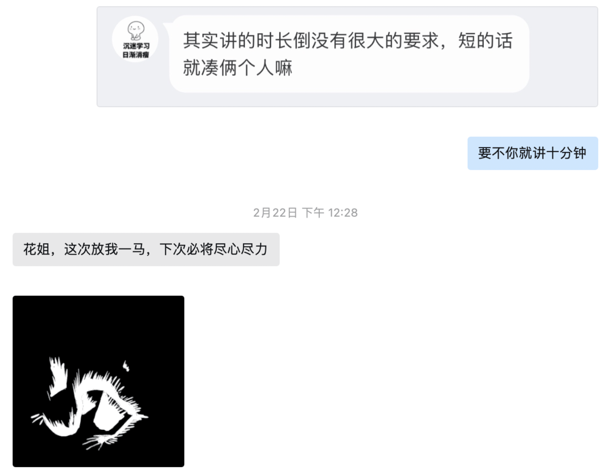

从对 Git 一窍不通到如今能够丝滑完成黑客松赛题，从曾经历鬼门关的生死挣扎到现在能够轻松跑几公里不喘气，从毕业于武大国软学的有志青年到佛系养生的新时代躺平中年，**敏师傅** 的人生经历就像是那瓶经年陈酿的老酒，醇厚细腻、回味无穷。

<!-- more -->

<!-- 导入聊天框功能 -->

<!-- 图例样式 -->

## 一、前言

是谁，天天说自己是 **“老咸鱼”** ？是谁，戏称自己是 **“快奔4️⃣的老头子”**？又是谁，自诩为 **“摸🐟王者“**？是他、是他、就是他～我们的朋友——**敏师傅**！！！

> 某路人师傅： 我没有，假的，都是假的

敏师傅毕业于武汉大学，目前在珠海某甲方企业工作。作为新时代中年人，敏师傅和许多开源者一样，喜欢躺平、宅家、吃吃吃！但敏师傅不仅喜欢吃，还喜欢做。不仅喜欢做，还擅长烹饪各式各样的美味佳肴，堪称“当代好男人”（敏：“相对的，比群里其他大佬差距还很大！”）、“顶级家庭煮夫”、“万千少女的理想老公🫰❤️（敏：“不是不是，我有主的，理想厨子是真！”）连米国五星上将麦克阿瑟见了都评价道：“不是米其林大厨请不起，而是李敏更具性价比！”

> 后文有敏师傅的厨艺展示哦～

在健身养身方面，李敏师傅也颇有经验。给他一根杠铃杆，他能撬动整个欧亚大陆！给他一套跑步装备，他能漫步宇宙！著名物理学家阿基米德曾说：“李敏所创造出来的物理奇迹足以改写人类此前所有的力学研究！”无论是极限深蹲、恐怖硬拉还是痛苦卧推，在李敏的面前都不过是老八进厕所手到擒来！

> 某路人师傅：“没有没有，都是瞎说的，手无缚鸡之力！”

而在开源方面，作为一个非专业的开源开发者，敏师傅从学习如何提交PR做起，到加入 Paddle 的 API 文档修改组，再到后面又积极参加一系列快乐开源活动和更具挑战性的黑客松。正如敏师傅所说：“自己在Paddle就像打怪升级一样做各种任务”。在这段Paddle的这段旅程中，他一点点精进了自己的技术，也结识了许多热爱开源的小伙伴。接下来让我们去瞧瞧这位多才多艺的“摸🐟老头子”（just kidding😉😉😉）！

   

      <figure style="width: 31.2%">
         
         <figcaption>左图：李敏师傅</figcaption>
      </figure>
      <figure style="width: 66%">
         
         <figcaption>有吐：水群摸鱼日常</figcaption>
      </figure>
   

## 二、采访内容

1. **介绍一下自己吧，敏师傅！**

   **敏师傅：** 各位大佬好，专业摸鱼，日常躺平晒太阳的咸鱼就是我了。身高183，体重170。老胖鱼一条。

2. 敏师傅说个人爱好之一是宅，那么平时宅在家干什么呢？

   **敏师傅：** 宅家追剧，鉴于囊中羞涩，又秉持开源，所以都是看免费的。(大家不要学我，要支持正版，知识产权法在头顶)有时会神经质发现地脏就做个简单的扫除，反正有时就去公园跑跑步，做做拉伸，尽量让自己活的久点，要不然养老金白交了。要么小主想逛苍蝇馆子，就祭出地图精准定位去吃完回家。

3. 你曾经有提到在机器学习的过程中(不是学习中，是那会刚好在学基础，出事跟学习无关啊)自己差点 “见了太祖”，请给大家分享一下这次惊险的经历😮

   **敏师傅：** 某年在工作，可能因为淋雨作业，感冒，加上伙食有沙吧，各种原因在一起，一天上午在办公室感觉头昏，估计自己是低血压，去卫生队让值班的人量了个，40/20，估计自己身体出大问题，赶忙让他们打了针NE，然后喊队长把我送医院，到了医院迷迷糊糊的，不敢让自己睡着。一天下了3张病危，好像是急性胆囊炎合并肺炎，附加胸腔积液。指标各种超标，医生也不敢手术，一直发烧，让医生给打了丙球续命，中间因为升压药泵注射漏了，整个胳膊肿得不像样，让护士帮忙买土豆切片敷那吸收了才完事，同为三甲，简直了。过了5天医生估计受不了，让转广州医院，还好领导派了个人跟着，就整了个车把我送到广总，那边直接说割胆囊，我怕，就说保守治疗，主任也同意了，就在广总住了一个多月。抽血都抽了三四十管，也没查出来病因，多科会诊好几次，像实验体一样躺着被几十人围观好几次。最后我看化验单，连非洲的传染病都查了，结果全是阴性。也就不了了之保守治疗了。先住传染科，然后呼吸内科，然后心内科。反正躺床上被推来推去，哈哈哈。那一个多月禁食，每天就是打营养针，就记得那脂肪乳，一瓶能打几个小时，每天从上午8点打到晚上8点。最后几天，医生才让吃流食，粥都不能喝，只能喝粥上面的米汤，哎。然后回到单位吃了半年的过汤菜(就是把所有菜都放水里洗洗尽量没有油)，肚子上的肉都没了，皮都耷拉下来了😂

4. 听说敏师傅的工作经历非常曲折有趣，能具体说说么？

   **敏师傅：** 这个，也没啥，毕业稀里糊涂进了某集团，一开始说干计算机的事，结果一点不沾边，各种其他技能点点了个遍。架设卫星锅，招待上级，液压系统维修，汽车机油液压油更换，气路维修，强电弱电架设，挖坑种树等各种。全国各地的沙漠，森林，海岛跑了大半，格尔木睡沙漠，半夜帐篷被吹飞去追帐篷，靖宇睡森林，半夜下暴雨水淹帐篷急忙转移，跟着护林工逛森林，吃野果，挖人参，烧松子，反正东北比西北好玩的多。海岛就懵了，坐船就吐的昏天暗地，然后各种晒脱皮，最难受的地儿。后面几年总算是接触计算机，做了个仿真训练系统，抄了一堆网站，各种借调打黑工，然后就想着赶紧滚蛋啥都不想干了，躺平，后面就是学机器学习，接着住院，接着佛系养生。

5. 你最早接触开源是在什么时候？

   **敏师傅：** 大学吧，那会为了看越狱，迷失，危机边缘那些，好用的播放器不多，关键是字幕，射手网开源了个播放器，就svn拿下来看了看，支持各种制式视频，最大的特点是可以在线搜索字幕源并选择，在那个realplayer的年代，真的是非常的优秀。

6. 那你又是怎么加入到Paddle社区的？您对于开源社区的价值和意义是怎样理解的？你认为这些价值和意义在Paddle社区又是如何体现的？

   **敏师傅：** 好像是查飞桨文档学习时，梦师傅的文档修改任务，然后就上了大船。
   我觉得在国内做开源真的挺不容易，毕竟开源在绝大部分人认为就是免费，其实也就是免费，而且大家都信奉拿来主义，开源协议那块也不关心。开源需要投入的人力物力财力都是不小的，投入少了，社区和维护不够，BUG就多了。但绝大多数软件，都是从开源起家的，操作系统，中间件，数据库，应用软件等等，所有层面都有开源的身影，是开源让计算机发展的更迅速，微软都不得不妥协就行开源，可想开源的力量。
   价值和意义的话，就用我接触的几个大佬概括下吧。

   涛姐，我所接触到飞桨负责开源的最高级别人物。涛姐从研发那割下来的开源任务，要考虑到我们的能力，不能太难，适众面又要广泛，对应负责的研发还要REVIEW，都是增加飞桨内部的工作量。然后做黑客松题目时发现，题目所需的，可以把开源题目串起来。这时才发现涛姐选题的前瞻性、系统性、大局观。对整体框架的全局把握才能轻车熟路深入浅出的发布出我们能做的题目。可想而知涛姐的能力有多强👍。

   梦师傅和花花，运营的核心CP，原文档负责人，从任务发布，统计信息、数据到对接第三方，做过统计上报的都能懂，那就是个磨人想砸键盘的活，我们一堆人是一个个点，她们那是一整个面，但凡报上去的信息不对，就是反复的核实修改，线下的活动也组织的有声有色，从历次活动照片能看出参与者欢快的笑容，也反映出组织者的能力有多强。

   孙师傅，现Dockathon发起人和文档总负责。虽然他总是潜水，而且使用者总说文档有错误。但反过来看，那还不是因为API更新快，参数修复多。孙师傅负责的是很庞大的费眼睛的项目，代码嘛，能跑就行，有的使用者只关心API怎么用。但文档，是所有人必须要看的，严谨系数其实比代码要高的多，孙师傅劳心劳力确实不容易。

7. 作为一个非专业的开发者，一开始接触Paddle的时候你遇了过什么困难或者问题，是怎么解决的？

   **敏师傅：** 刚开始，对流行的开发是一窍不通，对于git，只会把代码下下来自己用，从来没有提过PR，那会在群里啥也不懂，连PR是啥也不知道，git其他命令也不会，只会clone，后来在梦师傅和张师傅的帮助下，看教程，但是那会前面几个PR只会在github打开单文件修改提交。CI流程过不去。后来看了张师傅的PR教程，才学会了命令提交。

8. 你有提到最初是看教程学习Paddle的，你觉得飞桨的文档和教程怎么样？

   **敏师傅：** 飞桨文档和教程，在主线这块是维护的很及时的，就是对于分支一些，教程和代码的不同步还是很明显的，记得有个给黑白视频上色的教程，怎么都跑不下来，最后才知道，得用老的仓库代码才行。但教程里的代码，clone下来必然是最新的。

9. 你参加过哪些飞桨的开源项目？你最喜欢哪个项目，为什么？

   **敏师傅：** 参加的挺多，都是摸鱼做做边缘任务，最喜欢的应该是001带的任务，因为他基本724在线，改PR的速度赶不上他COMMENT的速度，哈哈哈哈哈哈。

10.   听说你还参加了黑客松，那段经历一定很精彩，能否分享一下你在那期间遇到的有趣事情或者特别人呢？

      **敏师傅：** 在婷姐带领下做了点fp16的任务，在花花带领下写了个API，跟其他大佬比起来，我这基本就是小学生水平，就记得那会CI各种拥挤(当然，责任在我，因为我没环境，只能靠CI，哈哈哈哈)。

11.   你觉得Paddle社区在吸引和培养新的开发者方面做得如何？是否有一些改进的建议或者想法？

      **敏师傅：** 我觉得一直都很吸引人，梦师傅花花酥酥孙师傅各种活动都能面面俱到（虽然没实地参加，但看照片能看得出）。
      建议想法啥的，我这四肢不发达头脑简单的脑子就算了，跟着大家学就好。🙂

12.   除了Paddle之外，您还参与过其他开源项目吗？如果有的话，您觉得PaddlePaddle与其他项目相比有哪些独特之处？

      **敏师傅：** 其他的么，好像真没，mmengine算么，当时要找框架，所以提了1个还是2个PR吧，后面就放弃了，因为没有免费算力可以用😀，还是咱飞桨好用。

13.   在与花花、孙师傅、梦师傅、涛姐和其他Paddle大佬的交流中，您学到了哪些知识和经验？对您的技术有哪些影响呢？

      **敏师傅：** 时怕他们忙，基本不主动找各位大佬。我们这都是点，她(他)们那是面，所以她们的工作量肯定是非常大的，能不打扰就不打扰。

14.   对于在某甲方公司工作，敏师傅有没有一些摸鱼小技巧可以分享一下呢？你是如何平衡工作和生活的？

      **敏师傅：** 摸鱼技巧？开会带本书，看看会议就过去了，反正路人甲一个，一般就用"三不"回答：不会，不懂，不知道。领导的决定都是对的，领导的决策都不会错，错了那也是我们马仔理解不够深，执行不彻底，落实不到位。
      平衡工作生活的话，下了班就不干活，遵守995，除了大值班，这都得参加，没啥说的。

15.   对于那些想要成为开源贡献者的人，您有什么鼓励和建议？

      **敏师傅：** 不管是不是科班出身，大项目里开源一般有利无害的吧。我毕业太久，现在的应聘肯定卷出了天际，啥力扣ACM估计都是基操，能用开源项目加分的话，先进大厂实习再氪肝留大厂也是条路吧。说的不一定对，请客观看待。

16.   最后，敏师傅还有什么想和大家说的么？

      **敏师傅：** 有新手怪的话，大佬们给我留点。我还是砍砍史莱姆和稻草人就好😀。

<!-- offer -->

    <figure style="width: 80%;">
      
      <figcaption>黄师傅的校招 offer 部分截图</figcaption>
    </figure>

## 三、“著名平台——虎扑评论”专区

这次，我们邀请了一些和黄师傅有过合作经历的朋友们（以及实习期间的导师🐶），贡献一下和黄师傅相关的故事，或者他们对黄师傅的评价～以下均为真心话，请放心看！

> 编者注✍️：黄师傅有些社恐，所以认识的社区朋友不多，大家正好可以借此机会认识一下。

### by 涛姐（[luotao1](https://github.com/luotao1)）

<MessageBox>
   <Message name="骆涛" github="luotao1">
   我觉得黄师傅是运气真好，类似张无忌，各种捡到宝，当然实力也是重要的。他刚来的时候其实对深度学习框架基本上不了解，然后我们快乐开源刚好放了第一个大任务-phi算子库（解决 CMake 依赖不需要懂深度学习框架）。然后他做啊做，问我们有没有机会来实习，当时 hc 太太太少了，但我们刚做起来，就给他申请，然后他就开挂了
   </Message>
</MessageBox>

### by 日升（[YuanRisheng](https://github.com/YuanRisheng)）

<MessageBox>
   <Message name="元日升" github="YuanRisheng">
   这位同学的工程素养很高，学习能力很强，经常超预期推进项目，最近独立完成高难度项目：飞桨 Flags 工具库建设，开源成果丰硕。另外也是原神大佬，工作累了还能带你打游戏，梦幻队友。
   </Message>
</MessageBox>

### by 花花（[Tulip-hua](https://github.com/Tulip-hua)）

<MessageBox>
   <Message name="花花" github="Tulip-hua">
   原神60级大佬！还欠我一次开源社区分享，请记得！
   </Message>
</MessageBox>

<!-- 花花的证据 -->

    <figure style="width: 50%;">
      
      <figcaption>黄师傅欠花花一次分享的证据（花花强烈要求贴上来的）</figcaption>
    </figure>

## 四、生活中的点点滴滴——黄师傅篇

<MessageBox>
   <Message name="黄师傅" github="huangjiyi">
   一张螺狮粉照片，一张游戏截图，这两张图片就代表我大部分的生活了，我也就是个喜欢吃点美食、打打游戏、敲敲代码的普通人。
   </Message>
</MessageBox>

<!-- 螺狮粉 -->

    <figure style="width: 40%;">
      
      <figcaption>黄师傅力荐的他认为广州最好吃的《周成芝螺蛳粉》！</figcaption>
    </figure>

<!-- 原神抽卡 -->

    <figure style="width: 90%;">
      
      <figcaption>谁懂十连双黄的概念？黄师傅玩几年原神了就这一次</figcaption>
    </figure>

---

## 写在最后 💡

**【开源江湖闲聊录】** 是一项专门为 Paddle 社区的开发者打造的特色访谈栏目📚。在这里，我们邀请到每一位别具一格且富有热情的开发者，通过文字或语音的方式进行深入采访 🎙️，探索并展现他们背后独一无二的故事，将他们的经历、见解和创意整理成精彩内容，呈现给整个社区。

---

从对 Git 一窍不通到如今能够丝滑完成黑客松赛题，从曾经历鬼门关的生死挣扎到现在能够轻松跑几公里不喘气，从毕业于武大国软学的有志青年到佛系养生的新时代躺平中年，敏师傅的人生经历就像是那瓶经年陈酿的老酒，醇厚细腻、回味无穷。

一.前言
是谁，天天说自己是 "老咸鱼" ？是谁，打趣自己是 "快奔4的老头子"?又是谁自诩自己为"摸鱼王者"(我没有，假的，都是假的)？
是他 是他 就是他 我们的朋友——敏师傅！！！
敏师傅毕业于武汉大学，现在珠海某甲方企业工作。作为新时代中年人，敏师傅和许多开源者一样，喜欢“躺平”+ 宅家 + 吃吃吃 ！而敏师傅不仅会吃，还会做。不仅会做，还会做各种种类的菜（下方有敏师傅的厨艺展示哦），堪称“当代好男人（敏：“相对的，比群里其他大佬差距还很大！”）”，“顶级家庭煮夫”，“万千少女的理想老公🫰❤️（敏：“不是不是，我有主的，理想厨子是真！)”，连米国五星上将麦克阿瑟见了都说：“不是米其林大厨请不起，而是李敏更具性价比~！”
在健身养身方面，李敏师傅也颇有经验。给他一根杠铃杆，他能撬动整个欧亚大陆！给他一套跑步装备，他能漫步宇宙！著名物理学家阿基米德曾说：“超级无敌至尊的李敏所创造出来的物理奇迹足以改写人类此前所有的力学研究！”无论是极限深蹲，恐怖硬拉还是痛苦卧推（敏：”没有没有，都是瞎说的，手无缚鸡之力！“），在李敏的面前都不过是老八进厕所手到擒来！
而在开源方面，作为一个非专业的开源开发者，敏师傅从学习如何提交PR做起，到加入PaddlePaddle的API文档修改组，后面又陆陆续续参加快乐开源活动和难度更高的黑客松。正如敏师傅所说：”自己在Paddle就像打怪升级一样做各种任务“。在这个Paddle的这段旅程中，他一点点精进了自己的技术，也结识了许多热爱开源的小伙伴。接下来让我们去瞧瞧这位多才多艺的“摸鱼老头子“（just kidding😉😉😉）！

       左图：李敏师傅                                                                            右图：水群摸鱼日常

二.采访内容

1. 介绍一下自己吧，敏师傅！
   各位大佬好，专业摸鱼，日常躺平晒太阳的咸鱼就是我了。身高183，体重170。老胖鱼一条。

2. 敏师傅说个人爱好之一是宅，那么平时宅在家干什么呢？
   宅家追剧，鉴于囊中羞涩，又秉持开源，所以都是看免费的。(大家不要学我，要支持正版，知识产权法在头顶)有时会神经质发现地脏就做个简单的扫除，反正有时就去公园跑跑步，做做拉伸，尽量让自己活的久点，要不然养老金白交了。要么小主想逛苍蝇馆子，就祭出地图精准定位去吃完回家。

3. 你曾经有提到在机器学习的过程中(不是学习中，是那会刚好在学基础，出事跟学习无关啊)自己差点 “见了太祖”，请给大家分享一下这次惊险的经历😮
   某年在工作，可能因为淋雨作业，感冒，加上伙食有沙吧，各种原因在一起，一天上午在办公室感觉头昏，估计自己是低血压，去卫生队让值班的人量了个，40/20，估计自己身体出大问题，赶忙让他们打了针NE，然后喊队长把我送医院，到了医院迷迷糊糊的，不敢让自己睡着。一天下了3张病危，好像是急性胆囊炎合并肺炎，附加胸腔积液。指标各种超标，医生也不敢手术，一直发烧，让医生给打了丙球续命，中间因为升压药泵注射漏了，整个胳膊肿得不像样，让护士帮忙买土豆切片敷那吸收了才完事，同为三甲，简直了。过了5天医生估计受不了，让转广州医院，还好领导派了个人跟着，就整了个车把我送到广总，那边直接说割胆囊，我怕，就说保守治疗，主任也同意了，就在广总住了一个多月。抽血都抽了三四十管，也没查出来病因，多科会诊好几次，像实验体一样躺着被几十人围观好几次。最后我看化验单，连非洲的传染病都查了，结果全是阴性。也就不了了之保守治疗了。先住传染科，然后呼吸内科，然后心内科。反正躺床上被推来推去，哈哈哈。那一个多月禁食，每天就是打营养针，就记得那脂肪乳，一瓶能打几个小时，每天从上午8点打到晚上8点。最后几天，医生才让吃流食，粥都不能喝，只能喝粥上面的米汤，哎。然后回到单位吃了半年的过汤菜(就是把所有菜都放水里洗洗尽量没有油)，肚子上的肉都没了，皮都耷拉下来了😂

4. 听说敏师傅的工作经历非常曲折有趣，能具体说说么？
   这个，也没啥，毕业稀里糊涂进了某集团，一开始说干计算机的事，结果一点不沾边，各种其他技能点点了个遍。架设卫星锅，招待上级，液压系统维修，汽车机油液压油更换，气路维修，强电弱电架设，挖坑种树等各种。全国各地的沙漠，森林，海岛跑了大半，格尔木睡沙漠，半夜帐篷被吹飞去追帐篷，靖宇睡森林，半夜下暴雨水淹帐篷急忙转移，跟着护林工逛森林，吃野果，挖人参，烧松子，反正东北比西北好玩的多。海岛就懵了，坐船就吐的昏天暗地，然后各种晒脱皮，最难受的地儿。后面几年总算是接触计算机，做了个仿真训练系统，抄了一堆网站，各种借调打黑工，然后就想着赶紧滚蛋啥都不想干了，躺平，后面就是学机器学习，接着住院，接着佛系养生。

5. 你最早接触开源是在什么时候？
   大学吧，那会为了看越狱，迷失，危机边缘那些，好用的播放器不多，关键是字幕，射手网开源了个播放器，就svn拿下来看了看，支持各种制式视频，最大的特点是可以在线搜索字幕源并选择，在那个realplayer的年代，真的是非常的优秀。

6. 那你又是怎么加入到Paddle社区的？您对于开源社区的价值和意义是怎样理解的？你认为这些价值和意义在Paddle社区又是如何体现的？
   好像是查飞桨文档学习时，梦师傅的文档修改任务，然后就上了大船。
   我觉得在国内做开源真的挺不容易，毕竟开源在绝大部分人认为就是免费，其实也就是免费，而且大家都信奉拿来主义，开源协议那块也不关心。开源需要投入的人力物力财力都是不小的，投入少了，社区和维护不够，BUG就多了。但绝大多数软件，都是从开源起家的，操作系统，中间件，数据库，应用软件等等，所有层面都有开源的身影，是开源让计算机发展的更迅速，微软都不得不妥协就行开源，可想开源的力量。
   价值和意义的话，就用我接触的几个大佬概括下吧。
   涛姐，我所接触到飞桨负责开源的最高级别人物。涛姐从研发那割下来的开源任务，要考虑到我们的能力，不能太难，适众面又要广泛，对应负责的研发还要REVIEW，都是增加飞桨内部的工作量。然后做黑客松题目时发现，题目所需的，可以把开源题目串起来。这时才发现涛姐选题的前瞻性、系统性、大局观。对整体框架的全局把握才能轻车熟路深入浅出的发布出我们能做的题目。可想而知涛姐的能力有多强👍。
   梦师傅和花花，运营的核心CP，原文档负责人，从任务发布，统计信息、数据到对接第三方，做过统计上报的都能懂，那就是个磨人想砸键盘的活，我们一堆人是一个个点，她们那是一整个面，但凡报上去的信息不对，就是反复的核实修改，线下的活动也组织的有声有色，从历次活动照片能看出参与者欢快的笑容，也反映出组织者的能力有多强。
   孙师傅，现Dockathon发起人和文档总负责。虽然他总是潜水，而且使用者总说文档有错误。但反过来看，那还不是因为API更新快，参数修复多。孙师傅负责的是很庞大的费眼睛的项目，代码嘛，能跑就行，有的使用者只关心API怎么用。但文档，是所有人必须要看的，严谨系数其实比代码要高的多，孙师傅劳心劳力确实不容易。

7. 作为一个非专业的开发者，一开始接触Paddle的时候你遇了过什么困难或者问题，是怎么解决的？
   刚开始，对流行的开发是一窍不通，对于git，只会把代码下下来自己用，从来没有提过PR，那会在群里啥也不懂，连PR是啥也不知道，git其他命令也不会，只会clone，后来在梦师傅和张师傅的帮助下，看教程，但是那会前面几个PR只会在github打开单文件修改提交。CI流程过不去。后来看了张师傅的PR教程，才学会了命令提交。

8. 你有提到最初是看教程学习Paddle的，你觉得飞桨的文档和教程怎么样？
   飞桨文档和教程，在主线这块是维护的很及时的，就是对于分支一些，教程和代码的不同步还是很明显的，记得有个给黑白视频上色的教程，怎么都跑不下来，最后才知道，得用老的仓库代码才行。但教程里的代码，clone下来必然是最新的。

9. 你参加过哪些飞桨的开源项目？你最喜欢哪个项目，为什么？
   参加的挺多，都是摸鱼做做边缘任务，最喜欢的应该是001带的任务，因为他基本724在线，改PR的速度赶不上他COMMENT的速度，哈哈哈哈哈哈。

10.   听说你还参加了黑客松，那段经历一定很精彩，能否分享一下你在那期间遇到的有趣事情或者特别人呢？
      在婷姐带领下做了点fp16的任务，在花花带领下写了个API，跟其他大佬比起来，我这基本就是小学生水平，就记得那会CI各种拥挤(当然，责任在我，因为我没环境，只能靠CI，哈哈哈哈)。

11.   你觉得Paddle社区在吸引和培养新的开发者方面做得如何？是否有一些改进的建议或者想法？
      我觉得一直都很吸引人，梦师傅花花酥酥孙师傅各种活动都能面面俱到（虽然没实地参加，但看照片能看得出）。
      建议想法啥的，我这四肢不发达头脑简单的脑子就算了，跟着大家学就好。🙂

12.   除了Paddle之外，您还参与过其他开源项目吗？如果有的话，您觉得PaddlePaddle与其他项目相比有哪些独特之处？
      其他的么，好像真没，mmengine算么，当时要找框架，所以提了1个还是2个PR吧，后面就放弃了，因为没有免费算力可以用😀，还是咱飞桨好用。

13.   在与花花、孙师傅、梦师傅、涛姐和其他Paddle大佬的交流中，您学到了哪些知识和经验？对您的技术有哪些影响呢？
      平时怕他们忙，基本不主动找各位大佬。我们这都是点，她(他)们那是面，所以她们的工作量肯定是非常大的，能不打扰就不打扰。

14.   对于在某甲方公司工作，敏师傅有没有一些摸鱼小技巧可以分享一下呢？你是如何平衡工作和生活的？
      摸鱼技巧？开会带本书，看看会议就过去了，反正路人甲一个，一般就用"三不"回答：不会，不懂，不知道。领导的决定都是对的，领导的决策都不会错，错了那也是我们马仔理解不够深，执行不彻底，落实不到位。
      平衡工作生活的话，下了班就不干活，遵守995，除了大值班，这都得参加，没啥说的。

15.   对于那些想要成为开源贡献者的人，您有什么鼓励和建议？
      不管是不是科班出身，大项目里开源一般有利无害的吧。我毕业太久，现在的应聘肯定卷出了天际，啥力扣ACM估计都是基操，能用开源项目加分的话，先进大厂实习再氪肝留大厂也是条路吧。说的不一定对，请客观看待。

16.   最后，敏师傅还有什么想和大家说的么？
      有新手怪的话，大佬们给我留点。我还是砍砍史莱姆和稻草人就好😀。
      三.敏师傅的佛系养身TIME~🏃‍♀️🏋️‍♀️⛹️‍♀️🚴‍♀️🤸‍♀️👯‍♂️💪
      经历：
      先设定个小目标，就减肥吧，然后开始了漫长的减肥计划。
      一开始3公里都难跑及格，啥也不管，先开跑，同时补充氨糖和维生素，免得关节废了。好像从95跑到85后，各种体测也没问题了。前几个月体重掉的快，后来基本一个月一公斤，逐渐五公里到十公里，最后跑了个半马试试自己的耐力。然后体重就到了瓶颈期，跑步成了热身，体重不减，体脂不减，请教专业人士，开始上力量，原始三件套：深蹲，硬拉，卧推。先慢跑3公里，然后负重训练。后来逐渐加上HIIT，体重最轻的时候到了70公斤。

过来人的小tips：
总结一下大概如下：热身是必要的，体重大先用有氧减脂，一开始不用太在意体重，练就完了，碳水和蛋白质要保证，氨糖和维生素也是必备，到了某天会发现衣服大了，体重下来了。到了瓶颈期就可以上力量，没有条件就用HIIT代替，比如斯巴达500，虽然痛苦，但是非常有效，提升新陈代谢率，提高心肺功能。在上力量时，如果有体检，会发现尿酸升高，这个是力量训练中常有的，可以暂停一周再复测，正常值后就说明是力量训练导致，就不用担心了。

by 花花
众所周知，飞桨开源社区分为两股势力：以敏师傅为首的好人阵营，以002为首的时好时坏阵营
by 汪昕
敏师傅，当然是实力超强的摸鱼仙人。
by 婷姐
敏师傅领题目、push研发超积极。最厉害的是自己不做测试的，都是一把改完push上去看ci结果，也不需要gpu算力，以充分利用婷姐的脑力资源为主。
by 独师傅
敏师傅给我的感觉就如同金庸武侠小说里的扫地僧，活跃在飞桨各大大小小的社区当中，神秘而且武功深不可测，有极高技艺却又深藏不露。嘴上说着摸鱼，但上班的时候提起PR毫不手软（敏师傅，咱贵公司还招人吗[可怜]）。敏师傅也是一步行走的百科全书，上知天文，下知地理，尤其对吃的颇有造诣，如果你想知道不同地方的美食，问敏师傅就对了。

不过我也得来吐槽下敏师傅，平时我认领的任务还没开始做的时候，张师傅都是口嗨说要背刺我，但只有敏师傅是来真的，直接把我认领的任务做了，希望敏师傅下次能给我留口汤喝，ball ball you了😭
by 陈沧夜
敏师傅是我人生重要的领路人之一，每次抉择迷茫时候，敏师傅总会用他经验满满的信息差对我的迷茫分叉口进行降维打击！最后让我拨云见月，酣畅淋漓！
by 张师傅
敏师傅简直是吾辈楷模，能愉快的摸鱼提pr，还有老婆，真让人羡慕。
四.十项全能的家庭煮夫敏敏子在线狂秀厨艺
自我宣言：
本人手艺还行，刀工一般，之前在某集团时没事跑去炊事班练练手，打打牙祭。

煎 炒 烹 炸焖炖溜熬蒸烩煮烙汆酿扒烧都会烧点。
