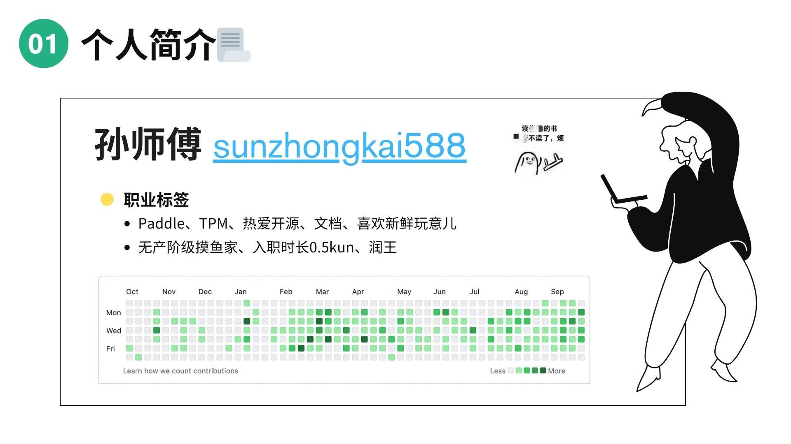
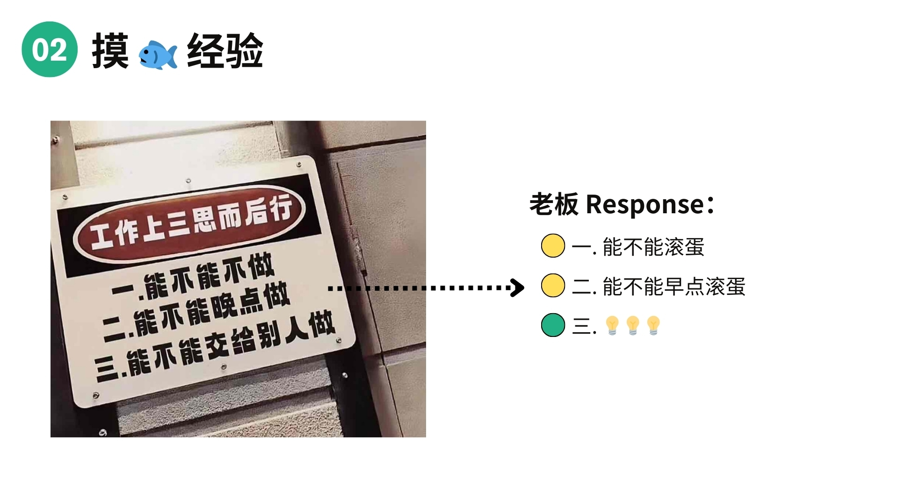
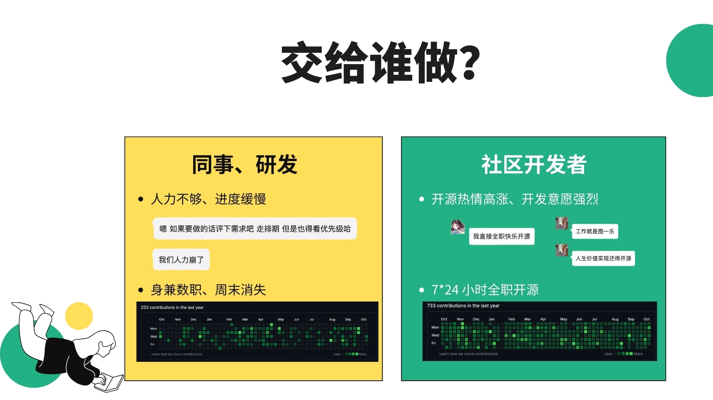
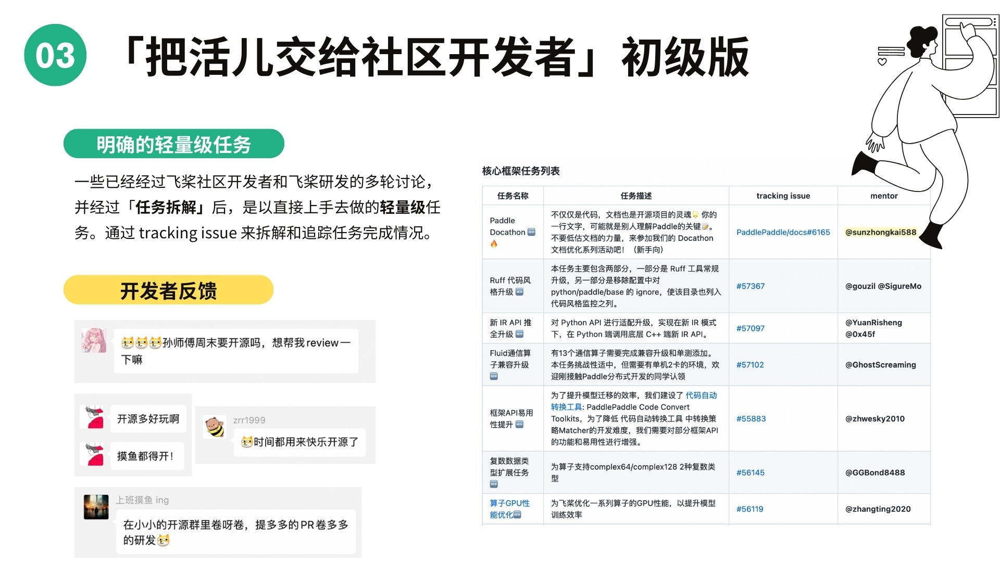
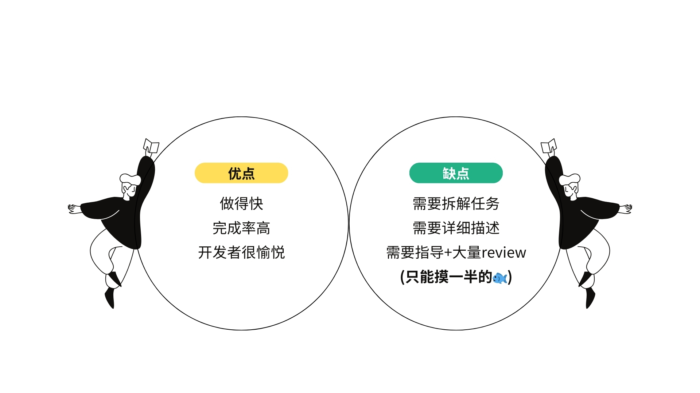
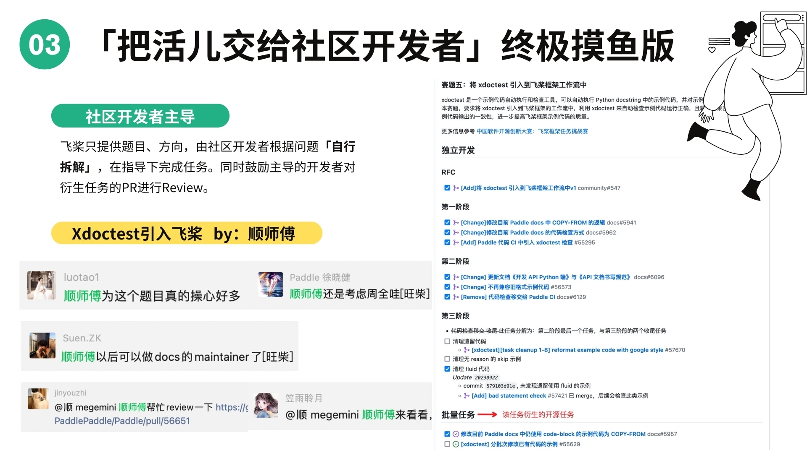

本篇博客文章的内容，来源于作者在「第八届中国开源年会」上分享的一次主题为 **「如何在开源社区摸 🐟」** 的闪电演讲，以下的部分为演讲的具体内容。

<!-- more -->

## 01-个人简介

大家好，今天我想分享的主题是 **「如何在开源社区摸 🐟」**。在演讲开始前先自我介绍一下，我叫孙钟恺，社区里的开发者都称呼我为 **孙师傅**，下图为我的 Github ID、头像和贡献热力图。

从上面的职业标签可以看出，我是入职百度一年半（0.5🐔年）、目前负责 Paddle 开源社区以及官网文档的飞桨校招产品经理。作为一名新人，我也没有什么特长，唯一擅长的就是摸 🐟 吧～所以在这里也和大家分享一下我的摸 🐟 经验。

## 02-摸 🐟 经验

我的摸鱼经验其实从这幅图就可以说明白，就是工作上**三思而后行**：

- 第一，**这工作能不能不做**；
- 第二，**这工作能不能晚点做**；
- 第三，**这工作能不能交给别人做**。

但是，理想是丰满的，现实是骨感的。老板的回复也很直接：

- 第一，你能不能滚蛋；
- 第二，你能不能早点滚蛋。

不过对于第三点呢，老板似乎不太抗拒（反正不是交给他做🐶）。于是我就在思考，也许可以通过“把工作转交给别人”的方式，来简单摸个 🐟。

那么问题来了，具体交给谁做呢？我看向了我的**同事和研发大爷们**。经过几百回的试探和心理博弈后，研发大爷们均以“人力不够”、“优先级低”等借口来拒绝我。而且咱们研发工作日做牛做马，一到周末直接原地消失了，一看 GitHub 热力图，周六、周日都是空的。

> 补充：不过这也说明百度还算是一个遵守劳动法的公司，周末都是双休的～

然后，我把我的目光转向了**社区开发者们**。哎，发现他们的开源热情似乎还是很高涨的，有的开发者甚至把开源视为人生价值（“工作就是图一乐”、“人生价值实现还得靠开源”）我又翻了翻一些社区开发者的 GitHub 热力图，一看吓一跳 😮，绿油油的一片，7\*24 小时全职开源。

至此之后呢，我就把 **“把活儿交给社区开发者”**，作为我摸 🐟 的核心思想。

但是，怎么“把活儿交给社区开发者”，也是需要讲点基本法的，所以我总结了两条方法～

## 03-「把活儿交给社区开发者」初级版

首先，我先介绍一下初级版，即把一些 **明确的轻量级任务** 交给社区开发者做。

怎么理解呢？其实很多问题已经由社区开发者和内部研发进行多轮讨论了，并经过 **任务拆解** 后，形成了可以直接去上手做的轻量级任务。这些轻量级任务最终会公布到社区，并以 tracking issue 的形式进行发布和追踪，下图右方就是部分的这类任务。

因为这些任务相对简单、好上手，社区开发者反馈其实非常好，有些人可能周末会去做，有些人甚至上班摸鱼的时候也在做。

发布这类任务的**优点**在于——因为任务比较简单，“啪”的一下做的很快，完成率又特别高。更重要的是，开发者也会很愉悦，比如花一个小时提一个 PR 上来，就能把任务做完了，很容易带来满足感～（而且也会有小礼品）

不过这类任务也有一些**缺点**——这些任务需要花精力进行任务的拆解、详细的描述，甚至还可能需要指导和大量的 Review。所以这 🐟 虽然摸了，但只摸了一半。

## 03-「把活儿交给社区开发者」终极摸鱼版

基于上述，我之后又总结了终极摸鱼版的方法，就是 **把问题交由社区开发者来主导**。

怎么理解呢？就是我们飞桨只提供大概的题目和方向，由社区开发者根据问题 **自行进行拆解**，然后在我们的指导下开展任务。比较典型的是 **《[将 xdoctest 引入飞桨工作流](https://github.com/PaddlePaddle/Paddle/issues/54705)》**，这个题目是由社区开发者顺师傅（@[megemini](https://github.com/megemini)）来完成的。

> xdoctest 是一个文档示例代码的检查工具。

从下面右半边可以看到，顺师傅按自己的理解对任务进行拆解，分为不同的阶段，并有条不紊的完成。并且还衍生出了一些批量的社区任务，比如全量的修改了飞桨一千多个 API 的示例代码。这是一个人完成不了的，需要号召更多的社区开发者来参与，因此这个项目也极大调动了整个社区的氛围和活力。

所以说，其实把问题交给社区开发者主导，会有很多积极的方面～一方面能够帮我们分担了很大的研发精力（帮我们摸 🐟），另一方面也会不经意间对整个社区有正向的影响力。

## 04-摸 🐟 的前提条件

最后也提一下，其实摸鱼也有很多前提条件，需要有**良好的社区氛围**、**丝滑的社区交流**、**研发的大力支持**和**运营的宣传推广**...这些条件都是缺一不可的～所以虽然是摸鱼，但也需要遵循很多客观规律。

---

以上是我演讲的全部内容，感谢大家的观看～

