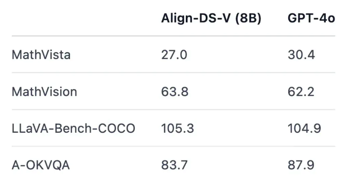

当前的多模态模型通常缺乏**推理能力（reasoning）**，为了提升其推理能力，研究主要集中在以下三个方向：  

- **训练策略**：保持模型架构不变，在后训练阶段采用 **强化学习（如 GRPO/PPO）** 进行优化，仅需普通的问答对数据，推理过程由模型自发生成。  
- **数据生成**：构建高质量的推理数据集，并通过 **监督微调（SFT）** 训练模型。数据可借助 **DeepSeek-R1** 等推理模型进行蒸馏（仅蒸馏文本数据）。  
- **模型架构**：优化多模态模型结构，例如将其中的 **LLM 替换为具备推理能力的模型**（如 **DeepSeek-R1 蒸馏版**）。  

目前，这些方向正在不断探索和优化，以提升多模态模型在数学推理、视觉问答等任务中的表现。 🚀  

---

## 1. 训练策略  

### 1.1 R1-V  
- **开源地址**：[GitHub - Deep-Agent/R1-V](https://github.com/Deep-Agent/R1-V)  


#### ① 介绍  
R1-V 是多模态推理模型的早期代表之一。  
- **训练环境**：8 个 A100 GPU，时长 30 分钟，训练成本 2.62 USD（ 200 步）。  

#### ② 训练流程  
- **训练启动**：使用 `torchrun` 运行 GRPO 脚本，并结合 `deepspeed`、`flash_attn`、`wandb` 等工具（代码结构简单）。  
- **核心流程**：  
  1. **初始化模型**：加载主模型和参考模型（用于 KL 惩罚计算，确保主模型行为不偏离原始分布）。  
  2. **奖励函数**：  
     - **准确率奖励**：基于符号验证和字符串匹配计算答案正确性。  
     - **格式奖励**：确保输出格式符合 `<think>...</think><answer>...</answer>` 结构。  
  3. **损失计算**：  
     -   先用主模型生成 N 个不同的候选回答。
     -   分别计算主模型与参考模型的 per-token 对数概率
     -   计算 KL 散度
     -   计算 Reward 与 Advantage
     -   根据奖励函数得到每个样本的奖励，并对同一个 prompt 的多条生成做平均，用于优势函数的归一化
     -   组合策略梯度与 KL 惩罚，得到最终的 loss 

- **System Prompt**：  
  ```plaintext
  A conversation between User and Assistant. The user asks a question, and the Assistant solves it.
  The assistant first thinks about the reasoning process in the mind and then provides the user with the answer.
  The reasoning process and answer are enclosed within <think> </think> and <answer> </answer> tags, respectively.


### ③ 关键注意点  

- 训练时可使用 **7 颗 GPU 进行训练，1 颗 GPU 运行 VLLM 计算 KL 损失**。  
- **GRPO 训练仅需普通 QA 对，不需要 `think` 过程**（如果有 `think` 数据，可先 SFT 再 GRPO）。  

---

### ④ 主要问题  

- **奖励函数难以设置**（当前代码中使用的是最简单的实现方案）。  
- **显存 OOM**：详见 [Issue #107](https://github.com/Deep-Agent/R1-V/issues/107)。  
- **损失值经常为 0**：详见 [Huggingface Open-R1 Issue #239](https://github.com/huggingface/open-r1/issues/239)。  
现在GRPO实现中策略都是单步更新，导致新旧策略是一样的，所以重要性采样系数是 1 ，然后优势函数A是一个组当中每个reward的标准化，那么对优势函数A求期望自然也就是 0 了。所以GRPO的loss实际上就是新旧策略的KL散度项再乘一个系数beta，这也就是为什么训练过程中loss曲线和KL散度曲线分布如此相似，因为只差了一个系数beta。

---

### ⑤ 是否可以去掉 KL 约束？  


**去除 KL 约束的影响：**  
- 不需要 `ref-model`，减少显存占用和前向计算成本。  
- 可能减少训练不稳定性（类似于梯度裁剪）。  
- 优化参数更加自由，可能探索到更佳的回答方案。  


**参考链接**  
- https://zhuanlan.zhihu.com/p/25067791857
---

## 1.2 open-r1-multimodal  

- **开源地址**：[GitHub - EvolvingLMMs-Lab/open-r1-multimodal](https://github.com/EvolvingLMMs-Lab/open-r1-multimodal)  

### ① 介绍  
- **开源了第一批专注于数学推理的 8K 多模态 RL 训练示例**。  
- **数据来源**：GPT-4o 生成（基于 Math360K 和 Geo170K），包含推理路径和可验证答案。  
- **采用 GRPO 训练策略**，提升模型的数学推理能力。  

### ② 代码改进  
- **`format_reward` 正则匹配更加宽松**。  
- **`reward_processing_class` 计算奖励**。  
- **生成方式优化**：  
  - **R1-V**：批量生成多个 completions。  
  - **open-r1-multimodal**：逐个生成再拼接（更灵活，但成本更高）。  


---

### 1.3 VisualThinker-R1-Zero  
- **开源地址**：[GitHub - turningpoint-ai/VisualThinker-R1-Zero](https://github.com/turningpoint-ai/VisualThinker-R1-Zero)  

#### ① 研究意义  
- **首个在非 SFT 2B 模型上成功实现“顿悟时刻”（emergence）并增强多模态推理能力的开源代码**。  
- 通过强化学习（RL），模型在推理过程中出现了**自我反思能力**，类似于 DeepSeek-R1 论文中描述的现象。 


#### ② 训练方法  
- **基础模型**：Qwen2-VL  
- **评测基准**：CV-Bench  
- **训练数据**：SAT 训练样本  
- **训练过程**：  
  - 初始阶段，模型倾向于生成 HTML 代码，导致推理长度下降。  
  - 经过强化学习优化后，模型逐渐采用更合理的输出格式，并且响应长度不断增加。  
  - 训练过程中，观察到一个**多模态“顿悟时刻”** —— 模型开始主动进行自我反思，并且**响应长度与基准准确率呈正相关**。  

#### ③ 结论  
- **更长的推理链可以极大提升基于视觉的任务表现**。  
- 在 **无 SFT** 的情况下，模型在 **CV-Bench** 上取得 **59.47% 的准确率**：  
  - **比基础模型高出约 30%**。  
  - **比 SFT 训练的模型高出约 2%**。  
  - **甚至超越了训练数据更多的指令微调模型**。  


#### ④ 代码改进  
- **引入 `freeze_llm` 和 `freeze_vision`，控制训练过程中的参数更新**。  
- **改进 `accuracy_reward`**，适配不同答案格式（如选择题）。  
- **增加 `length_reward`**，鼓励生成更长的回答，提高推理深度。  
- **兼容 `completions` 可能是字符串列表的情况，使代码更通用**。  


#### ⑤ 其他发现  
- **最大输入像素默认为 2,359,296**，是 R1-V 默认值的 **5.8 倍**。  
- **最大响应长度默认为 8,192**，是 R1-V 默认值的 **16 倍**。  

---

### 1.4 Efficient-R1-VLLM  
- **开源地址**：[GitHub - baibizhe/Efficient-R1-VLLM](https://github.com/baibizhe/Efficient-R1-VLLM)  

#### ① 介绍  
- **首个使用基于奖励的强化学习（GRPO）来微调 MoE（专家混合）视觉语言模型（DeepSeek2-VL）的项目**。  
- **重点关注训练效率优化**，采用 **SGLang 加速推理**，同时保持模型的推理能力。  

#### ② 训练流程（Pipeline）  
Vision-Language Input → DeepSeek2-VL MoE → GRPO Reward Optimization → Reasoning Output

- 目前 **等待开源**，具体训练细节尚未公开。  

---

### 1.5 VLM-R1  
- **开源地址**：[GitHub - om-ai-lab/VLM-R1](https://github.com/om-ai-lab/VLM-R1)  


#### ① 介绍  
- **适用于目标检测任务的多模态推理模型**。  
- **在 R1-V 代码基础上进行改进**，优化奖励函数以适应目标检测任务。  

#### ② 代码改动  
- **整体代码结构与 R1-V 类似**，但主要的奖励函数不同：  
  - **R1-V 奖励函数**：准确率奖励 + 格式奖励。  
  - **VLM-R1 奖励函数**：**IOU（Intersection over Union）奖励 + 格式奖励**。  
  - **IOU 计算方式**：  
    - **大于 0.5 的 IOU 计算为 1**（成功匹配）。  
    - **小于 0.5 的 IOU 计算为 0**（失败）。  
  - **作者建议可能使用“软奖励”更合适，但仍需实验验证**。  


---

### 1.6 Visual-RFT  
- **开源地址**：[GitHub - Liuziyu77/Visual-RFT](https://github.com/Liuziyu77/Visual-RFT)  
- **论文地址**：[arXiv - Visual-RFT](https://arxiv.org/html/2503.01785v1)  


#### ① 介绍  
- **基于强化学习优化的视觉推理模型**，专注于提升多模态任务的推理能力。  
- **采用类 R1-V 训练架构，acc奖励改为 iou + cls 奖励（对比 VLM-R1 为 iou 奖励）**。  


#### ② 示例  
- **论文提供了多个示例，展示模型在不同视觉任务中的推理表现**。  


---

## 2. 数据生成  

### 2.1 R1-Onevision  

- **开源地址**：[GitHub - Fancy-MLLM/R1-Onevision](https://github.com/Fancy-MLLM/R1-Onevision)  
- **团队**：浙江大学  
- **特点**：  
  - **长 COT（Chain of Thought）视觉数据集**，结合 **LLaVA-OneVision** 高质量数据和特定领域数据（自然场景、数学、OCR、科学等）。  
  - **数据处理流程**：  
    - **数据清洗** → **图像标注** → **推理链生成** → **质量控制** → **规则强化学习**。  


#### ① 数据处理流程  


##### 1. 数据准备与筛选  
- **数据来源**：整合多个数据集，包括 **自然场景图像、OCR、图表、文本-图像对、数学、科学和逻辑推理数据**，部分来自 LLaVA-OneVision 数据集。  
- **数据筛选**：去除与推理任务无关的数据，仅保留 **高质量、适用于推理的视觉数据**。  

##### 2. 图像标注  
**核心目标**：将图像转换为正式语言描述，以便模型进行逻辑推理。  
- **自然场景**：使用 **GPT-4o** 生成详细描述，同时 **Grounding DINO** 提供目标检测信息。  
- **图表（Charts & Diagrams）**：  
  - **GPT-4o** 将图表转换为代码（如 **SPICE** 处理电路图、**PlantUML/Mermaid.js** 生成流程图、**HTML/CSV/JSON** 处理表格、**Matplotlib** 生成数据图）。  
- **文本图像**：  
  - 使用 **EasyOCR** 提取文本，GPT-4o 复原原始文档格式。  
- **带文本内容的图像**：  
  - 结合 **GPT-4o** 生成详细描述、**Grounding DINO** 获取文本区域 bounding box、**EasyOCR** 提取文本，确保视觉与文本信息对齐。  
- **数学图像**：  
  - **GPT-4o** 生成数学公式、推理步骤和最终答案的结构化描述。  

##### 3. 推理链生成  
- **步骤**：  
  1. 结合 **图像的正式语言标注** 和 **相关问题**，使用 **DeepSeek-R1** 生成初始推理链。  
  2. **角色扮演方法**：  
     - 让模型模拟视觉理解，反复查看图像，提取额外信息，反思并优化推理过程。  
     - 目标是让模型“像人一样”观察图像并思考，提高推理的准确性和上下文理解能力。  

##### 4. 质量控制  
- 使用 **GPT-4o** 进行过滤，确保推理链：  
  - **准确**（符合事实和逻辑）。  
  - **相关**（与问题匹配）。  
  - **一致**（推理过程连贯）。  
- **数据格式示例**：  
  ```json
  {
    "id": "<unique_identifier>",
    "image": "<image_path>",
    "gt": "<ground_truth>",
    "data_source": "<dataset_source>",
    "conversations": [
      {"from": "human", "value": "<question>"},
      {"from": "assistant", "value": "<cot>"}
    ],
    "filter": "valid or invalid",
    "judge_response": "<gpt4o_filter_reason>"
  }


##### 5. 基于规则的强化学习  
- **目标**：在 **SFT** 后进一步优化推理的 **结构化和准确性**。  

###### 规则设计  
1. **准确性规则**：  
   - 通过 **正则表达式** 提取模型的最终答案，并与 `ground truth` 进行数学验证。  
   - **匹配则奖励，错误则惩罚**。  
2. **格式规则**：  
   - 强制模型在推理过程中使用 `<think>` 和 `<answer>` 标签，并确保顺序正确。  
   ```plaintext
   <think> Step 1: Analyze the diagram... </think>
   <think> Step 2: Identify the key variables... </think>
   <answer> Final result: 42 </answer>
   - 使用 **正则表达式** 验证格式，并给予奖励或惩罚。  


##### 6. 训练流程  
1. **监督微调（SFT）**：基于 **R1-Onevision Dataset** 进行初步训练。  
2. **强化学习（RL）**：  
   - 结合 **Accuracy Rule** 和 **Formatting Rule**，进行 **奖励-惩罚机制训练**。  
   - 目标是让模型在生成推理链和答案时 **更精准、更结构化**。  
3. **持续优化**：  
   - **模型在训练过程中逐步改进推理能力**，减少错误，提高一致性。  

---

### 2.2 deepseek-r1-vision  
- **开源地址**：[GitHub - sungatetop/deepseek-r1-vision](https://github.com/sungatetop/deepseek-r1-vision/tree/main)  

#### ① 方法  
- **将 SFT 数据转化为包含“思考”过程的内容**，形成 **COT（Chain of Thought）数据结构**。  
- **使用 SFT 方法训练视觉模型**，引导模型学习如何思考。  
- **开源了将原始问答对转换为思维链问答对的脚本（prompt）**。  

#### ② 数据转换  

###### 原始的问答对  
```json
[
  {
    "messages": [
      {
        "content": "<image>尝试为这只猫拍照时可能会遇到哪些挑战？",
        "role": "user"
      },
      {
        "content": " 当想要拍摄这只猫坐在木桌上直视前方时，可能会遇到几个挑战。首先，吸引猫的注意力并确保它专注于相机可能会很困难。猫通常很好奇，很容易被周围的环境分散注意力，因此保持猫的视线和兴趣可能会很具挑战性。其次，背景中的模糊图像可能会削弱主体或造成分散注意力的背景。关键是平衡良好的景深、照明和定位，从而创造出猫作为中心主题的视觉吸引力的照片。此外，调整相机设置，例如快门速度，以避免任何运动模糊，特别是如果猫准备扑击，有助于捕捉更清晰、更清晰的猫图像。",
        "role": "assistant"
      }
    ]
  }
]
```

###### 处理后的问答对
```json
  {
    "messages": [
      {
        "role": "user",
        "content": "<image>尝试为这只猫拍照时可能会遇到哪些挑战？"
      },
      {
        "role": "assistant",
        "content": "<think>\n嗯，我现在要帮用户分析拍摄这只猫时可能遇到的挑战。首先，我得仔细看看参考内容，里面提到了几个主要问题：吸引猫的注意力、背景干扰、快门速度设置。\n\n好，先从吸引猫的注意力开始思考。猫通常很好奇，但也很容易被周围环境分散注意力。所以，拍摄的时候可能会很难让猫一直盯着相机。也许可以尝试用一些玩具或者零食来吸引它的注意力，但这样可能会影响构图，比如零食在旁边会让猫看向那里而不是镜头。\n\n接下来是背景的问题。参考里提到背景中的模糊图像可能会削弱主体或者造成干扰。这让我想到，在拍摄时需要考虑背景是否简洁，是否有分散注意力的元素。如果背景太杂乱，即使主体拍得很好，整体效果也会受影响。可能需要用浅景深来虚化背景，但这样又得确保猫的眼睛是清晰的，否则整个照片就没意义了。\n\n然后是快门速度的问题。猫的动作很快，尤其是当它们准备扑击的时候。如果快门速度不够高，可能会导致运动模糊，拍出来的照片就会不清晰。这时候需要调整相机设置，比如提高ISO或者使用更大的光圈来增加进光量，从而允许更快的快门速度。不过，这样可能会带来噪点问题，特别是在光线不足的情况下。\n\n还有其他可能的问题吗？比如猫的好动性，它们不容易保持一个姿势太久，所以拍摄时间可能很短，需要快速捕捉。另外，光线也是一个因素，如果在自然光下拍摄，光线的变化可能会影响照片效果，尤其是在室内拍摄时，可能会有反光或者阴影问题。\n\n总结一下，主要的挑战包括：吸引并保持猫的注意力、处理背景干扰、避免运动模糊、调整合适的快门速度和光圈设置，以及应对光线变化。这些都需要在实际拍摄中灵活应对，可能需要多次尝试才能拍到满意的照片。\n</think>\n\n当尝试为这只猫拍照时，可能会遇到以下挑战：\n\n1. **吸引并保持猫的注意力**：猫通常好奇心强，但容易被周围环境分散注意力。要让猫专注于相机或某个方向，可能需要使用玩具、零食或其他引诱物来引导其视线。\n\n2. **背景干扰**：背景中的模糊图像或杂乱元素可能会削弱主体（即猫）的表现力，导致照片显得不够专业或吸引人。因此，选择一个简洁或有吸引力的背景，并通过调整景深来虚化不必要的部分，是拍摄时需要注意的关键点。\n\n3. **避免运动模糊**：猫的动作通常很快，尤其是在准备扑击时。使用较慢的快门速度可能会导致图像模糊。为了捕捉清晰的画面，可能需要提高快门速度，同时确保足够的光线进入相机以保持图像质量。\n\n4. **光线条件**：在拍摄过程中，光线的变化可能会影响照片的效果。例如，在自然光下拍摄时，光线的方向和强度可能会改变猫的面部表情或整体氛围。使用反光板或闪光灯来补光，可以帮助平衡光线并突出猫的特征。\n\n5. **猫的好动性**：猫不容易保持静止状态，尤其是在拍摄过程中。这可能需要摄影师具备快速反应的能力，以便在最佳时刻按下快门。\n\n通过克服这些挑战，可以拍出一张既清晰又吸引人的猫的照片。"
      }
    ]
  }
```


---

## 3. 模型架构  

### 3.1 Align-DS-V  

- **开源地址**：[Huggingface - PKU-Alignment/Align-DS-V](https://huggingface.co/PKU-Alignment/Align-DS-V)  
- **团队**：北京大学、香港科技大学  

#### ① 介绍  
Align-DS-V 基于自研全模态对齐框架 **Align-Anything**，将 DeepSeek-R1 系列模型拓展至多模态推理能力，推出多模态推理模型 **Align-DS-V**。  

#### ② 方法  
- Align-DS-V 通过对 **视觉编码器** 进行优化，使其能够更好地理解和处理图文混合的信息。  
- 借鉴 **LLaVA** 训练思路，将 **视觉信息投射到语言表示空间**，实现图像与文本的深度结合。  

#### ③ 性能  
- **多模态性能齐平 GPT-4o**，并且推理能力不降反增。  
- 通过 Align-Anything 框架，提升多模态任务的理解和推理能力。 




#### ④ Align-Anything 框架架构  
Align-Anything 是一个通用的多模态对齐框架，可以用于优化不同模态（文本、图像、语音等）之间的融合能力。  


#### ⑤ 意外发现  
- 将 **DeepSeek-R1-Distill-Llama-8B** 扩展到视觉模态后，Align-DS-R1 在原始文本模态推理能力上也取得了显著提高。  

#### ⑥ 开源贡献  
- **开源了模型**：[`PKU-Alignment/Align-DS-V`](https://huggingface.co/PKU-Alignment/Align-DS-V)  
- **开源了多个数据集**：  
  - [`PKU-Alignment/align-anything`](https://huggingface.co/datasets/PKU-Alignment/align-anything)  
  - [`PKU-Alignment/Align-Anything-Instruction-100K`](https://huggingface.co/datasets/PKU-Alignment/Align-Anything-Instruction-100K)  
  - [`PKU-Alignment/Align-Anything-TI2T-Instruction-100K`](https://huggingface.co/datasets/PKU-Alignment/Align-Anything-TI2T-Instruction-100K)  

> **注意**：训练代码暂未开源。  


## 总结 

当前，多模态推理模型正朝着 **强化学习优化推理能力、数据增强提升泛化能力、模型架构改进** 三个关键方向发展：  

### 1. 强化学习（RLHF/GRPO）优化推理能力  
- 采用 **GRPO** 等强化学习方法，对多模态推理能力进行优化。  
- **关键改进**：通过奖励机制增强模型的推理链生成能力，提高逻辑推理的准确性和稳定性。  
- **代表性工作**：  
  - **[R1-V](https://github.com/Deep-Agent/R1-V)**  
  - **[open-r1-multimodal](https://github.com/EvolvingLMMs-Lab/open-r1-multimodal)**  
  - **[VisualThinker-R1-Zero](https://github.com/turningpoint-ai/VisualThinker-R1-Zero)**  

### 2. 数据增强与高质量 COT 数据构造  
- 通过 **GPT-4o、DeepSeek-R1 蒸馏** 等方式构造 **长 COT（Chain of Thought）数据**，提升模型的推理深度和准确性。  
- **关键改进**：采用结构化数据生成、多步推理链优化策略，提高模型的泛化能力。  
- **代表性工作**：  
  - **[R1-Onevision](https://github.com/Fancy-MLLM/R1-Onevision)**  
  - **[deepseek-r1-vision](https://github.com/sungatetop/deepseek-r1-vision/tree/main)**  

### 3. 多模态模型架构优化  
- 采用 **Align-Anything 框架** 对视觉编码器进行优化，使语言模型能够更好地处理图文混合数据。  
- **关键改进**：借鉴 **LLaVA** 训练思路，优化视觉信息与语言表示的融合能力。  
- **代表性工作**：  
  - **[Align-DS-V](https://huggingface.co/PKU-Alignment/Align-DS-V)**  

