## 一、摘要

序列并行（Sequence Parallelism）是一种在训练大型 Transformer 模型时，将输入序列按序列长度方向（即 token 维度）切分到多个设备上的分布式并行方法。它能够显著降低单卡显存压力，并提升训练效率，尤其适用于长序列输入和超大模型。然而，在实际应用过程中，序列并行会涉及诸如不同 mask 类型的支持、跨设备的负载均衡、有效的通信策略、以及如何将计算与通信过程重叠等问题。这些方面的优化对于大规模模型的性能表现和可扩展性具有决定性作用。在我的理解下，序列并行视角下会涉及这些方面的问题：

- 序列并行的相关方案需要处理多种注意力 mask（如全局 mask、causal/self-attention mask、局部 mask 等）以适应不同的自然语言处理任务，比如 Ring Attention 由于是把 sequence 纬度分片，各设备仅看自己负责的 token 内容，在每个环形步骤交换，如何灵活支持上述 mask 类型，以及 mask 信息如何在各设备上本地分解或同步是比较关注的问题。
- 进一步下，不同的 mask 类型进一步带来的负载均衡的问题。我们想要的是：将输入序列合理分配到各个设备上，确保每个设备承担相近的计算量，防止因数据或序列长度分布不均而导致部分设备过载或闲置
- 通信机制：在分布式自注意力计算中，设备需要高效地交换各自分片的信息。如何降低通信量和带宽占用，是提升效率的关键。比如如何在每个环形步骤做交换：（如 AllReduce、AllGather、Broadcast 等）
- 计算与通信的重叠：通过将通信流程与本地计算过程重叠进行，可以最大化硬件资源利用率，减少因通信带来的等待和空闲时间。

对于这些涉及的问题，下文分成多个主题，每个主题介绍一篇相关文章来进行讨论

## 二、基础背景

Attention 计算和 FlashAttention-2

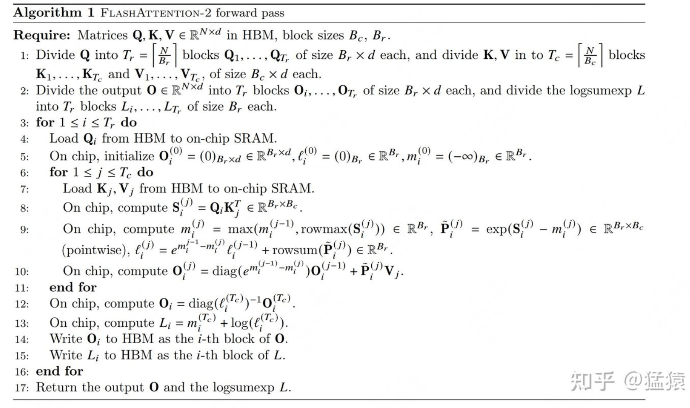

对于 FlashAttention-2 来说：在基于分块（chunk）的高效注意力计算过程中，整个序列会被划分为若干个分块，逐块进行遍历和处理。每当处理一个新的分块时，算法会累计更新到目前为止（包含当前分块）的若干中间量：包括当前为止所有分块的最大行值（rowmax）、每一行的整体累积和（rowsum），以及用最新最大值归一化之前的得分（未归一化的 softmax 输入），这些都是为了保证数值稳定性和软归一化计算的准确性。具体来说，每个分块首先基于当前累计的最大行值，对分块内部的得分矩阵进行转换，得到归一化前的矩阵，然后计算相应的累积和；接着再对每一行使用这些最新的参数，归一化 softmax 概率，加权计算该分块对应的输出值，并在全局范围内对输出结果逐步累加。这种“边遍历边归一化边输出”的流程，使算法能够逐步合并各个分块的信息，最终在完整遍历所有键值（KV）片段后，得到和整块计算 Attention 一致的最终输出。整个过程中，每一步的中间结果都以当前分块为界不断更新，既提高了内存和并行计算效率，又保证了最终输出的准确性。

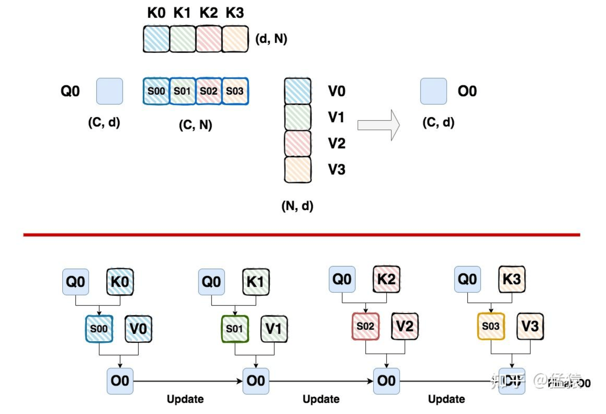

Ring Attention 可以理解为分布式版本的 Flash Attention。设 Q、K、V 的尺寸均为 $(N, d)$，其中 N 表示序列长度 seq*len, d 为隐藏维度（hidden_size）。在分布式场景下，假设 Q、K、V 都顺序切分成了 4 个块，每块大小为 $(C, d)$（其中 C = N/4），每个 GPU 或设备各自保存一份 Q、K、V 的分块。 在具体计算时，例如对于第一个 Q 分块（假定为 $Q_0$），会依次与 4 个 K、V 分块对应计算打分和 softmax 加权和，即先算 $S*{00}$，再是 $S_{01}$、$S_{02}$、$S_{03}$，并按照同样的顺序对对应的输出 $O_0$ 进行在线（online）更新。实际上，这个更新顺序可以是任意的——只要每次合成输出时都能够获得当前分块的输出 $O_0$，以及累计的最大值（max）和归一化累积和（sum）等辅助信息，最终的结果不会受到顺序的影响。这一性质本质上源自 softmax 归一化的数学定义以及 online 累加的加性与稳定性。

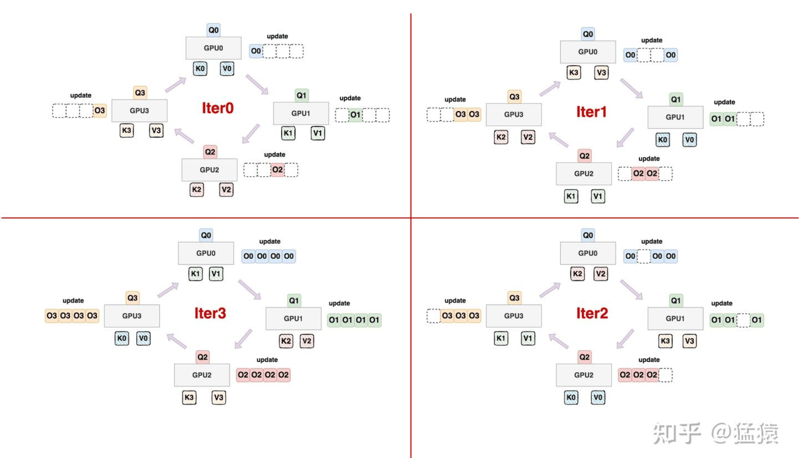

Ring Attention 的核心思想，是每个设备分别持有自己的 Q、K、V 分块，并以环状（ring topology）的方式，将本地的 K、V 块依次发送给相邻的设备。在处理本地 Q 分块与本地 K、V 块 attention 时，设备同时异步接收来自另一个节点的新 K、V 块，随后立即将接收到的 K、V 块与本地 Q 分块继续做 attention 计算。这一机制使得 attention 的计算和 K、V 分块的通信是高度重叠的（overlap），即在进行分布式流水线时，设备无需等待所有数据同步完成即可继续推进计算。 通过这种环的通信拓扑，所有设备之间只需与临近设备交互，降低了跨设备全量通信的压力。同时由于采用类似 Flash Attention 的分块累积-归一化策略，Ring Attention 保证了整体数值的准确性以及与标准 attention 一致的最终结果。重要的一点，是只要 attention 的计算瓶颈大于通信瓶颈（大模型或大序列常见），通信延迟几乎可以完全被计算流程掩盖，达到极高的硬件利用率。

## 三、负载均衡

**Striped Attention: Faster Ring Attention for Causal Transformers**

- [https://arxiv.org/abs/2311.09431](https://arxiv.org/abs/2311.09431)

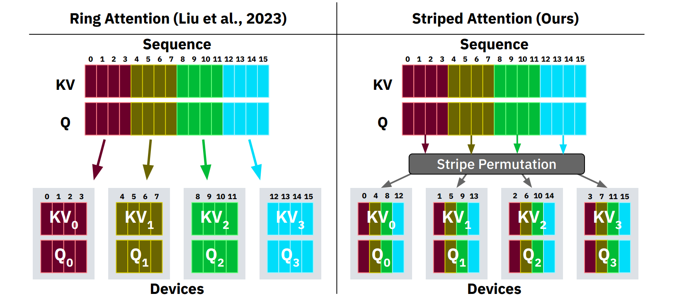

这篇文章最早关注到了 Ring Attention 的负载不均衡现象。他观察到 Ring Attention 无法有效利用因果注意力的结构来提高每个设备的吞吐量。以因果注意力为例，在 Ring Attention 算法的所有迭代中，除了第一次迭代外，一些设备的工作负载是完全必要的（未掩码），而其他设备的工作负载则完全不必要（已掩码）以生成最终输出。Ring Attention 的延迟由每次迭代中任何参与设备的最大延迟决定。

详细的讲：以下图为例，将黑色作为 mask 掉不被计算的部分。由于因果注意力的特性：每一步的查询不能感知到未来步的 KV，因此在分布式环形注意力中，当未来步骤的 KV 块被发送到当前的 Q 块的时候，只能在 mask 将其完全的 mask 掉不参与计算，这进一步导致了越往后步骤的 Q 块的计算负载越重，导致了系统等待在任务最重的瓶颈上。

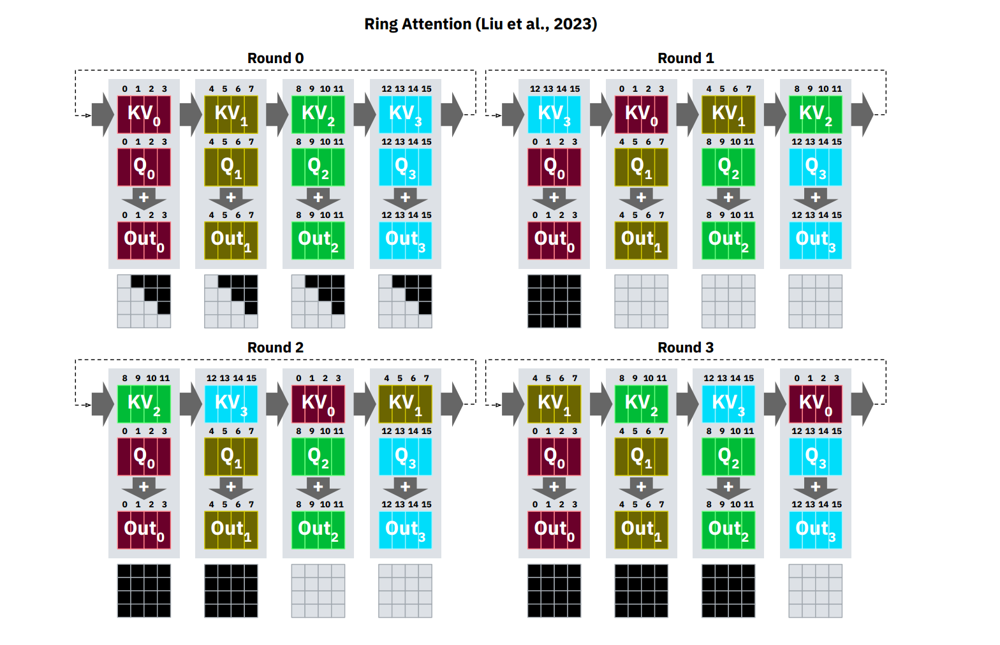
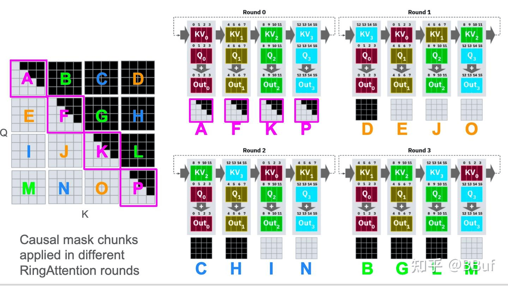

对于这样计算量不均衡的问题，stripped ring attention 的做法是，将计算量划分成条带状，本质上就是将原来的一个大 block size 切得更细，然后通过 permutation 进行混合，也就是说，stripped ring attention 将一些本来处在序列位置靠后的 Q，放在了序号靠前的 GPU 上进行计算，反之亦然。从而，使得每个 GPU 计算的 Attention 的计算量大致均衡（体现在每个 GPU 持有的 Attention mask 是均衡的）。比如，第 0 段分配 token 0、4、8、……，第 1 段分配 1、5、9、……，以此类推。这样在每个 attention step 中，各卡都能同时处理足够多的分块，减少前期或后期的极端负载。本质上是在更细粒度进行了切分，以此来方便做更细粒度的均衡。

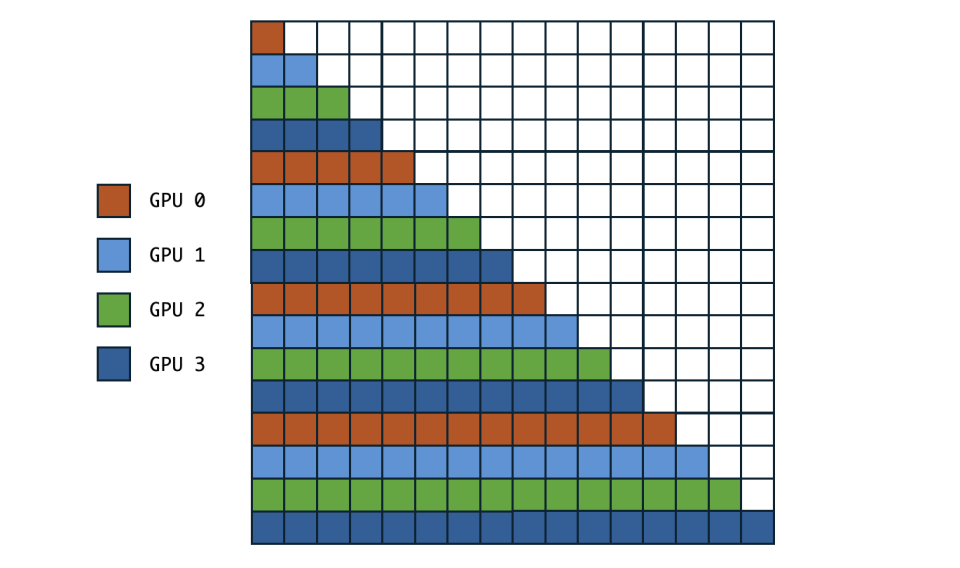
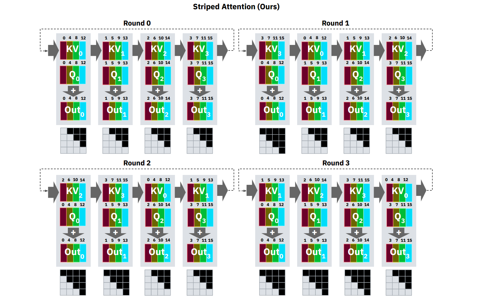

从实验结果上看，负载均衡严重阻碍了整个分布式系统的吞吐性能。是目前值得研究的方向之一。

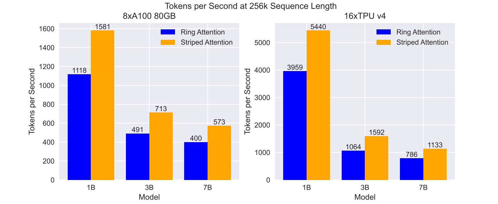

## 四、通信设计

**Tree Attention: Topology-Aware Decoding for Long-Context Attention on GPU Clusters**

- [https://arxiv.org/abs/2408.04093](https://arxiv.org/abs/2408.04093)

现有用于加速长上下文推理的注意力并行方法（如 Ring Attention）存在显著瓶颈。其核心问题在于通信效率低下：当序列被分片到多个 GPU 上时，这类方法需要设备间传递完整的键值缓存分片，导致通信量随设备数量线性增长（通信复杂度为 O(p)）。这不仅在扩展到大量设备（如百卡级）时造成严重延迟，还因需存储额外的临时键值分片和中间结果而大幅增加峰值内存占用。此外，此类方法通常采用固定的环形通信拓扑，无法有效适配现代 GPU 集群（如 DGX 节点）中“节点内高速互连（如 NVLink）远快于节点间互连（如 InfiniBand）”的异构网络结构，进一步限制了其在跨节点场景下的性能。

提出 Tree Attention，其核心思想是利用自注意力数学本质的重新诠释——将其视为一个能量函数的梯度。这一视角揭示了注意力计算中的关键操作（logsumexp 和 max）具有结合律特性，因此可通过树形归约 (Tree Reduction)高效并行化。具体而言，该方法将序列分片到多个 GPU，各设备先本地计算注意力所需的“部分分子和分母”（经数值稳定化处理），再通过树状通信（如 AllReduce）聚合这些部分结果。这种树形聚合仅需对数级通信步数（O(log p)），显著优于线性通信的现有方案。

关键的基础发现：

- 能量函数：Tree Attention 的核心数学基础是将标准注意力计算重新表述为一个能量函数的梯度。对于单个查询向量 _q_ 和分布在多个设备上的键/值对 $(k_a, v_a)$，其能量函数定义为：$F(ζ) = log ∑_a exp(q ⋅ k_a^T + ζ ⋅ v_a^T)$。其中 _ζ_ 是一个辅助的源向量。Tree Attention 的关键观察是，标准注意力的输出（即值向量的加权和）恰好等于该能量函数在 _ζ = 0_ 处的梯度 $z = ∂F(ζ)/∂ζ |_{ζ=0} = ∑_a softmax(q ⋅ k_a^T) v_a$。
- Softmax 通过迭代来进行计算：$s*i^{(j)} = \exp(q_j \cdot k_i), \quad n_i^{(j)} = n*{i-1}^{(j)} + v*i s_i^{(j)}, \quad d_i^{(j)} = d*{i-1}^{(j)} + s_i^{(j)}$
- logsumexp 和 max 操作具备结合律：$\text{logsumexp}_a(\{T_a, \text{logsumexp}_a(\{R_a, S_a\})\}) = \text{logsumexp}_a(\{T_a, R_a, S_a\})$

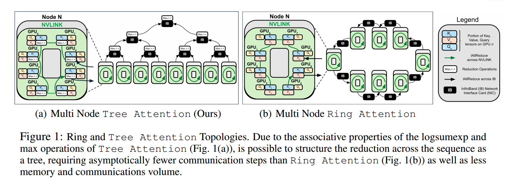

进而得到 motivation：能量函数的公式关系表明，只要能高效计算能量函数 $F(ζ)$ 或其梯度，即可精确得到注意力输出。而 logsumexp 和 max 操作具备结合律，进一步使得传输不需要传 kv cache，而是只需要通过具备结合律的 op 下的 allreduce 来完成 lse 的聚合，进而通过 Softmax 通过迭代来进行计算，来得到最终的结果，同时和 FlashAttention-2 进行结合。而 Allreduce 通过树形的 Tree reduce 使得相比 Ring Attention 的 O(p)的通信步骤降低到 O(log p)。（p 为整个拓扑中节点的数量）

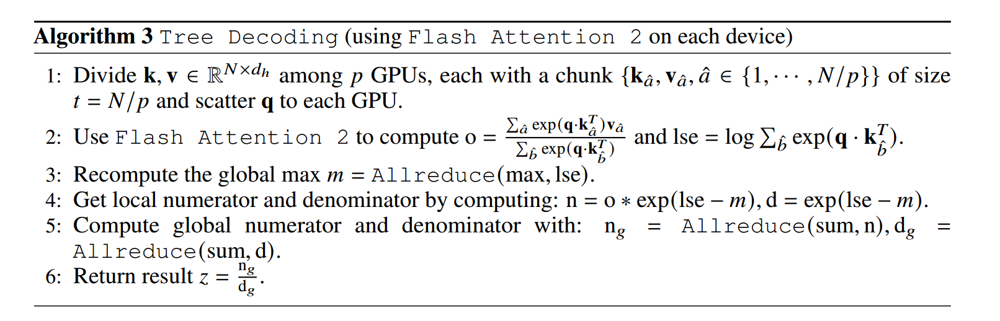

Tree Attention 进一步引入拓扑感知优化，充分利用 GPU 集群的硬件特性。现代集群通常具有两层带宽结构（节点内高带宽、节点间较低带宽）。该方法在通信时，节点内使用高带宽链路执行环形归约，节点间则通过树形归约减少跨节点通信量。这种动态适配最大化利用了高速链路，减少了低速互连的瓶颈。最终，Tree Attention 实现了精确注意力计算，在保持原始模型效果的同时，大幅降低了分布式解码的延迟（最高达 8 倍加速）、内存占用（约降低 2 倍）和通信量，并能泛化到多种硬件平台（如 NVIDIA H100、AMD MI300X、消费级 GPU）。

## 五、灵活 Mask 表达

**FlexAttention: The Flexibility of PyTorch with the Performance of FlashAttention**

- [https://arxiv.org/abs/2412.05496](https://arxiv.org/abs/2412.05496)

FlexAttention 主要针对 FlashAttention-2 不能完全的应对全部的注意力机制而产生。主要针对因果注意力（Causal）、[相对位置编码（Relative Positional Embeddings）](https://paperswithcode.com/method/relative-position-encodings)、[ALiBi](https://paperswithcode.com/method/alibi)、[滑动窗口注意力（Sliding Window Attention）](https://mistral.org.cn/news/announcing-mistral-7b/)、[PrefixLM](https://twitter.com/andersonbcdefg/status/1800907703688339569)、[文档掩码/样本打包/不规则张量（Document Masking/Sample Packing/Jagged Tensors）](https://github.com/pytorch/torchtune/pull/875)、[Tanh 软限幅（Tanh Soft-Capping）](https://twitter.com/LysandreJik/status/1807779471891538199)、[分页注意力（PagedAttention）](https://arxiv.org/abs/2309.06180)等这些常见的注意力变体，以及这些注意力变体的任意叠加和组合。

在 FlexAttention 中，它只需几行的 PyTorch 代码即可实现许多注意力变体，通过 `torch.compile` 将其编译为一个融合的 FlashAttention 核函数，生成一个不占用额外内存且性能可与手写核函数媲美的 FlashAttention 核函数，以及利用 PyTorch 的 autograd 机制自动生成反向传播和利用注意力掩码中的稀疏性，从而比标准注意力实现获得显著提升。详细的说，对于标准注意力可以这样描述：

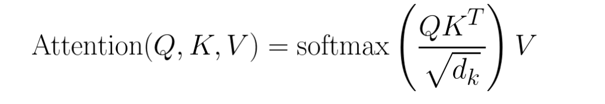

```plain
Q, K, V: Tensor[batch_size, num_heads, sequence_length, head_dim]
score: Tensor[batch_size, num_heads, sequence_length, sequence_length] **=** (Q **@** K) **/** sqrt(head_dim)
probabilities **=** softmax(score, dim**=-**1)
output: Tensor[batch_size, num_heads, sequence_length, head_dim] **=** probabilities **@** V
```

而对于 FlexAttention 来说， 允许使用用户自定义函数 `score_mod:`

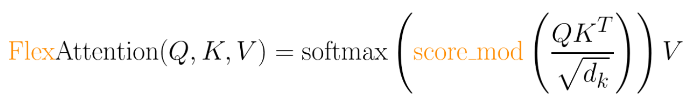

```plain
Q, K, V: Tensor[batch_size, num_heads, sequence_length, head_dim]
score: Tensor[batch_size, num_heads, sequence_length, sequence_length] **=** (Q **@** K) **/** sqrt(head_dim)
modified_scores: Tensor[batch_size, num_heads, sequence_length, sequence_length] **=** score_mod(score)
probabilities **=** softmax(modified_scores, dim**=-**1)
output: Tensor[batch_size, num_heads, sequence_length, head_dim] **=** probabilities **@** V
```

它允许你在 softmax 计算之前修改和自定义注意力分数，对于在底层实现：通过利用 `torch.compile`，自动将你的函数编译成单个融合的 FlexAttention 核函数

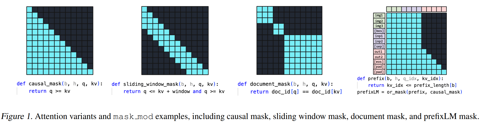

此外我们可以详细看一下 FlexAttention 的底层实现：

- 如果我们用 PyTorch 写了一个标准的 `Attention_std`，即呈现出了 `GEMM+Softmax+GEMM`，但是并没有加入任何变体；然后用 `torch.compile` 的形式给他包起来，在代码中开启标志 `torch._inductor.config.trace.enabled = True` 打印信息，就可以观察到 `torch.dynamo` 在前端识别到了这个 `gemm+softmax+gemm` 的 pattern，并且在元算子 `torch.ops.aten` 层面，直接把这一部分替换为了 `flash_attention` 实现
- 如果在其中加入了任何的变体，即破坏了 `GEMM+Softmax+GEMM` 的 pattern，使得其 pattern 实际上变成了 `GEMM+(Mask)+Softmax+GEMM`，那么被 torch.compile 包起来以后只会将 Attention_std 过程打散为元算子，然后在编译后端以 Triton 版 FlashAttention 代码实现为基础，根据不同的变体调整 Triton 代码生成。eg：下图是生成的 output，显然是 triton 的 flashattention 变种版本

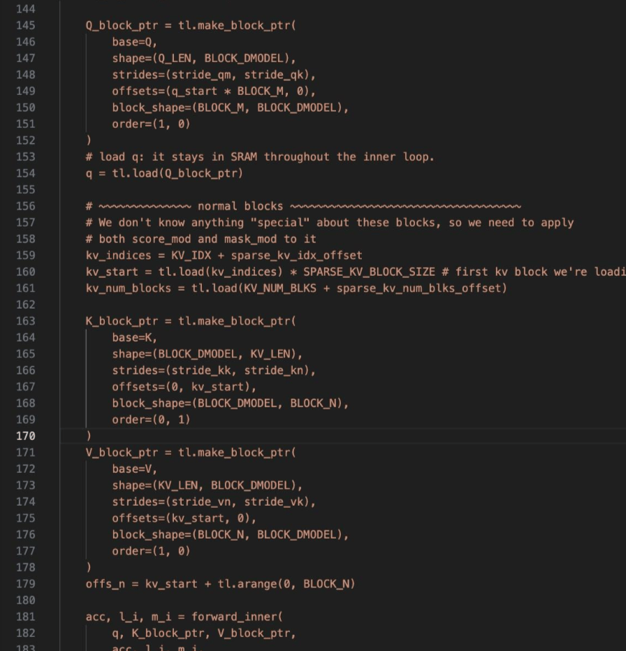

- TLDR：针对用户需求自动写 triton

从性能上来讲，相比 FlashAttention 系手调的还是有差距，本质上就是 triton 和 Flash 系的差距。

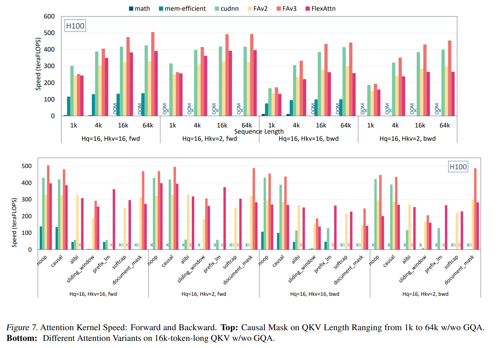

## 六、目前较好的融为一体

MagiAttention: A Distributed Attention Towards Linear Scalability for Ultra-Long Context, Heterogeneous Mask Training

- [https://sandai-org.github.io/MagiAttention/](https://sandai-org.github.io/MagiAttention/)

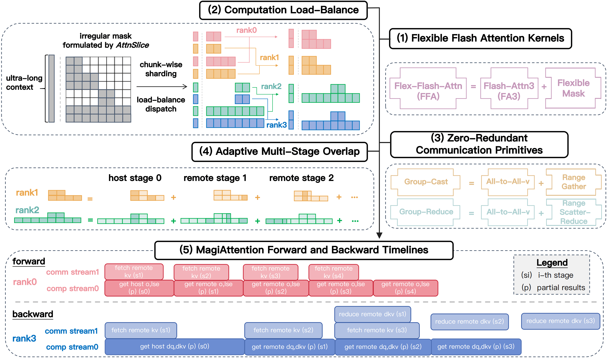

对于 magiattention 来说，其兼顾了 1.灵活 mask 表达、2.负载均衡、3.通信设计优化、4.分布式 kernel 优化这四个方面，是目前把这些问题较好的融合起来的 sota 工作，下面我们对这几个方面进行逐一介绍：

**(1) 对于灵活 mask 表达：**

magiattention 通过使用 AttnSlice 三元组：将整个 Attention Mask 分解为多个子计算单元，每个单元定义为三元组：
`(QRange, KRange, MaskType)` 其中：

- `QRange/KRange`：连续查询/键值范围（如 `[start, end]`）
- `MaskType`：支持 FULL、CAUSAL、INV-CAUSAL（反因果）、BI-CAUSAL（双因果）四种基础类型

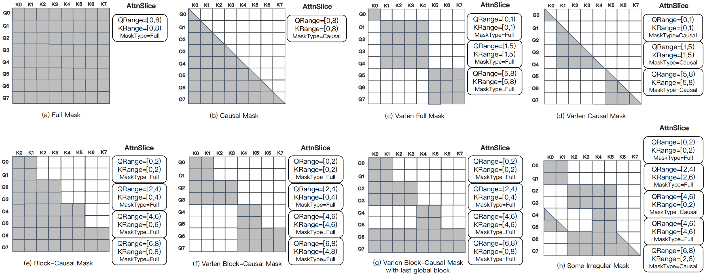

- 以及新增两种 INV-CAUSAL（仅保留当前 token 之后的键）和 BI-CAUSAL（仅对角线有效）类型，高效表达滑动窗口等复杂模式

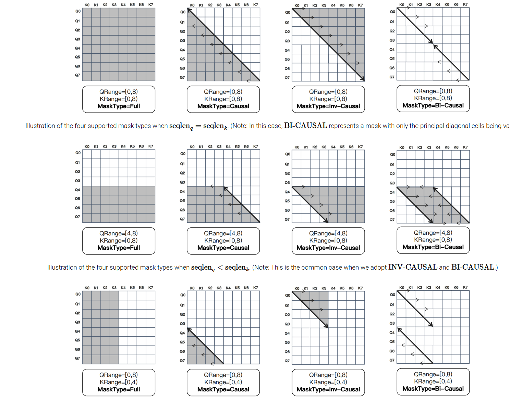

**(2) 负载均衡设计：**

分块可置换分片策略（Chunk-Wise Permutable Sharding）

1. 将序列沿 Query 维度均匀分块（块大小=`chunk_size`）
2. 计算每块的 Mask 面积 `Area(C_i)` → 表征计算量
3. 将块分配到 `cp_size` 个桶（Bucket），约束：每个桶块数相等（确保非 Attention 模块均衡）

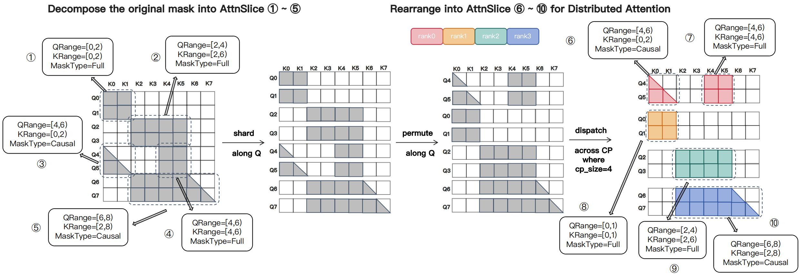

以及一个 O(nlogn)的贪心调度算法，来尽可能让每个桶尽可能负载均衡

1. 按块计算量降序排序，以及各桶容量（n / cpsize）
2. 初始化最小堆（记录各桶当前总计算量）
3. 遍历每个块，分配给当前计算量最小的桶
4. 更新桶状态并重新入堆

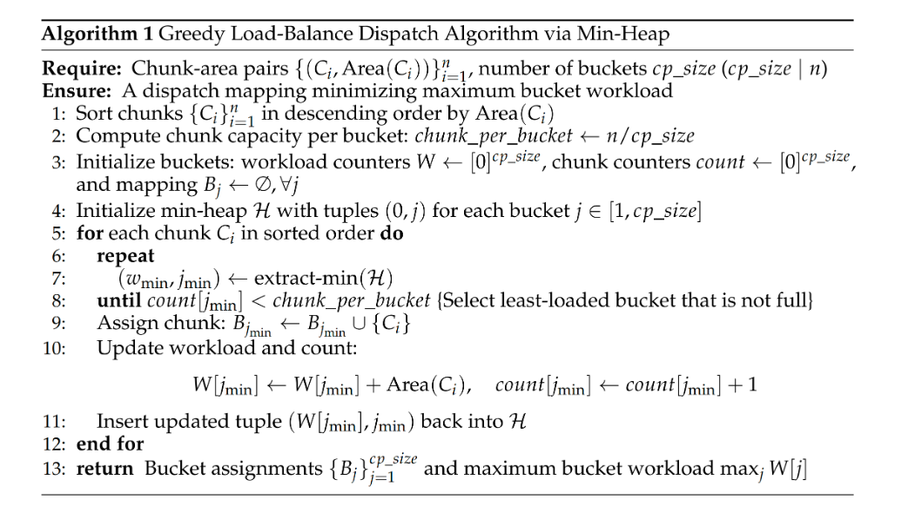

**(3) 通信设计优化：**

motivation：Ring P2P 通信在稀疏 Mask 下冗余严重（例如变长块因果 Mask 冗余 >30%）：

- 所有 Rank 传输完整序列块，无论是否需要
- 梯度聚合（dKV）存在类似冗余

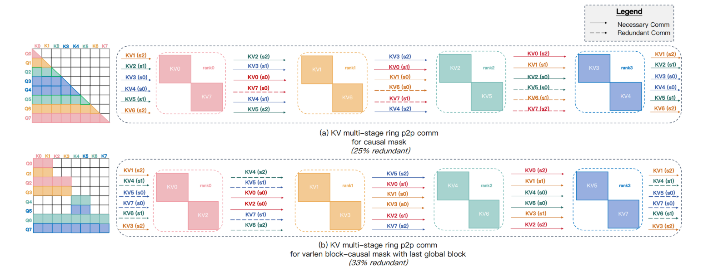

优化实现：Group-Cast / Group-Reduce 原语：

- Group-Cast（前向）：
  仅将 KV 发送给需要它的目标 Ranks（通过 torch 调用 nccl 的 `All-to-All-v` 实现）
- Group-Reduce（反向）：
  仅收集部分 dKV 并聚合到宿主 Rank

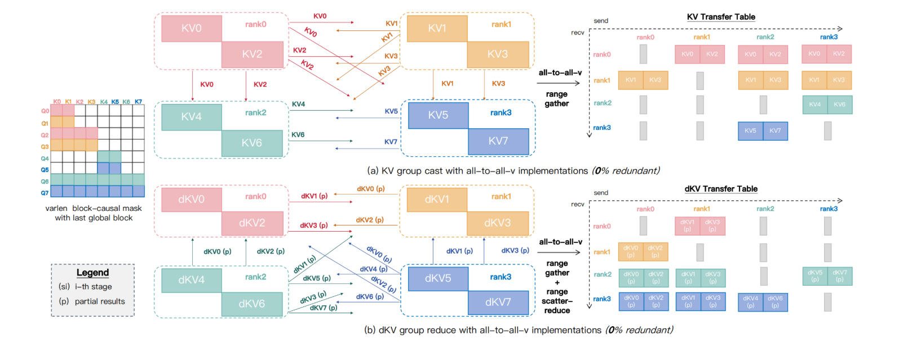

同时做了计算通信的 overlap：

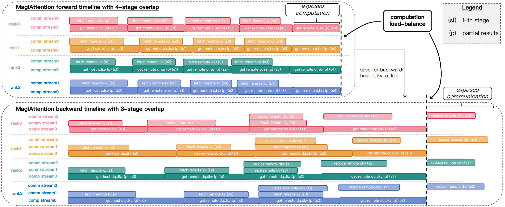

**(4) 实验结果：**

主要对比 flashattention-v3，对于 flashattention-v3 支持的模式，magiattention 的 ffa 基本上均比 flashattention-v3 差，但差的不太多基本上 5% 以内。同时 flashattention-v3 有一些不能支持的 mask 模式，ffa 展示了兼容的灵活 mask。

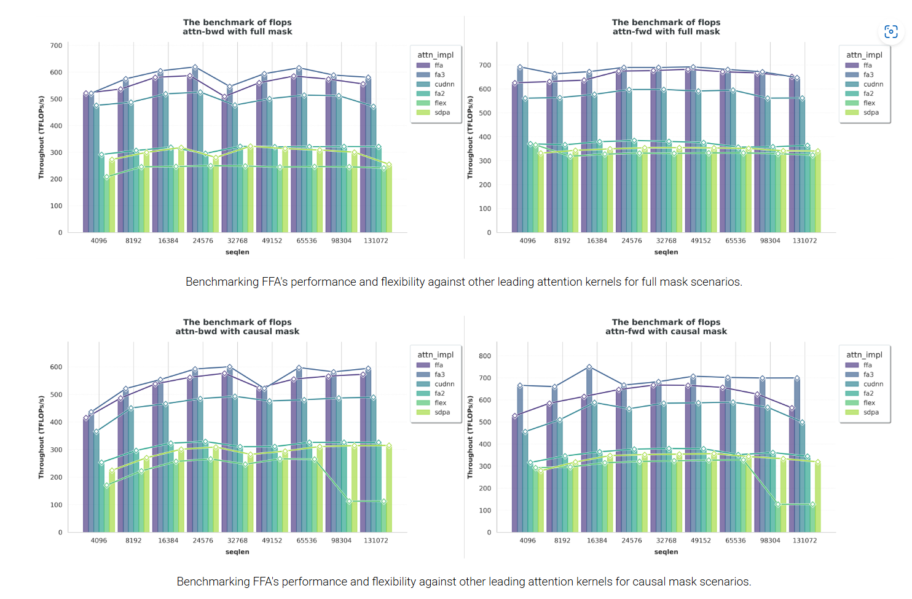

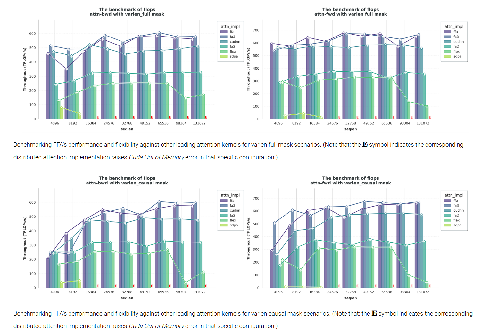

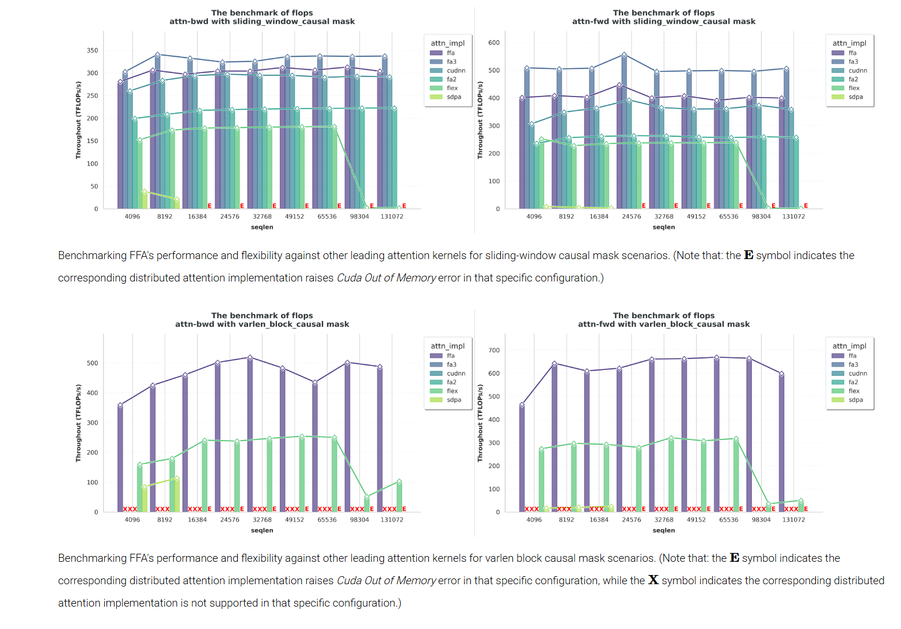
