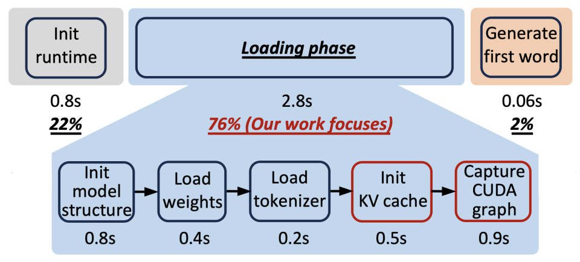
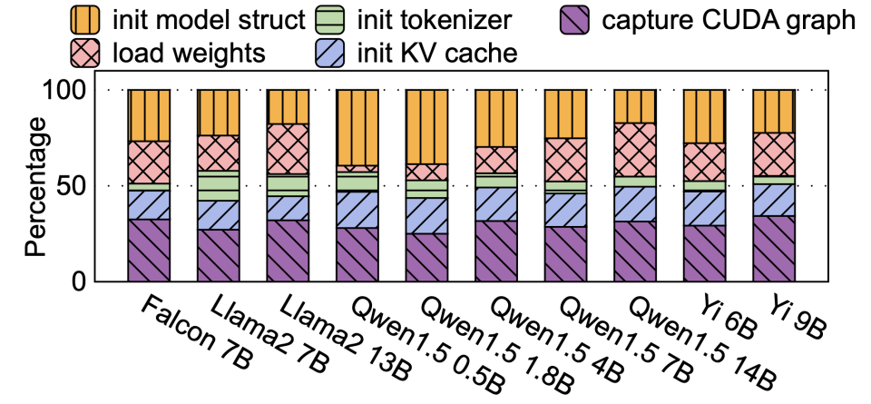
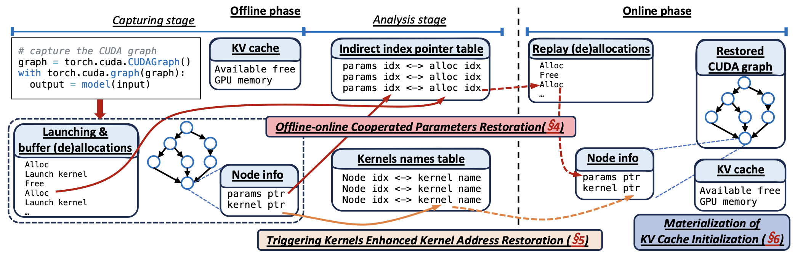
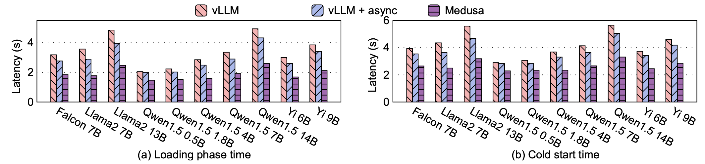
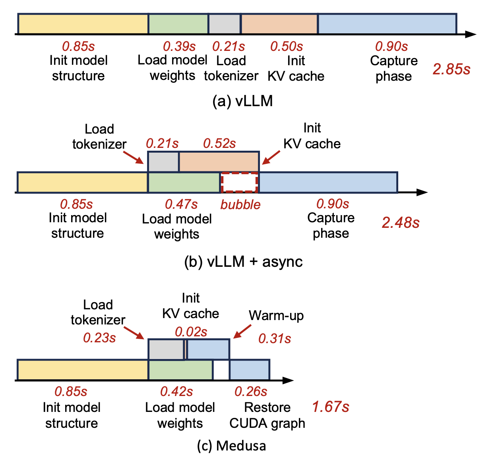
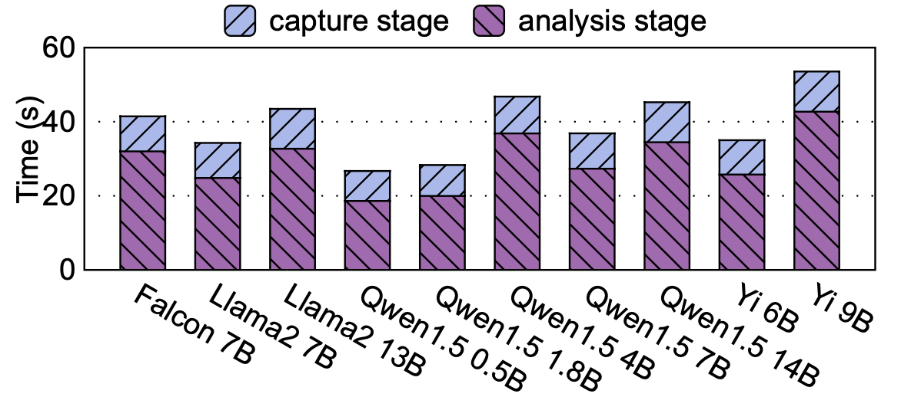

本工作旨在解决**Serverless LLM推理中的冷启动（Cold Start）问题**。冷启动延迟严重影响了用户体验的关键指标——首令牌时间（Time-To-First-Token, TTFT）。

<!-- more -->

## 摘要

- **核心问题发现:** 作者通过剖析发现，在冷启动的“加载阶段”（Loading Phase），**KV缓存（KV Cache）初始化**和**CUDA图（CUDA Graph）捕获**这两个阶段合计占据了高达50%的时间，是主要的性能瓶颈。
- **传统方案的不足:** 现有工作大多专注于消除运行时初始化（如容器、语言环境）的开销，或仅优化模型权重加载，却忽略了LLM推理特有的这两个昂贵阶段。
- **MEDUSA的核心思想:** 提出 **“状态物化”（State Materialization）** 方法。即在离线阶段预先计算（物化）KV缓存的大小和CUDA图的结构，在冷启动的在线阶段直接**恢复**这些状态，从而避免了在运行时进行动态性能剖析（Profiling）和图构建，极大缩短了冷启动时间。
- **主要贡献:**
   1. 首次明确指出并量化了KV缓存初始化和CUDA图捕获是Serverless LLM冷启动的主要开销。
   2. 提出了创新的、轻量级的CUDA图物化与恢复机制，解决了数据指针不确定性和内核地址隐藏性两大挑战。
   3. 实现了MEDUSA系统，并在10个主流LLM模型上验证了其有效性，将加载阶段延迟降低了42.5%，将真实负载下的TTFT尾延迟降低了53.0%。

---

## 背景

### Serverless LLM冷启动分解

- **冷启动时间线（以Qwen1.5 4B为例）**
  
   - **运行时初始化 (22%):** 加载Python代码、包、设置执行环境。
   - **加载阶段 (76%):** 加载模型特定数据并进行预热剖析。这是当前的主要瓶颈，也是MEDUSA的优化目标。
   - **生成首个令牌 (2%):** 实际推理时间。

- **加载阶段深入分解**
  
   1. **模型结构初始化:** 实例化模型层、内核，在GPU上为模型权重分配张量缓冲区。
   2. **模型权重加载:** 从存储介质加载权重到GPU预分配的张量中。
   3. **分词器加载:** 加载模型的分词器。
   4. **KV缓存初始化 (18%):** 为了有效管理GPU内存，框架需要知道有多少空闲内存可用于KV缓存。**方法是通过一次“剖析前向”（profiling forward）**：以最大序列长度和最大批次大小运行一次模型前向传播，然后剖析剩余的空闲GPU内存空间。这个过程很耗时。
   5. **CUDA图捕获 (32%):** 为了减少CPU内核启动开销，需要为不同的批次大小构建CUDA图。**方法是通过“预热”和“捕获前向”** 来构建图，这个过程需要重复多次（例如vLLM默认支持35种批次大小），非常耗时。

### CUDA图的重要性与开销

- **为什么需要CUDA图？**
   - GPU内核执行速度极快（微秒级），CPU逐个启动内核的开销变得不可忽视。
   - CUDA图将多个内核及其依赖关系组合成一个图，允许通过**一次CPU启动**来执行整个图，大幅降低开销。
   - 实验表明，使用CUDA图可获得高达**2.4倍的性能加速**。因此，不能简单地移除它。

- **CUDA图捕获的开销来源:**
   1. **预热（Warm-up）:** 首次运行某些内核（如cuBLAS）会触发内部初始化（如同步），这些API在捕获期间是被禁止的，因此需要一次额外的预热前向。
   2. **多批次大小:** CUDA图与特定的批次大小绑定。不同批次大小需要不同的图，vLLM默认捕获35个图，加剧了延迟。

### 现有解决方案的局限性

- **热备实例（Hot Spares）:** 资源浪费，且难以覆盖所有模型类型，成本高昂。
- **阶段异步执行:** 由于阶段间存在依赖关系（如捕获阶段依赖KV缓存），无法完全并行化。权重加载的I/O操作也无法完全覆盖其他阶段的延迟。
- **延迟捕获:** 将捕获过程推迟到处理请求时进行，并没有消除开销，只是将延迟分摊到了用户请求中，损害了TTFT。

## MEDUSA 核心设计

### 总体思路与挑战

**思路:** 将运行时（在线）的动态剖析和构建操作，转变为离线物化+在线恢复。

- **KV缓存物化:** 离线运行一次剖析前向，记录下可用空闲GPU内存大小。在线冷启动时直接使用该值。
- **CUDA图物化:** 离线捕获CUDA图，但并非直接保存二进制图（因为无效），而是保存其“蓝图”（间接索引指针表+内核名称表+CUDA图的拓扑结构）。在线阶段根据“蓝图”快速重建出可执行的CUDA图。

**挑战 I: 数据指针的非确定性**

- CUDA图节点参数中包含了指向输入/输出缓冲区的**数据指针（地址）**。`cudaMalloc`在不同次启动中返回的地址是随机的。直接保存离线阶段的指针地址，在线恢复时会导致非法内存访问。

**挑战 II: 内核地址的随机性与隐藏性**

- CUDA图节点中记录了**内核函数的地址**。进程的地址空间布局随机化（ASLR）导致每次启动的内核地址都不同。
- **更棘手的问题:** 并非所有内核（如cuBLAS中的某些内核）都暴露在动态链接库的符号表中，无法通过`dlsym`等函数按名称查找地址。

### 系统概述

MEDUSA分为两个阶段：

1. **离线阶段（一次性的）:**
   - **捕获阶段:** 运行标准的冷启动过程，但会拦截所有缓冲区分配调用和内核启动调用，记录序列。同时捕获CUDA图并保存其结构信息（节点、依赖关系），并物化KV缓存信息。
   - **分析阶段:** 分析捕获的数据，构建两个关键映射表：
      - **间接索引指针表:** 将数据指针参数映射到其对应的缓冲区分配序列中的索引。
      - **内核名称表:** 记录每个节点对应的内核的（mangled）名称及其所在模块。

2. **在线阶段（每次冷启动）:**
   - 按正常顺序进行模型结构初始化、权重加载等。
   - **恢复KV缓存:** 直接使用物化的空闲内存值，省去了剖析前向。
   - **恢复CUDA图:**
      - **重放缓冲区分配序列:** 按记录的顺序重新分配缓冲区，并记录第i次分配返回的地址。
      - **恢复参数指针:** 根据间接索引指针表，将图节点中的参数替换为当前分配序列中对应索引的实际地址。
      - **恢复内核地址:** 使用触发内核加载所需模块，然后根据内核名称表遍历模块内的所有内核，通过名称匹配找到正确的地址填入图节点。
   - 依赖关系等信息直接用离线保存的元数据恢复。

### 关键技术细节

#### 参数恢复：间接索引指针

- **关键观察:** 控制流是确定的！缓冲区分配的顺序（模型结构初始化决定）和内核启动顺序每次运行都严格一致。
- **解决方案:**
   - **离线:** 拦截所有`cudaMalloc`和`cudaFree`调用，记录分配/释放序列。对于每个数据指针，在分配序列中**向后追溯**（考虑释放操作），找到其**唯一对应的分配调用索引**。将这个索引`i`（即间接索引指针）而不是地址本身保存下来。
   - **在线:** 按相同顺序重放缓冲区分配序列。对于需要恢复的指针，根据其索引`i`，从当前分配序列中取出第`i`次分配的实际地址，填入CUDA图节点。
- **缓冲区内容恢复:** 大部分缓冲区内容（如模型权重）无需额外保存和恢复，因为它们会由正常的模型加载过程填充。仅需处理极少数包含魔数的永久性缓冲区，开销极小。

#### 内核地址恢复：触发内核

- **对于有符号的内核 (69.2%):** 在线阶段可直接通过`dlopen`和`dlsym`按名称查找地址。
- **对于无符号的隐藏内核 (如cuBLAS):**
   - **方法:** 通过CUDA驱动接口`cuModuleEnumerateFunctions`和`cuFuncGetName`遍历已加载模块中的所有内核，通过名称匹配来查找地址。
   - **问题:** 如何确保所需模块已被加载？
   - **解决方案：触发内核（Triggering-Kernels）**
      - **初始方案:** 手动寻找能触发目标模块加载的内核（如某种矩阵乘法）。
      - **优化方案:** 利用LLM模型层结构重复的特点。**捕获并运行第一层的CUDA图**。由于第一层包含了模型所需的所有内核类型，运行它会自动触发所有必要模块的加载。之后即可遍历这些模块，为所有层的CUDA图节点解析出正确的地址。第一层的捕获开销远小于捕获整个模型。

## 实验评估

### 实验设置

- **模型:** 10个来自HuggingFace的流行模型，包括Falcon, Llama2, Qwen1.5, Yi等。
- **对比方案:**
   - **vLLM:** 基线方案。
   - **vLLM + async:** 基线 + 模型权重加载异步化。
   - **MEDUSA:** 本文方案，包含CUDA图和KV缓存物化。
- **评估指标:** 加载阶段延迟、总冷启动延迟、真实负载下的TTFT尾延迟。

### 主要结果

- **加载阶段延迟 (a):** MEDUSA平均比vLLM降低**42.5%**，比vLLM+async降低**34.4%**。证明了物化方法的显著优势。
- **总体冷启动延迟 (b):** 平均降低**34.9%**。

- **分解分析 :** 以Qwen1.5 4B为例，MEDUSA将KV缓存初始化时间从0.50s降至0.02s，将CUDA图捕获时间从0.90s降至0.57s。并通过异步执行优化，进一步消除了气泡。

- **离线开销:** 离线阶段平均耗时约39.2秒（捕获9.7s + 分析29.5s），对于一次性的操作来说是可接受的。
- **真实负载测试 (ShareGPT轨迹):**
   - 在Poisson请求分布下，MEDUSA显著降低了**99th百分位的TTFT尾延迟**（最高降低53.0%）。
   - 在不同RPS（每秒请求数）和系统吞吐量下，MEDUSA始终能提供更低、更稳定的尾延迟。
   - 与“完全移除CUDA图”（w/o CUDA Graph）的方案相比，MEDUSA表现更好，因为它既降低了冷启动延迟，又保留了CUDA图对推理吞吐量的加速 benefits。

## 结论与展望

- **总结:** MEDUSA通过状态物化有效解决了Serverless LLM推理冷启动中的核心瓶颈。其设计的间接索引指针和触发内核方法巧妙地克服了CUDA图物化的底层挑战。
- **意义:** 这项工作不仅是一个高效的系统实现，更重要的是为优化类似系统（凡依赖动态剖析和构建的系统）提供了新颖的设计思路。
