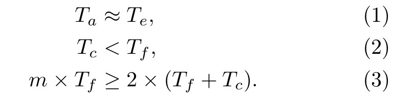
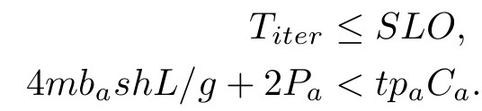
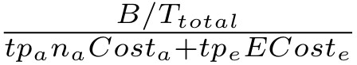

---

- 论文链接：https://arxiv.org/pdf/2504.02263v3 
- 关键词：MOE, EP, decode, 加速

---

## 背景

MOE: 将Dense模型的FFN层替换为门控网络和众多专家。token不会经过所有专家的计算，token经由门控网络决定激活哪些专家用于计算，计算后的结果再求和交给下一层的Attention，可以节省计算量。 

专家并行：将专家分布到不同的GPU上来降低计算和显存压力，每一层引入了两次 all2all通信。

MOE模型非常适合模型参数增大这个趋势，其计算量随着专家数量的增多和模型参数的增多次线性增长。虽然计算量少了，但MOE的计算方式使得GPU利用率低，导致没有充分降低计算成本。

**二、利用率低？**

对Dense model来说
1. Attention加载所有token的KV，增大batch size，计算量和IO都增加，利用率低
2. FFN加载固定大小的参数，增大batch size，计算量增大，利用率增大

对MOE来说，专家很多，分配给每个专家的token数量很少，导致FFN需要更大的batch size才能充分利用GPU

batch size不能无限增大：时延要求，显存限制 (KV)，MP带来通信

## 核心思想

将Attention和FFN放在一起限制了batch size的增大，所以分离Attention层和FFN层到不同的机器上。Attnention采用DP+TP，FFN采用EP+TP。

好处 

1. 增大FFN的batch size 
2. 各自选择硬件，Attention选择IO更好的硬件，FFN选择计算更好的硬件

挑战 

1. 交替计算会导致GPU空闲：设计流水线 
2. NCCL时延大：M2N通信库

## Ping-Pong Pipeline Parallelism

将global-batch切分成micro-batch，用计算掩盖通信，提高利用率

数字代表micro-batch id，颜色代表layer

形成上述流水线的约束： 

1. 计算时间平衡，减少空闲
2. 计算时间大于通信时间
3. global-batch经过Attention/FFN层的时间要大于micro batch经过两者的时间之和，否则有空闲，要求micro-batch 数量足够多

设计流水线需要确定一些超参，设计了一个超参数搜索的算法，其搜索空间包括 Attention Node和Expert Node的张量并行度大小，micro-batch数量（m），单位成本的吞吐量作为优化目标。

时延要求和KV显存限制：

目标：

## M2N 通信库

all2all、M2N都是由⼀系列send和receive通信组成

NCCL的不足： 

1. 比起network benchmark测出来的时延高，说明额外开销很大
2. P99差距更大，说明通信时间不稳定 

额外开销： 

1. 在跨机器通信时，数据经历user buffer->proxy buffer->network->proxy buffer >user buffer 
2. group 操作数量有上限8，group 类似 batch，可以提高性能 
3. 为了通用性引入不必要的 group 操作的初始化 

不稳定：GPU同步和访存操作 

M2N的优化: 减少不必要的拷贝、同步、初始化

sender 

1. 等待计算完成，启动一个kernel来检查数据是否准备好，减少同步 
2. 去掉proxy buffer，直接注册tensor memory为RDMA可访问区域，直接发送，减少 buffer拷贝
3. 没有group操作数量的限制

receiver 

1. 去掉proxy buffer，直接注册tensor memory为RDMA可访问区域，直接接收，减少 buffer拷贝 
2. 等待通信完成，启动⼀个kernel来阻塞计算，直到数据准备好，减少同步 

## 实验

baseline: 

1. vLLM: tp+pp 
2. TensorRT-LLM: tp+ep+pp

## 核心观点和 Feature

MOE的专家并行，导致decode阶段专家的batch size较小，使得GPU利用率低，通过分离Attention层和FFN层来增大FFN的batch size，从而提高利用率。为避免交替计算导致GPU空闲，设计了流水线；为降低NCCL时延，设计了通信库。

## 思考

PD分离很流行，感觉这个工作也是受PD分离的影响。模型不同层的计算特点不同，分离后再单独做优化可以打破耦合在⼀起的束缚，不过分离本身会带来通信，需要优化才 能拿到正向的收益。 牺牲了NCCL的通用性换取性能的提升，细粒度的优化。
