- 论文链接：https://arxiv.org/pdf/2504.02263v3
- 关键词：MOE, EP, decode, 加速
 <!-- more -->

---

## 背景

MOE: 将 Dense 模型的 FFN 层替换为门控网络和众多专家。token 不会经过所有专家的计算，token 经由门控网络决定激活哪些专家用于计算，计算后的结果再求和交给下一层的 Attention，可以节省计算量。

专家并行：将专家分布到不同的 GPU 上来降低计算和显存压力，每一层引入了两次 all2all 通信。

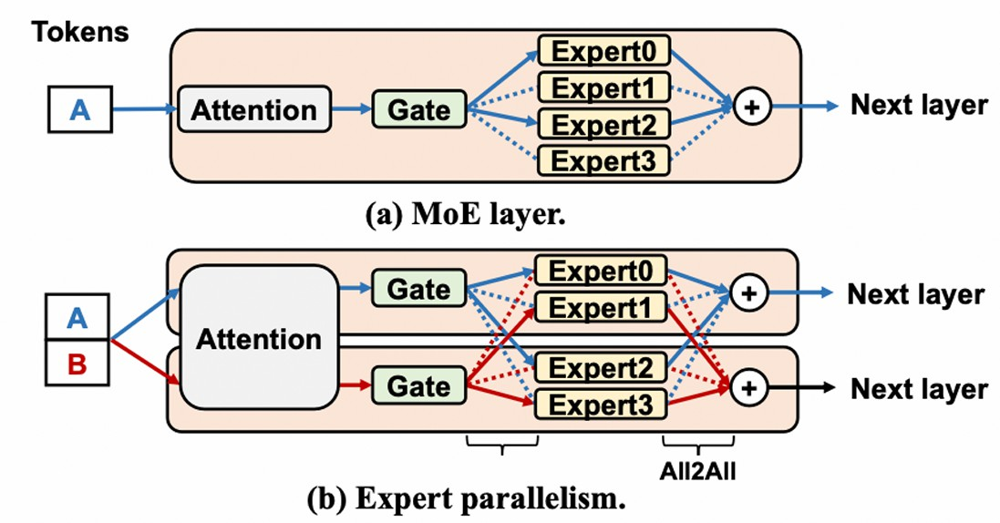

MOE 模型非常适合模型参数增大这个趋势，其计算量随着专家数量的增多和模型参数的增多次线性增长。虽然计算量少了，但 MOE 的计算方式使得 GPU 利用率低，导致没有充分降低计算成本。

**利用率低？**

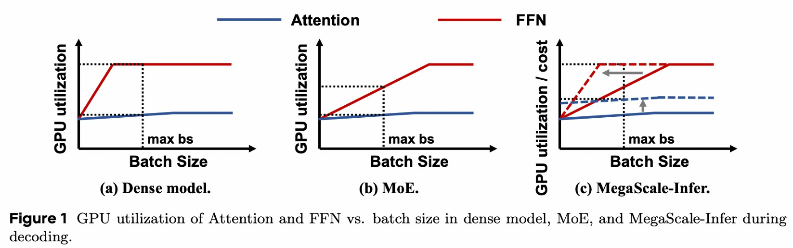

对 Dense model 来说

1. Attention 加载所有 token 的 KV，增大 batch size，计算量和 IO 都增加，利用率低
2. FFN 加载固定大小的参数，增大 batch size，计算量增大，利用率增大

对 MOE 来说，专家很多，**分配给每个专家的 token 数量很少**，导致 FFN 需要更大的 batch size 才能充分利用 GPU

batch size 不能无限增大：时延要求，显存限制 (KV)，MP 带来通信

## 核心思想

将 Attention 和 FFN 放在一起限制了 batch size 的增大，所以**分离 Attention 层和 FFN 层到不同的机器上。Attnention 采用 DP+TP，FFN 采用 EP+TP。**

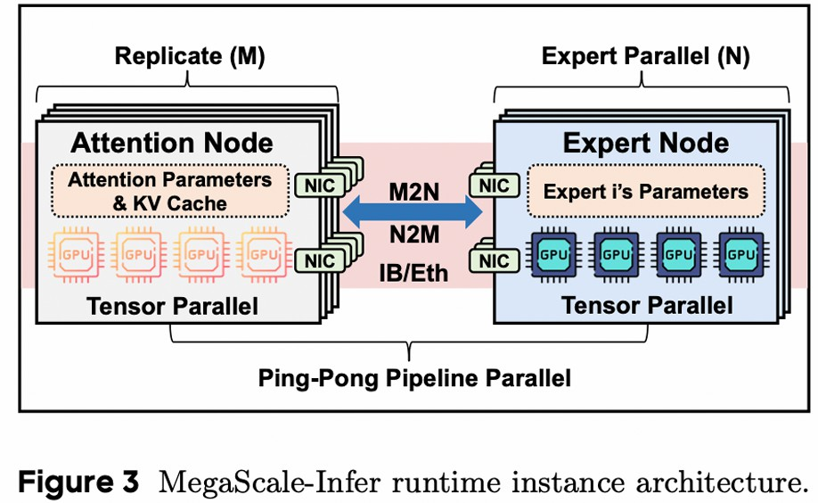

好处

1. 增大 FFN 的 batch size
2. 各自选择硬件，Attention 选择 IO 更好的硬件，FFN 选择计算更好的硬件

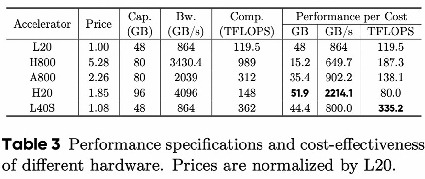

挑战

1. 交替计算会导致 GPU 空闲：设计流水线
2. NCCL 时延大：M2N 通信库

## Ping-Pong Pipeline Parallelism

将 global-batch 切分成 micro-batch，用计算掩盖通信，提高利用率

**数字代表 micro-batch id，颜色代表 layer**

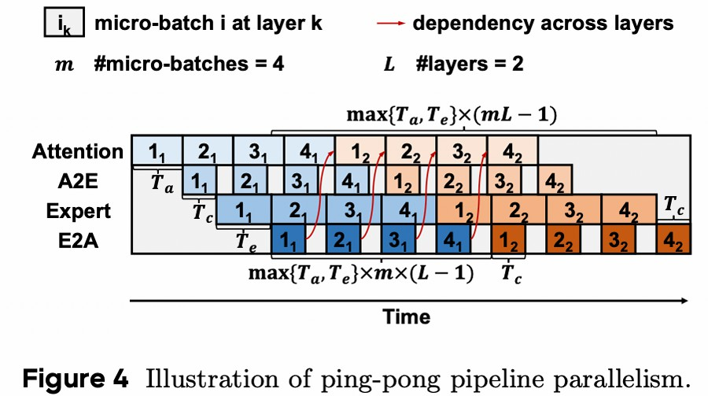

形成上述流水线的约束：

1. $T_a\approx T_e$
   - 计算时间平衡，减少空闲
2. $T_c < T_f$，其中 $T_f = \max\{T_a, T_e\}$。
   - 计算时间大于通信时间
3. $m \times T_f \geq 2 \times (T_f + T_c)$。
   - global-batch 经过 Attention/FFN 层的时间要大于 micro batch 经过两者的时间之和，否则有空闲，要求 micro-batch 数量足够多
      - micro-batch 时延：
        $$(T_a + T_e + 2T_c) + m T_f (L - 1) \leq T_{\text{iter}} \leq m T_f L.$$
      - global-batch 时延：
        $$T_{\text{total}} = (T_a + T_e + 2T_c) + T_f (mL - 1)$$

设计流水线需要确定一些超参，设计了一个**超参数搜索**的算法，其搜索空间包括 Attention Node 和 Expert Node 的张量并行度大小，micro-batch 数量（m），单位成本的吞吐量作为优化目标。

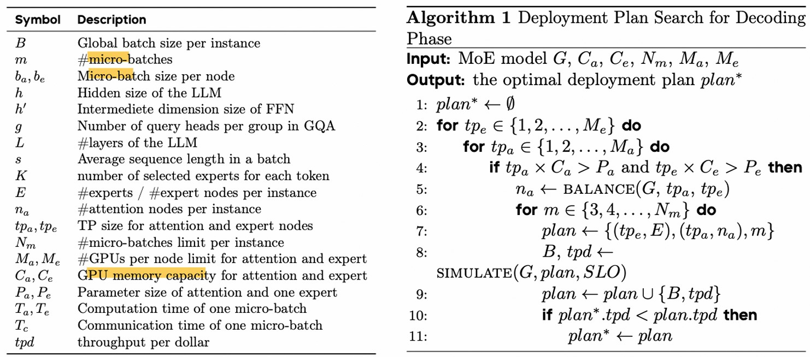

时延要求和 KV 显存限制：

$$
T_{\text{iter}} \leq \text{SLO},
$$

$$
\frac{4 m b_a s h L}{g} + 2 P_a < t_{pa} C_a.
$$

目标：

$$
\frac{B / T_{\text{total}}}{tp_{a} \, n_{a} \, Cost_{a} + tp_{e} \, E \, Cost_{e}}
$$

## M2N 通信库

all2all、M2N 都是由⼀系列 send 和 receive 通信组成

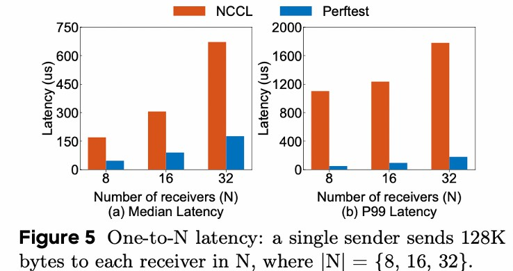

NCCL 的不足：

1. 比起 network benchmark 测出来的时延高，说明额外开销很大
2. P99 差距更大，说明通信时间不稳定

额外开销：

1. 在跨机器通信时，数据经历 user buffer->proxy buffer->network->proxy buffer >user buffer
2. group 操作数量有上限 8，group 类似 batch，可以提高性能
3. 为了通用性引入不必要的 group 操作的初始化

不稳定：GPU 同步和访存操作

M2N 的优化: 减少不必要的拷贝、同步、初始化

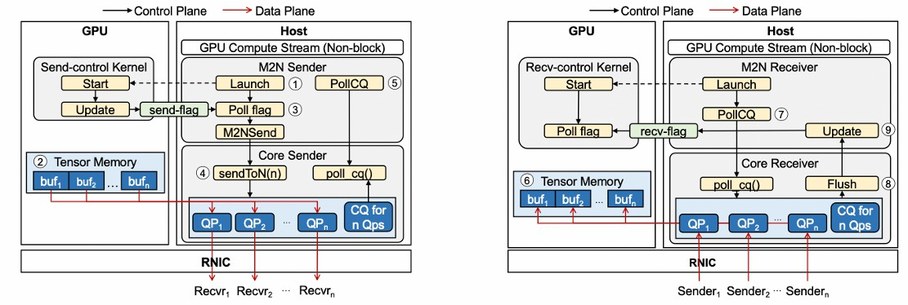

sender

1. 等待计算完成，启动一个 kernel 来检查数据是否准备好，减少同步
2. 去掉 proxy buffer，直接注册 tensor memory 为 RDMA 可访问区域，直接发送，减少 buffer 拷贝
3. 没有 group 操作数量的限制

receiver

1. 去掉 proxy buffer，直接注册 tensor memory 为 RDMA 可访问区域，直接接收，减少 buffer 拷贝
2. 等待通信完成，启动⼀个 kernel 来阻塞计算，直到数据准备好，减少同步

## 实验

baseline:

1. vLLM: tp+pp
2. TensorRT-LLM: tp+ep+pp

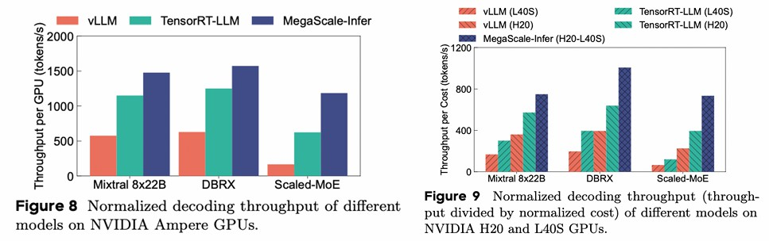
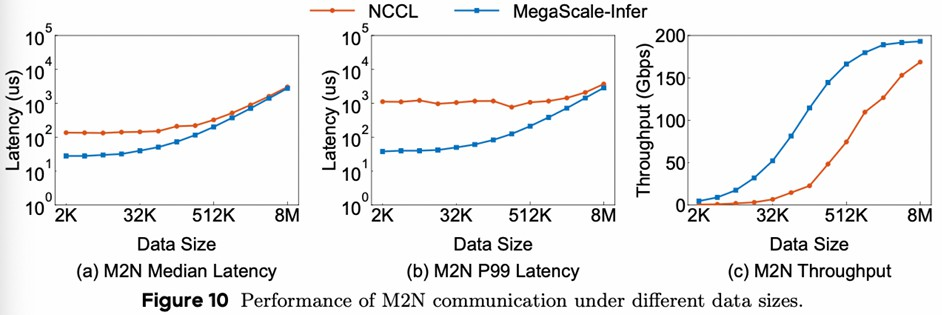
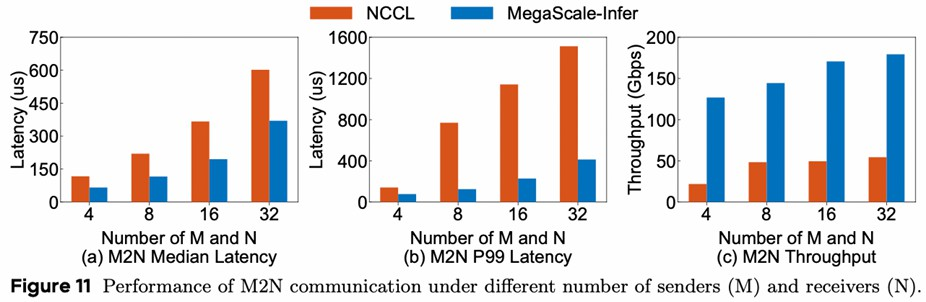

## 核心观点和 Feature

MOE 的专家并行，导致 decode 阶段专家的 batch size 较小，使得 GPU 利用率低，通过分离 Attention 层和 FFN 层来增大 FFN 的 batch size，从而提高利用率。为避免交替计算导致 GPU 空闲，设计了流水线；为降低 NCCL 时延，设计了通信库。

## 思考

PD 分离很流行，感觉这个工作也是受 PD 分离的影响。模型不同层的计算特点不同，分离后再单独做优化可以打破耦合在⼀起的束缚，不过分离本身会带来通信，需要优化才能拿到正向的收益。 牺牲了 NCCL 的通用性换取性能的提升，细粒度的优化。
