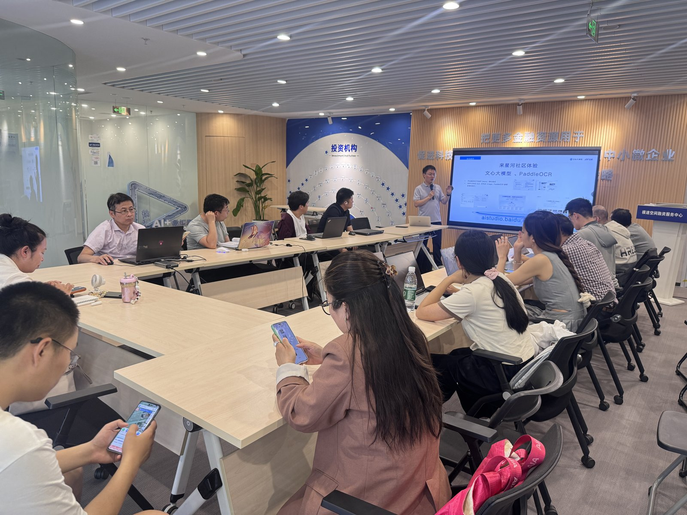
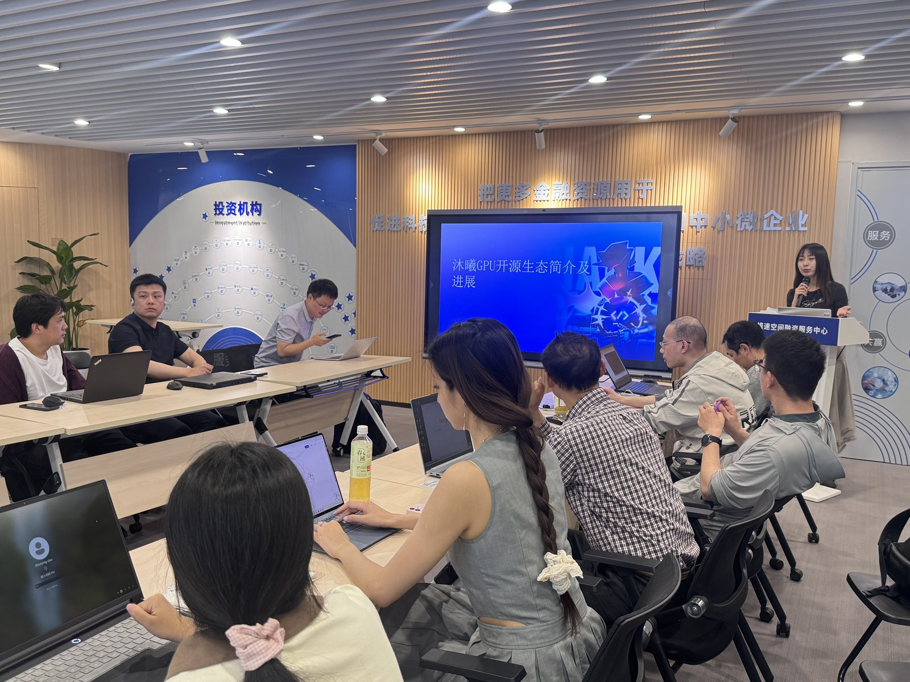
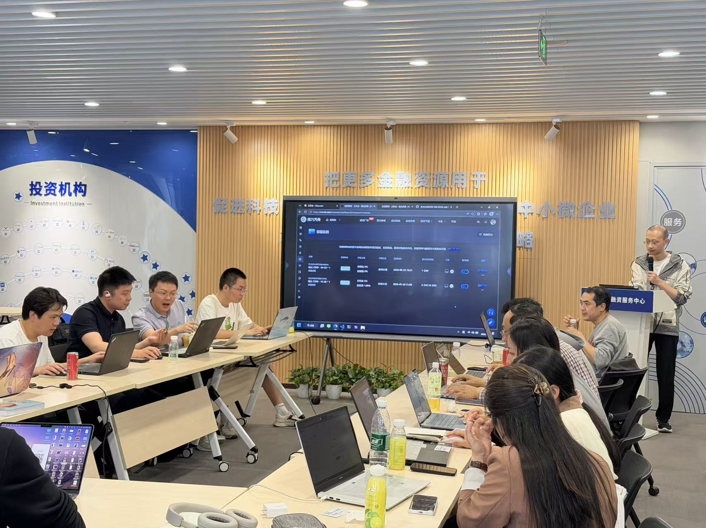
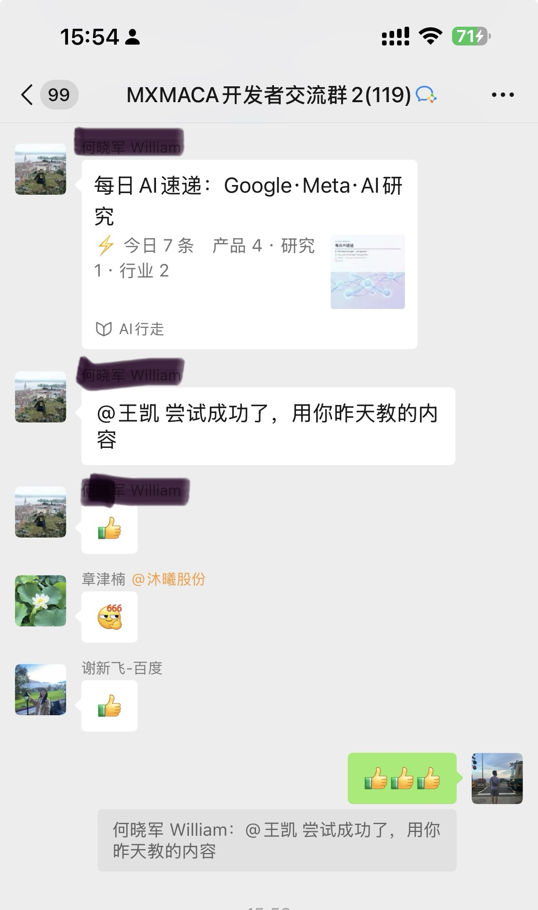

> 5 月 22 日下午，飞桨黑客松第十期「文心合作伙伴赛道」携手沐曦股份，在上海模速空间举办线下黑客松暨技术沙龙。20 余位开发者到场，围绕「优化 PaddleOCR-VL-1.5 + MetaX GPU」赛题，从"看懂"推进到"跑通"。

2026 年 5 月 22 日（周五）14:00，飞桨黑客松第十期「文心合作伙伴赛道」联合沐曦股份，在上海市徐汇区龙台路 180 号模速空间举办了本赛季第三场线下 Meetup。本次活动由百度文心大模型、百度飞桨、沐曦股份、模速空间联合主办，聚焦沐曦曦云 C 系列 GPU 国产算力平台与百度 PaddlePaddle 框架的协同优化实战。

<!-- more -->

---

## 文心赋能：赛事全景与 AI 自媒体实践

活动以百度文心侧分享开场。百度飞桨高级产品经理王凯首先围绕飞桨黑客松第十期「文心合作伙伴赛道」进行介绍，帮助到场开发者快速了解赛程安排、任务方向和参赛方式。

随后，分享进入了最受关注的环节——基于文心大模型搭建 AI 自媒体内容流水线的实战经验。王凯详细介绍了开源项目 newscraft 的使用流程，从选题、素材抓取、内容生成到发布，展示了 AI Agent 全流程驱动技术内容创作的完整方案。

newscraft 是一套已稳定运行 40 余期的自动化内容流水线，从热点抓取到微信草稿发布平均耗时仅 25 分钟。主要环节包括：

- **信息获取**：自动抓取 HackerNews、Reddit、arXiv、IT 之家、36 氪等 20 余个信源，基于热度权重和历史去重算法筛选选题；
- **内容生成**：ERNIE-5.0 写稿，ERNIE-4.5 与 ERNIE-5.0 双模型交叉审稿，从事实核查到观点深度分三阶段把关；
- **配图生成**：ERNIE-image-turbo 自动生成封面图，差值哈希去重保证连续发布不撞款；
- **一键发布**：Markdown 转 HTML、图片上传素材库、创建微信草稿，全流程自动化。

项目地址：https://github.com/onecatcn/newscraft （Apache-2.0 协议）

<figure>

<figcaption>百度文心团队分享赛事全貌与 AI 自媒体实践</figcaption>
</figure>

---

## 沐曦算力：国产 GPU 的推理优化路径

紧接着，沐曦股份技术团队深入拆解了曦云 C 系列 GPU 的国产算力平台能力。

演讲围绕两个核心展开：「硬件能力边界」和「软件适配路径」。沐曦工程师结合 PaddlePaddle 框架、FastDeploy 极速部署工具和 ERNIE 文心大模型，全方位讲解了国产算力硬件适配百度大模型的推理优化方案、落地技巧与工程实操挑战——包括 MXMACA 全栈软件栈的编译流程、常见性能瓶颈的定位方法，以及从模型转换到端到端推理验证的完整链路。

<figure>

<figcaption>沐曦技术团队分享曦云 C 系列 GPU 硬件能力与适配方案</figcaption>
</figure>

---

## 实操环节：从"看懂"到"跑通"

活动的核心环节是赛题实操。现场围绕百度 × 沐曦联合赛题「优化 PaddleOCR-VL-1.5 + MetaX GPU」展开，拆解打卡任务、进阶任务及后续优化方向，并设置了专属实操与答疑环节。

参会者在技术老师指导下，上手体验了完整任务流程——从环境配置、模型部署、推理验证到性能优化和代码提交，把赛题从"看懂"推进到"跑通"。工程师们在各桌间来回走动，现场答疑覆盖了环境安装报错、模型加载异常、推理结果验证等高频问题。

<figure>

<figcaption>开发者在沐曦工程师指导下现场实操赛题任务</figcaption>
</figure>

---

## 彩蛋：Agent 写稿，现场验证

活动分享中，百度文心团队演示的 newscraft 项目引发了现场热烈反响。

令人惊喜的是，会后一位参会者当场按照分享的方法，成功使用 Agent 发布了一篇 AI 新闻。从选题、素材抓取、内容生成到发布，全流程 AI 驱动，真正实现了"听完就能用"。

<figure>

<figcaption>参会者会后当场使用 Agent 成功发布 AI 新闻</figcaption>
</figure>

---

## 福利：双品牌专属权益

参与本次活动的开发者，可获得：

- 百度文心大模型颁发的电子证书
- 百度文心飞桨伴手礼
- 沐曦股份算力代金券
- 优秀参与者还可获得算力资源、专属孵化扶持及赛事专属奖励

---

## 写在最后

本次 Meetup 以「文心赋能 + 国产算力实操」双轨并行的形式，让参与者在三小时内完成了从了解赛道到亲手跑通任务的完整体验。沐曦工程师的深度讲解、百度文心团队的现场支持，以及现场 AI 自媒体实践环节的意外收获，共同促成了这个下午的成果。

沐曦 GPU 赛道（打卡 #4 / 进阶 #16）目前仍有名额开放，感兴趣的开发者欢迎在黑客松总览 Issue 中评论报名：https://github.com/PaddlePaddle/Paddle/issues/78485

---

_感谢沐曦股份、百度文心大模型团队对本次活动的支持与协作。_
_飞桨黑客松第十期文心合作伙伴赛道持续进行中，欢迎报名参赛！_
