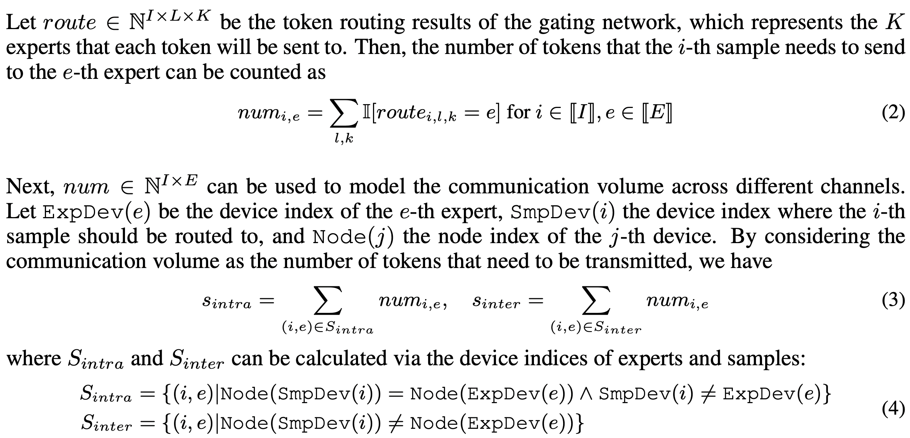

论文链接：**[ICLR 2025] [NETMOE: ACCELERATING MOE TRAINING THROUGH DYNAMIC SAMPLE PLACEMENT](https://openreview.net/pdf?id=1qP3lsatCR)**

<!-- more -->

<style>
figure {
   text-align: center;
}
figcaption {
   color: orange;
   border-bottom: 1px solid #d9d9d9;
   display: inline-block;
   color: #999;
   padding: 2px;
}
</style>

## 1. Background

### MoE 模型与专家并行

[Paddle 官方 MoE 介绍](https://www.paddlepaddle.org.cn/documentation/docs/zh/guides/06_distributed_training/moe_cn.html#moe)

   <div style="display: flex; justify-content: space-between">
      <figure style="width: 54%">
         
         <figcaption>MoE 模型</figcaption>
      </figure>
      <figure style="width: 45%">
         
         <figcaption>专家并行</figcaption>
      </figure>
   </div>

MoE 将 transformer block 中的 FFN 替换为了 Gate+数个 FFN（也就是 expert）

- 在原本的 transformer block 中，token 只需经过 FFN 层计算，MoE 模型中这些 FFN 被替换成了 Gate+Expert，其中 Gate 进行一个简单的打分（如 SoftMax），Expert 与原本的 FFN 层相同
- 在 MoE 模型中，token 经过 Gate 路由到不同的 Expert 上后，在这些 Expert 上计算（取决于 TopK 设置）
- 在同等的计算量下，通过 Gate 的稀疏激活（一个 token 只激活 TopK 个的 expert 而非所有），MoE 模型能有效的扩大模型参数大小（或者说在同等模型参数大小下，MoE 模型能有效减小计算量）

专家并行

- 考虑到 FFN 是模型中占比较大的部分，专家并行通过将每个 transformer block 中的 Expert 分散到不同的 worker 上来分担显存与计算压力
- 专家并行有个很大的问题，那就是 A worker 上 的 token 可能被路由到 B worker 上，这就需要在不同 worker 之间传输这些 token，不仅仅是 A，所有的 worker 上都可能会有这种情况，因此在 Expert 计算前后两次会有我们称为 AlltoAll 的传输过程（AllScatter 与 AllGather）。目前已经有非常多的工作证明，在传统 MoE 训练框架下（以 Megatron-LM 为例），MoE 层中的 AlltoAll 开销占比可以到达 47% 以上([COMET](https://arxiv.org/pdf/2502.19811))。

## 2. Motivation

### 专家热门度不均

由于数据集与门控网络的影响，不同专家所需要负责处理的 token 数量有极大差异

**门控网络：**

- SoftMax：简单的使用 SoftMax 来为 token 选择 TopK 个专家，早期的 MoE 模型直接使用这种方案，且目前 Qwen 系列 MoE 模型仍在使用这一门控网络。SoftMax 网络的很大一个问题在于其，很容易导致极大的专家热度不均。如下图是我自己在 MoE-GPT 上使用 SoftMax 门控跑出来的结果，不同颜色代表第 5 层中不同的 itr 中每个专家处理的 token 量。可以看到灰色的专家在后期已经被压缩到仅处理数个 token，而其他 token 主要由浅蓝色的专家和蓝紫色专家负责处理，热门专家与冷门专家之间的处理 token 量比值可以达到 75x 以上。这意味着通信压力和计算压力全部集中于这些专家上，会进一步加剧 AlltoAll 通信压力。

<figure>
    
    <figcaption>SoftMax 门控网路下的专家热度分布</figcaption>
</figure>

<figure>
    
    <figcaption>HuggingFace 官方模型中的 Qwen3 门控网络</figcaption>
</figure>

- [Gshard](https://arxiv.org/pdf/2006.16668)：Gshard 更偏向于一种强制均衡的方式，其会引入 aux-loss 并且 dropout 一些热门专家的 token。Gshard 的好处是带来了极为均衡的专家热度，MoE-GPT 在使用 Gshard 后热门专家与冷门专家之间的处理 token 量比值仅为 1.3x。但是目前多个工作指出使用强制均衡策略会影响模型最终的收敛效果，因此 Gshard 也并非是效率与质量的最优之选。
- Aux-loss-free：[DeepSeek](https://arxiv.org/pdf/2412.19437) 提出，使用亲和度来取代 loss 来 Gshard 避免影响模型最终效果的情况。Aux-loss-free 策略的热门专家与冷门专家之间的处理 token 量比值在 7.5x 左右，仍然是一个较大的值。比较有趣的一点是，DeepSeek 文中有明确提出，保留一些热门的专家而非强制所有专家负责同样的 token 数，会对最终的模型质量有所改善，aux-loss-free 也特地保留了一些热门专家，这样才能知道你用的是 MoE 模型。

> ⬇️ DeepSeek 的 aux-loss-free 实现方式：亲和度+分组 TopK

```python
import math
import torch
from .base_gate import BaseGate
import torch.nn.functional as F
from .base_gate import BaseGate
from .utils import limit_by_capacity
import torch.nn as nn
import torch.nn.functional as F

class AuxGate(BaseGate):

    def __init__(self,d_model, num_expert, world_size, top_k=2):
        super().__init__(num_expert, world_size)

        self.top_k = top_k
        self.n_routed_experts = world_size*num_expert
        self.routed_scaling_factor = 2.5
        self.n_group = 2
        self.topk_group = 1
        self.norm_topk_prob = False
        self.hidden_size=d_model

        self.gate = nn.Linear(d_model, self.tot_expert, bias = True)

        # self.weight = nn.Parameter(torch.empty((self.n_routed_experts,d_model)))
        self.register_buffer("e_score_correction_bias", torch.zeros((self.n_routed_experts)))

    @torch.no_grad()
    def get_topk_indices(self, scores):
        scores_for_choice = scores.view(-1, self.n_routed_experts) + self.e_score_correction_bias.unsqueeze(0)
        group_scores = (
            scores_for_choice.view(-1, self.n_group, self.n_routed_experts // self.n_group)
            .topk(2, dim=-1)[0]
            .sum(dim=-1)
        )
        group_idx = torch.topk(group_scores, k=self.topk_group, dim=-1, sorted=False)[1]
        group_mask = torch.zeros_like(group_scores)
        group_mask.scatter_(1, group_idx, 1)
        score_mask = (
            group_mask.unsqueeze(-1)
            .expand(-1, self.n_group, self.n_routed_experts // self.n_group)
            .reshape(-1, self.n_routed_experts)
        )
        scores_for_choice = scores_for_choice.masked_fill(~score_mask.bool(), 0.0)
        topk_indices = torch.topk(scores_for_choice, k=self.top_k, dim=-1, sorted=False)[1]
        return topk_indices

    def forward(self, hidden_states):
        assert not torch.isnan(hidden_states).any(), "NaN in hidden_states"
        # assert not torch.isnan(self.weight).any(), "NaN in router weights"
        hidden_states = hidden_states.view(-1, self.hidden_size)
        router_logits=self.gate(hidden_states)
        # router_logits = F.linear(hidden_states.type(torch.float16), self.weight.type(torch.float16))
        scores = router_logits.sigmoid()
        topk_indices = self.get_topk_indices(scores)
        topk_weights = scores.gather(1, topk_indices)
        # dummy loss
        self.set_loss(torch.zeros(1, requires_grad=True).to(hidden_states.device))
        if self.norm_topk_prob:
            denominator = topk_weights.sum(dim=-1, keepdim=True) + 1e-20
            topk_weights /= denominator
        topk_weights = topk_weights * self.routed_scaling_factor
        return topk_indices, topk_weights
```

**数据集**

- 针对不同数据集下专家的热度表现特征会发生一定变化，会对特定的某些 token，会更高概率的被路由到特定 token，这里不展开描述。

### 网络局部性

众所周知，Intra-connection（以 NVLink 和 PCIe 为例）和 Inter-connection（以 ETH 和 InfiniBand 为例）之间的连接质量有较大差异，一般认为 Intra 的延迟与带宽是远大于 Inter 的，尽管有 RDMA 等技术实现了较高速的 inter 通信，但也需要针对性的优化适配([DeepEP](https://github.com/deepseek-ai/DeepEP))。这两种连接方式的速率的不匹配进一步加剧了 AlltoAll 通信的开销。

专家热度不均与网络局部性带来的直接影响：MoE 层训练速度降低。[COMET](https://arxiv.org/pdf/2502.19811) 的一个实验直接说明了这个结果，下图左图中，随着 std 增大 token 的分布越来越不均匀，可以看到这种不均匀的 token 分布相较与完全均衡的分布的训练时间慢了 1.5x 左右。


如果进一步考虑增加 TP，会引入较为复杂的多重通信过程，涉及到多次 Scatter 和 Gather 过程，这些通信过程是与计算高度耦合的，目前有很多 paper 在研究这些并行全部开启时的优化方案


[FSMoE: A Flexible and Scalable Training System for Sparse Mixture-of-Experts Models](https://arxiv.org/pdf/2501.10714)

## 3. Related Work

**动态专家放置**

- [DeepSeek](https://arxiv.org/pdf/2412.19437)：比较简单直接，直接使用一些节点专门存放热门专家，来分担这部分热门专家的计算压力，DeepSeek 技术报告中只有一小段说明了一下，应该没有着重针对这点优化。
- [FasterMoE](https://dl.acm.org/doi/pdf/10.1145/3503221.3508418)：通过在其他工作机上创建热门专家的“影子专家（Shadow Expert）”来分担通信/计算压力。
- [Janus](https://dl.acm.org/doi/pdf/10.1145/3603269.3604869)：完全使用传递专家参数代替 AlltoAll 过程中的传递 Token，需占用大量显存。
- [SmartMoE](https://www.usenix.org/system/files/atc23-zhai.pdf)：动态地在专家池中选择热门专家进行复制。
- [PopFetcher](https://www.usenix.org/conference/atc25/presentation/zhang-junyi)：本人参与的一项工作，已中稿 ATC2025，通过一系列历史数据提前预测并预取热门专家来减小热门专家通信、计算压力。

创建新的专家副本会带来一些额外通信开销（例如参数同步），新的专家副本会占用额外显存。

**调整模型结构**

- Gating Dropout: 通过 dropout 强制均衡的门控网络。
- Pre-gated MoE: 使用第一个门控来预测第二层的 MoE 层专家热门度。

修改模型结构对模型本身的性能会有影响，且引入了新的超参，增加训练难度。

## 4. NetMoE

NetMoE 的核心思想是通过改变数据的放置模式来减小 AlltoAll 过程中的 inter-connect 开销，尽可能的将 AlltoAll 传输过程最大程度限制在 intra- connect 中，从而减小 MoE Layer 的整体延迟。

<figure>
    
    <figcaption>NetMoE 示意图</figcaption>
</figure>

在上图中，2-3 代表来自 Device2 的第 3 个 sample（也就是 token）。左侧为不调整 sample placement 的正常 MoE 层中第二个 AlltoAll 过程（AllGather），可以看到有 10 个 token 进行了 inter-connect 的传输。而在调整了 sample placement 后（将原本在 Device0 和 Deveice3 上的 sample 进行了置换），只有 4 个 token 进行 inter-connect，通过减小传输量来减小总体延迟。

首先从直观的思考一下调整 sample placement 会带来什么影响：

- 对于非 MoE Layer，在 EP 中，不同 Device 上的非 MoE Layer 处理的都是不同的数据，由反向过程中的 AllReduce 统一聚合，对他们来说其实就是个 DP 过程，因此调整 sample placement 对非 MoE 层没有任何影响。
- 对于 MoE Layer，上一个 MoE Layer 在调整 sample placement 后，由于在这个 MoE Layer 计算前首先会进行一次 AlltoAll（AllScatter），sample 的顺序被这个 AlltoAll 重新打乱了，因此是否调整 sample placement 对 MoE Layer 的实际计算过程也没有影响。

由此，我们得到了一个理论上与原计算过程相同，但可以减少 inter-connect 从而降低 MoE Layer 整体延迟的优化方式。

### 建模分析

**传输时间建模**

考虑到传统 MoE 训练框架中，AlltoAll 是一个受限于最慢工作机的同步过程（实际上在很多针对 AlltoAll 优化的框架中已经不是了，例如字节的 megascale-moe），文章使用的是较为经典的α+β模型。


传输量 s 可由门控网络的路由信息得到，这样通信总时间 t 就可以完整的表示出来。



最终优化目标为通过调整 sample placement 来调整 s，从而实现 min t：


**问题求解**

尽管需要调整的只有 sample placement，但其所能选择的空间是随着 Device 增加指数增长的，且对求解时间有严格限制（gate 计算完成后，第二次 AlltoAll 启动之前）因此需要一个高效的算法来求解这个较为复杂的组合优化问题，文章将求解过程分为了两步


- Stage-1：优化 inter-connect。考虑到通信开销主要由 inter-connect 引入，优先减少其通信量是一个较优选择。首先将所有的 sample 以 node 为单位分好组。仅考虑到 node 级别而非 device 级别缩小问题的规模。
- Stage-2：优化 intra-connect。在第一步的的基础上再进一步将问题缩减为同一 node 的不同 device 上应该如何进行 sample placement。

最终将问题转化为了一个二分图问题并使用一个优化后的匈牙利算法进行求解。

   <div style="display: flex; justify-content: space-between">
      <figure style="width: 42%">
            
            <figcaption>sample placement 的二分图表示</figcaption>
      </figure>
      <figure style="width: 55%">
            
            <figcaption>NetMoE workflow</figcaption>
      </figure>
   </div>

整体的执行流程可以可以由上图右图表示：

1. 根据实际拓扑进行建模
2. two-stage 求解
3. 执行求解器
4. 调整 sample placement

总体还是一个比较轻量级的过程，无需对训练系统进行大的修改或者更改模型结构

### 实验效果

实验使用 4 节点共 32 卡 A800 的集群来进行，值得注意的是，inter-connect 使用的是 100GB/s 的 InfiniBand，intra-connect 使用的是 400GB/s 的 NVLink。


主要在对比使用动态专家放置的一些框架，这些框架受限于在模型增大时，没有能很好处理动态专家放置所引入的一些额外通信开销，可以看到在模型大小为 XXL 时 NetMoE 可以取得最好的加速效果。值得注意的一点是 NetMoE 的优化可以与 FasterMoE 这一类动态专家放置的优化一同开启，进一步提高训练效率。


文章针对 AlltoAll 时间进行了独立测试，可以看到能接近理论最优，但这里使用的 baseline 应该是完全没有经过任何优化的 AlltoAll（类似 Megatron-LM 的 MoE），因此仅作为 NetMoE 效果的参考。

## 5. Conclusion

目前由专家热度不均所带来的 MoE 模型训练/推理效率降低的优化还没有被纳入主流机器学习框架，只有学术界少量 paper 在关注这一点。传统的 paper 基本上都是从处理专家放置位置来解决专家热度不均的这个问题，而 NetMoE 从数据放置的角度来处理这个问题，思路比较新颖，同时避免了复制专家所带来的一些显存开销问题。且相较于动态放置专家的方案，调整数据放置位置的策略对训练框架所需的改动较小。

缺点在于对通信时间的建模其实是有点问题的（把 AlltoAll 当成了一同步过程），实际上现在有非常多的工作在做 AlltoAll 和计算的 overlap，因此这个建模可能不太准确。

## 6. 可能的优化点

Paddle 其实可以尝试在 EP 中支持类似于 [FasterMoE](https://dl.acm.org/doi/pdf/10.1145/3503221.3508418)和[PopFetcher](https://www.usenix.org/conference/atc25/presentation/zhang-junyi) 的优化方案，通过跟踪专家热门度并创建热门专家副本来进行优化，根据 [COMET](https://arxiv.org/pdf/2502.19811) 的实验结果来看应该能获得较为可观的收益（1.2x-1.5x）。比较麻烦的一点是这一优化目前高度针对 EP，想在多种并行方式同时开启时进行优化会需要重新设计，且需要解决热门专家副本所占显存问题。好处是这个种优化方式是对用户完全无感的，且并非并行方式/算子级别/模型结构调整的优化，而是与这些优化方案正交，可以与这些优化一同开启。
