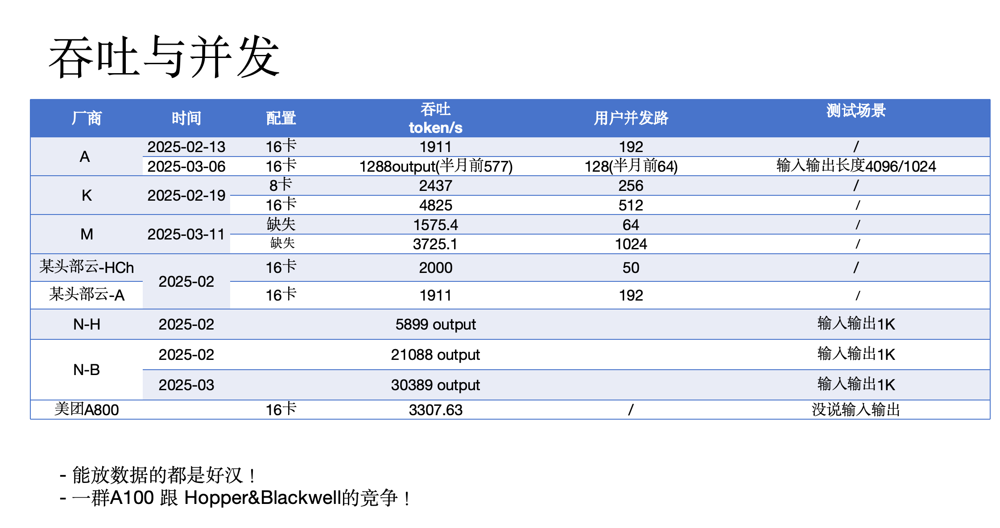
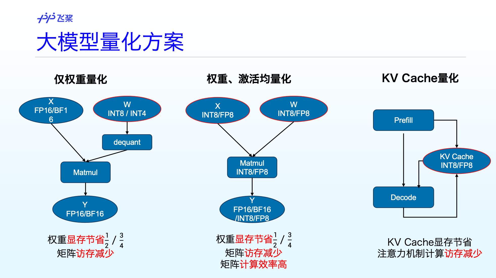
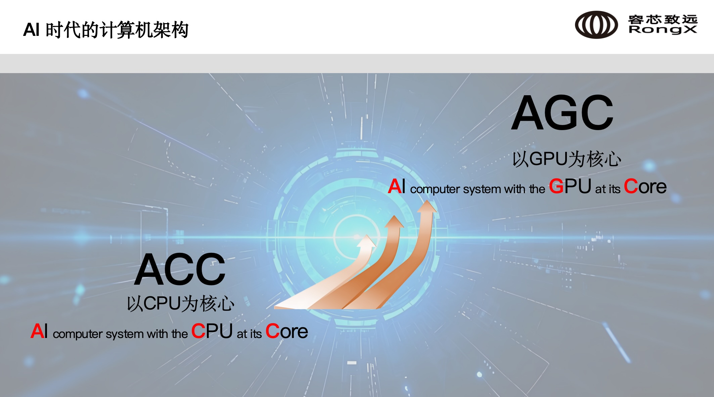
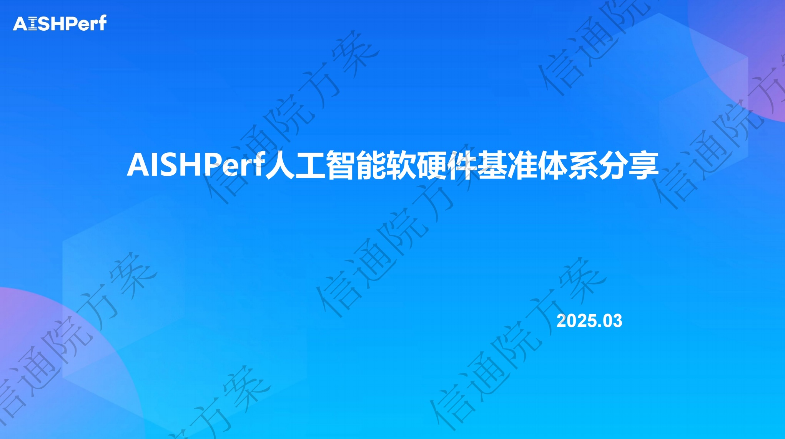

为繁荣新硬件生态，2025 年 3 月 20 日晚上，百度“新硬件用户共鸣会”第二期，在线上成功举办。

<!-- more -->

---

飞将高级产品经理王凯、资深研发工程师华强、中国信通院人工智能研究所软硬件与创新生态部工程师王雅晗、容芯致远 CTO 石旭，为观众带来新硬件评测、性能优化、服务器架构新思路等内容。专家们结合自身的专业锁厂进行分享，内容具备很强的启发性，引起了较为热烈的讨论。活动由王凯主持。

## 主题报告

### 1. 管中窥豹 - 从 DeepSeek 一体机海报探究芯片评测

王凯（百度飞桨高级产品经理 [@onecatcn]（https://github.com/onecatcn）从近期火热的 DeepSeek 一体机宣传海报出发，通过海报的解析，归纳出芯片厂商宣传的 3 个看点，包括吞吐与性能、机器配置和时间。然后逐个维度分析各厂商的宣传口径与对应的技术含义，也对其中一些有趣的现象进行进一步探讨。

### 2. 飞桨与芯片推理部署中性能优化的技术点，以大模型优化为例

华强（百度资深研发工程师 @vivienfanghuagood）基于第一个分享中提到的技术关注点，如吞吐、显存，逐一分享飞桨在这些技术点上性能优化的经验，报告是近期飞桨在大模型推理开源建设方面的总结。

### 3. AISHPerf 人工智能软硬件基准体系分享

中国信通院人工智能研究所软硬件与创新生态部工程师王雅晗，介绍了 AISHPerf 的工作背景、目标定位、测试体系架构，然后分享了近期的工作成果，包括标准制定、生态培育、适配认证以及与飞桨共同建设的异构算力适配认证流水线，最后介绍了参与方式，欢迎观众参与 AISHPerf 的共建。

### 4. 新型计算产品架构中的国产芯片适配技术与特点

容芯致远 CTO 石旭，介绍了一种新的计算机架构，以 GPU 为核心（AGC，AI computer system with the GPU at its Core）。基于这种架构，能过实现 8U20 卡、4U10 卡的单机配置。这一全新的理念引起了包括主持人在内的质疑，观众追问是 PPT 阶段还是有真的产品，石旭很有信心地表达 4 月会召开产品发布会。所以，到底是 PPT，还是跨时代的创新，我们拭目以待！

Footer
© 2025 GitHub, Inc.
Footer navigation
Terms
Privacy
Security
Status
Docs
Contact
Manage cookies
Do not share my personal information
