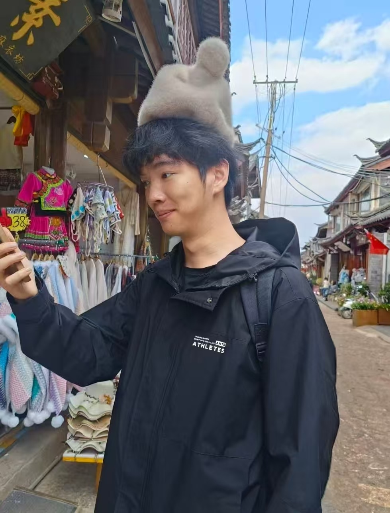

这是一篇关于聂师傅的采访，记录了他从参与飞桨开源社区到加入飞桨团队实习的成长故事。他从 `GitHub` 闲逛时偶然发现飞桨活动开始，一路参与了启航计划、黑客松等项目，最终加入飞桨推理组进行实习，一路上体验了很多不一样的风景。

<!-- more -->

<!-- 导入聊天框 -->

<!-- 导入聊天框功能 -->

## 一、前言

聂师傅，GitHub ID 是 [Echo-Nie](https://github.com/Echo-Nie)，最开始启航计划，后面又持续参与了一些黑客松的开源项目，并担任了多期的助教。之后他加入了飞桨团队，并在推理组完成了近四五个月的实习。如今他已保研至北京大学，即将开启研究生阶段的学习。

**一些生活照 🐶**

   <!-- 🐱 -->
   

      <figure style="width: 47.5%">
         
         <figcaption>帅照1</figcaption>
      </figure>
      <figure style="width: 48.1%">
         
         <figcaption>帅照2</figcaption>
      </figure>
   

## 二、采访内容

1. **先简单自我介绍一下吧**

<MessageBox>
<Message name="Echo-Nie" github="Echo-Nie">
大家好，我是聂宇旋，GitHub ID 是 Echo-Nie，现在是一名大四本科生。2024 年 7 月，我通过 C4‑AI 大赛与飞桨结缘，随后参与启航计划，后面又持续参与了一些黑客松的开源项目。之后我加入了飞桨团队，并在推理组完成了近四五个月的实习。
</Message>
</MessageBox>

2. **你当时是什么渠道接触到飞桨的？**

<MessageBox>
<Message name="Echo-Nie" github="Echo-Nie">
很随意……我当时就是逛 `GitHub`，点着点着就点到了飞桨的活动了。然后我就去微信上搜了一下相关的关键词，找到了飞桨的启航计划，就这样接触到了。

因为我经常会看 `GitHub` 的新鲜东西，然后当时的 `issue` 可能比较新，我就关注到了，具体的过程有些忘记了，我都会先去微信、小红书这类信息比较集中的渠道，查找活动介绍和报名方式，再进一步深入了解。
</Message>
</MessageBox>

3. **学校里是否有成立专门的开源社团？**

<MessageBox>
<Message name="Echo-Nie" github="Echo-Nie">
我们学校好像也没啥开源社团。其实在学校搞一个社团非常麻烦，有很多繁琐的审批流程，很耗费人的心气。而且以我的了解，我们学校玩开源的人非常少，我自己算是做开源做的相对来说比较多的，大部分同学更多是把 `GitHub` 当作一个工具——用来提交作业、管理代码，很少有人主动去参与开源社区、贡献项目。

我觉得这里面最大的问题就是“信息差”。很多人第一步就卡住了：他们知道“开源”这个词，但不知道从哪里开始，有的人甚至不知道去哪里看文档、去哪里找任务、怎么反馈、怎么跟进，这些东西没人带的话会很劝退。即使知道了如何开始，在真正参与贡献时也会遇到很多困难。
</Message>
</MessageBox>

4. **你作为启航计划好几期的助教，接触过很多新人。从你的角度看，你觉得大家刚开始做开源，最容易卡在哪？**

<MessageBox>
<Message name="Echo-Nie" github="Echo-Nie">
我觉得新人做开源，最核心的卡点还是在起步阶段。

第一个坎是项目与方向选择：因为开源领域非常广，有数据库、框架、工具链等多个方向，每个方向的差异也很大，新人很难判断"我该做什么、我适合做什么"，光是筛选方向就会劝退很多人。

第二个坎是：贡献流程不熟悉。即便确定了方向，在实际提交 PR、跑 CI 检查、遵守社区规范等环节，也会遇到大量细节门槛。尤其是第一次参与开源的同学，面对整套协作流程，很容易因为不熟悉规范和工具链而产生畏难情绪，比如说你 `review` 之后可能过了一周也不修改的，很常见。
</Message>
</MessageBox>

5. **你自己第一次贡献的时候，有没有遇到被卡住的情况？**

<MessageBox>
<Message name="Echo-Nie" github="Echo-Nie">
有，对我来说，当时最大的难点是 Paddle 的本地编译。比如在"启航计划"里有一个编译打卡任务，那应该是所有任务里提问最多的一个。很多新人都会卡在编译这一步。虽然在 AIStudio 提供的二次开发环境里编译相对顺畅一些，但很多人还是会选择在自己的本地电脑上练习，这时候就会有各种问题。
我一开始也是本地编译、跑环境，边弄边出问题，就一直在解决编译和环境相关的问题。那种问题可能要反复试很多次，现在回想起来，可能有八九成的时间都花在排查环境和编译问题上，而不是真正写代码。

后面我也会用最蠢的方法：把事情拆开。比如先在一个更稳定的环境里（像 AIStudio）验证代码逻辑是否正确，确保改动本身是没问题的；确认没问题之后，再把代码 copy 回本地环境去整理、提交 PR。这样至少可以把"代码问题"和"环境问题"分离开，不至于混在一起折磨人。
</Message>
</MessageBox>

6. **你在参与飞桨开源项目之前，有参与过其他的企业开源项目吗？**

<MessageBox>
<Message name="Echo-Nie" github="Echo-Nie">
零零碎碎的参与过一些腾讯、华为等企业的项目，但因为在校生的时间还是比较有限，所以就是哪一天突然就看到了某个消息，觉得感兴趣的话才会进去尝试参加了一下。
</Message>
</MessageBox>

7. **你在接触"企业开源项目"之前和之后，有感受到什么差别吗？**

<MessageBox>
<Message name="Echo-Nie" github="Echo-Nie">
差别挺大的。最大的变化是心态和思维方式。以前从"纯用户视角"会默认："大家都在用的开源的库肯定是最权威的、最完备的"，"如果报错了，那一定是我自己的代码有问题"。但真正参与进去之后，你会发现：库本身也可能有 `bug`，你可能刚好踩到雷。就算是像 `PyTorch` 这样很成熟的框架，也不代表完全没有问题，有时候只是之前没人遇到，或者遇到了但没提出来。

现在的心态就很不一样了。遇到问题时，会先判断到底是自己用错了，还是库本身有问题；如果确认是库的问题，就会去看源码、定位原因，必要时自己修改代码、重新编译安装，甚至先在本地打 `patch` 保证项目能跑通。而不是"无脑怀疑自己"，慢慢具备一定的分析问题来源的能力。
</Message>
</MessageBox>

8. **也就是说，你不再把第三方库当成"不可质疑的权威"？**

<MessageBox>
<Message name="Echo-Nie" github="Echo-Nie">
对。至少你会开始考虑"是不是库的问题"，而不是无条件先自责。而且当你真的去改过源码、修过 `bug`，你的视角会变得更工程化，遇到问题不是"猜"，而是去定位、去验证、再决定怎么修。
</Message>
</MessageBox>

9. **你后来加入了飞桨团队，在推理方向实习过，你感受到最大的变化是什么？**

<MessageBox>
<Message name="Echo-Nie" github="Echo-Nie">
变化非常明显。

首先从时间上和责任上来说：实习是在真实项目中承担具体任务，这件事就是你的责任，需要按计划推进并对结果负责；而开源相对来说比较自由，可以按照自己的兴趣安排节奏，参与深度也由自己决定。因为开源项目往往由社区协作推进，所以节奏和约束可能会和企业内部不太一样。

另外更重要的是从"学生思维"向"工程思维"的转变。学生阶段通常可量化的目标和评价标准，比如分数、绩点、排名这些非常直观的指标——90 分是优秀，60 分是及格，`bug` 大部分是前人踩过的，网上搜一搜大部分问题都能解决。而在企业开发中，很多问题并不存在唯一正确答案，需要你自己去分析、提出方案，再和 `mentor`、同事一起讨论并落地。有时甚至需要主动表达不同看法，通过沟通不断校准方向，最后给出一个可行的并且相对来说比较好的方案即可，这对独立思考能力和沟通能力都是很大的锻炼。对我来说，沟通能力的变化尤其明显。因为我在学校里和小组同学交流一直比较顺畅，我以为我是一个沟通能力很强的人，但刚进入团队时，因为我的表达方式更偏向"学生式"，有时同事或 `mentor` 会反馈不太容易理解我的重点。后来我也在不断反思，比如学会更结构化地表达问题、提前整理思路、明确结论和背景。后来沟通效率提高了，也从一开始的被动接受任务，转变为能够主动提出问题和不同意见。这种变化对我的成长意义非常大。

同时，也让我逐渐意识到团队协作的本质更像是共同探索，而不是单向指导。尤其是在 `Infra` 这类基础设施方向，很多工作具有探索性，大家往往一起查资料、修 `bug`、验证假设。刚开始我会有一种"权威滤镜"，类似于之前我提到的对第三方库那种权威的崇拜——觉得 `mentor` 经验这么丰富，应该不会错，不太敢提出不同意见会下意识把资深同事当成"标准答案"的提供者，但后来发现，在这种探索性工作中，其实每个人都可能判断不完全准确，需要通过讨论和实践不断修正。这让我对工程团队的运作方式有了更真实、更立体的认识，也让我意识到，在团队里敢于表达自己的想法很重要。哪怕说得不完全对，也可以通过和 `mentor` 讨论来不断修正；反而如果一直不说，很多问题可能就会被忽略，之后可能会踩大坑！

最后是对工作的认知更加务实。以前对大模型和基础建设的想象会比较"宏大"，但真正参与之后发现，很多价值都来自于扎实的工程细节，比如定位问题、修复 `bug`、优化性能、提升稳定性，而且可能你好几天的工作都是在修 `bug`。虽然这些工作看起来很朴素，甚至可能连续几天都在处理同一类问题，但它们直接关系到系统质量和用户体验，也让我更理解基础设施工作的长期价值所在。
</Message>
</MessageBox>

10. **那你有想过换方向吗？比如更偏算法层面，做模型本身更核心的工作？**

<MessageBox>
<Message name="Echo-Nie" github="Echo-Nie">
想过一点点。因为我对模型本身可能也很感兴趣，不过相比做实验调参等，我可能更想深入理解模型内部的结构设计，比如各个模块为什么这样设计、带来了哪些收益和代价，以及它们在系统层面是如何被高效实现的。这也是我当初选择做 `Infra` 的原因之一——希望能从更底层的角度理解模型，而不仅仅停留在实验结果层面。

未来几年我大概率还是会沿着 `Infra` 这条路线发展，同时也会根据机会和个人成长情况，保持对其他方向的开放性。一方面 `AI` 发展非常快，模型迭代也很密集，比如业界一直在关注的 `DeepSeek` 新模型，以及像 `Qwen` 等系列模型都在持续更新。如果不持续学习，很容易跟不上技术节奏。同时我也觉得自己的基础还需要继续补，比如数学、系统这些底层能力，所以现在更像是在一边做事一边补课、拓展视野。至于未来更偏系统、模型还是啥，我其实也没有特别给自己定死，关键还是保持持续学习和紧跟前沿的能力，这样不管走哪条路都不会太偏。
</Message>
</MessageBox>

11. **未来还会想在百度工作吗？**

<MessageBox>
<Message name="Echo-Nie" github="Echo-Nie">
可能性会小一点吧，不过真的不是因为 Paddle 或具体团队的问题。我在百度的这段经历其实挺好的，团队氛围很舒服，也不是那种实习生只干杂活的情况。做的事情、合作的同事，还有几位 `mentor`，都给了我很多正向反馈。而且平时还能经常和 O 师傅聊天摸鱼🐟，整体体验是很 nice 的，所以从团队和工作内容本身来说，我是挺认可、也挺感谢这段经历的。

但如果说未来是否还会回百度工作，可能更多还是现实因素吧，比如薪资、发展机会这些。实习阶段不同公司的条件差异确实挺明显的，我和身边朋友也经常会互相交流，比如某节、某鹅之类的公司整体竞争力还是会更强一些，尤其待遇方面。对学生来说，这种差距有时候真的会直接影响选择。我有个朋友就是，刚入职某公司实习了几天，另一家给了接近翻倍的薪资，当天就换了（不过他的 `mentor` 非常好而且表示理解），我们也挺能理解并且可能有些羡慕。所以如果以后再做选择，我大概率会更看重综合条件，但如果各方面都合适，也不排除再回来的可能。
</Message>
</MessageBox>

12. **听说你保研到了北大，能分享一下这段经历吗？你是从什么时候开始考虑保研的？保研最关键的点是什么？**

<MessageBox>
<Message name="Echo-Nie" github="Echo-Nie">
我一开始其实完全没打算走保研这条路，原本想的是考研或者本科直接就业。后来大一下成绩出来，发现自己成绩还不错，有保研的可能性，就把考研这条路先放下了，变成"就业和保研两手准备"。但那个阶段也没有特别系统地去准备，只是下意识把重心放在把专业课成绩尽量拉高。真正开始认真准备，大概是大二下到大三上那段时间，一边卷绩点，一边打比赛、做项目、做科研，整体还是挺忙的。等到大三下学期，差不多四月份到九月份这几个月（我觉得四月可能晚了一些，可能提前到 2-3 月会更好？），我觉得是最关键的阶段。因为九月份要填系统，在那之前要提前选好学校，联系导师，了解各个学校的政策，还要把自己的材料、比赛经历、科研成果都整理好。

对我来说，保研很重要的一点是"信息"。一定要多和学长学姐、老师交流，了解真实情况，然后自己做判断。信息差真的很重要，搜集信息的过程对我来说不算难，但也会遇到一些坑。有的人会给你非常具体、实用的建议；但我就遇到过一个学长，我问他推荐什么学校、哪些老师比较合适这种关键问题，他一直在跟我讲"现在保研形势多么严峻""竞争多么激烈"，讲了很多劝退的信息，听完反而更焦虑，并且对我实际决策帮助不大；反观薛哥（另一位学长）更多的是给出了一些客观的建议和看法，至少能让我心里有底。

另外对我来说，真正难的是一个选择：读研还是直接就业。现在行业变化很快，很多人会担心，三年之后出来，可能还不如本科直接就业拿的 `offer` 好。我当时以自己的能力，加上老师的推荐，其实也能拿到一些不错的 `offer`。所以这个选择真的挺纠结。后来我拿到了一个还不错的学校作为保底，再加上考虑到学历带来的提升比较明显，我最后还是选择读研。我也不停地暗示自己，告诉自己"没关系的，三年之后还是能找到工作的😭"。

但说实话，这个决定也受到学校里的价值观的影响。在学校里，如果一个学长/学姐保研成功，学校和学院可能会宣传这位同学"很厉害"，并且来给学弟学妹们开讲座分享经验。但如果有人本科毕业拿了高薪 `offer`，其实不一定会有类似的关注度或宣传，更别说经验分享了。可能因为学校环境本身还是以学业为导向，再加上大多数人的路径都是"能去更好的学校就继续读"，很少有人在有保研资格的情况下选择直接就业。在这样的氛围下，其实很难完全不被影响。所以我后来也慢慢觉得，先去一个更好的平台深造一下，对当时的自己来说可能是更合适、也更稳妥的选择。
</Message>
</MessageBox>

13. **参与飞桨开源的这段经历，对你的保研有影响吗？**

<MessageBox>
<Message name="Echo-Nie" github="Echo-Nie">
说实话，影响不大。我当时的保研简历里，其实没有专门写开源经历。只是放了一个 GitHub 链接。简历里更多写的是科研、比赛这些内容。而且我感觉那个 GitHub 链接大概率也没人看，老师面试的时候也没怎么问到开源相关的内容，可能保研更注重学术方面的素养。开源其实对我来说更像是一种爱好。
</Message>
</MessageBox>

14. **未来有什么特别想做的事吗？不管是生活上还是工作上。**

<MessageBox>
<Message name="Echo-Nie" github="Echo-Nie">
有，我其实一直挺想去环球旅行的。这个想法多少也受了一些 UP 主的影响，比如影视飓风那种类型的。我甚至认真做过一点攻略，大概算过账，一年可能要 50 万左右。

我觉得这件事很酷。环球旅行不是简单的打卡，而是真的去不同国家生活一小段时间，看看他们的城市、文化特色、自然环境，感受那种多元的氛围。尤其是像我们这种以后就要长期坐在公司、已经丧失"活人感"的活人——生活变得很单一，很重复。所以我会很向往那种接触不同地域文化，接触世界各地那些有鲜活气息的人、感受不同氛围的状态。那种感觉会让我觉得，自己是在真实地生活，而不只是一直在工作。所以可能等以后钱攒得差不多了，我会开始认真去尝试这件事。
</Message>
</MessageBox>

15. **最后一个固定问题：如果给第一次参与飞桨开源的新人提建议，你会说什么？**

<MessageBox>
<Message name="Echo-Nie" github="Echo-Nie">
首先是坚持。不管说这个问题有多难，一定得坚持。尤其是像参与启航计划这种入门级的开源活动，有的同学并不是无法完成任务，而是会忘记写周报、忘记打卡，节奏一乱，就慢慢退出了，也就失去了很多开源的可能性。

第二是，大胆提问。新人特别容易有一种心理——"是不是我太菜了"、"这个问题是不是太低级了"。然后就憋着不问。但你换个角度想，你遇到的问题，很可能真的是一个 `bug`，或者是文档不清晰。不要默认所有问题都是自己的错。你要敢问、敢定位问题，甚至敢去质疑。就算对方比你经验多，也不代表他不会出错。把问题解决掉，比自己闷着内耗重要得多。而且开源本身就是 open 的，大家本来就是在公开协作。提问不是丢脸，是参与的一部分。
</Message>
</MessageBox>

---

## 写在最后 💡

**【开源江湖闲聊录】** 是一项专门为 Paddle 社区的开发者打造的特色访谈栏目 📚。在这里，我们邀请到每一位别具一格且富有热情的开发者，通过文字或语音的方式进行深入采访 🎙️，探索并展现他们背后独一无二的故事，将他们的经历、见解和创意整理成精彩内容，呈现给整个社区。

---
