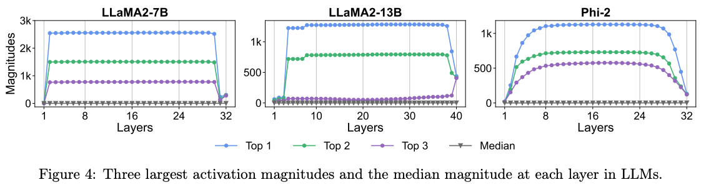
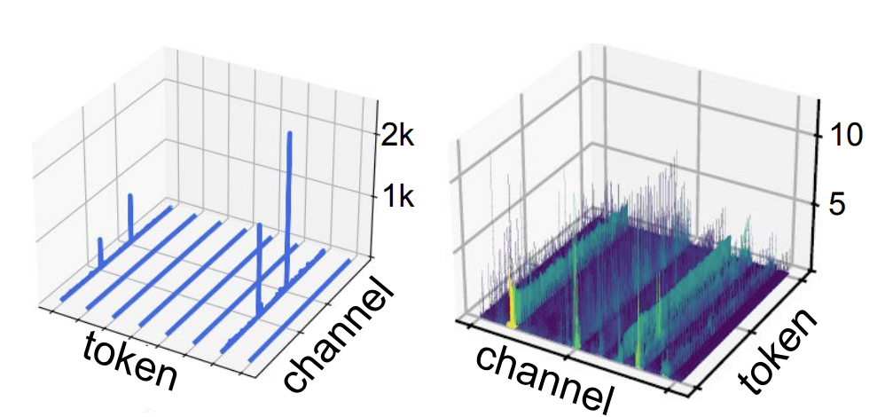
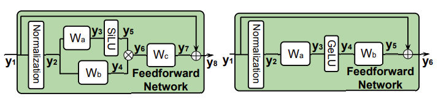
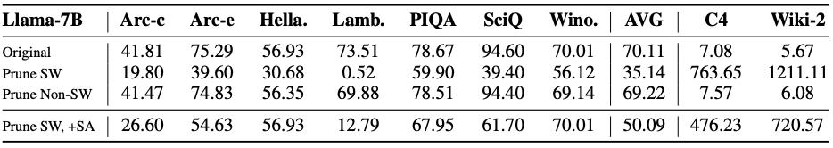
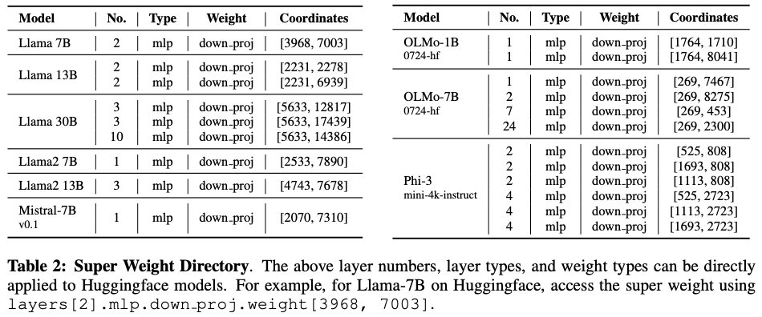
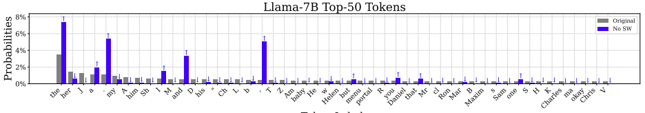

## 1. 研究背景

研究大型语言模型中的离群值至关重要，因为它们对模型的多个性能方面都有显著影响，包括量化和压缩。离群值往往会引发较大的量化误差，从而导致模型性能下降。识别并应对这些离群值，可以提高量化过程的准确性与效率，从而促进模型在边缘设备或专用硬件上的顺利部署。然而，在将 LLM 进行低比特量化时，模型内部存在的离群值成为性能下降的关键障碍之一。所谓离群值，指的是模型参数或中间激活中出现的极端大或小的数值（如下图），它们往往具有非均匀分布特性，导致常规线性量化策略无法覆盖所有数值范围，造成严重的信息丢失和量化误差。这些误差会直接破坏模型的数值稳定性，最终显著影响推理精度，特别是在对精度要求较高的任务中表现尤为明显。因此研究离群值问题以及如何降低离群值特性成为了一个非常有科研价值的方向。

## 2. 激活值中的离群值

### 2.1 巨幅激活值（Massive Activations）

巨幅激活，是前向过程中稳定出现的远超平均水平线的激活值分布，现有的研究基本都对已经训练完成的模型进行了基于性能级的探索。
例如 [1] 在 100 个 4096token 的样本推理时统计了每层输出的前三个大的激活值以及对应最大值的位置分布，这些值普遍稳定且贯穿在激活值中，

这个现象说明了以下几个行为：

（1） 巨大激活值在早期出现并通过 skip connection 一直传播（ [2] 也说明了这一现象 ）

（2） 参与 attn 和 ffn 的计算并没有完全线性加剧激活值，换句话说，中间层的输出其实是相对平滑的

[1] 的观测猜想与解决思路:

在 massive activations 出现之后，attention logits 普遍趋于负值；

这些 logits 通常由 query 与不含 massive activations 的 key token 的内积计算而得；

而当 key token 属于 massive activations 时，对应 logits 会稍微呈正值。

激活值扮演着对某个 token 对 bias 偏置，或者换句话说，网络需要这个激活值来构造对一些特殊 token 对预测能力，它的作用是强化其他 token 对它的关注度（默认 massive value 是当前结构与训练模式下网络的自然选择，其作用是提供偏置，那么就人工构造一个提供偏置且不需要使用 massive value 的结构供网络使用），既然作用类似于偏置，那就可以人工构造一个偏置项参与训练：

$$
\text{Attention}(Q,K,V;k',v')=\text{softmax}\left(\frac{Q[K^\top k']}{\sqrt{d}}\right)\left[V^\top v'\right]^\top.
$$

对于原始的 attention 公式在最后加一个可学习的维度来捕捉 bias，这可以缓解 Attention 中的 massive activation 问题。

[1] 可以拓展的方向:
这个实验有趣的点在于，它最终成功将 softmax 输出的更大的关注度转移到 v'向量上，换句话说，k'在训练过程中，会主动保持与需要被关注的 token 的同向性，它的结果是其他 token 在互相关注时，不再需要保持概率为 1，而是小于等于 1，它提供了更多的 token 的聚合能力。

### 2.2 通道离群值（Channel-wise Outlier）

[2] 进一步探索了通道离群性，是前向过程中稳定出现的特定 channel（维度）出现的离群性，一般表示为每个 token 中某些固定维度经常性出现较大的值，如下图（右）所示：

通道离群通常出现在归一化层后，并且隐形伴随在整个网络的激活值分布中。目前对这一分布形成的原因，大致认为是归一化过程中的超参数引起的相变。例如，对于层归一化（RMSNorm 同理），

$$
\text{LayerNorm}(x)=\gamma\cdot \frac{x-\mu}{\sigma} + \beta
$$

其中$\gamma,\beta\in\mathbb{R}^d$ 属于 token embedding 维度的归一化，对于$\gamma,\beta$的某些维度出现了很大的值，从而引起归一化过程中某个维度的绝对值一直很大，从而造成了普遍的通道离群性。

除此之外，[2] 给出了一个新的探索结论，即 Massive Activation 首次出现在第一层 FFN 的激活层后（LLaMA/Qwen 的 y6 以及 GPT 的 y4）

所以 $y_4\odot y_5$ 中出现了巨幅激活，即 $W_a$或 $W_b$ 中出现了超级权重。

根据这个结论，一系列新的实验围绕着如何平滑巨幅激活值进行探索，主要都是行为性测试，总结如下：

（1）输出位置的巨幅激活值是不能平滑的。

（2）skip connection 传下来的巨幅激活值时可以平滑的。

[2] 的观测猜想与解决思路:
对归一化层训练的$\gamma$中对应通道的离群值直接赋值为 1 或均值，标准化过程并不产生离群性，核心是$\gamma$的离群性引起的通道巨值。

[2] 的可以拓展的方向：
$\gamma$的本质是可学习的参数，因此可以直接对归一化的参数进行额外的正则监督（l1 正则或者其他度量形式）

## 3. 权重中的离群值

许多研究都证实了权重离群值的重要性，显示出只需保留少量幅值最大的离群值，就对模型质量至关重要。这一比例可以低至 0.01%，但对于拥有数十亿参数的大模型来说，0.01% 也意味着仍包含几十万个权重。[3] 进一步探索了这个超级权重对模型质量至关重要，一旦将其移除，其对模型的影响远远超出其他权重。没有该超级权重，LLM 将无法生成有效文本，产生的响应在定性上。

上图是一组简单的测试，在参与统计的 7000 个最大值中，删除关键离群值后网络性能将发生崩溃(SW)，而保留关键值，删除 7000 个中其他值影响微弱(Non-SW)，即使手动恢复激活值中的离群值也仅能部分恢复网络的原始性能(SW+SA)。

[3] 还探索了一个有趣的现象，巨幅激活值与超级权重在相同的位置出现，而且首次出现在超级权重所在层对应的输出层。

超级权重的作用：

（1）诱发巨幅激活值出现并随着网络持续传递

（2）抑制停止词的生成概率（超级权重移除后"the" "and" "."的生成概率将显著性提高）

适当增大超级权重可以提高结果：

## 4. 总结

前向计算中的离群值分布是广泛存在的，目前的观测在计算网络中的激活离群值来源主要归类为 attention 中的概率分配引起的和归一化过程中的 scale 系数引起的。attention 中构造特殊的单元来存储偏置是有一种有效措施，它的本质上将巨幅激活值从单位数值转向向量点乘的存储结构，避免在某个单元中保留极高的能量。

归一化的问题需要被归类为参数中的问题，因为归一化函数可能不是产生巨幅激活值的根本原因，而是由于训练过程中，这个通道持续性的巨幅激活值导致$\gamma$追踪到这些巨值上去，不应该被直接归类为强因果关系。

超级权重的生成路径将是核心研究。尽管权重是网络自己训练的结果，但是这种规律性极强的离群单元肯定是训练机制引起的，本质上是目前的结构中无法满足网络对于最后任务的输出所需的最低要求。后期的工作核心将围绕对参数进行规范以及补充结构化功能来避免超级权重的生成。

## 引用

[1] Massive activations in large language models (https://arxiv.org/pdf/2402.17762)

[2] Rethinking the Outlier Distribution in Large Language Models: An In-depth Study (https://arxiv.org/pdf/2505.21670)

[3] The super weight in large language models (https://arxiv.org/pdf/2411.07191)

其他相关文献：

[4] Smoothquant: Accurate and efficient post-training quantization for large language models (https://proceedings.mlr.press/v202/xiao23c/xiao23c.pdf)

[5] Quarot: Outlier-free 4-bit inference in rotated llms (https://proceedings.neurips.cc/paper_files/paper/2024/file/b5b939436789f76f08b9d0da5e81af7c-Paper-Conference.pdf)

[6] Olive: Accelerating large language models via hardware-friendly outlier-victim pair quantization (https://dl.acm.org/doi/pdf/10.1145/3579371.3589038?casa_token=bmVl5f7n-HYAAAAA:TreW-oYGgy9Vn0taqk7dGLn3ZhQ_kapr_gH0yOPe-skM3utlzLFN-YSsIwdwKIgnKf9PEnXigqoc-hU)

[7] Sparsegpt: Massive language models can be accurately pruned in one-shot (https://proceedings.mlr.press/v202/frantar23a/frantar23a.pdf)

[8] Gpt3. int8 (): 8-bit matrix multiplication for transformers at scale (https://proceedings.neurips.cc/paper_files/paper/2022/file/c3ba4962c05c49636d4c6206a97e9c8a-Paper-Conference.pdf)

[9] Deepseek-v3 technical report (https://arxiv.org/pdf/2412.19437)
