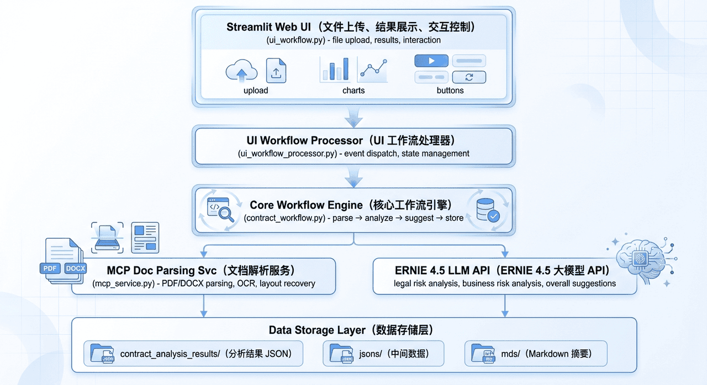

还在为了一份几十页的合同，熬夜逐条对照、担心漏掉关键条款吗？
在大模型时代，这件事不该再靠人力硬扛。

<!-- more -->

**PactGuard-ERNIE-PP** 是我在实践中打造的一套「**智能合同审查与风险分析系统**」。它并不是一个简单的“问问大模型就完了”的 Demo，而是一个真正能落地、能跑在生产环境里的**工程级解决方案**：

- 能看 PDF、扫描件、图片等各种格式的合同；
- 能从杂乱的 OCR 结果里“拼回原始版面”，把风险条款精准高亮出来；
- 能在 LLM 返回“半残 JSON”的情况下自动修复，保证整条链路稳定运行。

如果你：

- 正在做 **垂直领域 LLM 应用**；
- 想搭一个 **可复用的合同 / 文档审查框架**；
- 或者只是好奇「一个工程化的 LLM 应用到底长什么样」

这篇文章会把 PactGuard-ERNIE-PP 背后的架构、关键模块和踩坑经验，尽量讲清楚。

---

## 项目简介：它到底能帮你做什么？

一句话概括：

> **PactGuard-ERNIE-PP 是一套基于 ERNIE 4.5 的智能合同审查系统，用自动化方式帮助识别法律 / 商业风险，并给出可执行的修改建议。**

它的核心能力包括：

- 🧾 **多格式合同输入**：支持 PDF、扫描件、图片等，自动走 OCR 流程；
- 🧠 **LLM 深度分析**：基于 ERNIE 4.5，对合同进行语义理解、风险识别和条款级分析；
- 📊 **结构化风险报告**：输出 JSON / Markdown 风险报告，支持统计信息和签约建议；
- 💡 **可视化展示**：在原始合同上直接高亮“有问题的条款”，风险一目了然。

项目资源：

- 🐙 GitHub 代码仓库：[点击访问](https://github.com/tjujingzong/PactGuard-ERNIE-PP)
- 🚀 星河社区在线应用：[立即体验](https://aistudio.baidu.com/application/detail/104781)
- 📓 星河社区 Notebook：[在线运行](https://aistudio.baidu.com/project/edit/9779934)


---

## 技术架构：一个可复用的 LLM 合同审查骨架

### 整体架构图



从工程视角看，PactGuard-ERNIE-PP 本质上是一套「**分层 + 解耦 + 可替换**」的 LLM 应用架构。

### 架构特点

1. **分层设计**
   - UI 层、业务逻辑层、服务层、数据层清晰拆分，方便独立演进。
   - 想换 UI 或换模型，只动对应层即可。

2. **服务解耦**
   - MCP 服务独立运行，通过 HTTP 接口通信。
   - OCR、LLM 等都可以视为“可拔插服务”。

3. **可扩展性**
   - LLM 和 OCR 服务都通过配置切换：
      - 你可以在 ERNIE、其他大模型之间切换；
      - 也可以替换 OCR 引擎，而不动上层逻辑。

4. **容错机制**
   - 支持缓存、重试、降级：出问题时尽量“自动兜底”，而不是让用户直面报错。

---

## 合同处理主流程：从上传到结果落盘

在整个系统里，**工作流引擎 `contract_workflow.py` 是真正的“中枢神经”**。
可以把它理解为一条从「原始合同」到「结构化风险报告」的流水线：


```python
class ContractWorkflow:
    def run(self, contract_path: str) -> Dict[str, Any]:
        # 1. 文档解析：调用 MCP / OCR 等服务，拿到结构化文本
        parsed_document = self._parse_document(contract_path)

        # 2. 风险分析：法律风险 + 商业风险 + 统计信息
        risks = self._analyze_risks(parsed_document)

        # 3. 建议生成：综合所有风险点输出签约建议与修改意见
        suggestions = self._generate_suggestions(risks)

        # 4. 结果整合：计算文件哈希、补充元数据并写入 JSON / Markdown
        final_result = self._integrate_results(parsed_document, risks, suggestions)
        return final_result
```

在 UI 侧：

- `ui_workflow.py` 接收用户上传的合同和配置；
- 调用 `ui_workflow_processor.py` 中的 `process_contract_workflow()`；
- 再把 `ContractWorkflow` 的执行结果同步到 Streamlit 会话状态，用于前端展示与下载。

**一句话：工作流引擎负责「怎么跑」，UI 负责「怎么让用户看到」。**

---

## 模块职责清单：每个文件只做一件事

为了避免“标题太碎”，这里直接整理成一个 **模块职责表**，方便你从工程角度快速扫描：

- **文档解析模块（`mcp_service.py`）**
  统一入口 `parse_contract()`：
   - 识别文件类型（PDF/DOCX/图片等）；
   - 调用本地解析或在线 OCR；
   - 将各种格式的合同 **统一转换为结构化 JSON**。

- **OCR 工具模块（`ui_ocr_utils.py`）**
   - 封装 PP-StructureV3 在线 OCR 调用，实现 **版面恢复**（段落、表格、坐标等）；
   - 提供 `find_text_positions_in_json()` 等工具函数，为后续风险高亮提供坐标数据。

- **工作流引擎（`contract_workflow.py`）**
   - 实现主流程 `run()` 及 `_parse_document()`、`_analyze_risks()`、`_generate_suggestions()`、`_integrate_results()` 等内部步骤；
   - 负责调用 LLM、解析模型 JSON、组织最终输出文件，是整个系统的核心业务层。

- **UI 展示模块（`ui_workflow.py`）**
   - 基于 Streamlit 搭建交互界面；
   - 支持文件上传、参数配置（模型选择、API Key 等）、进度展示；
   - 负责“结果页面”的整体布局（原文高亮 + 风险卡片 + 统计信息）。

- **渲染模块（`ui_rendering.py`）**
   - 把 JSON 结果转换成可交互 HTML；
   - 在原文中高亮风险条款，实现左右分栏预览、按风险等级过滤展示；
   - 是“**让分析结果变成用户体验**”的关键一环。

- **工具模块（`ui_utils.py`）**
   - 提供缓存、文件管理、会话状态初始化等通用工具；
   - 比如基于文件哈希的缓存键、历史结果加载等，大幅减少重复分析时的等待时间。

- **工作流处理器（`ui_workflow_processor.py`）**
   - 作为 UI 与工作流引擎之间的“胶水层”；
   - 负责协调异步执行、进度更新、错误捕获和用户提示；
   - 让前端用户感受到的是“平滑的一步步执行过程”，而不是冷冰冰的后台任务。

---

## 开发过程中的技术亮点与踩坑复盘

下面这几块，是我在开发过程中印象最深、也最值得复用到其他 LLM 项目里的经验。

### 1. 版面恢复：从 OCR 的“碎片堆”到可交互的合同页面

现实中的合同很多都是扫描件：

- 有的被压成图片嵌在 PDF 里；
- 有的还带着各种水印、盖章、表格。

要想在原文上高亮风险条款，首先要解决一个问题：

> **如何从 OCR 返回的一大坨嵌套 JSON 里，恢复出接近原始 PDF 的版面布局？**

核心逻辑在 `ui_rendering.py` 的 `generate_html_layout()` 中：

```python
def generate_html_layout(json_result: Dict[str, Any], issues: List[Dict]) -> str:
    """基于 JSON 生成 HTML 版面恢复，并标注风险点"""
    # 1. 解析 OCR / PP-StructureV3 返回的版面结果
    layout_result = json_result.get("layoutParsingResults", [{}])[0].get(
        "prunedResult", {}
    )

    # 2. 提取文本元素：行文本 + 坐标 + 所属页码等
    text_elements = _extract_ocr_text_elements(layout_result)
    # text_elements 结构示例：
    # [
    #   {"page_id": 0, "text": "合同编号：...", "bbox": [x1, y1, x2, y2], "block_id": 1},
    #   ...
    # ]

    # 3. 将风险点根据文本内容或 block_id 映射到对应的文本元素
    issue_map = _build_issue_map_by_block_id(issues)

    # 4. 逐个元素生成绝对定位的 <div>，并根据风险等级上色
    html_blocks = []
    for elem in text_elements:
        block_id = elem.get("block_id")
        related_issues = issue_map.get(block_id, [])
        risk_level = _get_max_risk_level(related_issues)

        style = _build_style_from_bbox(elem["bbox"], risk_level)
        content = _escape_html(elem["text"])

        html_blocks.append(
            f'<div class="ocr-text ocr-risk-{risk_level}" style="{style}">'
            f"{content}"
            "</div>"
        )

    # 5. 包装成完整 HTML 页面（包含背景、样式和脚本）
    return _wrap_as_full_html_page("\n".join(html_blocks))
```

而为了在 OCR 的复杂 JSON 结构中准确找到「某个条款对应的坐标」，`ui_ocr_utils.py` 里实现了 `find_text_positions_in_json()`：

```python
def find_text_positions_in_json(
    clause_text: str, json_result: Dict[str, Any]
) -> List[Dict[str, Any]]:
    """通过文本匹配在 JSON 中查找条款的位置信息"""
    layout_results = json_result.get("layoutParsingResults", [])
    matches: List[Dict[str, Any]] = []

    for layout_idx, layout_item in enumerate(layout_results):
        pruned = layout_item.get("prunedResult", {})
        # 1. 从结构化结果中查找（parsing_res_list）
        for block in pruned.get("parsing_res_list", []):
            text = _normalize_text(block.get("text", ""))
            if _is_clause_match(clause_text, text):
                matches.append(
                    {
                        "layout_index": layout_idx,
                        "block_id": block.get("block_id"),
                        "bbox": block.get("block_bbox"),
                        "source": "parsing_res_list",
                    }
                )

        # 2. 从整体 OCR 结果中查找（overall_ocr_res）
        for ocr_block in pruned.get("overall_ocr_res", []):
            for line in ocr_block.get("res", []):
                text = _normalize_text(line.get("text", ""))
                if _is_clause_match(clause_text, text):
                    matches.append(
                        {
                            "layout_index": layout_idx,
                            "block_id": ocr_block.get("block_id"),
                            "bbox": line.get("rec_boxes"),
                            "source": "overall_ocr_res",
                        }
                    )

    return matches
```

**这里的关键经验有两点：**

1. **正确“读懂” OCR JSON 的层级结构**：
   - `layoutParsingResults` → `prunedResult` → `parsing_res_list` / `overall_ocr_res`；
   - 既要用结构化结果（更干净），又要用整体 OCR（更完整）。

2. **充分利用坐标信息（`block_bbox`、`rec_boxes`）**：
   - 不只是为了高亮，更是为了恢复“接近原始 PDF”的阅读体验。

这个版面恢复思路，只要稍作改造，就可以复用到 **电子发票审查、合同比对、标书评审** 等一系列场景。

---

### 2. JSON 修复：和“大模型半残 JSON”握手言和

真实场景里，大模型很少像教科书那样乖：

- 多一个逗号、少一个引号、少一层大括号……
- `json.loads()` 直接报错，整个工作流就废了。

为了解决这个问题，我在 `contract_workflow.py` 里给模型返回结果加了一层 **自动修复的“缓冲层”**：

````python
def _parse_model_json(self, content: str, context: str) -> Optional[Any]:
    """尝试解析模型返回的 JSON，失败时使用 json_repair 做容错"""
    if not content:
        return None

    # 1. 基础清洗：去掉 Markdown 代码块包装、无关前后缀
    cleaned = content.strip()
    cleaned = cleaned.replace("```json", "").replace("```", "").strip()

    # 2. 先尝试标准 JSON 解析（成功则直接返回）
    try:
        return json.loads(cleaned)
    except json.JSONDecodeError:
        logger.warning(f"{context} 返回的 JSON 非严格格式，尝试使用 json_repair 进行修复")

    # 3. 如果失败，再尝试使用 json_repair 自动修复
    if repair_json is None:
        logger.error("未检测到 json_repair 库，无法自动修复无效 JSON")
        return None

    try:
        repaired = repair_json(cleaned, ensure_ascii=False)
        return json.loads(repaired)
    except Exception as e:
        logger.error(f"使用 json_repair 解析 {context} 结果失败: {str(e)}; 原始内容片段: {cleaned[:200]}")
        return None
````

这样设计带来的好处：

- 正常情况下走 `json.loads()`，性能和安全性都好；
- 模型轻微“越界”时，通过 `json_repair` 自动纠偏；
- 即便修复失败，也能优雅地记录日志，而不是让整个流程直接崩掉。

**这套模式可以直接拿去复用：**
只要你的 LLM 返回 JSON，就很值得加一层这样的“自愈能力”。

---

### 3. 基于文件哈希的缓存：让同一份合同只分析一次

在真实使用中，一个合同往往不仅会被上传一次：

- 法务看一遍，商务再看一遍；
- 换个模型参数、换个风险偏好，还要再跑几次。

如果每次都从头走 OCR + LLM，不仅浪费算力，用户体验也会很差。
因此在 `ui_utils.py` 里，我加了一套 **基于文件哈希的缓存机制**：

```python
from pathlib import Path
from typing import Callable, Dict, Any

def calc_file_hash(file_path: str, chunk_size: int = 1024 * 1024) -> str:
    """对文件内容做哈希，保证同内容同哈希、不同内容必然不同"""
    import hashlib

    h = hashlib.sha256()
    with open(file_path, "rb") as f:
        while True:
            chunk = f.read(chunk_size)
            if not chunk:
                break
            h.update(chunk)
    return h.hexdigest()


def get_cache_key(file_path: str, model_name: str) -> str:
    file_hash = calc_file_hash(file_path)
    return f"{file_hash}_{model_name}"


def load_or_run_workflow(cache_key: str, runner: Callable[[], Dict[str, Any]]) -> Dict[str, Any]:
    """如果缓存存在则直接返回结果，否则执行工作流并写入缓存"""
    cached = load_from_cache(cache_key)
    if cached is not None:
        return cached

    result = runner()
    save_to_cache(cache_key, result)
    return result
```

这个设计有几个值得注意的小点：

1. **缓存键 = 文件内容哈希 + 模型配置**
   - 同一份合同在同一模型配置下，只分析一次；
   - 换了文件或模型配置，就不会误用旧缓存。

2. **天然幂等**
   - 文件内容不变，哈希一定不变；
   - 重复上传不会引入冗余计算。

3. **用户体验直观可感**
   - 第一次分析可能几分钟；
   - 第二次打开同一份合同时，结果可以直接秒级加载。

---

## 写在最后：这套系统还能怎么用？

如果你看到这里，不妨可以：

- **想要直接体验**：可以先去星河社区在线应用试用一份自己的合同；
- **想要二次开发 / 改造**：可以从 GitHub 仓库把代码拉下来，把 OCR、LLM 替换成你自己的技术栈；
- **想要在其他文档场景复用**：例如标书审查、合规检查、发票核验，都可以用同样的“工作流 + 版面恢复 + JSON 容错 + 缓存”思路。

非常感谢张晶老师在开发过程中给予我的系统性指导，帮助我从“能跑通”走向“能工程化落地”。

也感谢杨有志老师在星河社区部署阶段给的支持，让项目顺利上线并可被更多人使用。

很幸运能够参加启航计划第 6 期，这次实践也让我对“如何把 LLM 变成真正可落地的系统”有了更深的理解。
也期待未来能继续为 Paddle 社区贡献自己的力量。
