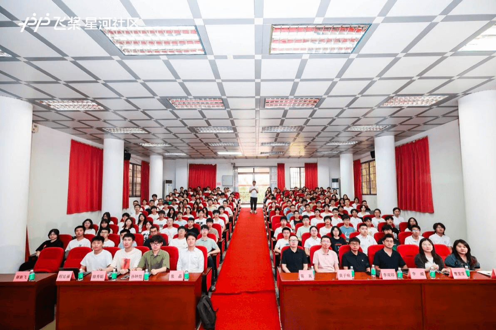
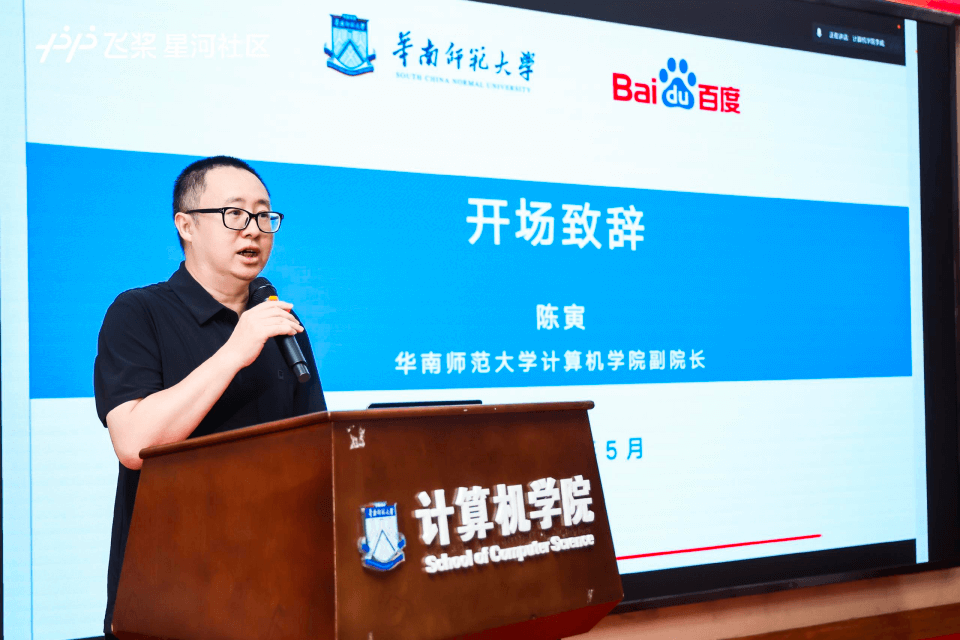
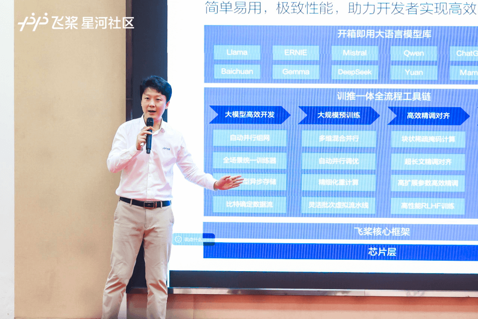
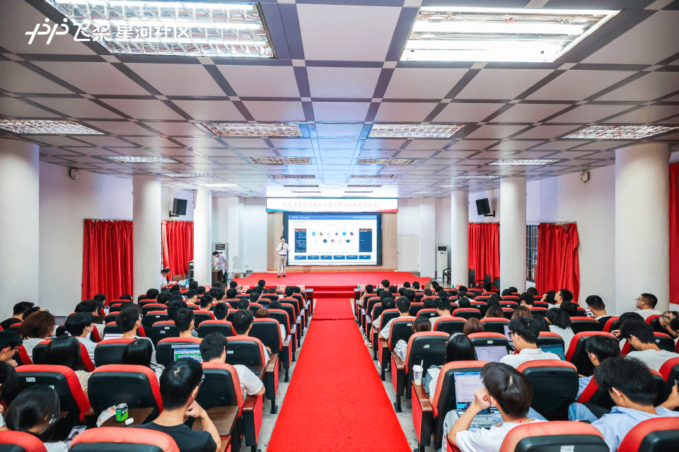
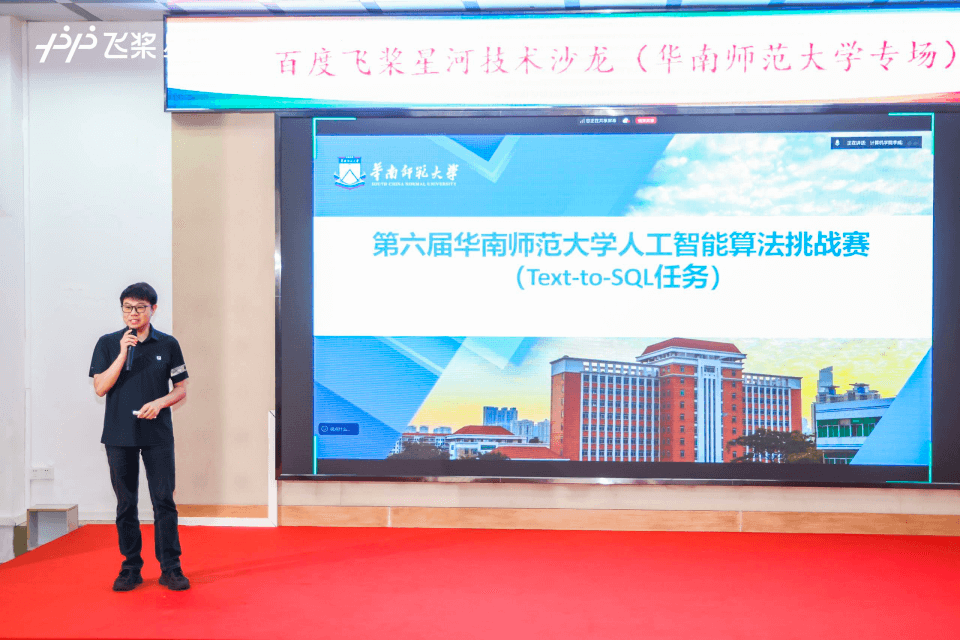
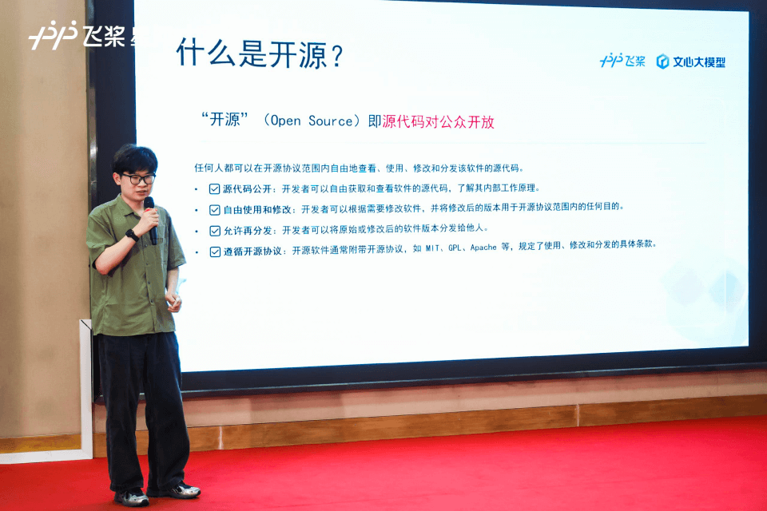
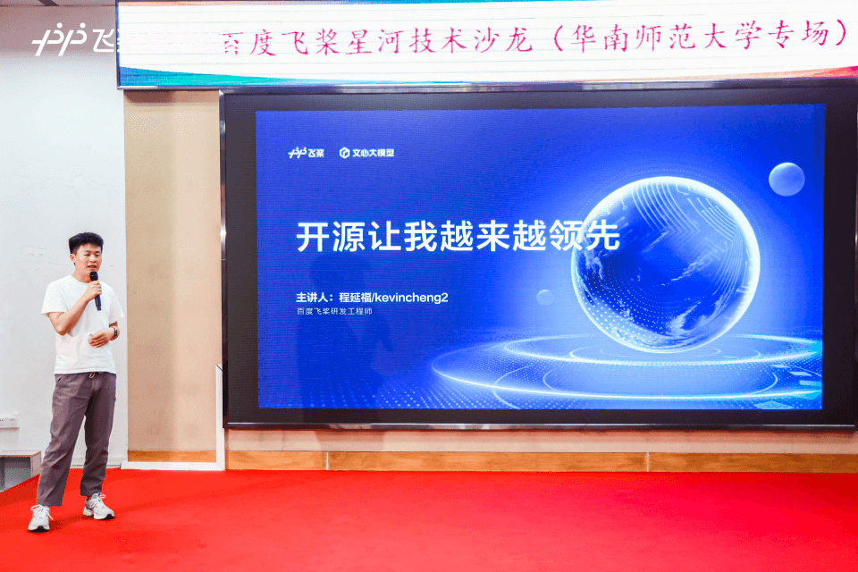
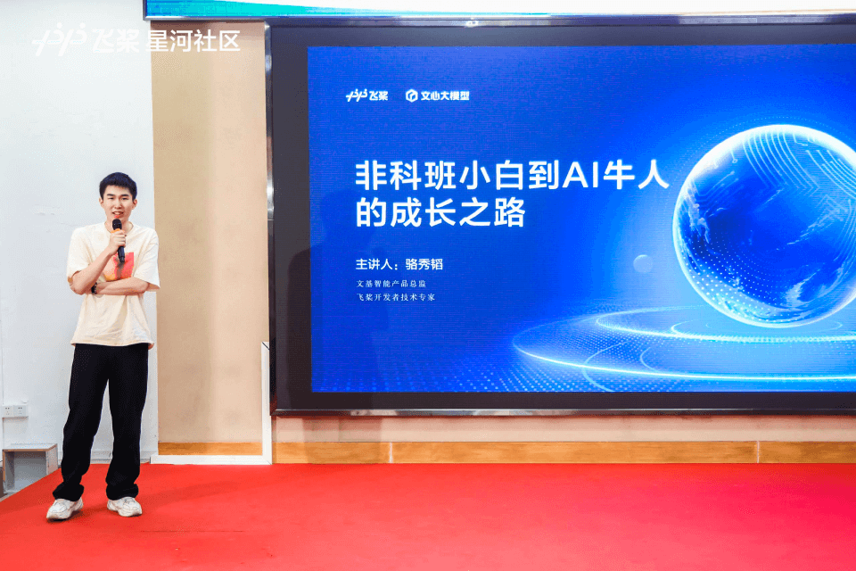
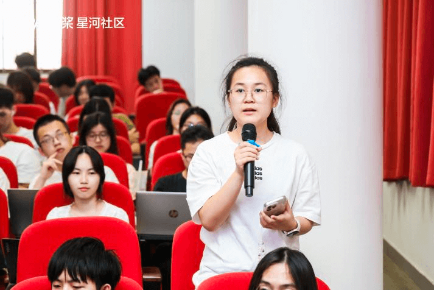
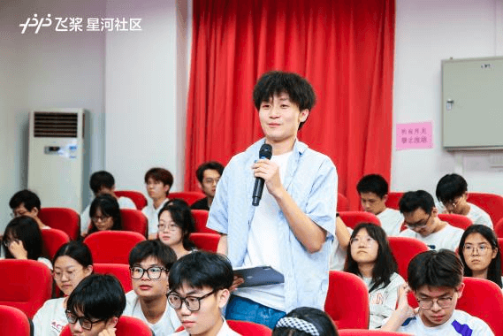

近日，百度飞桨星河社区与华南师范大学计算机学院联合举办的技术沙龙在华南师范大学成功举行。本次活动汇聚百度飞桨技术专家与高校师生近140人，围绕AI前沿技术、开源生态与人才培养展开深度交流，共同探讨人工智能发展与应用。

<!-- more -->

---

在人工智能技术快速发展的时代背景下，AI技术已广泛应用于各行各业，深刻改变着社会生产与生活方式。作为飞桨星河社区比赛平台的重要组成部分，华南师范大学已连续成功举办五届人工智能算法挑战赛，累计吸引上千名师生参与。目前，第六届赛事正在如火如荼进行中，那么本次技术沙龙对于赛题解读、前沿技术都有哪些精彩分享，让我们一探究竟。

<figure style="text-align: center;">
   
   <figcaption>活动现场</figcaption>
</figure>

## 深化校企合作，共育AI人才

华南师范大学计算机学院副院长陈寅在开幕致辞中，对百度飞桨长期以来对高校AI教育的支持表示感谢。他强调了企业与高校协同在培养AI创新人才方面的重要意义，并鼓励学生积极参与实践，为国家科技自立自强贡献力量。

<figure style="text-align: center;">
   
   <figcaption>华南师范大学计算机学院副院长陈寅</figcaption>
</figure>

## 技术前沿分享，赋能开发者成长

### PaddleNLP前沿技术解析

百度飞桨高级产品经理张晶系统介绍了PaddleNLP的核心技术架构及其在自然语言处理领域的应用。作为飞桨生态的重要组成部分，PaddleNLP以其功能强大与好学易用的特点，赋能开发者高效完成大语言模型从精调到部署的全部流程。通过本次分享，与会师生深入了解了NLP技术的最新进展与实践方法。

   <figure style="margin: 0;">
      
      <figcaption>百度飞桨高级产品经理张晶</figcaption>
   </figure>
   <figure style="margin: 0;">
      
      <figcaption>活动现场</figcaption>
   </figure>

### Text2SQL技术解析与实战指导

华南师范大学李双印教授着重在本次算法挑战赛的赛题解读，从技术原理与实践案例出发，系统分析了Text2SQL任务的核心挑战与解决方案。他介绍了这一连接自然语言与数据库的关键技术如何提升数据查询效率，并为参赛学生提供了清晰的解题思路与优化技巧。

<figure style="text-align: center;">
   
   <figcaption>华南师范大学李双印教授</figcaption>
</figure>

### 开源生态与技术创新

百度飞桨产品经理孙钟恺以"飞桨开源故事"为主题，飞桨开源社区的发展历程为主题，阐述了开源技术对创新的推动作用。同时也介绍了全球开发者如何通过开源协作共同推动技术进步，构建强大的技术生态。

<figure style="text-align: center;">
   
   <figcaption>百度飞桨产品经理孙钟恺</figcaption>
</figure>

百度飞桨研发工程师程延福则从"开源让我越来越领先"的角度，分析了参与开源项目对个人技术能力提升与行业视野拓展的积极作用。他通过实际案例说明，开源不仅是技术共享的平台，更是个人职业发展的加速器。该主题帮助学生认识到参与开源项目的重要性，并为其未来职业规划提供了有益指导。

<figure style="text-align: center;">
   
   <figcaption>百度飞桨研发工程师程延福</figcaption>
</figure>

### 非科班到AI专家的成长之路

文基智能产品总监、飞桨开发者技术专家（PPDE）骆秀韬分享了自己从非计算机专业背景到成为AI技术专家的经历，为学生提供了实用的学习路径与方法，证明兴趣与坚持是突破专业限制、实现技术成长的关键。

<figure style="text-align: center;">
   
   <figcaption>飞桨开发者技术专家（PPDE）骆秀韬</figcaption>
</figure>

### 深度互动交流，解答技术难题

在自由提问环节，现场学生积极踊跃，围绕 AI 技术应用、模型训练优化等热门议题，与嘉宾们展开了深入交流。百度飞桨团队的专家们凭借专业知识，一一为学生们答疑解惑，详细阐述了模型训练过程中的关键技术和要点，并对人工智能领域未来发展的主要驱动力进行了探讨。思维的火花在互动中不断碰撞，将活动氛围推向了高潮，也为学生们在第六届人工智能算法挑战赛中解决实际问题提供了思路。

   <figure style="margin: 0;">
      
      <figcaption>自由提问环节</figcaption>
   </figure>
   <figure style="margin: 0;">
      
      <figcaption>自由提问环节</figcaption>
   </figure>
   <figure style="margin: 0;">
      
      <figcaption>自由提问环节</figcaption>
   </figure>

本次技术沙龙系统探讨了诸多AI前沿技术，通过专家分享与互动交流，深化了师生对技术原理与实践应用的理解。活动不仅促进了产学研融合，更帮助学生优化学习路径，明确发展方向。华南师范计算机学院与百度飞桨将以此次赛事活动为契机，持续深化合作，共同推动AI人才培养与技术创新，为我国人工智能领域发展贡献力量。

## 写在最后

飞桨星河社区比赛平台
飞桨星河社区比赛平台是国内领先的AI及大数据竞赛平台，已举办500余场国际AI大赛，提供千万级总奖池，汇聚50万来自全球多国的精英开发者，培养上万名顶尖选手。赛题覆盖AI技术前沿领域，致力于打造全球领先的AI赛事，聚才兴业，竞促发展。
目前，平台已具备全流程自动化办赛功能，提供专业性办赛服务指导，以期与政府学会、企业单位、高校机构、科研院所共同举办具有影响力的精彩赛事。

如果您有办赛需求，可点击[飞桨 AI Studio-比赛平台](https://aistudio.baidu.com/foreigncompetition/instruction)「申请办赛」